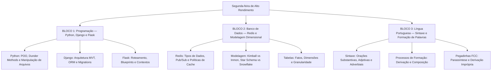

# Guia de Estudos Definitivo — Segunda-feira 01/06/2026
## Semana 3 | Dia 15 | TJ-CE 2026 (Analista TI - Sistemas)
### Foco Absoluto: Banca FCC — Doutrina, Detalhes Ocultos, Pegadinhas e Casos Práticos

---

## 🗺️ Mapa de Estudos do Dia

---

## 🐍 SEÇÃO 1: Programação — Python, Django e Flask

A FCC tem focado fortemente em detalhes internos da linguagem Python e na arquitetura dos frameworks web mais populares do ecossistema.

### 1. Python: Orientação a Objetos, Escopo e Arquivos
*   **Escopo (Global vs Nonlocal):** `global` declara que uma variável pertence ao escopo do módulo inteiro. `nonlocal` vincula a variável ao escopo da função *envolvente* mais próxima, útil em funções aninhadas e closures.
*   **POO e Dunder Methods:** O Python não tem modificadores de acesso físicos (`private`, `public`). O encapsulamento é feito por convenção (`_atributo`) ou pelo **Name Mangling** (`__atributo`), que reescreve internamente o nome da variável para evitar colisões em subclasses.
    *   Métodos Mágicos: `__init__` (construtor), `__str__` (representação legível), `__repr__` (representação técnica), `__len__` e `__getitem__` (implementam suporte a iteração e acesso via chaves/índices `[]`).
*   **Herança Múltipla e `super()`:** Python suporta herança múltipla usando a **C3 Linearization (MRO)**. A função `super()` não chama simplesmente o "pai", mas sim a *próxima classe na cadeia MRO* do objeto original.
*   **Manipulação de Arquivos e `with`:** 
    *   O modo `w` trunca (zera) o arquivo na abertura; o modo `r+` abre para leitura/escrita mantendo o conteúdo e colocando o cursor no início; `a` abre para inserção no final (append).
    *   A cláusula `with open(...) as f:` garante que o método `__exit__` será chamado, fechando o arquivo automaticamente mesmo em caso de falha (Context Manager).

### 2. Framework Django (Baterias Pesadas)
*   **Arquitetura MVT:**
    *   *Model:* Classes ORM do banco de dados (equivale ao Model do MVC).
    *   *View:* Funções/Classes Python que processam o request (equivale ao **Controller** do MVC).
    *   *Template:* HTML com tags do Django (equivale ao **View** do MVC).
*   **ORM e Otimização:** O problema de *N+1 queries* (fazer uma query de banco extra para cada item de um loop) é resolvido usando:
    *   `select_related('chave_estrangeira')`: Faz um `INNER JOIN` direto no SQL. (Para relacionamentos 1-para-1 ou 1-para-N invertido).
    *   `prefetch_related('muitos_para_muitos')`: Faz uma query separada usando a cláusula `IN (...)` do SQL e une os dados na memória RAM do Python.
*   **Migrations:** `makemigrations` detecta as mudanças no código e cria os arquivos python de migração. `migrate` aplica o script convertendo-o para SQL e executa no banco, registrando o sucesso na tabela de controle interna `django_migrations`.

### 3. Framework Flask (Microframework)
*   É minimalista, não inclui ORM nativo. O roteamento usa decorators (`@app.route`).
*   **Contextos:**
    *   `request` e `session`: Pertencem ao contexto de Requisição.
    *   `g`: Global temporário ligado ao *Contexto da Aplicação*. Usado para compartilhar conexões/variáveis durante o ciclo de vida de uma mesma requisição.
*   **Blueprints:** Mecanismo utilizado para **modularizar** aplicações Flask médias e grandes. Permite dividir a aplicação em pacotes/componentes organizados com rotas e templates isolados.

---

## 📊 SEÇÃO 2: Banco de Dados — Redis e Modelagem Dimensional

### 1. Redis: In-Memory, NoSQL e Casos de Uso
*   **Tipos de Dados:** Diferente de bancos Memcached, o Redis suporta estruturas avançadas (Lists, Sets, Hashes, Sorted Sets).
    *   *Hashes:* Ideais para guardar objetos pequenos (ex: Perfis de usuário), pois ocupam pouca memória através de otimização em *ziplist* e permitem acesso/atualização granular em um campo sem desserializar tudo (ex: `HSET`, `HINCRBY`).
    *   *Sorted Sets (ZSET):* Únicos por associar um `score` (flutuante numérico) a cada chave string. Ideal para Painéis de Liderança (Leaderboards).
*   **Pub/Sub:** Comunicação em tempo real (*fire and forget*). `PUBLISH` para enviar, `SUBSCRIBE` para ouvir exato, `PSUBSCRIBE` para usar wildcards (`*`). Mensagens não são salvas no disco se ninguém estiver ouvindo.
*   **Filas com Listas:** Para evitar o gasto de CPU (polling), o consumidor não deve usar `RPOP` repetidas vezes, e sim o bloqueante **`BRPOP`**, que faz o Redis suspender a conexão até que um item entre na lista.
*   **Despejo de Cache (Eviction):** O padrão é `noeviction` (retorna erro). Se a política for `volatile-lru`, o Redis apaga os itens "menos recentemente usados" *mas apenas* dentre aqueles que possuem um tempo de vida `TTL` configurado, protegendo dados persistentes.

### 2. Modelagem Dimensional (Data Warehousing)
*   **Ralph Kimball:** Filosofia "Bottom-up" (de baixo para cima). O Data Warehouse é a união de vários *Data Marts* integrados usando **Dimensões Conformadas** (dimensões padrão que podem ser cruzadas entre vários fatos).
*   **Tabelas Fato:** Ficam no centro, detêm o "grão" da transação de negócio e guardam as chaves estrangeiras ligadas às dimensões, junto com as **Métricas (medidas)** numéricas.
    *   *Aditivas:* Somam em todas as dimensões (Faturamento).
    *   *Semi-aditivas:* Não somam em algumas, especialmente no tempo (Saldo Bancário ou Estoque diário).
    *   *Não-aditivas:* Não somam em lugar nenhum (Taxas, Percentuais, Temperaturas).
*   **Star Schema (Estrela):** Tabela Fato no centro, ligada diretamente às Dimensões. As dimensões são **desnormalizadas** (guardam redundâncias como Cidade, Estado, País na mesma tabela). **Vantagem:** Muito rápido de consultar, tem menos JOINs.
*   **Snowflake Schema (Floco de Neve):** As tabelas de dimensão são normalizadas e quebradas em níveis de hierarquia (País -> Estado -> Cidade). **Vantagem:** Poupa espaço em disco, evita redundâncias e anomalias de atualização de texto. **Desvantagem:** Consultas ficam muito mais lentas e complexas devido à quantidade massiva de JOINs.

---

## ✍️ SEÇÃO 3: Língua Portuguesa — Sintaxe e Formação de Palavras

A FCC adora misturar sintaxe com a morfologia e semântica, criando armadilhas em períodos compostos.

### 1. Orações Subordinadas e Sintaxe Interna
*   **Subordinada Substantiva Subjetiva (Sujeito):** Fique atento à **Voz Passiva Sintética**. Ex: "Sabe-se *que a reforma ocorrerá*." A partícula "se" apassiva o verbo "Saber". Logo, o que se sabe (que a reforma ocorrerá) é o Sujeito da Oração Principal.
*   **Complemento Nominal vs Adjunto Adnominal (O clássico da FCC):**
    *   Ambos usam preposição e acompanham substantivos abstratos.
    *   Se o termo preposicionado sofre a ação do nome (paciente), é **Complemento Nominal**. Ex: A invenção *do telefone* (o telefone foi inventado). A resposta *ao recurso*.
    *   Se o termo pratica a ação (agente) ou indica posse/matéria, é **Adjunto Adnominal**. Ex: A resposta *do analista* (o analista respondeu). A caneta *de ouro*.

### 2. Processos de Formação de Palavras
*   **Derivação Parassintética vs Prefixal/Sufixal:** Na parassíntese, a união de prefixo e sufixo é simultânea e mutuamente dependente. Tirar um deles destrói a palavra (Ex: em+tarde+ecer = entardecer). Tirando "en" ou "ecer", a palavra perde o sentido (não existe *entarde* nem *tardecer*).
*   **Derivação Regressiva (Deverbal):** Retira-se a terminação verbal e acrescenta-se uma vogal temática, transformando verbo em substantivo abstrato de ação. Ex: Debater $\to$ *O debate*. Chorar $\to$ *O choro*.
*   **Derivação Imprópria (Conversão):** A palavra muda de classe gramatical por causa do contexto, mantendo a mesmíssima escrita e fonética. Ex: O **bom** (adjetivo $\to$ substantivo) sempre vence. O diretor disse um **não** (advérbio $\to$ substantivo).
*   **Composição por Justaposição:** Une palavras e ambas mantêm sua identidade fonética original (não perdem som). Ex: Girassol (o "s" é pra segurar o som), Passatempo.
*   **Composição por Aglutinação:** Une palavras havendo fusão e perda fonética de letras. Ex: Planalto (Plano + alto), Embora (Em + boa + hora), Fidalgo (Filho + de + algo).

---

## 🎯 SEÇÃO 4: Questões Inéditas FCC-Style Comentadas Passo a Passo

### Questão 1: Modelagem Dimensional
**(FCC - Adaptada)** Na arquitetura de Data Warehouses, um esquema dimensional é formado por tabelas Fato e Dimensões. Para registrar adequadamente o estoque diário de uma loja — uma métrica que permite somas por localização do galpão ou categoria do produto, mas que não deve ser acumulada aritmeticamente ao longo dos dias da dimensão tempo —, deve-se configurar a referida métrica como:

A) Não aditiva, dada a sua dependência estatística.  
B) Semi-aditiva, devido à impossibilidade de agregação plena em pelo menos uma de suas dimensões.  
C) Aditiva estrita, visto que as junções no esquema estrela garantem consistência cruzada temporal.  
D) Fato sem fatos (Factless Fact Table), pois inventários não possuem números reais.  

#### 💡 Resolução Comentada da Questão 1:
*   Métricas que podem ser somadas na maioria das dimensões, EXCETO em algumas (comumente a dimensão Tempo), são classificadas na literatura de Kimball como **Semi-aditivas**.
*   Se você tem 10 caixas no estoque na segunda-feira e 10 caixas na terça, seu estoque total na semana não é de 20 caixas (não se pode somar no tempo).
*   **Gabarito correto: B.**

### Questão 2: Formação de Palavras
**(FCC - Adaptada)** Assinale a alternativa que traz uma palavra formada pelo processo de Derivação Imprópria:

A) A *pesca* de arrastão destrói ecossistemas marítimos.  
B) O *envelhecer* do ser humano tem sido estudado amplamente pela ciência.  
C) As atitudes *desleais* dos advogados chocaram o juiz.  
D) Na *planície* norte-americana, os ventos são muito fortes.  

#### 💡 Resolução Comentada da Questão 2:
*   **A:** *Pesca* vem de pescar (corte de letras: derivação regressiva).
*   **B:** A palavra *envelhecer* (verbo) ganhou o artigo "O" e virou substantivo, mudando de classe gramatical sem sofrer alteração material nas letras (continua sendo "envelhecer"). Isso é a conversão ou Derivação Imprópria.
*   **C:** *Desleais* (derivação prefixal "des-" em leal).
*   **D:** *Planície* é derivação sufixal do radical plano/plan.
*   **Gabarito correto: B.**

---

## 🧠 SEÇÃO 5: Flashcards de Memorização Ativa (Estilo Anki)

### Bloco 1 — Python & Web
*   **Frente (Pergunta):** O que diferencia o método `select_related` do `prefetch_related` no ORM do Django?
*   **Verso (Resposta):** O `select_related` gera um único SQL longo contendo `INNER JOIN` (ideal para *ForeignKeys* de relacionamento simples 1-1 e N-1). O `prefetch_related` faz consultas isoladas pelo Python, unindo tabelas na memória RAM usando `IN (...)` no SQL (ideal para relações N-M ou invertidas).

*   **Frente (Pergunta):** Para que serve um *Blueprint* no framework Flask?
*   **Verso (Resposta):** Para **modularização** e divisão física do projeto, permitindo registrar blocos de rotas, middlewares e templates em módulos separados e "acoplá-los" no arquivo principal.

### Bloco 2 — Banco de Dados e BI
*   **Frente (Pergunta):** No esquema Floco de Neve (*Snowflake*), as tabelas de dimensão sofrem qual processo em comparação ao *Star Schema*?
*   **Verso (Resposta):** Elas sofrem **Normalização** (divisão em múltiplas tabelas para remover redundâncias hierárquicas, exigindo dezenas de novos comandos `JOIN` lentos em SQL).

*   **Frente (Pergunta):** No Redis, se um cliente quiser escutar apenas requisições em canais Pub/Sub que comecem com a palavra `noticias:*`, qual comando usar?
*   **Verso (Resposta):** Comando **`PSUBSCRIBE`** (Pattern Subscribe), que escuta canais com caracteres curingas.

### Bloco 3 — Língua Portuguesa
*   **Frente (Pergunta):** Na frase "O choro da criança acordou o cachorro", a palavra "choro" foi formada por qual processo?
*   **Verso (Resposta):** **Derivação Regressiva** (Deverbal). Cortou-se os pedaços do verbo "chorar" e se criou um substantivo abstrato.

*   **Frente (Pergunta):** Como diferenciar Complemento Nominal e Adjunto Adnominal se ambos têm preposição completando substantivos abstratos?
*   **Verso (Resposta):** Teste do Agente/Paciente. Se o termo depois da preposição realiza a ação abstrata, é Adjunto (Ex: Amor de mãe - a mãe ama). Se o termo *recebe/sofre* a ação abstrata, é Complemento (Ex: Culto a Deus - Deus é cultuado).

---

## 🏆 Roteiro de Estudos Sugerido para Hoje (01/06/2026)

1.  **Manhã (Bloco 1 - 2h):** Revise Python puro: entenda as regras MRO da herança múltipla, Name Mangling (`__var`) e manipulação de arquivos (modos `r+`, `w`, `a` e Context Managers `with`). Repasse o esqueleto do Django (MVT e Migrations) e os contextos do Flask (`g`, `request`).
2.  **Tarde (Bloco 2 - 2h):** Mergulhe em NoSQL com Redis: Comandos práticos (`HSET`, `HGET`, `BRPOP`), Arquitetura Pub/Sub e Políticas de LRU/TTL. Revise Kimball (Star) e Inmon. Decore a diferença entre Surrogate Keys (Geradas) e Natural Keys (Operacionais).
3.  **Noite (Bloco 3 - 1.5h):** Foco extremo em análise sintática. Diferencie orações adjetivas explicativas (com vírgula) de restritivas (sem vírgula), e treine exaustivamente os processos morfológicos de derivação parassintética e imprópria.
4.  **Resolução de Questões:** Responda rigorosamente as **45 questões** do dia (Segunda-feira 01/06) no simulador em HTML integrado em seu navegador.

Bons estudos e conte comigo! 🚀
