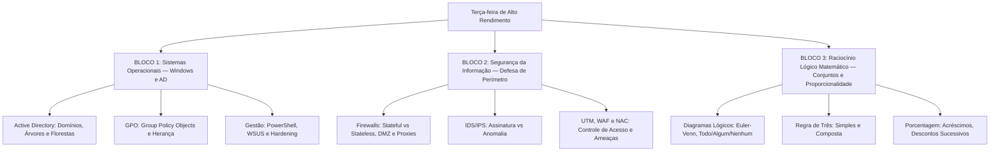

# Guia de Estudos Definitivo — Terça-feira 02/06/2026
## Semana 3 | Dia 16 | TJ-CE 2026 (Analista TI - Sistemas)
### Foco Absoluto: Banca FCC — Doutrina, Detalhes Ocultos, Pegadinhas e Casos Práticos

---

## 🗺️ Mapa de Estudos do Dia

---

## 🖥️ SEÇÃO 1: Sistemas Operacionais — Windows Server e Gestão

A FCC foca na estrutura lógica do Active Directory e nos comandos/funcionalidades de administração centralizada (GPOs e PowerShell).

### 1. Active Directory (AD DS)
*   **Estrutura Lógica:** 
    *   *Domínio:* Fronteira de segurança e administração.
    *   *Árvore (Tree):* Conjunto de domínios que compartilham um *namespace* contíguo (ex: `tjce.jus.br` e `ti.tjce.jus.br`).
    *   *Floresta (Forest):* Um ou mais conjuntos de árvores de domínios que **não** compartilham o mesmo namespace, mas compartilham o mesmo esquema (schema) e catálogo global. É o nível máximo de segurança.
*   **Unidade Organizacional (OU):** Contêiner dentro do domínio usado para organizar objetos (usuários, computadores) e **delegar permissões administrativas** ou vincular Políticas de Grupo (GPOs). Diferente de "Grupos", a OU não serve para conceder permissão em arquivos.
*   **Catálogo Global (GC):** Servidor controlador de domínio (DC) que armazena uma cópia *completa* de todos os objetos de seu próprio domínio e uma cópia *parcial* (apenas atributos vitais para busca) de objetos de todos os outros domínios da floresta.

### 2. Group Policy Objects (GPO)
*   As GPOs permitem aplicar configurações de sistema operacional, segurança e softwares a milhares de máquinas simultaneamente.
*   **Ordem de Aplicação (LSDOU):** Lógica que determina quem "vence" quando há conflitos de políticas:
    1.  **L**ocal (Políticas Locais do computador)
    2.  **S**ite (Políticas ligadas a um Site do AD)
    3.  **D**omain (Políticas ligadas ao Domínio inteiro)
    4.  **OU** (Políticas ligadas à Unidade Organizacional) - *Esta tem prioridade máxima no conflito.*
*   **Block Inheritance (Bloquear Herança):** Uma OU inferior pode bloquear a herança das GPOs vindas do Domínio/Site. 
*   **Enforced (Imposta / Forçada):** Uma GPO superior configurada como `Enforced` fura qualquer bloqueio e substitui políticas conflitantes de OUs inferiores.

### 3. Gestão e Hardening (Windows 10/11/Server)
*   **PowerShell:** Automação baseada em objetos .NET. A estrutura de comandos é `Verbo-Substantivo` (Ex: `Get-Process`, `Restart-Service`). Para manipular AD, usa-se o módulo RSAT (Remote Server Administration Tools).
*   **WSUS (Windows Server Update Services):** Papel (role) que atua como servidor centralizado de atualizações. Ele baixa as atualizações da Microsoft e as distribui para as máquinas locais da rede (reduzindo consumo de link de internet e permitindo testes antes da implantação).
*   **Hardening (Endurecimento):** Redução da superfície de ataque. Inclui:
    *   Desativar serviços/portas desnecessárias (ex: Telnet, SMBv1).
    *   Mínimo Privilégio (não usar o administrador local, aplicar UAC).
    *   Senhas complexas, LAPS (Local Administrator Password Solution) e BitLocker (Criptografia de disco).

---

## 🛡️ SEÇÃO 2: Segurança da Informação — Redes e Defesa

A FCC cobra as minúcias arquiteturais, diferenciando equipamentos que parecem fazer a mesma coisa (Firewall x IDS x IPS x WAF).

### 1. Firewalls e DMZ
*   **Stateless (Filtro de Pacotes):** Analisa pacotes individualmente na camada de rede/transporte (IP, Porta). Não sabe o estado da conexão. Regras são rígidas.
*   **Stateful (Inspeção de Estados):** Rastrea o estado das conexões TCP (Estabelecida, Nova, Terminada). Permite que o tráfego de retorno seja aceito automaticamente caso o pacote de ida tenha sido autorizado.
*   **DMZ (Demilitarized Zone):** Rede isolada que expõe serviços externos (Servidores Web, E-mail, DNS) para a internet não confiável, protegendo simultaneamente a rede interna (LAN) que fica atrás de um segundo nível de segurança.
*   **Proxies:**
    *   *Proxy Direto:* Fica na borda da LAN, mediando o acesso dos *funcionários internos* para a Internet (Ex: Filtro de URL, proxy Squid).
    *   *Proxy Reverso:* Fica na borda, recebendo acessos da *Internet* e repassando para os servidores da empresa (Ex: Balanceamento de carga web, Nginx como cache).

### 2. IDS vs IPS vs WAF vs UTM
*   **IDS (Intrusion Detection System):** Apenas **monitora, detecta e alerta**. Funciona "em cópia" (modo espelho de porta/span). Não bloqueia o tráfego em tempo real (pois não está na linha direta - *inline*).
*   **IPS (Intrusion Prevention System):** Analisa e **bloqueia ativamente** pacotes maliciosos. Funciona em linha (*inline*). 
    *   *Baseado em Assinaturas (Signature-based):* Identifica ataques conhecidos (banco de dados/regras como o Snort). Falha em ameaças "Zero-day".
    *   *Baseado em Anomalias (Anomaly/Behavior-based):* Cria uma linha de base (baseline) do comportamento normal da rede. Detecta ataques Zero-day observando desvios estranhos de tráfego (gera falsos positivos).
*   **WAF (Web Application Firewall):** Firewall focado exclusivamente nas camadas 7 (Aplicação) HTTP/HTTPS. Impede ataques no estilo OWASP Top 10 (SQL Injection, XSS, Path Traversal), entendendo os métodos GET/POST.
*   **UTM (Unified Threat Management):** Dispositivo "tudo em um" (Firewall + IPS + Antivírus de Gateway + Filtro Web + VPN). Vantagem: Fácil administração. Desvantagem: Ponto único de falha e possível gargalo de performance (Single Point of Failure).

### 3. NAC (Network Access Control) e Proteção Endpoint
*   **NAC:** Verifica a saúde e a identidade do computador antes de conceder acesso total à rede corporativa. Ex: Checa se o Windows está atualizado, se o antivírus está ativo. Se não, joga o PC numa VLAN de quarentena. Usa o padrão 802.1X.
*   **Antivírus / Antimalware:** Evoluiu de simples assinaturas (hashes) para Heurística (análise de comportamento) e EDR (Endpoint Detection and Response) para investigar movimento lateral em estações de trabalho.

---

## 🧮 SEÇÃO 3: Raciocínio Lógico Matemático — Diagramas e Matemática

### 1. Diagramas Lógicos (Euler-Venn)
*   **Silogismos Categóricos:** A FCC cobra visualização de frases.
    *   "Todo A é B": O círculo de A fica **inteiramente dentro** do círculo de B. (A $\subset$ B).
    *   "Nenhum A é B": Os círculos de A e B são **disjuntos** (não se tocam, interseção vazia).
    *   "Algum A é B": Há uma interseção (cruzamento parcial) entre A e B. Pelo menos um elemento está nos dois.
*   **Estratégia FCC:** Sempre desenhe o **pior cenário possível** (o mais geral). Se a conclusão não for válida em todos os desenhos matematicamente aceitos pelas premissas, a conclusão é Falsa.

### 2. Proporcionalidade e Regra de Três
*   **Regra de Três Simples:**
    *   *Diretamente proporcionais:* Quando uma cresce, a outra cresce. (Multiplica cruzado).
    *   *Inversamente proporcionais:* Quando uma cresce (ex: número de operários), a outra diminui (ex: dias da obra). (Multiplica em linha reta).
*   **Regra de Três Composta (Método das setinhas ou Causas vs Consequências):** Separe tudo o que for CAUSA (trabalhadores, dias, horas/dia, eficiência) e CONSEQÜÊNCIA (o trabalho final: metros de muro, peças, processos analisados). A proporção é: O produto das causas sobre o produto das causas é igual à consequência 1 sobre a consequência 2.

### 3. Porcentagem (Acréscimos e Descontos Sucessivos)
*   Nunca some diretamente as porcentagens (Ex: Dar 10% de aumento em janeiro e 10% em fevereiro NÃO é um aumento total de 20%).
*   **Fator de Multiplicação:**
    *   Aumento de $P\%$: Multiplique o valor por $(1 + P/100)$. Ex: Aumentar 15% $\to$ $x * 1,15$.
    *   Desconto de $P\%$: Multiplique o valor por $(1 - P/100)$. Ex: Descontar 20% $\to$ $x * 0,80$.
*   **Descontos Sucessivos FCC:** Se uma TV de R\$100 sofre desconto de 20%, passa a R\$80. Novo desconto de 10% (agora em cima de R\$80), perde R\$8 e passa a R\$72. (Desconto real de 28%, e não de 30%).

---

## 🎯 SEÇÃO 4: Questões Inéditas FCC-Style Comentadas Passo a Passo

### Questão 1: Sistemas Operacionais (Windows AD/GPO)
**(FCC - Adaptada)** Um administrador do Active Directory vinculou uma GPO com configuração específica de papel de parede corporativo diretamente na Unidade Organizacional (OU) "Financeiro". Contudo, o administrador do Domínio vinculou anteriormente na raiz do Domínio uma GPO diferente para o papel de parede, configurando esta última GPO com a opção "Enforced". Sabendo-se que um usuário comum efetua logon em uma máquina da OU "Financeiro", o resultado da aplicação das políticas (LSDOU) será:

A) A GPO da OU será aplicada, pois políticas no nível de OU têm sempre a prioridade máxima e não podem ser sobrescritas por níveis superiores.  
B) Nenhuma GPO será aplicada, pois configurações conflitantes em níveis diferentes resultam no bloqueio da herança.  
C) A GPO do Domínio será aplicada, pois a diretiva "Enforced" anula a precedência padrão de OUs inferiores no caso de conflitos.  
D) A GPO Local da máquina se tornará prioritária no modo "Fallback", já que as políticas de rede entraram em colisão.  

#### 💡 Resolução Comentada da Questão 1:
*   A ordem padrão LSDOU dita que a política mais específica (OU) vence a política mais geral (Domínio) em caso de conflitos.
*   **No entanto**, a opção **"Enforced"** (Forçada/Imposta) serve exatamente para quebrar essa regra. Uma GPO superior (Domínio) definida como "Enforced" não pode ser sobrescrita e não respeita sequer o bloqueio de herança, tornando-se definitiva.
*   **Gabarito correto: C.**

### Questão 2: Segurança da Informação (Firewall/DMZ)
**(FCC - Adaptada)** Na implantação de uma infraestrutura de rede segura, a Demilitarized Zone (DMZ) é essencial para segregar tráfego. Considerando as boas práticas, os servidores localizados na DMZ devem poder, por regra de firewall e política padrão, iniciar conexões para a rede corporativa interna (LAN) livremente, garantindo o sincronismo de bancos de dados vitais. A afirmação é:

A) Correta, pois a DMZ, diferentemente da WAN, possui alto nível de confiança criptográfica na LAN interna.  
B) Incorreta, uma vez que a DMZ hospeda serviços públicos acessíveis pela Internet e, caso comprometidos, atacariam livremente a rede interna (LAN).  
C) Correta, desde que se utilize proxy transparente autenticado e IDS trabalhando em modo espelho para capturar eventuais ataques internos da DMZ.  
D) Incorreta, pois a finalidade da DMZ é puramente de armazenamento offline de logs de firewalls (syslog).  

#### 💡 Resolução Comentada da Questão 2:
*   O propósito da DMZ é isolar servidores públicos (DNS, Servidor Web, E-mail) que são acessados pela Internet. Eles estão sob constante risco de invasão.
*   Por isso, o tráfego que sai da DMZ em direção à LAN interna deve ser estritamente bloqueado ou severamente restringido por firewall (ex: apenas a porta específica do banco de dados autorizada, e nunca acesso livre). Se o servidor da DMZ for hackeado, ele não deve servir como ponte fácil para invadir a rede corporativa.
*   **Gabarito correto: B.**

---

## 🧠 SEÇÃO 5: Flashcards de Memorização Ativa (Estilo Anki)

### Bloco 1 — Windows Server e AD
*   **Frente (Pergunta):** O que diferencia uma Árvore (Tree) de uma Floresta (Forest) no Active Directory?
*   **Verso (Resposta):** Na **Árvore**, os domínios compartilham um espaço contíguo de nomes (ex: jus.br $\to$ tj.jus.br). Na **Floresta**, pode haver múltiplas árvores com nomes diferentes (ex: justica.com e judiciario.org), mas que compartilham a mesma estrutura de Diretório e Esquema Global.

*   **Frente (Pergunta):** Qual a sigla que define a ordem cronológica em que as Políticas de Grupo (GPOs) são processadas? Qual tem precedência?
*   **Verso (Resposta):** **LSDOU** (Local, Site, Domínio, OU). A última a ser aplicada (a mais interna, **OU**) é a que tem precedência e sobrescreve as outras.

### Bloco 2 — Segurança (Defesa)
*   **Frente (Pergunta):** Qual a diferença entre Firewalls Stateful e Stateless?
*   **Verso (Resposta):** **Stateless** analisa pacotes isoladamente usando ACLs rígidas. **Stateful** lembra do "estado da conexão", abrindo temporariamente portas dinâmicas de retorno para tráfego que o usuário interno solicitou validamente.

*   **Frente (Pergunta):** IDS (Intrusion Detection) vs IPS (Intrusion Prevention). Qual opera "em linha" na rede e qual opera por espelhamento (cópia)?
*   **Verso (Resposta):** O **IPS** atua em linha (inline), podendo bloquear o pacote ofensivo imediatamente. O **IDS** atua fora da linha/cópia (promiscuous mode), apenas enviando alertas sem barrar o tráfego de imediato.

### Bloco 3 — Raciocínio Lógico (Matemática e Diagramas)
*   **Frente (Pergunta):** Duas secretárias expedem 10 ofícios em 5 dias. 4 secretárias com a mesma produtividade expedirão quantos ofícios na mesma quantidade de dias?
*   **Verso (Resposta):** **20 ofícios**. É regra de três simples e direta (dobrou quem produz, dobra o produto no mesmo tempo).

*   **Frente (Pergunta):** Um software de $R\$200,00$ sofre um aumento de $10\%$ e em seguida, o preço novo sofre desconto de $10\%$. O valor final voltará a $R\$200,00$?
*   **Verso (Resposta):** **NÃO.** Aumento de 10% de R\$200 = R\$220. Desconto de 10% sobre R\$220 = R\$22 de desconto, logo, o valor cai para **R\$198,00**.

---

## 🏆 Roteiro de Estudos Sugerido para Hoje (02/06/2026)

1.  **Manhã (Bloco 1 - 2h):** Revise Active Directory. Foque em gravar a sopa de letrinhas das GPOs (Ordem LSDOU, Enforced vs Block Inheritance). No PowerShell, memorize a estrutura *Verb-Noun*. Entenda o ciclo de patches do WSUS (sincronização, aprovação e deployment).
2.  **Tarde (Bloco 2 - 2h):** Crie na cabeça o desenho de uma DMZ e onde colocar os equipamentos. Diferencie profundamente IDS de IPS. Grave os conceitos de ataques que o WAF bloqueia (camada de aplicação - 7) contra o que firewalls comuns barram (camadas 3 e 4). 
3.  **Noite (Bloco 3 - 1.5h):** Monte equações desenhando diagramas. A FCC ama tentar invalidar silogismos. Treine matemática financeira básica não somando os percentuais de acréscimo sucessivo, use o fator de multiplicação.
4.  **Resolução de Questões:** Acesse o simulador, faça a bateria **inédita de 45 questões (02/06)**. Revise o gabarito das de RLM no papel passo a passo.

Vamos que o edital está batendo na porta. Foco total! 🚀
