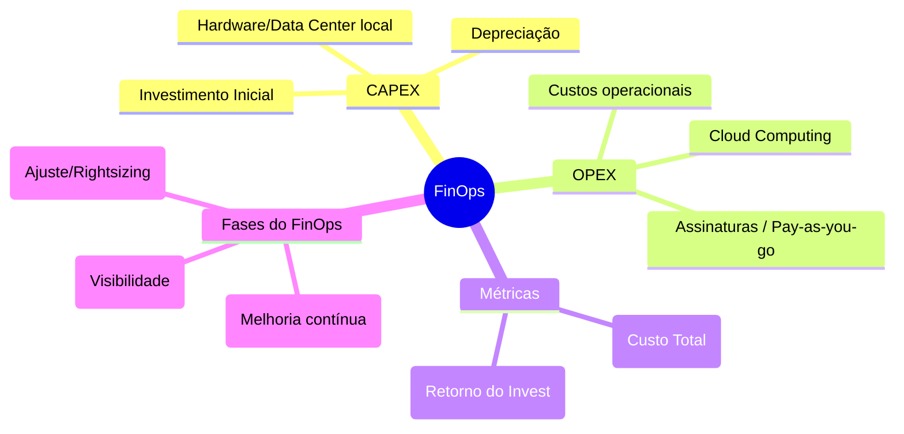

# 📚 Guia de Estudos — Quarta-feira 03/06
## Foco: Governança TI, Microserviços/Arquiteturas e Legislação PCD

Neste terceiro dia da terceira semana, vamos focar fortemente na Governança de TI (COBIT e ITIL + conceitos de Finanças na nuvem), na parte arquitetural de Engenharia de Software (Microserviços, DDD, Arquitetura Hexagonal) e legislações específicas dos Direitos das Pessoas com Deficiência cobradas frequentemente em tribunais.

---

## 🏛️ BLOCO 1: Governança de TI e FinOps

### 1. COBIT 2019 e ITIL v4 (Revisão Prática)
O foco da FCC em COBIT 2019 e ITIL v4 na altura da revisão é em relacionar práticas com princípios.

* **COBIT 2019**: Baseado em 6 princípios do Sistema de Governança (Fornecer valor, Abordagem holística, Sistema dinâmico, Distinção entre Governança e Gestão, Adaptado às necessidades e Sistema de Governança ponta a ponta) e 3 princípios do Framework (Baseado em modelo conceitual, Aberto/Flexível e Alinhado aos padrões). A distinção crucial é: Governança (EDM - Avaliar, Dirigir, Monitorar) vs Gestão (APO, BAI, DSS, MEA).
* **ITIL v4**: Compreender o SVS (Sistema de Valor de Serviço) e a Cadeia de Valor de Serviço (PIEDOD: Plan, Improve, Engage, Design & transition, Obtain/build, Deliver & support).

### 2. FinOps (Cloud Financial Management)
FinOps não é apenas economizar dinheiro, é **fazer o dinheiro render mais (valor de negócio)** na nuvem.

* **CAPEX (Capital Expenditure)**: Investimento inicial para adquirir bens físicos (ex: comprar servidores para um Data Center local).
* **OPEX (Operational Expenditure)**: Custo recorrente operacional (ex: pagar a assinatura mensal da AWS/Azure pelo uso consumido).
* **TCO (Total Cost of Ownership)**: Custo Total de Propriedade. Envolve não só a compra, mas a energia, refrigeração, pessoal, treinamento, licenças, etc. Ao migrar para a nuvem, o TCO costuma mudar de uma alta carga CAPEX para OPEX.
* **ROI (Return on Investment)**: Retorno sobre o Investimento. Calcula-se pela fórmula: `(Ganho Obtido - Custo do Investimento) / Custo do Investimento`.

> [!WARNING] Pegadinha FCC
> A FCC adora dizer que "A migração para a nuvem transforma os custos operacionais (OPEX) em custos de capital (CAPEX)". É **exatamente o oposto**! A nuvem transforma CAPEX em OPEX.

---

## 💻 BLOCO 2: Engenharia de Software Avançada

### 1. Microserviços
Uma abordagem arquitetural onde a aplicação é composta por pequenos serviços autônomos, modelados em torno de domínios de negócio.
* **Vantagens**: Escalabilidade independente, stack de tecnologia heterogênea, deploy independente.
* **Desafios**: Complexidade de rede (latência, falhas), consistência de dados (transações distribuídas / SAGA pattern), orquestração vs coreografia.

### 2. Padrões de Resiliência (Cloud-native)
Como microserviços comunicam-se via rede, a rede é inerentemente falha.
* **Circuit Breaker**: Previne que um serviço tente eternamente chamar outro serviço que está fora do ar. Ele "abre" o circuito e falha rápido, dando tempo para o serviço alvo se recuperar.
* **Retry**: Tenta executar a operação novamente após uma falha transitória (ex: Timeout rápido).
* **Bulkhead**: Isola partes do sistema (como compartimentos estanques de um navio). Se um pool de threads encher por causa de um serviço lento, ele não derruba toda a aplicação.

### 3. DDD (Domain-Driven Design)
* **Ubiquitous Language (Linguagem Ubíqua)**: Uma linguagem comum falada por desenvolvedores e especialistas do negócio.
* **Bounded Context (Contexto Delimitado)**: Fronteira explícita dentro da qual um modelo de domínio se aplica (ex: A entidade "Cliente" no contexto de Vendas é diferente do "Cliente" no Suporte).

### 4. Arquitetura Hexagonal (Ports and Adapters)
Criada por Alistair Cockburn, o objetivo é isolar a lógica de negócios (Core/Domínio) do mundo externo (Banco de dados, APIs web, UI).
* **Centro**: Lógica de Negócios / Domínio.
* **Ports (Portas)**: Interfaces (contratos) através das quais o núcleo se comunica.
* **Adapters (Adaptadores)**: Implementações que convertem os dados do formato externo para o formato do núcleo e vice-versa. Ex: Adaptador REST, Adaptador SQL.

> [!TIP] FCC Foca nisso!
> Para a FCC, o foco principal da Arquitetura Hexagonal é garantir que a aplicação possa ser **testada isoladamente**, livre de bancos de dados ou interfaces de usuário externas.

---

## ⚖️ BLOCO 3: Direitos das Pessoas com Deficiência (Legislação)

### 1. Resolução CSJT nº 386/2024 (Artigo 6º)
Dispõe sobre o Comitê de Acessibilidade e Inclusão no âmbito da Justiça do Trabalho. (Aplicável por similaridade e exigência de editais de tribunais como leitura obrigatória).
* O Art. 6º geralmente trata da constituição e do papel proativo do Comitê de Acessibilidade na proposição de ações para remover barreiras urbanísticas, arquitetônicas, comunicacionais e atitudinais.

### 2. Lei nº 11.126/2005 (Cão-guia)
Dispõe sobre o direito da pessoa com deficiência visual de ingressar e permanecer em ambientes de uso coletivo acompanhada de cão-guia.
* **Direito assegurado**: Acesso a **qualquer** local público ou privado de uso coletivo (inclusive transportes públicos).
* **Penalidade para restrição**: É considerado ato de discriminação restringir ou tentar cobrar taxas extras para a entrada do cão-guia.
* **Exceção**: Locais sujeitos a assepsia rigorosa, como centros cirúrgicos ou UTIs, por óbvias razões sanitárias.

---

## 📇 Flashcards de Memorização (Revisão Rápida)

1. **O que o padrão Circuit Breaker faz?**
   R: Impede a propagação de falhas em cascata em microserviços interrompendo tentativas de chamada a um serviço inativo.
2. **Qual é a principal transformação financeira da migração para a Cloud Computing?**
   R: A conversão de CAPEX (Investimento em capital/ativos físicos) para OPEX (Despesas operacionais sob demanda).
3. **No DDD, o que define a área onde um modelo de domínio específico é semanticamente válido?**
   R: O Contexto Delimitado (Bounded Context).
4. **Qual a premissa principal da Arquitetura Hexagonal?**
   R: Isolar a lógica de domínio no centro, independente de frameworks, bancos de dados ou interfaces web, interagindo via Portas e Adaptadores.
5. **O portador de cão-guia precisa pagar ingresso para o cão no transporte público?**
   R: Não, é expressamente proibida a cobrança de qualquer valor, tarifa ou acréscimo relacionado à presença do cão-guia.

---
*Fim do guia do dia 03/06. Prepare-se para a bateria de questões!*
