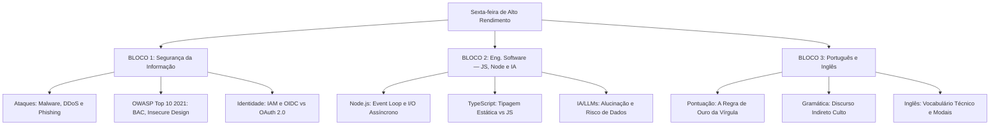

# Guia de Estudos Definitivo — Sexta-feira 05/06/2026
## Semana 3 | Dia 20 | TJ-CE 2026 (Analista TI - Sistemas)
### Foco Absoluto: Banca FCC — Doutrina, Detalhes Ocultos, Pegadinhas e Casos Práticos

---

## 🗺️ Mapa de Estudos do Dia

---

## 🛡️ SEÇÃO 1: Segurança da Informação — Ameaças, OWASP e IAM

A FCC foca na distinção sutil entre ataques, na arquitetura de identidade e nas posições exatas do OWASP.

### 1. Ataques e Ameaças Comuns
*   **Malware:** Termo guarda-chuva. 
    *   *Vírus:* Precisa de hospedeiro, precisa ser ativado/executado.
    *   *Worm:* Autorreplicável via rede, propaga-se sozinho explorando vulnerabilidades (não precisa do clique do usuário).
    *   *Spyware:* Espiona (Keyloggers mapeiam teclado).
    *   *Ransomware:* Criptografa arquivos/discos (extorsão cobrando criptomoedas).
*   **DoS vs DDoS:** O *Denial of Service* inunda a rede. Quando é *Distributed* (DDoS), provém de uma Botnet (milhares de computadores zumbis), tornando a defesa dificílima.
*   **Phishing e Variantes:** 
    *   *Phishing:* Escala massiva. 
    *   *Spear Phishing:* Direcionado a grupos menores. 
    *   *Whaling:* Alvo em CEOs, Diretores ou Magistrados.
    *   *Pharming:* Modifica o DNS ou o arquivo hosts (o usuário digita certo e cai no site falso).

### 2. OWASP Top 10 (2021)
*   **A01 - Broken Access Control (Quebra de Controle de Acesso):** É a falha nº 1 atual. O usuário consegue forçar acesso a dados de outros (Ex: IDOR, mudar o `?id=5` para `?id=6` na URL e ver o processo de outra pessoa).
*   **A04 - Insecure Design:** Falta de arquitetura de defesa. Não é "código mal escrito", é esquecer de projetar barreiras lógicas (ex: não colocar CAPTCHA num formulário e levar um ataque de bot que esgota o sistema).
*   **A05 - Security Misconfiguration:** Falhas de operação pura. Deixar portas abertas, painéis default de Apache visíveis e buckets S3 públicos na nuvem.

### 3. Identidade e Acesso (IAM e OIDC)
*   **SSO (Single Sign-On):** Fazer login uma vez no IdP central e acessar múltiplos sistemas automaticamente.
*   **OIDC (OpenID Connect) vs OAuth 2.0:** A banca ama confundir isso. OAuth 2.0 provê AUTORIZAÇÃO (Access Token opaco para APIs). O OIDC fica "por cima" dele e provê a IDENTIDADE (ID Token em JWT, contendo CPF, nome, etc.).

---

## 💻 SEÇÃO 2: Engenharia de Software — Ecossistema JS e IAs

### 1. Node.js e Event Loop
*   O Node roda sobre o motor V8 usando apenas **uma thread primária (Single-Thread)**.
*   O segredo da performance absurda dele (Non-Blocking I/O) é delegar o que demora (banco de dados, requisições HTTP) para o sistema operacional.
*   **O Ponto Fraco (CPU-Bound):** Se você botar o Node para calcular matrizes, gerar PDFs pesados ou criptografia forte, a thread trava, o *Event Loop* morre afogado e a API inteira para de responder a outros usuários. (Solução: Worker Threads).

### 2. JavaScript vs TypeScript
*   **JS:** Tipagem Fraca e Dinâmica. O navegador entende diretamente. Erros estouram só na tela do usuário (Runtime). A palavra `const` garante que a referência não seja sobrescrita acidentalmente.
*   **TypeScript:** Traz tipagem ESTÁTICA e FORTE (Compile-time). Detecta o erro *antes* de rodar. Navegador não roda TS, logo, é **Obrigatório Transpilar** (Compilar/Converter) todo o `.ts` de volta para `.js` puro antes de ir para o servidor.

### 3. Assistentes de IA e LLMs (Large Language Models)
*   **Alucinação:** O modelo de IA preenche uma lacuna inventando bibliotecas e funções de código que parecem hiper realistas mas não existem.
*   **Risco de Data Leakage:** Ao colar código fonte do tribunal no ChatGPT aberto, a IA da OpenAI/Google usa isso no treinamento, expondo segredos.
*   **Prompt Injection:** O tipo de ataque cibernético atual (OWASP para LLMs) onde o invasor escreve comandos invisíveis enganando a IA para vazar informações ou ignorar suas regras de segurança.

---

## 📖 SEÇÃO 3: Português e Inglês Instrumental

### 1. Português: A Regra de Ouro e o Discurso
*   **A Vírgula Asssassina:** A FCC desconta nota e erra questões que separam **Sujeito e Verbo**. Se o sujeito for enorme ("Os auditores de tribunal de contas, os estagiários da TI e o Presidente"), não o separe do seu verbo por uma vírgula solitária.
*   **Pontuação Explicativa:** A vírgula converte a Oração Adjetiva de *Restritiva* para *Explicativa*. Colocou vírgula isolando o termo inteiro? Agora ele deixou de restringir (dizer que é apenas "aquele" tipo) para generalizar ("todos são assim").
*   **Dois-pontos:** Quase sempre inseridos para iniciar o "desdobramento lógico/consequência explicativa" da afirmação que acabou de ser feita.
*   **Discurso Indireto Livre:** A voz (pensamento) do personagem escorre pelo texto no meio da narração do autor sem travessões e sem os avisos clássicos ("Ele disse:").
*   **Vocabulário:** Belicoso (guerreiro, brigão) x Cordato (conciliador, calmo); Açodamento (pressa excessiva) e Incúria (negligência).

### 2. Inglês para TI (Vocabulário FCC)
*   **Deployment:** Implantação (pôr o software em produção). Não confunda com "Deplorar".
*   **Modal *Shall be*:** Requisito estrito em manuais, obrigação mandatória (Must). Não é apenas sugestão.
*   **Phrasal Verb *Phase out*:** Descontinuar/desativar algo em fases gradativamente.
*   **Sanitize:** Sanitizar/limpar as variáveis de entrada evitando que um Hacker mande comandos SQL via formulário.

---

## 🎯 SEÇÃO 4: Questões Inéditas FCC-Style Comentadas Passo a Passo

### Questão 1: Engenharia de Software (O Calcanhar do Node.js)
**(FCC - Adaptada)** Um Analista Senior migrou uma rotina contábil de fechamento mensal do tribunal para um microserviço puramente construído em Node.js (V8 Engine). A rotina realiza pesados cálculos matemáticos exponenciais sequenciais sobre um array na memória contendo dez milhões de linhas salariais. Assim que a rotina noturna iniciou, todos os juízes que tentaram logar no portal Web relataram que a tela de login ficava girando eternamente e não entrava. Sob o escopo arquitetural do ecossistema Node, este incidente ocorreu invariavelmente devido:

A) Ao Garbage Collector da V8, que limpa os tokens de sessão por segurança.  
B) À limitação estrutural da engine, pois o Single-Threaded Event Loop central ficou ocupado "preso" calculando o array massivo e bloqueou-se completamente para responder novas requisições de I/O de rede simultâneas.  
C) Ao fato de o Node precisar ser transpilado em tempo de execução para JavaScript pelas Worker Threads em segundo plano.  
D) Ao uso de Promises Assíncronas que geram conflito direto com o paradigma CPU-Bound em arrays densos.

#### 💡 Resolução Comentada e Pegadinha (Questão 1):
*   **A Pegadinha:** Muitas pessoas decoram que "Node é super rápido por ser assíncrono". Ele é magistral para rede e conexões HTTP de leitura/escrita, mas é **péssimo para processamento denso de CPU**.
*   Ao calcular tudo matematicamente de uma vez (CPU-Bound), a única e solitária thread do Node (Event Loop) engasga e para de ouvir a porta da web. Ela só faria as duas coisas ao mesmo tempo se a rotina fosse de I/O de disco/rede e repassada ao SO. A solução arquitetônica moderna seria usar Worker Threads do Node.
*   **Gabarito correto: B.**

### Questão 2: Segurança da Informação (Ataques Cirúrgicos)
**(FCC - Adaptada)** Um Desembargador de altíssima relevância no TRT recebeu uma intimação por e-mail disfarçada do Presidente da República. O conteúdo da mensagem exigia de forma peremptória que o desembargador redefinisse seu duplo-fator (MFA) em um link específico falso, cujo design era indistinguível da intranet verdadeira, em virtude de uma suposta "Quebra do OIDC". Sabe-se que esse ataque exigiu profundo estudo de campo e foi focado e disparado **exclusivamente** para este único servidor devido à sua hierarquia, e mais ninguém. Este vetor clássico no cenário corporativo classifica-se estritamente como:

A) Vishing.  
B) DDoS por exaustão de estado corporativo.  
C) Pharming baseado em Spoofing de MAC.  
D) Whaling.  

#### 💡 Resolução Comentada e Pegadinha (Questão 2):
*   **A Pegadinha:** O concurseiro apressado vê a descrição de "e-mail para roubar dados com site falso" e procura por Phishing (que até serve), mas a FCC usa casos concretos para cobrar as subcategorias. Se é focado "exclusivamente num único servidor", é *Spear Phishing*. Se esse servidor em questão é da altíssima cúpula executiva/judiciária (diretores, ministros, desembargadores), o nome exato e preciso do ataque é **Whaling** (Pesca da baleia). Vishing usa voz/telefone. Pharming corrompe DNS.
*   **Gabarito correto: D.**

---

## 🧠 SEÇÃO 5: Flashcards de Memorização Ativa (Estilo Anki)

### Bloco 1 — Segurança e IAM
*   **Frente:** O que difere o OIDC (OpenID Connect) do OAuth 2.0?
*   **Verso:** O OAuth 2.0 fornece **Autorização** (Access Token, acessar APIs do banco). O OIDC fornece **Identidade** (JWT/ID Token com seu nome, foto e cargo). OIDC fica no topo do OAuth.

*   **Frente:** No OWASP Top 10 (2021), a categoria nº1 assumiu a ponta. Qual é e o que ela significa?
*   **Verso:** **Broken Access Control (A01)**. É quando as barreiras caem e o usuário João consegue alterar os dados ou visualizar os processos do usuário Pedro (Ex: IDOR).

### Bloco 2 — JS e Node
*   **Frente:** Por que é obrigatório o uso do compilador (`tsc`) no TypeScript?
*   **Verso:** Porque **nenhum navegador web** compreende nativamente TS. Ele precisa ser **transpilado** para JavaScript padrão para rodar na produção ou em Node. O TS garante segurança de tipos só em tempo de compilação.

*   **Frente:** O que significa a vulnerabilidade de Alucinação num LLM (Inteligência Artificial)?
*   **Verso:** Significa que o robô, por modelo estatístico, inventará com total convicção métodos e funções falsas na linguagem de programação para entregar o código que você pediu.

### Bloco 3 — Português e Inglês
*   **Frente:** Discurso Indireto: "A estagiária disse: - Eu não farei a migração amanhã!". Converta.
*   **Verso:** A estagiária disse que (ela) não **faria** a migração **no dia seguinte** (ou no dia posterior).

*   **Frente:** Traduza as expressões técnicas de contexto IT: "Deployment", "Phase Out" e "Sanitize".
*   **Verso:** **Deployment** = Implantação de ambiente/software. **Phase Out** = Descontinuar algo gradativamente. **Sanitize** = Sanitizar/limpar dados inseridos pelo usuário filtrando vírus e códigos suspeitos (SQLi/XSS).

---

## 🏆 Roteiro de Estudos Sugerido para Hoje (05/06/2026)

1.  **Manhã (Bloco 1 - Segurança):** Leia as diferenças entre Vírus, Worm e Spyware. Estude e internalize a lista do OWASP Top 10 focando nos exemplos do A01, A04 e A05. Grave a diferença entre OIDC e OAuth.
2.  **Tarde (Bloco 2 - Eng. Software):** Entenda como o Event Loop brilha na I/O mas morre em CPU. Revise como o TS te dá paz e tranquilidade evitando bugs em produção e decore que `JSON.parse` transforma texto de API em objeto JS local.
3.  **Noite (Bloco 3 - Port. e Inglês):** Revise as regras de pontuação restritiva vs explicativa (Isolar uma adjetiva por vírgulas sempre a transforma em explicação geral). Leia textos em inglês buscando os modal verbs ("shall be") e sua carga de obrigação normativa de manuais RFC.
4.  **Ação Final:** Vá direto para o Web App e **bata a Bateria de Questões do dia 05/06**. Preste enorme atenção às explicações das alternativas erradas (nelas estão as cascas de banana da FCC).

A consistência de ler as teorias nas pegadinhas todo dia vai pavimentar sua nomeação. Vamos pra cima! 🚀
