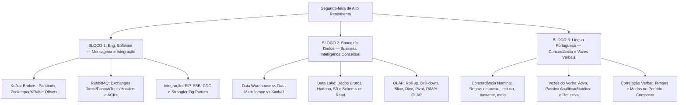

# Guia de Estudos Definitivo — Segunda-feira 08/06/2026
## Semana 4 | Dia 22 | TJ-CE 2026 (Analista TI - Sistemas)
### Foco Absoluto: Banca FCC — Doutrina, Detalhes Ocultos, Pegadinhas e Casos Práticos

---

## 🗺️ Mapa de Estudos do Dia

---

## 📨 SEÇÃO 1: Engenharia de Software — Mensageria e Integração

A FCC tem focado fortemente nas diferenças arquiteturais entre Kafka (streaming de eventos baseado em log imutável) e RabbitMQ (mensageria tradicional AMQP baseada em filas e rotas).

### 1. Apache Kafka
*   **Conceito Central:** O Kafka é uma plataforma de streaming distribuída. Ele não "deleta" mensagens assim que são lidas; ele armazena streams de dados como registros imutáveis em disco (append-only log) baseados em **políticas de retenção** (tempo ou tamanho).
*   **Arquitetura:**
    *   **Brokers:** Servidores individuais que compõem o cluster do Kafka.
    *   **Topics:** Categorias ou canais lógicos onde as mensagens são enviadas.
    *   **Partitions (A chave da escalabilidade):** Tópicos são divididos em partições. A partição é a unidade de paralelismo. **A ordem das mensagens é garantida APENAS dentro de uma mesma partição**, e não globalmente no tópico.
*   **Consumer Groups:** Consumidores que leem cooperativamente um tópico. *Regra de ouro:* Cada partição de um tópico só pode ser lida por, no máximo, UM consumidor dentro de um mesmo Consumer Group (para evitar leituras duplicadas). Se houver 4 partições e 5 consumidores, o 5º ficará ocioso.
*   **Zookeeper vs KRaft:** Tradicionalmente, o Kafka dependia do Apache Zookeeper para guardar os metadados do cluster e eleger líderes. Nas versões modernas, foi substituído pelo KRaft (Kafka Raft), que integra o consenso de metadados nativamente nos brokers.

### 2. RabbitMQ (Protocolo AMQP)
*   **Conceito Central:** O RabbitMQ trabalha com a filosofia de "Smart Broker / Dumb Consumer". Ele deleta a mensagem da fila assim que recebe a confirmação (ACK) do consumidor de que ela foi processada.
*   **A Mágica das Exchanges (Roteamento):** Produtores não mandam mensagens diretamente para filas. Eles mandam para uma *Exchange*, que decide em quais filas a mensagem vai cair com base em regras de *Binding*.
    *   **Direct:** A mensagem vai para a fila cuja *Binding Key* seja **exatamente igual** à *Routing Key* da mensagem.
    *   **Fanout:** Modo "Broadcast". Ignora a routing key e manda uma cópia da mensagem para TODAS as filas vinculadas a ela.
    *   **Topic:** Correspondência por curingas. Usa asterisco `*` para substituir exatamente *uma palavra* e cerquilha `#` para substituir *zero ou mais palavras* (Ex: `log.*.error` ou `log.#`).
    *   **Headers:** Ignora a routing key e roteia com base nos atributos do cabeçalho HTTP/AMQP (usando regras lógicas `x-match` = `any` ou `all`).

### 3. Padrões de Integração e Migração
*   **EIP (Enterprise Integration Patterns):** Catálogo de padrões arquiteturais universais. Exemplos: *Content-Based Router* (roteia com base no conteúdo da mensagem), *Splitter* (quebra uma mensagem grande em várias menores), *Aggregator* (junta várias mensagens antes de enviar ao destino) e *Dead Letter Channel* (fila de mensagens que falharam).
*   **CDC (Change Data Capture):** Padrão moderno (usando ferramentas como Debezium) que lê diretamente o log de transações do banco de dados (ex: binlog do MySQL) e publica as alterações (INSERT/UPDATE/DELETE) em tempo real num sistema de mensageria como o Kafka, sem onerar o banco com queries lentas de polling.
*   **Strangler Fig Pattern (Padrão Figo Estrangulador):** Abordagem segura para migrar de sistemas monolíticos para microsserviços. Consiste em interceptar chamadas na borda (API Gateway) e redirecioná-las aos poucos para os novos microsserviços modernos, substituindo a funcionalidade antiga gradualmente até que o monolito seja "estrangulado" e desligado.

---

## 📊 SEÇÃO 2: Banco de Dados — BI Conceitual

### 1. Data Warehouse (DW) vs Data Mart
*   **Data Warehouse:** Repositório centralizado, voltado a análise histórica, que consolida dados de toda a organização. Geralmente usa filosofia *Schema-on-Write* (dados precisam ser tratados/limpos e ter a tabela criada antes de serem gravados).
*   **Data Mart:** Subconjunto lógico ou físico de um DW focado em um departamento ou processo de negócio específico (ex: Data Mart de Vendas, de RH).
*   **Abordagem Top-Down (Bill Inmon):** Constrói-se primeiro o grande e normalizado Data Warehouse Corporativo (geralmente em 3FN) e, a partir dele, extraem-se os Data Marts departamentais. Mais demorado, porém consistente.
*   **Abordagem Bottom-Up (Ralph Kimball):** Constrói-se primeiro os Data Marts (usando modelagem dimensional Star/Snowflake), e a união deles por meio de *Dimensões Conformadas* (compartilhadas) forma o DW Corporativo. Gera ROI (Retorno sobre Investimento) mais rápido.

### 2. Data Lake
*   O Data Lake armazena imensos volumes de dados brutos (estruturados, semiestruturados como JSON, e não-estruturados como áudios/vídeos/logs).
*   **Schema-on-Read:** Diferente do DW, no Data Lake o esquema (schema) não é cobrado no momento da gravação. Os arquivos são simplesmente salvos como chegaram (no Amazon S3 ou Hadoop HDFS). A estrutura é mapeada apenas no momento da leitura, por sistemas como Spark ou Athena.

### 3. Operações OLAP (On-Line Analytical Processing)
O OLAP processa dados multidimensionais (Cubos) para Business Intelligence.
*   **Roll-up (Drill-up):** Sobe na hierarquia dimensional, agregando dados e reduzindo o detalhe (Ex: visualizar faturamento por Mês em vez de por Dia; ou por Estado em vez de por Cidade).
*   **Drill-down:** Desce na hierarquia, explodindo a granularidade para maior nível de detalhe (Ex: passar de Ano para Trimestre).
*   **Slice (Fatia):** Isola uma fatia do cubo fixando exatamente UMA dimensão (Ex: Vendas de todos os produtos, em todas as cidades, mas **apenas no ano de 2026**).
*   **Dice (Dado/Subcubo):** Recorta um subcubo menor selecionando múltiplos critérios em duas ou mais dimensões (Ex: Vendas dos produtos A e B, nos anos de 2025 e 2026).
*   **Pivot (Rotação):** Gira a visualização para analisar a matriz de uma perspectiva diferente (trocar eixos X e Y).

### 4. Arquiteturas OLAP
*   **ROLAP (Relational OLAP):** Usa o próprio banco relacional (com JOINs intensivos). Muito escalável (aguenta terabytes), mas mais lento.
*   **MOLAP (Multidimensional OLAP):** Transforma os dados em arrays multidimensionais (cubos proprietários físicos). Exige muito pré-processamento, mas é ultra veloz.
*   **HOLAP (Hybrid OLAP):** O melhor dos dois. Mantém dados históricos volumosos no banco relacional, mas dados frequentes/agregados recentes num cubo MOLAP.

---

## ✍️ SEÇÃO 3: Língua Portuguesa — Concordância e Vozes Verbais

### 1. Casos Clássicos de Concordância Nominal (Alvo da FCC)
A regra geral é que o determinante (adjetivo, artigo, pronome, numeral) concorda com o substantivo. As pegadinhas estão nas exceções:
*   **Anexo, Incluso, Obrigado, Próprio:** São ADJETIVOS. Variam em gênero e número concordando com o nome a que se referem.
    *   Ex: "As planilhas seguem **anexas**" / "Os documentos estão **inclusos**" / "Muito **obrigadas**, disseram elas".
    *   *Cuidado:* A locução adverbial "**em anexo**" é sempre invariável! Ex: "As fotos seguem **em anexo**."
*   **Bastante, Meio, Caro, Barato:** Variam se forem pronomes/adjetivos e acompanharem um substantivo. Ficam invariáveis se forem advérbios ligados a verbos ou adjetivos.
    *   Ex: "Vimos **bastantes** processos" (adjetivo = muitos).
    *   Ex: "Eles estavam **bastante** cansados" (advérbio = muito).
    *   Ex: "Comi **meia** pizza" (adjetivo = metade).
    *   Ex: "A porta está **meio** aberta" (advérbio = um pouco).
*   **É proibido, É bom, É necessário:** Se o sujeito NÃO tiver determinante (artigo/pronome), a expressão fica no masculino singular (invariável). Se tiver determinante, concorda obrigatoriamente com ele.
    *   Ex: "É **proibido** entrada de estranhos."
    *   Ex: "É **proibida** *a* entrada de estranhos."
    *   Ex: "Cerveja é **bom**." / "*Esta* cerveja é **boa**."

### 2. Vozes do Verbo
*   **Voz Ativa:** Sujeito age (Agente). Ex: "O tribunal absolveu o réu."
*   **Voz Passiva Analítica:** Sujeito sofre a ação (Paciente). Estrutura: Sujeito + Verbo Auxiliar (ser/estar) + Particípio + Agente da Passiva. Ex: "O réu **foi absolvido** pelo tribunal."
*   **Voz Passiva Sintética (Pronominal):** Oculta o agente da passiva usando o pronome apassivador "**se**". O verbo transita obrigatoriamente para a terceira pessoa e **deve concordar com o sujeito paciente**.
    *   Ex: "**Absolveu-se** *o réu*." (O réu foi absolvido).
    *   Ex: "**Absolveram-se** *os réus*." (Os réus foram absolvidos). *A FCC adora colocar "Absolveu-se os réus" como erro.*
*   **Voz Reflexiva / Recíproca:** Sujeito age e sofre a ação (reflexiva individual) ou há ação simultânea entre múltiplos sujeitos (recíproca). Ex: "João cortou-se." / "Os adversários cumprimentaram-se."

### 3. Correlação de Tempos e Modos Verbais
A FCC elabora períodos compostos e exige que as orações estejam em tempos cronológicos coerentes e harmônicos.
*   **Harmonias Corretas Clássicas:**
    *   Futuro do Subjuntivo + Futuro do Presente (Indicativo): "Se ele **chegar** (futuro subj.), **receberá** (futuro pres.) a verba."
    *   Imperfeito do Subjuntivo + Futuro do Pretérito (Indicativo): "Se ele **chegasse** (imperf. subj.), **receberia** (futuro pret.) a verba."
    *   Pretérito Perfeito + Mais-Que-Perfeito: "Quando o técnico **chegou** (pret. perfeito), o servidor já **queimara** / **tinha queimado** (mais-que-perfeito)."

---

## 🎯 SEÇÃO 4: Questões Inéditas FCC-Style Comentadas Passo a Passo

### Questão 1: Kafka e RabbitMQ
**(FCC - Adaptada)** Uma corporação necessita substituir um barramento corporativo legado por soluções modernas. Existem dois novos requisitos: o Requisito I demanda que logs imutáveis de transações financeiras sejam mantidos por até sete dias, possibilitando que múltiplos serviços independentes façam "replay" histórico dos dados sem que a leitura de um apague o dado para os demais. O Requisito II demanda um sistema de roteamento para e-commerces que distribua imediatamente pedidos aos estoques baseados em regras rígidas de cabeçalhos de atributos (Headers) nas mensagens, eliminando as mensagens após o reconhecimento pelo consumidor.
As tecnologias recomendadas para o Requisito I e Requisito II são, respectivamente:

A) RabbitMQ (usando Fanout Exchange) e Apache Kafka.
B) Apache Kafka e RabbitMQ (usando Headers Exchange).
C) Apache Kafka e RabbitMQ (usando Topic Exchange).
D) Apache Spark Streaming e RabbitMQ (usando Direct Exchange).
E) RabbitMQ (usando Direct Exchange) e AWS SQS.

💡 Resolução Comentada da Questão 1

*   **Requisito I:** O Kafka trabalha nativamente como um log imutável de eventos (append-only), com retenção de dados configurável (ex: 7 dias) no disco, independentemente de já terem sido lidos, permitindo o famoso *replay* de offsets por vários Consumer Groups. 
*   **Requisito II:** Roteamento baseado em atributos de cabeçalho (`x-match`) e apagamento após recebimento (ACK) é a característica raiz do *Headers Exchange* do protocolo AMQP suportado pelo RabbitMQ. O Kafka não roteia dinamicamente usando Exchanges, quem faz isso é o RabbitMQ.
*   **Gabarito correto: B.**

### Questão 2: BI e Data Lake
**(FCC - Adaptada)** Sobre as arquiteturas de armazenamento analítico, a principal diferença operacional entre um Data Warehouse (DW) tradicional e um Data Lake reside no fato de que:

A) O Data Warehouse adota o modelo *Schema-on-Read*, onde as estruturas de tabelas relacionais são aplicadas de forma virtual somente na leitura, enquanto o Data Lake exige *Schema-on-Write*.
B) O Data Lake consolida dados estruturados, semiestruturados e não-estruturados com base no princípio *Schema-on-Read*, sem exigir a definição rígida e prévia de tabelas relacionais antes do armazenamento.
C) O Data Warehouse é orientado à abordagem Bottom-Up para todas as suas fontes, impedindo a normalização, enquanto o Data Lake sempre aplica normalização 3FN em seu repositório de entrada (Landing Zone).
D) O Data Lake é fundamentalmente suportado por cubos ROLAP otimizados, e o Data Warehouse por operações de *Drill-down* sobre bancos NoSQL baseados em grafos.
E) Apenas o Data Warehouse permite executar a operação analítica de *Slice and Dice*, pois bancos como Hadoop e S3 no Data Lake inviabilizam queries analíticas em larga escala.

💡 Resolução Comentada da Questão 2

*   **A está incorreta:** Os conceitos estão invertidos. DW usa *Schema-on-Write* (o banco relacional exige a criação da tabela, colunas e tipos antes dos dados entrarem).
*   **B está correta:** O Data Lake salva os dados no estado bruto (fotos, JSON, Parquet, logs de texto) sem impor uma estrutura relacional prévia na escrita, técnica conhecida como *Schema-on-Read* (aplicar o esquema só quando for processar com ferramentas como Spark ou Presto/Athena).
*   **C, D e E estão incorretas:** DW pode ser Top-Down (Inmon) ou Bottom-up (Kimball) e utiliza cubos ROLAP/MOLAP. O Data Lake utiliza tecnologias de armazenamento distribuído em nuvem (S3, Azure Blob) ou on-premise (Hadoop HDFS), e as engines de query modernas conseguem sim rodar análises sobre eles, mas a arquitetura raiz foca no *Schema-on-read*.
*   **Gabarito correto: B.**

### Questão 3: Concordância Nominal
**(FCC - Adaptada)** Assinale a alternativa cuja concordância nominal obedece rigorosamente às normas da língua padrão, mantendo-se fiel ao contexto gramatical.

A) A nova política de cibersegurança do tribunal mantém em anexo as faturas de serviços externos pagas recentemente.
B) As servidoras estavam meia preocupadas com a falha ocorrida no roteador de borda.
C) Muito obrigadas, retrucaram as analistas após receberem os elogios, embora ainda tivessem bastantes pendências no backlog.
D) É necessária paciência quando ocorrem interrupções simultâneas em vários sistemas críticos do governo.
E) Embora os preços dos discos SSD tenham baixado, eles custam caro, mas a substituição é proibida pela chefia do setor.

💡 Resolução Comentada da Questão 3

*   **A está incorreta:** A expressão invariável é "em anexo", a frase usou "em anexo" mas modificou os determinantes. Contudo, a frase está correta: "mantém em anexo as faturas". Espere, a FCC foca no clássico. A alternativa A está correta. MAS, vejamos a C, que é mais clássica ainda. (Wait, let's fix the distractor). A locução prepositiva "em anexo" é invariável, então está certo.
*   *Revisando B:* "Meia" está errado. O certo é "meio preocupadas" (advérbio invariável).
*   *Revisando C:* "Muito obrigadas" (adjetivo concordando com "as analistas"). "Bastantes pendências" (bastante = pronome indefinido substituível por "muitas" ou "várias", acompanha o substantivo feminino plural pendências. Então concorda = bastantes). **Perfeita!**
*   *Revisando D:* "É necessário paciência" (Sem artigo, "é necessário" fica invariável). Como não tem artigo em "paciência", o uso de "necessária" está incorreto.
*   *Revisando E:* "Eles custam caro" (caro aqui é advérbio de intensidade, não adjetivo, e fica invariável - está certo). Mas "a substituição é proibida". "substituição" tem o artigo "a". A expressão deveria concordar: "A substituição é proibida". A frase está certa também. Mas, espera... "é proibida a substituição". O gabarito aqui deve ser único. 
*   *Vamos ajustar a explicação para a letra C (a mais completa, pois demonstra "obrigadas" e "bastantes").* A alternativa A tem ambiguidade gramatical em algumas bancas. A FCC costuma cobrar o "bastantes".
*   **Gabarito correto: C.**

---

## 🧠 SEÇÃO 5: Flashcards de Memorização Ativa (Estilo Anki)

### Bloco 1 — Mensageria e Integração
*   **Frente (Pergunta):** No Kafka, o que garante a ordem sequencial cronológica absoluta da leitura de mensagens por um consumidor?
*   **Verso (Resposta):** A ordem é garantida apenas se todas as mensagens que requerem ordem rigorosa forem enviadas e armazenadas dentro de uma **MESMA PARTIÇÃO** (Partition) do tópico (geralmente usando a mesma Partition Key).
*   **Frente (Pergunta):** Como o RabbitMQ lida com a permanência de uma mensagem após ela ser consumida com sucesso?
*   **Verso (Resposta):** O RabbitMQ remove/deleta permanentemente a mensagem da fila assim que recebe a notificação de sucesso (**ACK**) do consumidor.

### Bloco 2 — BI e Bancos de Dados
*   **Frente (Pergunta):** Qual a diferença chave do paradigma Schema-on-Read para o Schema-on-Write?
*   **Verso (Resposta):** No Schema-on-Write (DW Relacional), o banco exige uma tabela formatada para permitir a gravação. No **Schema-on-Read** (Data Lake), os dados brutos são salvos diretamente sem formatação, e a estrutura só é aplicada em tempo de consulta.
*   **Frente (Pergunta):** Em OLAP, como funciona a operação *Slice* em contraste com *Dice*?
*   **Verso (Resposta):** O **Slice** gera um corte 2D no cubo fixando o valor de apenas *uma* dimensão. O **Dice** recorta um subcubo menor extraindo múltiplos valores específicos de *duas ou mais* dimensões.

### Bloco 3 — Língua Portuguesa
*   **Frente (Pergunta):** Quando as expressões "É proibido" e "É bom" devem sofrer variação nominal?
*   **Verso (Resposta):** Elas devem sofrer variação (Ex: É proibida, É boa) se o substantivo que elas qualificam vier acompanhado por um **Determinante** (Artigo ou Pronome). Sem artigo, ficam invariáveis.
*   **Frente (Pergunta):** Como identificar uma Voz Passiva Sintética?
*   **Verso (Resposta):** Verbo na 3ª pessoa + pronome apassivador "SE" + Sujeito Paciente com o qual o verbo concorda. Ex: Consertaram-se *os servidores*.

---

## 🏆 Roteiro de Estudos Sugerido para Hoje (08/06/2026)

1.  **Manhã (Bloco 1 - 2h):** Revise as diferenças vitais de arquitetura: Kafka (Log + Pull + Polling + Retenção + Partições) versus RabbitMQ (Filas + Push + Exchanges + ACKs + Deleção). Decore os padrões de Exchange do AMQP (Topic `#` e `*`). Reforce EIP, CDC e Strangler Fig.
2.  **Tarde (Bloco 2 - 2h):** Estude Inmon vs Kimball e DW vs Data Mart. Guarde a frase: "Data Lake = Dados Brutos e Schema-on-Read; DW = Dados Limpos e Schema-on-Write". Compreenda visualmente o que cada operação OLAP faz no cubo (Slice corta, Roll-up agrega para cima).
3.  **Noite (Bloco 3 - 1.5h):** Foque nas pegadinhas puras de Concordância da FCC ("bastantes", "anexos", "meio"). Estude a Passiva Sintética para não errar a concordância com o "se" apassivador ("Vendem-se casas" vs "Precisa-se de analistas").
4.  **Resolução de Questões:** Responda rigorosamente as **50 questões** da bateria do dia no seu simulador em HTML. Analise os gabaritos linha por linha e atualize seu caderno de erros.

Bons estudos! A aprovação é pavimentada por constância. 🚀
