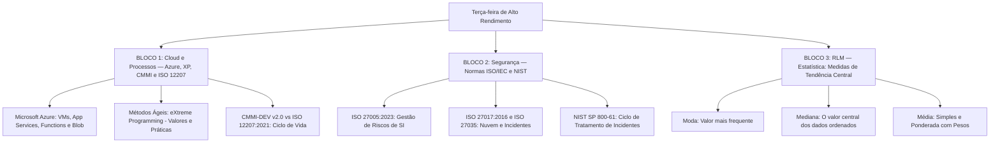

# Guia de Estudos Definitivo — Terça-feira 09/06/2026
## Semana 4 | Dia 23 | TJ-CE 2026 (Analista TI - Sistemas)
### Foco Absoluto: Banca FCC — Doutrina, Detalhes Ocultos, Pegadinhas e Casos Práticos

---

## 🗺️ Mapa de Estudos do Dia

---

## ☁️ SEÇÃO 1: Cloud Computing e Processos — Azure, Ágil e ISO/CMMI

A FCC adora cobrar a associação correta dos serviços de nuvem com seus modelos (IaaS, PaaS, SaaS) e os detalhes de práticas ágeis do XP em contraposição ao Scrum. 

### 1. Microsoft Azure (Serviços Essenciais)
*   **Azure Virtual Machines (VMs):** IaaS (Infraestrutura como Serviço). Dá controle total sobre o SO, ideal para lift-and-shift.
*   **Azure App Services:** PaaS (Plataforma como Serviço). Focado em hospedar aplicações web, APIs REST e backends mobile. O desenvolvedor foca no código, a plataforma cuida da escalabilidade, balanceamento e SO.
*   **Azure Functions:** Computação Serverless (FaaS). O código roda em resposta a eventos (triggers), como um arquivo caindo no Blob ou uma mensagem numa fila, cobrando apenas pelos milissegundos de execução.
*   **Azure Blob Storage:** Armazenamento de objetos, equivalente ao AWS S3. Ideal para Data Lakes, backups e mídia.

### 2. Métodos Ágeis: eXtreme Programming (XP)
*   Diferente do Scrum (que é um framework de gestão), o XP foca fortemente nas **práticas de engenharia**.
*   **Valores do XP:** Comunicação, Simplicidade, Feedback, Coragem e Respeito.
*   **Práticas-Chave:**
    *   **Pair Programming (Programação em Par):** Dois programadores em um teclado. Maior qualidade do código e disseminação de conhecimento.
    *   **TDD (Test-Driven Development):** O teste falho é escrito *antes* da funcionalidade.
    *   **Integração Contínua (CI):** Código integrado várias vezes ao dia.
    *   **Refatoração:** Melhorar o design do código constantemente sem mudar o comportamento externo.
    *   **Cliente no Local (On-site Customer):** O cliente faz parte da equipe o tempo todo para tirar dúvidas.

### 3. Modelos de Maturidade e Ciclo de Vida
*   **CMMI-DEV v2.0:** Mudou o foco de "Áreas de Processo" para "Áreas de Prática" agrupadas por capacidades. Seus níveis de maturidade clássicos são: 1 (Inicial/Ad-hoc), 2 (Gerenciado), 3 (Definido - onde os processos são padronizados para toda a organização), 4 (Quantitativamente Gerenciado) e 5 (Em Otimização).
*   **ISO/IEC 12207:2021:** Norma internacional para processos de ciclo de vida de software. Divide os processos em grupos como Acordo, Projetos Organizacionais, Gestão Técnica e Processos Técnicos (onde ficam Análise de Requisitos, Arquitetura, Implementação, Integração e Testes).

---

## 🔒 SEÇÃO 2: Segurança da Informação — Riscos e Incidentes

As normas da família 27000 e frameworks como o NIST são vitais para a prova de Segurança.

### 1. Gestão de Riscos: ISO/IEC 27005:2023
*   Processo sistemático para tratar riscos. 
*   **Fases do Risco:**
    1.  **Identificação do Risco:** Achar ativos, ameaças, vulnerabilidades e consequências.
    2.  **Análise do Risco:** Estimar as consequências e a probabilidade de ocorrerem. Nível de Risco = Impacto x Probabilidade.
    3.  **Avaliação do Risco:** Comparar o nível de risco com os critérios de aceitação da organização (apetite ao risco) para decidir se ele precisa de tratamento.
*   **Opções de Tratamento de Risco:** Modificar (mitigar), Reter (aceitar), Evitar ou Compartilhar (transferir, ex: seguro).

### 2. Nuvem e Incidentes: ISO 27017 e 27035
*   **ISO/IEC 27017:2016:** Extensão da 27002 específica para **Cloud Computing**. Estabelece controles e diretrizes tanto para os provedores de nuvem quanto para os clientes da nuvem, com foco na responsabilidade compartilhada.
*   **ISO/IEC 27035-1:2023:** Princípios da **Gestão de Incidentes de Segurança**. O ciclo foca em detectar, relatar, avaliar, responder a incidentes de segurança da informação e aprender com eles.

### 3. NIST SP 800-61 (Tratamento de Incidentes)
O guia de resposta a incidentes do NIST é muito cobrado. Seu ciclo de vida tem 4 fases principais:
1.  **Preparação (Preparation):** Criar e treinar a equipe (CSIRT), adquirir ferramentas e criar políticas preventivas.
2.  **Detecção e Análise (Detection & Analysis):** Identificar se um evento é realmente um incidente através de alertas, logs e análise forense inicial.
3.  **Contenção, Erradicação e Recuperação (Containment, Eradication & Recovery):** Isolar o sistema comprometido (contenção), remover a causa raiz e malwares (erradicação) e restaurar do backup ou colocar no ar em ambiente limpo (recuperação).
4.  **Atividades Pós-Incidente (Post-Incident Activity):** Reuniões de lições aprendidas e melhoria contínua para evitar reincidências.

---

## 📈 SEÇÃO 3: RLM — Medidas de Tendência Central

Questões de estatística na FCC geralmente cobram o cálculo direto a partir de um conjunto de dados pequeno ou de uma tabela de frequências.

### 1. Média (Média Aritmética)
*   **Simples:** Soma de todos os valores dividida pela quantidade de valores. Ex: Valores (2, 4, 6) -> Média = 12 / 3 = 4.
*   **Ponderada:** Cada valor é multiplicado por um "peso" ou frequência. Soma-se os resultados e divide-se pela **soma dos pesos**. 
    *   *Atenção:* Em tabelas de frequência, o valor analisado multiplica-se pela quantidade de vezes que ele aparece, e divide-se pelo total de ocorrências.

### 2. Mediana
*   É o **valor central** da amostra, mas **só funciona se os dados estiverem ordenados** (em Rol, crescente ou decrescente).
*   *Ímpar de elementos:* O valor exato do meio. Ex: (1, 3, **5**, 7, 9) -> Mediana é 5.
*   *Par de elementos:* A média simples dos dois valores do meio. Ex: (1, 3, 5, 7) -> Meio são 3 e 5 -> Mediana = (3+5)/2 = 4.
*   **Vantagem da Mediana:** Ao contrário da Média, ela não é puxada (influenciada) por valores extremos (outliers).

### 3. Moda
*   É o valor que **mais se repete** no conjunto de dados (maior frequência absoluta).
*   Pode ser:
    *   Amodal (nenhum valor se repete).
    *   Unimodal (um valor se repete mais).
    *   Bimodal/Multimodal (dois ou mais valores empatam no topo da repetição).

---

## 🎯 SEÇÃO 4: Questões Inéditas FCC-Style Comentadas Passo a Passo

### Questão 1: XP vs Scrum e Serviços Azure
**(FCC - Adaptada)** O Tribunal de Justiça do Estado do Ceará (TJ-CE) iniciou a modernização de seu Sistema de Peticionamento Eletrônico, atualmente um monólito legado hospedado *on-premises*. Historicamente, o sistema sofre com lentidão e indisponibilidade nas horas finais dos prazos processuais (ex: entre 22h e 23h59), devido a um volume colossal e imprevisível de uploads de petições, cujas validações de formato e cômputo de tempestividade (cálculo de prazos) ocorrem de forma síncrona. 

A equipe de arquitetura decidiu migrar o módulo de processamento de petições para o Microsoft Azure e reestruturar o processo de desenvolvimento adotando as práticas do *eXtreme Programming* (XP). A nova diretriz arquitetural exige que o novo módulo processe os documentos de forma assíncrona, escale automaticamente de forma granular (por evento) com cobrança baseada estritamente no consumo computacional gerado pelos picos, e que não haja qualquer esforço de gerenciamento de sistema operacional por parte da infraestrutura do Tribunal. 

No âmbito da engenharia de software, a equipe precisa garantir que as complexas regras jurídicas de cômputo de prazos tenham altíssima confiabilidade e que o trabalho paralelo de múltiplos desenvolvedores não gere gargalos de integração ou quebra de funcionalidades pré-existentes.

Considerando o cenário descrito, assinale a alternativa que apresenta a melhor decisão arquitetural no Azure aliada à correta aplicação das práticas do XP:

A) Adoção do Azure Functions (Serverless) para o processamento assíncrono das petições acionado por eventos. Aplicação do TDD para redação prévia dos testes de regras de prazos, aliado à Integração Contínua (CI) com integrações diárias múltiplas sob validação automatizada, e ao Pair Programming para o trabalho em duplas.

B) Adoção do Azure Virtual Machine Scale Sets (IaaS) para o módulo de processamento escalável e controle de bibliotecas do sistema operacional. Aplicação do Pair Programming para a divisão simultânea entre código de negócio e testes (TDD) no mesmo posto. Execução da Integração Contínua (CI) ao término de cada sprint quinzenal.

C) Adoção do Azure App Service (PaaS) para hospedar o monólito de forma unificada com alocação elástica de instâncias. Adoção do TDD com foco na criação preliminar de testes automatizados de Interface Gráfica (GUI). Substituição da Integração Contínua (CI) automatizada pelo Pair Programming para revisão do código e eliminação de regressões.

D) Adoção do Azure Kubernetes Service (AKS) para conteinerização das rotinas de validação e cobrança granular por execução de pod. Aplicação da Integração Contínua (CI) permitindo a submissão de código sem testes automatizados atrelados. Execução do Pair Programming através da aprovação simultânea de Pull Requests em máquinas separadas.

E) Adoção do Azure Logic Apps (Serverless) como ambiente de processamento intensivo de CPU para as validações de regras jurídicas. Aplicação do Pair Programming com um piloto e um navegador no mesmo posto. Uso do TDD para a criação de testes de integração após a escrita do módulo e acionamento da Integração Contínua (CI) ao final do dia.

💡 Resolução Comentada da Questão 1

**Gabarito Correto: A**

**Análise do Cenário (Requisitos):**
1. **Cobrança baseada em consumo, escala granular, sem gestão de OS:** Característica exata de *Serverless* (FaaS - Function as a Service).
2. **Alta confiabilidade de regras complexas:** Necessidade de Testes de Unidade rigorosos (TDD focado em regras de negócio).
3. **Evitar gargalos de integração:** Necessidade de *Continuous Integration* verdadeira (múltiplas vezes ao dia com testes automatizados).

**Análise das Alternativas:**
*   **A) CORRETA.** O **Azure Functions** é um serviço *Serverless* baseado em eventos (FaaS), que escala automaticamente a cada execução e cobra apenas pelos milissegundos de computação (atendendo à exigência de não gerir OS e cobrança por pico). As práticas de XP estão perfeitamente aplicadas: o **TDD** prega o ciclo *Red-Green-Refactor* (testes vêm *antes* do código de produção); a **Integração Contínua (CI)** real exige commits frequentes (várias vezes ao dia) atrelados à validação automatizada de testes; e o **Pair Programming** atua como revisão simultânea em tempo real, melhorando o design da solução construída em par.
*   **B) INCORRETA.** *Pegadinha:* Embora VM Scale Sets (IaaS) escalem horizontalmente, eles violam duas exigências do enunciado: cobram por tempo de alocação de máquina (e não execução granular) e **exigem** gerenciamento de OS (patching, atualizações). No viés XP, o erro é grotesco: escrever testes *depois* do código não é TDD. Além disso, integrar o código apenas ao final da *sprint* quinzenal é o oposto diametral da Integração Contínua, configurando o chamado "Integration Hell".
*   **C) INCORRETA.** *Pegadinha:* O App Service é de fato PaaS e abstrai o OS, mas a precificação é baseada no plano do App Service Plan (instâncias pré-alocadas) e não puramente granular por evento isolado como o Serverless. Nos erros de XP: TDD foca fundamentalmente na base da pirâmide de testes (unidade), não em UI/GUI, pois testes de UI antes da lógica tornam o design extremamente frágil. Outro erro fatal: **Pair Programming nunca substitui a Integração Contínua** automatizada; eles são complementares. A confiança humana do par não previne que a alteração deles quebre o código feito por outros pares no repositório.
*   **D) INCORRETA.** *Pegadinha:* O AKS é essencialmente um CaaS/PaaS (Container/Platform as a Service), e não puro IaaS. A cobrança do AKS padrão baseia-se nos nós (VMs) alocados para o cluster, não puramente por execução de *pod* isolada. Na esfera XP, permitir CI sem testes (submissão livre) quebra o conceito primário de integração segura. O outro erro analítico é a definição de *Pair Programming*: aprovar *Pull Requests* de máquinas separadas de forma assíncrona é *Code Review* tradicional, não PP. O Pair Programming verdadeiro exige duas pessoas trabalhando no *mesmo* contexto de código (piloto e co-piloto/navegador) simultaneamente.
*   **E) INCORRETA.** *Pegadinha:* O *Azure Logic Apps* é de fato *Serverless*, porém é um orquestrador de fluxos de trabalho visuais (iPaaS), péssimo e inadequado para processamento intensivo de CPU ou execução de complexas regras computacionais (para isso usa-se o Azure Functions ou Batch). Na frente do XP, usar TDD escrevendo testes *após* a escrita completa do módulo no ambiente de homologação destrói o propósito de direcionar o design (*Driven Development*) característico da prática.

### Questão 2: Segurança da Informação e Arquitetura (NIST SP 800-61 e ISO 27017)
**(FCC - Adaptada)** O Tribunal de Justiça do Estado do Ceará (TJ-CE) concluiu recentemente a migração de um módulo crítico do sistema Processo Judicial Eletrônico (PJe) para uma infraestrutura em nuvem pública no modelo IaaS (*Infrastructure as a Service*). Durante um plantão judiciário de fim de semana, a equipe do CSIRT (*Computer Security Incident Response Team*) do Tribunal identificou um pico anômalo de tráfego de rede e confirmou a exfiltração contínua de dados sigilosos (processos em segredo de justiça) a partir de uma das máquinas virtuais (VMs) que hospeda a camada de aplicação web do PJe. 

De acordo com o ciclo de vida de tratamento de incidentes estabelecido pelo **NIST SP 800-61 Rev. 2** e as diretrizes para controles de segurança da informação em serviços em nuvem da **ISO/IEC 27017**, o arquiteto de segurança corporativa e o coordenador do CSIRT precisam tomar decisões operacionais imediatas. 

Considerando as restrições do modelo de responsabilidade compartilhada na nuvem e as fases de resposta a incidentes, assinale a ação técnica e arquiteturalmente correta a ser adotada pela equipe do Tribunal:

A) Exclusão da VM comprometida de forma a estancar imediatamente o vazamento de dados, pulando a etapa de Contenção e iniciando a Erradicação imediata (NIST SP 800-61). Transferência integral da responsabilidade forense sobre os discos virtuais no modelo IaaS ao provedor de serviços em nuvem (CSP) (ISO/IEC 27017).

B) Isolamento lógico da VM afetada mediante alteração dos grupos de segurança de rede (Security Groups) na fase de Contenção, Erradicação e Recuperação (NIST SP 800-61). Assunção da responsabilidade primária pela investigação no nível do Sistema Operacional por parte do Tribunal, com acionamento do provedor (CSP) para o fornecimento complementar de logs da infraestrutura (ISO/IEC 27017).

C) Manutenção do sistema em operação normal para o monitoramento das táticas, técnicas e procedimentos do atacante durante a fase de Detecção e Análise (NIST SP 800-61). Restrição de qualquer interrupção de tráfego de rede no modelo IaaS ao provedor (CSP), mediante prévia emissão de ordem judicial (ISO/IEC 27017).

D) Execução prioritária da fase de Atividades Pós-Incidente (NIST SP 800-61) com notificação compulsória à Autoridade Nacional de Proteção de Dados (ANPD) antes da intervenção técnica. Atribuição exclusiva ao provedor de nuvem (CSP) para identificação e correção de vulnerabilidades no código da aplicação web do PJe (ISO/IEC 27017).

E) Foco na Erradicação através da aplicação de patches de segurança a quente (hot patching) na VM comprometida enquanto permanece acessível pela internet (NIST SP 800-61). Delegação de responsabilidade operacional solidária ao provedor (CSP) para o bloqueio proativo das credenciais lógicas de banco de dados da aplicação do TJ-CE (ISO/IEC 27017).

💡 Resolução Comentada da Questão 2

**Gabarito Correto: B**

**Justificativa detalhada:**
A alternativa **B** traduz perfeitamente a intersecção analítica entre as duas normas exigidas. 
1. Pelo **NIST SP 800-61 Rev. 2**, logo após a *Detecção e Análise*, a equipe entra na fase de *Contenção, Erradicação e Recuperação*. A **contenção** é crucial antes da erradicação para evitar que o dano se espalhe. Isolar a VM na rede usando *Security Groups* sem desligá-la ou excluí-la permite estancar a exfiltração enquanto preserva evidências voláteis (RAM) e de disco para análise (Forensics), o que é uma diretriz explícita do NIST.
2. Pela **ISO/IEC 27017**, o modelo de nuvem dita as responsabilidades. Em **IaaS (Infrastructure as a Service)**, o provedor de nuvem (CSP) é responsável pela segurança física, infraestrutura de rede física e *hypervisor*. O cliente (TJ-CE / CSC - *Cloud Service Customer*) é o único responsável pela segurança e investigação do Sistema Operacional convidado (*Guest OS*), aplicações e dados. Portanto, o TJ-CE deve investigar a VM por conta própria, mas, devido à natureza abstraída da nuvem, depende contratualmente (SLA/Acordos) do CSP para fornecer logs físicos ou do *hypervisor* que possam complementar a resposta ao incidente.

**Análise dos Distratores (A "Pegadinha" em cada alternativa incorreta):**
*   **(A) Incorreta.** Mistura conceitos reais de forma desastrosa. Deletar a VM na fase de contenção destrói todas as evidências (violando princípios forenses do NIST). Além disso, a "pegadinha" da ISO 27017: em IaaS, a responsabilidade forense do nível de Sistema Operacional **não** é do provedor (CSP), mas sim do cliente (TJ-CE). O CSP não tem acesso lógico ao SO do cliente em IaaS por padrão.
*   **(C) Incorreta.** Transformar um servidor de produção ativamente vazando "processos em segredo de justiça" em um *honeypot* improvisado sem contenção é um erro crasso em gestão de risco segundo o NIST. A "pegadinha" da ISO 27017 está na afirmação de que interromper tráfego viola a disponibilidade ou exige ordem judicial do CSP; pelo contrário, o cliente tem autonomia total em IaaS para gerenciar seu tráfego de rede virtual (SDN / *Security Groups*) e deve fazê-lo para conter ameaças.
*   **(D) Incorreta.** Pular as fases de Contenção e Erradicação viola o ciclo do NIST 800-61 (o vazamento continuaria ativo). A "pegadinha" da ISO 27017 é a transferência de responsabilidade no código: em IaaS (e até mesmo em PaaS), o cliente (TJ-CE) é **sempre** o responsável exclusivo pelo desenvolvimento seguro e correção do código de sua própria aplicação (o PJe), jamais o provedor de nuvem.
*   **(E) Incorreta.** Tentar erradicar (aplicar patch) um sistema que já foi comprometido e que tem um invasor exfiltrando dados, sem antes realizar a contenção/isolamento, é uma falha arquitetural (o atacante possivelmente já instalou *backdoors* ou *rootkits*). A "pegadinha" da ISO 27017 está na responsabilidade sobre credenciais da aplicação: o controle de identidade lógica *dentro* da aplicação do cliente (ex: senha de banco de dados do PJe) é de responsabilidade estrita do CSC (TJ-CE), e não compartilhada com o provedor em IaaS.

### Questão 3: RLM - Medidas de Tendência Central no Contexto de Serviços de TI
**(FCC - Adaptada)** O Comitê de Governança de TI do Tribunal de Justiça do Ceará (TJ-CE) instaurou uma auditoria para avaliar o cumprimento dos Acordos de Nível de Serviço (SLA) pela equipe de suporte de Nível 3. O foco da análise recaiu sobre os incidentes de indisponibilidade na integração entre o sistema Processo Judicial Eletrônico (PJe) e a base do Conselho Nacional de Justiça (CNJ). 

Ao extrair um relatório do sistema de ITSM (Gestão de Serviços de TI), o Coordenador obteve uma amostra sequencial cronológica (por ordem de abertura) do tempo de resolução, em horas, dos últimos 7 incidentes críticos ocorridos na semana: **4, 2, 8, 3, 2, 45, 6.**

Durante a investigação, a equipe técnica informou que o incidente com tempo de resolução de 45 horas foi causado por uma falha atípica e crônica no barramento de serviços, que exigiu não apenas o diagnóstico local, mas a espera por um *patch* de correção enviado pela empresa fornecedora da solução, configurando assim um *outlier* (ponto fora da curva).

O Coordenador de Suporte precisa apresentar um relatório gerencial à Presidência do Tribunal definindo a métrica de tendência central que **melhor represente o tempo típico** de resposta da equipe do TJ-CE para esses incidentes, evitando que o evento anômalo distorça a avaliação de desempenho dos servidores. 

Considerando os princípios estatísticos de análise de dados e o cenário descrito, assinale a alternativa que indica corretamente a medida a ser utilizada pelo Coordenador, o seu respectivo valor e a justificativa arquitetural e analítica correta:

A) Seleção da Média Simples (10 horas) para incorporar linearmente todas as variações dos incidentes cronológicos da equipe. Adoção desta métrica para refletir de forma transparente o impacto técnico do gargalo do fornecedor no indicador de serviço interno.

B) Seleção da Mediana (3 horas) mediante identificação do termo central na exata ordem cronológica do registro dos incidentes críticos. Adoção desta métrica não paramétrica para anular as distorções geradas pelo evento atípico de 45 horas.

C) Seleção da Moda (2 horas) como medida bimodal correspondente ao tempo de maior ocorrência da amostra do ITSM. Adoção desta métrica representativa para demonstrar a eficiência absoluta e pontual da equipe no encerramento da vasta maioria dos chamados.

D) Seleção da Mediana (4 horas) através da localização do termo central do conjunto de dados previamente reordenado de forma crescente ou decrescente. Adoção desta métrica para estabelecer um ponto central isolado da influência do valor extremo de 45 horas.

E) Seleção da Média Ponderada (10 horas) com a atribuição de maior peso multiplicativo ao chamado de duração atípica. Adoção desta métrica para evidenciar a correção de variância perante eventos de altíssima severidade no sistema judicial.

💡 Resolução Comentada da Questão 3

**Gabarito Correto: D**

**Análise do Cenário:**
O problema nos apresenta um conjunto de dados brutos e cronológicos: {4, 2, 8, 3, 2, 45, 6}. O total de elementos (n) é 7. Existe um valor extremo (*outlier*) de 45 horas que não representa o esforço diário padrão da equipe de TI, mas sim uma falha atípica de um fornecedor externo. O gestor precisa da métrica de tendência central mais "justa" e representativa.

**Por que a Média é inadequada aqui?**
A média simples seria (4+2+8+3+2+45+6) / 7 = 70 / 7 = 10 horas. O valor de 10 horas não representa fielmente a realidade da equipe, já que 6 dos 7 chamados (aprox. 85%) foram resolvidos em menos de 10 horas. A média é uma métrica altamente sensível a *outliers*.

**Por que a Mediana é adequada?**
A mediana divide a amostra exatamente ao meio, ignorando as magnitudes extremas das pontas. Ela é considerada uma métrica **robusta** na estatística. 
*A Pegadinha Matemática:* Para calcular a mediana, é **obrigatório** ordenar o conjunto de dados. 
1. Dados brutos (cronológicos): 4, 2, 8, **3**, 2, 45, 6 (Termo central errado = 3).
2. Dados ordenados (Rol): 2, 2, 3, **4**, 6, 8, 45.
A posição da mediana em uma amostra ímpar é (n+1)/2 = (7+1)/2 = 4ª posição.
O número na 4ª posição é o **4**. Logo, a Mediana é 4 horas.

**Análise dos Distratores (Alternativas Incorretas):**
*   **A) Incorreta.** Conceito matemático válido, mas aplicação incorreta no cenário. Embora a Média Simples seja 10 horas, usá-la distorce negativamente a percepção de eficiência da equipe interna do Tribunal, pois embute o gargalo do fornecedor no indicador de desempenho dos servidores.
*   **B) Incorreta. (A Super Pegadinha)**. A alternativa escolhe a métrica correta (Mediana) e usa o argumento analítico correto (imunidade contra distorções do outlier). O erro está na **execução estatística**: a banca induz o candidato a extrair o elemento central (3 horas) diretamente da lista não ordenada (cronológica). A mediana exige ordenação prévia.
*   **C) Incorreta.** A Moda da amostra é de fato 2. No entanto, ela não representa a "vasta maioria" (apenas 2 em 7 chamados). Além disso, não é uma distribuição bimodal (existe apenas uma moda, logo é unimodal). Usar a moda em pequenas amostras contínuas ou de tempo subestima o real tempo típico de resolução.
*   **E) Incorreta.** Usa jargões técnicos rebuscados ("evidenciar risco sistêmico", "desvios de variância") para dar um falso tom de sofisticação. A Média Ponderada exige pesos definidos previamente, o que não foi dado. Além disso, ponderar pelo maior tempo faria a média tender ainda mais ao *outlier*, indo exatamente contra o objetivo principal do Coordenador estipulado no enunciado.

---

## 🧠 SEÇÃO 5: Flashcards de Memorização Ativa (Estilo Anki)

### Bloco 1 — Cloud e Processos (Azure e XP)
*   **Frente (Pergunta):** No XP, o que é a prática de Integração Contínua (CI)?
*   **Verso (Resposta):** É a prática onde os desenvolvedores integram o novo código ao repositório principal do projeto várias vezes ao dia, executando testes automatizados a cada integração para detectar falhas o mais rápido possível.
*   **Frente (Pergunta):** Qual a diferença entre os serviços Azure App Services e Azure Virtual Machines?
*   **Verso (Resposta):** As *Virtual Machines* operam no modelo IaaS, onde o cliente gerencia o Sistema Operacional e as atualizações. O *App Services* opera no modelo PaaS, onde o cliente implanta apenas o código de sua aplicação web/API, sem se preocupar com o SO subjacente.

### Bloco 2 — Segurança (ISO e NIST)
*   **Frente (Pergunta):** Na ISO/IEC 27005 (Gestão de Riscos), como é calculado o Nível de Risco na fase de Análise de Riscos?
*   **Verso (Resposta):** O nível de risco é determinado pela combinação das **Consequências** (Impacto) que ocorreriam caso o risco se concretize e a **Probabilidade** de ocorrência. (Impacto x Probabilidade).
*   **Frente (Pergunta):** No tratamento de incidentes (NIST SP 800-61), qual o objetivo da fase de "Contenção"?
*   **Verso (Resposta):** A "Contenção" visa isolar os sistemas afetados antes que o incidente (como um malware ou invasor) se espalhe para o restante da rede corporativa, ganhando tempo para desenvolver a estratégia de erradicação.

### Bloco 3 — RLM (Estatística)
*   **Frente (Pergunta):** Qual a principal vulnerabilidade da Média Aritmética Simples como medida de tendência central, quando comparada à Mediana?
*   **Verso (Resposta):** A Média é altamente sensível e distorcida por **outliers** (valores extremamente altos ou extremamente baixos fora da curva). A Mediana não sofre essa distorção.
*   **Frente (Pergunta):** Como se encontra a Mediana num conjunto de dados com quantidade **PAR** de elementos?
*   **Verso (Resposta):** Primeiro, ordena-se os dados. Depois, selecionam-se os **dois** elementos centrais e calcula-se a média simples entre eles.

---

## 🏆 Roteiro de Estudos Sugerido para Hoje (09/06/2026)

1.  **Manhã (Bloco 1 - 2h):** Estude as características dos principais serviços do Azure (VM, App Services, Functions, SQL Database). Faça uma leitura ativa listando os 5 valores e as práticas de eXtreme Programming. Entenda o propósito do CMMI e da ISO 12207 no ciclo de vida de desenvolvimento.
2.  **Tarde (Bloco 2 - 2h):** Leia os resumos da família ISO 27000, diferenciando bem a 27005 (Gestão de Riscos) da 27035 (Incidentes). Domine as 4 fases de tratamento de incidentes de segurança segundo o NIST SP 800-61.
3.  **Noite (Bloco 3 - 1.5h):** Revise Estatística básica. Não esqueça a regra de ouro: *Para calcular a mediana, sempre ordene os dados primeiro!* Pratique contas simples de média ponderada.
4.  **Resolução de Questões:** Responda as **50 questões** da bateria do dia focando nas armadilhas da banca. Atualize o seu caderno de erros e valide seu desempenho!

Bons estudos! A constância é a sua maior aliada na aprovação. 🚀
