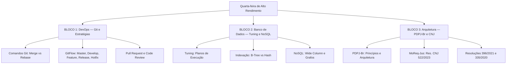

# Guia de Estudos Definitivo — Quarta-feira 10/06/2026

## Semana 4 | Dia 24 | TJ-CE 2026 (Analista TI - Sistemas)

### Foco Absoluto: Banca FCC — Doutrina, Detalhes Ocultos, Pegadinhas e Casos Práticos

---

## 🗺️ Mapa de Estudos do Dia

---

## ⚙️ SEÇÃO 1: DevOps e Versionamento — Git Avançado

A FCC cobra as minúcias dos comandos Git e os fluxos de trabalho colaborativos em grandes times.

### 1. Merge vs Rebase

* **Git Merge:** Junta duas branches criando um novo *commit de merge*. Mantém o histórico real e ramificado intacto. É mais seguro (não reescreve histórico público).
* **Git Rebase:** Move a base da sua branch para a ponta de outra branch, reescrevendo o histórico. Fica com um histórico linear e limpo, sem commits de merge. **Nunca faça rebase em branches públicas/compartilhadas**, pois causa divergência nos repositórios dos colegas.

### 2. GitFlow (Fluxo de Trabalho Clássico)

* **main / master:** Contém apenas código em produção (estável). Cada commit aqui ganha uma *tag* de versão (ex: v1.0).
* **develop:** Branch principal de integração dos desenvolvedores. Código para a próxima release.
* **feature:** Criada a partir da `develop`. Onde a nova funcionalidade é feita. Ao terminar, junta na `develop`.
* **release:** Criada a partir da `develop` quando se prepara para produção. Apenas correções de bugs de última hora. Ao terminar, junta na `main` e na `develop`.
* **hotfix:** Criada a partir da `main`. Usada para corrigir um bug crítico em produção rapidamente. Ao terminar, junta na `main` e na `develop`.

### 3. Pull Request (PR) e Code Review

* **PR:** Solicitação para que o código de uma branch (ex: feature) seja mesclado em outra (ex: develop).
* **Code Review:** Prática essencial de DevSecOps onde outros desenvolvedores inspecionam o código do PR antes da aprovação, garantindo qualidade, segurança e padrões arquiteturais.

---

## 💾 SEÇÃO 2: Banco de Dados — Tuning e NoSQL

### 1. Indexação (B-Tree vs Hash)

* **B-Tree (Balanced Tree):** O índice padrão e mais versátil dos bancos relacionais. Excelente para buscas exatas (`=`) e **pesquisas de intervalo** (`>`, `<`, `BETWEEN`). Ele mantém os dados ordenados.
* **Hash Index:** Usa uma função de dispersão (hash) para mapear a chave. É extremamente rápido para **buscas exatas** (`=`), mas é **inútil** para buscas de intervalo ou ordenação (pois os hashes não guardam relação de ordem).

### 2. Planos de Execução (Execution Plans)

* É o roteiro que o Otimizador de Consultas (Query Optimizer) cria para executar o SQL. O comando `EXPLAIN` (ou `EXPLAIN ANALYZE`) revela se a consulta está usando um *Index Scan* (lendo o índice) ou um custoso *Full Table Scan* (varrendo a tabela inteira, linha por linha). O Tuning foca em criar índices e reescrever queries para evitar os *Full Scans*.

### 3. NoSQL: Wide Column e Grafos

* **Wide Column (Família de Colunas):** Ex: Cassandra, HBase. Armazena dados em tabelas, linhas e colunas dinâmicas. Otimizado para altíssima escala e velocidade de gravação (*write-heavy*) distribuída.
* **Grafos (Graph):** Ex: Neo4j. Modelado em Nodos (entidades) e Arestas (relacionamentos). Perfeito para dados altamente conectados, como redes sociais, motores de recomendação e detecção de fraudes, onde as conexões são tão importantes quanto os dados.

---

## 🏛️ SEÇÃO 3: Arquitetura CNJ — PDPJ-Br e Resoluções

Este bloco é crítico para qualquer prova de TI para Tribunais!

### 1. PDPJ-Br (Resolução CNJ nº 335/2020)

* **Objetivo:** Consolidar todos os sistemas eletrônicos dos tribunais em uma única plataforma na nuvem (Plataforma Digital do Poder Judiciário Brasileiro).
* **Princípio Central:** Desacoplamento. Evitar o aprisionamento tecnológico (*vendor lock-in*). O PJe não é mais um sistema monolítico gigante, mas sim um ecossistema de microserviços.
* **Marketplace:** Tribunais desenvolvem novos serviços (ex: um módulo de IA para ler petições) e disponibilizam no Marketplace da PDPJ-Br para que outros tribunais consumam via APIs REST.

### 2. Resoluções Integradas

* **Resolução CNJ nº 396/2021:** Institui a Estratégia Nacional de Segurança Cibernética do Poder Judiciário. Foco em SOC, frameworks de segurança e resiliência cibernética.
* **Resolução CNJ nº 522/2023 (MoReq-Jus):** Modelo de Requisitos para Sistemas Informatizados de Gestão de Processos e Documentos. Define requisitos funcionais, não-funcionais e de metadados garantindo a cadeia de custódia e preservação digital de longo prazo dos documentos judiciais (integração de arquivamento).

---

## 🎯 SEÇÃO 4: Questões Inéditas FCC-Style Comentadas (Padrão Premium)

Atenção: Seguindo o rigor do seu novo *prompt* Premium, as alternativas estão secas, diretas, cruéis e exigem conhecimento afiado do conceito aplicado.

### Questão 1: DevOps e GitFlow

**(FCC - 2026 - TJ-CE - Analista de TI)** A Diretoria de Tecnologia do TJ-CE adotou o GitFlow como modelo oficial de versionamento para o sistema de custas processuais. Durante um expediente padrão, ocorreu uma falha crítica de arredondamento nos boletos de custas gerados em produção. A equipe de suporte detectou a falha e identificou a necessidade de reparo emergencial em poucas horas, sem interferir no desenvolvimento paralelo de novas funcionalidades agendadas para o mês seguinte.

Considerando o padrão de governança de código ditado pelo GitFlow, assinale a alternativa que representa o fluxo arquitetural correto para a correção do incidente:

A) Criação de uma branch de hotfix a partir da branch develop para isolar a correção e, após a homologação, integração do código através de merge commit exclusivo na branch master.

B) Realização de commit de ajuste diretamente na branch master com submissão acoplada de uma tag de versão, acionando em seguida a transferência das atualizações para a branch release.

C) Criação de uma branch de hotfix a partir da branch master com integração final, após os reparos, através de processos de merge commit tanto na branch master quanto na branch develop.

D) Extração de uma branch de feature a partir da branch master para o isolamento do código de reparo com a posterior integração via rebase diretamente na branch de release ativa.

E) Alteração estrutural do código na branch release com a posterior execução do comando git rebase na branch develop para garantir a linearidade do histórico do reparo urgente.

💡 Resolução Comentada da Questão 1

**Gabarito Correto: C**

**Justificativa:** No modelo canônico do GitFlow, branches de *hotfix* (correções críticas de produção) são SEMPRE derivadas da `master` (ou `main`), pois esta branch espelha o estado exato de produção. Após a correção, a branch de hotfix deve ser obrigatoriamente mesclada (merge) de volta na `master` (gerando nova versão/tag) E também na `develop` (para garantir que os desenvolvedores não reintroduzam o bug na próxima versão).

**Erro das Alternativas Falsas (Pegadinhas):**

* **A:** Erro de origem e destino. Branches de hotfix nascem da `master`, não da `develop`. E devem voltar para ambas (master e develop), não apenas para a master.
* **B:** Violação da premissa básica de controle de versão em equipe. Commits diretos na `master` são estritamente proibidos e bloqueados em ambientes sérios (via branch protection).
* **D:** Branch de *feature* tem o propósito de desenvolver novas funcionalidades, não correções emergenciais. Além disso, as features nascem e morrem na `develop`, nunca na `master` ou `release`.
* **E:** O comando `git rebase` reescreve histórico e nunca deve ser usado para integrar código de correção em branches compartilhadas principais. O fluxo proposto quebra a estrutura de ramificação isolada.

### Questão 2: Tuning de Banco de Dados e Índices

**(FCC - 2026 - TJ-CE - Analista de TI)** O banco de dados PostgreSQL do sistema de jurisprudência do Tribunal tem apresentado lentidão severa. Analisando o log de transações, o DBA identificou que a *query* responsável pelo atraso varre a tabela `tb_processos` filtrando dados com a cláusula `WHERE data_distribuicao BETWEEN '2025-01-01' AND '2025-12-31'`. Atualmente, essa busca está forçando a *engine* relacional a executar um *Full Table Scan* (Sequencial Scan) sobre milhões de registros, derrubando a CPU do servidor.

Visando o Tuning dessa instrução específica de banco de dados, assinale a alternativa que propõe a modificação física mais adequada e de maior impacto performático no SGBD:

A) Implementação de um índice do tipo Hash Index sobre a coluna data_distribuicao para a redução imediata da carga de CPU da tabela particionada.

B) Criação de um índice do tipo B-Tree sobre a coluna data_distribuicao com acionamento estatístico do Query Optimizer para substituir o Sequencial Scan por um Index Scan.

C) Desnormalização da tabela tb_processos seguida da conversão do repositório relacional em um banco NoSQL do tipo Grafo focado na navegação de intervalos de datas.

D) Inserção do operador JOIN na cláusula WHERE combinada com a restrição de tabelas temporárias voláteis gerenciadas pelo buffer cache do PostgreSQL.

E) Implementação de um índice do tipo Bitmap sobre a coluna de chave primária para a resolução de travamentos nativos de buscas em intervalos dinâmicos.

💡 Resolução Comentada da Questão 2

**Gabarito Correto: B**

**Justificativa:** O cenário exige otimização para buscas de *intervalo* (range scans) devido ao operador `BETWEEN`. O índice adequado estruturalmente para intervalos, menor/maior e ordenação em bancos relacionais é o **B-Tree** (Balanced Tree). Ao criar o índice B-Tree, o otimizador passará a ler os nodos da árvore (*Index Scan*) em vez de ler a tabela inteira linha por linha (*Full/Sequencial Scan*).

**Erro das Alternativas Falsas (Pegadinhas):**

* **A:** O erro letal da FCC em tuning. Um índice *Hash* é extremamente rápido para igualdades exatas (`=`), mas é cego e inútil para intervalos (`>`,`<`, `BETWEEN`). Ele não otimizaria essa query.
* **C:** Proposta arquitetural absurda mascarada de jargão técnico. Um banco de grafos (ex: Neo4j) foca em conectar nodos e relacionamentos pesados, não em resolver gargalos simples de filtro de datas de um sistema relacional.
* **D:** Falta de sentido sintático. O operador JOIN atua na ligação de chaves entre tabelas diferentes (cláusula FROM), não modifica o funcionamento de um filtro isolado de data no WHERE.
* **E:** O índice do tipo *Bitmap* é excelente para colunas de baixa cardinalidade (ex: sexo, status). Aplicá-lo na chave primária (altíssima cardinalidade) é tecnicamente prejudicial, além do foco da query ser a coluna `data_distribuicao`, e não a chave primária.

### Questão 3: Arquitetura CNJ e PDPJ-Br

**(FCC - 2026 - TJ-CE - Analista de TI)** O Comitê de Governança de TIC do TJ-CE aprovou o desenvolvimento de uma nova ferramenta de anonimização de dados processuais movida a Inteligência Artificial. Por exigência estratégica, a arquitetura deste novo módulo deve estar em conformidade estrita com as diretrizes da Plataforma Digital do Poder Judiciário Brasileiro (PDPJ-Br), instituídas pela Resolução CNJ nº 335/2020.

A arquitetura do PDPJ-Br possui pilares mandatórios focados na eliminação de dependências monolíticas, permitindo o reaproveitamento nacional de soluções por outros tribunais sem aprisionamento tecnológico (*vendor lock-in*).

Com base nas diretrizes arquiteturais estipuladas pela Resolução da PDPJ-Br, assinale a alternativa técnica apropriada para a construção deste sistema:

A) Construção do módulo de anonimização como um componente síncrono injetado nativamente no núcleo monolítico do sistema PJe local com a utilização de stored procedures compartilhadas no CNJ.

B) Encapsulamento da solução em um banco de dados NoSQL centralizado hospedado em ambiente on-premises do TJ-CE com exposição via FTP seguro para replicação manual de lotes entre os tribunais.

C) Arquitetura do módulo baseada em microserviços desacoplados e distribuídos com a exposição de suas funcionalidades mediante APIs RESTful catalogadas no Marketplace da plataforma nacional.

D) Modelação do sistema através de uma arquitetura centralizada orientada a barramentos de serviço corporativo (ESB) utilizando troca de dados governados exclusivamente pelo formato de comunicação SOAP.

E) Instalação de servidores dedicados do tipo mainframe para a absorção da carga computacional de inteligência artificial com o tráfego inter-rede mediado por conexões proprietárias diretas (*point-to-point*).

💡 Resolução Comentada da Questão 3

**Gabarito Correto: C**

**Justificativa:** A Resolução CNJ 335/2020 que criou o PDPJ-Br revolucionou a TI do judiciário determinando o abandono dos grandes monólitos e abraçando a arquitetura em nuvem distribuída. A regra de ouro do PDPJ é a **arquitetura de microserviços** e a colaboração através do **Marketplace**. Um tribunal desenvolve a solução, encapsula em um microserviço, e expõe suas APIs (tipicamente RESTful com JWT) no Marketplace para que tribunais do país inteiro as consumam de forma padronizada.

**Erro das Alternativas Falsas (Pegadinhas):**

* **A:** O exato oposto da diretriz. O PDPJ nasceu para acabar com os monólitos do PJe. Injetar código no núcleo do PJe e usar lógicas presas no banco (stored procedures) viola o princípio de desacoplamento e causa aprisionamento tecnológico.
* **B:** Tecnologias incompatíveis com a agilidade nacional. Expor o compartilhamento colaborativo judiciário usando replicação FTP manual em lote quebra os fundamentos de nuvem e integração contínua API-first estipulados na norma.
* **D:** O uso de ESB e SOAP é tido como arquitetura legada (SOA antigo). O PDPJ-Br é fundado sobre abordagens modernas de Cloud-Native, API Gateways modernos e REST/JSON.
* **E:** Retrocesso tecnológico. Propõe comprar "mainframes" e interligar os sistemas por conexões ponta-a-ponta. O modelo do CNJ exige nuvem, microserviços e alta escalabilidade elástica para IA, sem onerar hardware legado em cada tribunal isoladamente.

---

## 🧠 SEÇÃO 5: Flashcards de Memorização Ativa (Estilo Anki)

### Bloco 1 — DevOps e Git

* **Frente:** Qual a regra principal sobre a criação de branches de `hotfix` no GitFlow?
* **Verso:** Elas nascem exclusivamente da branch `master` (ou `main`) para consertar um bug crítico de produção e, ao finalizarem, são mescladas (merge) de volta tanto na `master` quanto na `develop`.
* **Frente:** Qual a diferença no histórico gerado pelo comando `git merge` comparado ao `git rebase`?
* **Verso:** O `merge` cria um novo *commit de merge* não linear e preserva a história exata das ramificações. O `rebase` reescreve a história, colocando seus commits na ponta da base atual, criando um histórico perfeitamente linear.

### Bloco 2 — Banco de Dados e Tuning

* **Frente:** Se uma *query* PostgreSQL com filtro de data (usando `>`, `<`, ou `BETWEEN`) está lenta, que tipo de índice físico de banco de dados resolve o problema?
* **Verso:** Um Índice B-Tree (Balanced Tree). Índices Hash são inúteis para buscas de intervalo, funcionando apenas para igualdades exatas (`=`).

### Bloco 3 — Arquitetura PDPJ-Br

* **Frente:** O que é o Marketplace da PDPJ-Br criado pela Resolução CNJ 335/2020?
* **Verso:** Um ambiente nacional onde os tribunais publicam e consomem microserviços e módulos independentes entre si (geralmente via APIs REST), consolidando o ecossistema tecnológico do judiciário sem depender do antigo núcleo monolítico do PJe.

---

## 🏆 Roteiro de Estudos Sugerido para Hoje (10/06/2026)

1. **Manhã (Bloco 1 - 2h):** Estude a documentação básica ou um resumo de Git e GitFlow. Domine o conceito das branches principais (master, develop) e temporárias (feature, release, hotfix). Entenda por que não se faz *rebase* em branches públicas.
2. **Tarde (Bloco 2 - 2h):** Revise Banco de Dados. Foco pesado na diferença entre índice Hash e índice B-Tree, e na leitura teórica de planos de execução (Index Scan vs Full Table Scan). Leia sobre os conceitos base de bancos NoSQL Familiares de Colunas (Wide-column) e Grafos.
3. **Noite (Bloco 3 - 1.5h):** Baixe e leia os pontos-chave das resoluções do CNJ: 335/2020 (PDPJ-Br e Marketplace), 396/2021 (Estratégia Nacional Cibernética) e 522/2023 (MoReq-Jus, foco em preservação e custódia digital de arquivos).
4. **Resolução de Questões:** Responda rigorosamente a nova bateria consolidada de **45 questões padrão FCC Premium** geradas ontem, aplicando todo o nível de interpretação técnica profunda. As questões já estão integradas no seu sistema web.

Bons estudos! Cuidado com os distratores cruzados. Mantenha a guarda alta! 🚀
