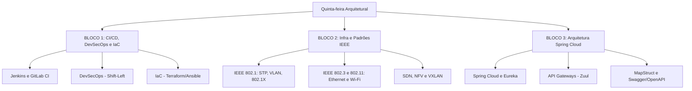

# Guia de Estudos Definitivo — Quinta-feira 11/06/2026
## Semana 4 | Dia 25 | TJ-CE 2026 (Analista TI - Sistemas)
### Foco: Infraestrutura como Código, Padrões IEEE e Ecossistema Spring Cloud

---

## 🗺️ Mapa de Estudos do Dia

---

## ⚙️ SEÇÃO 1: CI/CD, DevSecOps e IaC

A FCC adora cobrar o papel de cada ferramenta na esteira de integração e entrega contínua.

### 1. CI/CD (Integração e Entrega Contínua)
*   **Jenkins:** Ferramenta clássica open-source baseada em plugins. Utiliza arquivos `Jenkinsfile` escritos em Groovy para definir pipelines declarativos ou roteirizados.
*   **GitLab CI:** Integrado nativamente ao repositório. Utiliza um arquivo `.gitlab-ci.yml` na raiz do projeto e depende dos "GitLab Runners" para executar os *jobs*.

### 2. DevSecOps (Segurança na Esteira)
*   **Shift-Left:** O conceito de antecipar as checagens de segurança para o início do desenvolvimento (logo após o commit), em vez de testar a segurança apenas no final (homologação/produção).
*   **SAST (Static Application Security Testing):** Análise do código-fonte ("caixa-branca") sem executá-lo.
*   **DAST (Dynamic Application Security Testing):** Análise da aplicação rodando ("caixa-preta"), simulando ataques externos.

### 3. Infraestrutura como Código (IaC)
*   Consiste em provisionar servidores, redes e bancos através de arquivos de configuração (código) em vez de cliques manuais.
*   Exemplos: **Terraform** (foco em provisionamento/orquestração de cloud) e **Ansible** (foco em gerência de configuração/instalação de pacotes).

---

## 🌐 SEÇÃO 2: Padrões IEEE e Redes de Nova Geração

Um dos blocos mais "decoreba" e perigosos do edital de infraestrutura.

### 1. Padrões IEEE 802.1 (Gestão de Redes / Camada 2)
*   **802.1D (STP - Spanning Tree Protocol):** Evita loops em redes de switches bloqueando caminhos redundantes.
*   **802.1w (RSTP):** STP Rápido. Converge a rede em milissegundos em caso de queda de link.
*   **802.1s (MSTP):** Múltiplas instâncias de STP para diferentes VLANs.
*   **802.1Q:** Protocolo de *VLAN Tagging* (adiciona 4 bytes ao frame Ethernet para identificar a VLAN). O 802.1p é a parte do padrão que define a prioridade (QoS de camada 2).
*   **802.1X:** Controle de Acesso Baseado em Porta. Exige autenticação (ex: via servidor RADIUS) antes de liberar a porta de rede do switch ou o Wi-Fi para o usuário.

### 2. SDN, NFV e VXLAN
*   **SDN (Software-Defined Networking):** Separa o Plano de Controle (cérebro) do Plano de Dados (encaminhamento mecânico). Permite gerir toda a rede de forma programável a partir de um controlador central (ex: OpenFlow).
*   **NFV (Network Functions Virtualization):** Troca equipamentos físicos caros (roteadores, firewalls físicos) por máquinas virtuais (software) rodando em servidores padrão (x86).
*   **VXLAN:** Protocolo que encapsula frames Ethernet de Camada 2 dentro de pacotes UDP de Camada 3. Usado em datacenters modernos para ultrapassar o limite de 4096 VLANs convencionais (suporta 16 milhões).

---

## ☕ SEÇÃO 3: Ecossistema Spring Cloud e Arquitetura

Ferramentas essenciais para gerenciar uma arquitetura real de microsserviços em Java.

### 1. Spring Cloud Netflix Eureka (Service Discovery)
*   Funciona como a "lista telefônica" dos microsserviços. Em vez de hardcodar IPs físicos (que mudam toda hora na nuvem), os microsserviços se registram no servidor Eureka pelo nome. Quando o "Serviço A" quer falar com o "Serviço B", ele pergunta ao Eureka qual é o IP dinâmico atual.

### 2. Zuul / Spring Cloud Gateway (API Gateway)
*   É a porta de entrada única da aplicação. Recebe as requisições externas e as roteia para os microsserviços ocultos corretos. Responsável por preocupações transversais (autenticação de tokens, rate limiting, balanceamento de carga de borda).

### 3. MapStruct e Swagger
*   **MapStruct:** Uma biblioteca Java baseada em anotações que gera automaticamente (em tempo de compilação) o código para mapear dados entre objetos diferentes, como transformar uma Entidade JPA de Banco em um DTO (Data Transfer Object) para a API. Extremamente rápido pois não usa reflection.
*   **Swagger (OpenAPI):** Ferramenta para desenhar, documentar e testar APIs RESTful de forma padronizada.

---

## 🎯 SEÇÃO 4: Questões Inéditas FCC-Style Comentadas (Padrão Premium)

Atenção: O padrão FCC "seco e direto" foi mantido. Não espere alternativas explicativas.

### Questão 1: DevOps e Shift-Left
**(FCC - 2026 - TJ-CE - Analista de TI)** O Tribunal de Justiça estabeleceu uma pipeline de integração contínua rigorosa para o novo sistema processual. Como exigência da Política de Segurança da Informação, foi determinado que vulnerabilidades como injeção de SQL e falhas de gerenciamento de sessão devem ser identificadas e bloqueadas de forma preventiva, imediatamente após o commit do desenvolvedor e antes da construção da imagem de produção. A implementação arquitetural que atende nativamente a essa restrição do fluxo DevSecOps é a:

A) configuração de rotinas DAST no ambiente de homologação.
B) inserção de testes de penetração no ciclo final de release.
C) execução de análise SAST em um estágio inicial da pipeline CI.
D) habilitação de varreduras do tipo RASP no servidor de aplicação.
E) delegação do monitoramento contínuo para o Firewall de Aplicação Web (WAF).

💡 Resolução Comentada da Questão 1

**Gabarito Correto: C**

**Justificativa:** A exigência de descobrir falhas de código estrutural (injeção SQL, buffer overflow) "imediatamente após o commit e antes do build" descreve perfeitamente o conceito de **SAST (Static Application Security Testing)**, associado à mentalidade *Shift-Left* (trazer a segurança para a esquerda/início do processo). O SAST varre o código fonte cru.

**Erro das Alternativas Falsas (Pegadinhas):**
*   **A:** DAST (Dynamic Application Security Testing) requer que a aplicação esteja compilada e rodando (caixa-preta). Não ocorre "antes da construção da imagem".
*   **B:** Testes de penetração no ciclo final são abordagens legadas (*Shift-Right*), o oposto do requisitado no cenário.
*   **D:** RASP (Runtime Application Self-Protection) atua em tempo de execução dentro do servidor produtivo, defendendo ataques ao vivo, não é uma ferramenta estática de pipeline de compilação.
*   **E:** O WAF atua na borda da rede filtrando tráfego malicioso HTTP em produção, não audita código recém-commitado em repositório.

### Questão 2: Redes IEEE e Controle de Loops
**(FCC - 2026 - TJ-CE - Analista de TI)** Durante a renovação do data center do TJ-CE, a topologia de camada 2 foi desenhada com múltiplos caminhos físicos redundantes para garantir altíssima disponibilidade. No entanto, a equipe de operações relatou tempestades de broadcast catastróficas (broadcast storms) que derrubaram a rede administrativa minutos após o cabeamento final. Visando eliminar a redundância lógica sem remover os cabos físicos de backup, o protocolo normativo do IEEE que bloqueia programaticamente portas alternativas para construir uma árvore livre de ciclos lógicos é o:

A) IEEE 802.1Q
B) IEEE 802.1D
C) IEEE 802.1X
D) IEEE 802.3ad
E) IEEE 802.11ax

💡 Resolução Comentada da Questão 2

**Gabarito Correto: B**

**Justificativa:** O protocolo responsável por bloquear rotas de camada 2 redundantes e impedir tempestades de broadcast construindo uma "árvore geradora" livre de loops lógicos é o **STP (Spanning Tree Protocol)**, padronizado historicamente pela norma **IEEE 802.1D**.

**Erro das Alternativas Falsas (Pegadinhas):**
*   **A:** O 802.1Q é o padrão para VLAN Tagging (marcação de frames), usado para separar redes virtualmente, não para bloquear loops de topologia.
*   **C:** O 802.1X é o padrão de segurança para Controle de Acesso Baseado em Porta (exige autenticação para ligar a porta).
*   **D:** O 802.3ad refere-se a Link Aggregation (LACP), que soma a velocidade de vários cabos paralelos, mas não soluciona loops de broadcast sistêmicos se configurado indevidamente.
*   **E:** O 802.11ax é o padrão sem fio (Wi-Fi 6).

### Questão 3: Spring Cloud Eureka
**(FCC - 2026 - TJ-CE - Analista de TI)** Um ecossistema de dezesseis microsserviços autônomos foi implantado na nuvem híbrida do tribunal para suportar o PJe. A infraestrutura de containers recria dinamicamente instâncias dos serviços, alterando seus IPs privados e portas constantemente conforme a demanda elástica. Para garantir que um microsserviço cliente localize e comunique-se com um microsserviço destino sem manter um registro estático e manual de configurações de rede no código-fonte, a arquitetura Spring Cloud fornece a tecnologia de:

A) proxy reverso gerenciada pelo Spring Cloud Config Server.
B) balanceamento global distribuído via Spring Boot Actuator.
C) descoberta de serviços materializada no Netflix Eureka Server.
D) roteamento estático perimetral controlado pelo Zuul Gateway.
E) mensageria assíncrona baseada no provedor Spring Cloud Stream.

💡 Resolução Comentada da Questão 3

**Gabarito Correto: C**

**Justificativa:** A necessidade de localizar instâncias que mudam de IP e porta dinamicamente na nuvem é resolvida pelo padrão de *Service Discovery* (Descoberta de Serviços). No ecossistema Spring Cloud, essa peça arquitetural clássica é o **Netflix Eureka Server** (ou o Consul), que atua como um catálogo de endereços atualizado em tempo real.

**Erro das Alternativas Falsas (Pegadinhas):**
*   **A:** O Config Server atua na centralização dos arquivos de propriedade (application.yml) da rede, e não atua descobrindo IPs em tempo real.
*   **B:** O Actuator serve para expor métricas de saúde e endpoints de monitoramento da aplicação, não tem ligação com descoberta de malha de rede.
*   **D:** O Zuul Gateway atua como porta de entrada (borda) da rede para receber chamadas externas, não gerencia internamente a descoberta de IPs móveis (ele próprio consulta o Eureka para saber os destinos).
*   **E:** O Cloud Stream lida com fluxos de eventos via RabbitMQ/Kafka, o cenário pede resolução síncrona de localização de rede, não mensageria de fila.

---

## 🧠 SEÇÃO 5: Flashcards de Memorização Ativa (Estilo Anki)

### Bloco 1 — DevOps e IaC
*   **Frente:** No ecossistema DevSecOps, o que difere essencialmente a abordagem SAST da abordagem DAST?
*   **Verso:** SAST (Static) lê o código cru sem rodar a aplicação (*White-box*). DAST (Dynamic) interage com a aplicação executável rodando em busca de brechas (*Black-box*).

### Bloco 2 — IEEE e Redes
*   **Frente:** O que determina a norma IEEE 802.1X e onde ela é crucialmente utilizada?
*   **Verso:** Determina o controle de acesso à rede baseado em porta (PNAC). Usado para impedir que máquinas não autorizadas se conectem às portas do switch corporativo ou às redes Wi-Fi sem prévia autenticação por um servidor (como RADIUS/EAP).

### Bloco 3 — Spring Cloud
*   **Frente:** Qual a responsabilidade arquitetural de um API Gateway como o Spring Cloud Gateway (ou Zuul)?
*   **Verso:** Ser o único ponto de entrada para todas as requisições externas. Ele roteia requisições para os microsserviços ocultos, consolida balanceamento de carga, encerra TLS e valida tokens JWT de segurança globalmente.

---

## 🏆 Roteiro de Estudos Sugerido para Hoje (11/06/2026)

1.  **Manhã (Bloco 1 - 2h):** Estude Jenkins (funcionamento de pipelines declarativos) e os conceitos cruciais de segurança *Shift-Left* (SAST vs DAST). Entenda a filosofia conceitual de IaC (Infra como código) usando Terraform e Ansible.
2.  **Tarde (Bloco 2 - 2h):** Decoreba pura dos padrões IEEE 802 (STP, VLANs, Wi-Fi). Crie tabelas mentais associando o número da norma ao seu nome e função principal. Leia sobre como o SDN separa o plano de controle do plano de dados.
3.  **Noite (Bloco 3 - 1.5h):** Entenda a arquitetura básica de microsserviços Spring Cloud. Não foque no código Java, foque no **papel** de cada ferramenta: Eureka (Descoberta), Gateway (Borda/Roteamento), Config Server (Configurações centralizadas).
4.  **Resolução de Questões:** Aguarde o novo lote Premium de 45 questões do dia para testar os conhecimentos e revisar o caderno de erros.

Bons estudos! A prova está chegando, mantenha o foco nos detalhes que diferenciam os aprovados! 🚀
