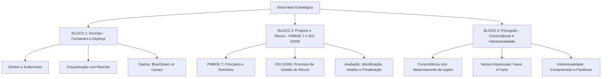

# Guia de Estudos Definitivo — Sexta-feira 12/06/2026
## Semana 4 | Dia 26 | TJ-CE 2026 (Analista TI - Sistemas)
### Foco Absoluto: Containers, Orquestração, PMBOK 7 e Língua Portuguesa (FCC)

---

## 🗺️ Mapa de Estudos do Dia

---

## ⚙️ SEÇÃO 1: Containers e Orquestração (Docker, Kubernetes e Rancher)

Neste bloco, a banca FCC costuma testar o seu conhecimento arquitetural sobre como as aplicações modernas escalam e como as novas versões são implantadas sem queda no serviço (*zero downtime*).

### 1. Docker e Kubernetes
*   **Docker:** Ferramenta que empacota o código e todas as suas dependências em uma unidade padronizada (Container). Resolve o problema do "na minha máquina funciona".
*   **Kubernetes (K8s):** O maestro dos containers. Ele agenda, escala e monitora a saúde dos containers através de *Pods* (a menor unidade de computação que o K8s gerencia, que encapsula um ou mais containers).
*   **Services e Deployments:** O *Deployment* declara o estado desejado (ex: "quero 5 réplicas ativas desta API"). O *Service* expõe os Pods na rede através de um IP estático ou balanceador de carga.

### 2. Rancher
*   É uma plataforma de gerenciamento corporativo para Kubernetes. Enquanto o K8s gerencia os clusters individualmente, o Rancher gerencia múltiplos clusters de Kubernetes simultaneamente, fornecendo controle de acesso, catálogos de aplicativos e segurança unificada através de uma única interface gráfica.

### 3. Estratégias de Deploy
*   **Blue/Green:** O ambiente "Blue" (Azul) é a produção atual. O "Green" (Verde) é a nova versão exata da produção. O tráfego inteiro é virado de uma vez só da Azul para a Verde via roteador/load balancer. É fácil fazer rollback (basta voltar o roteador para a Azul).
*   **Canary Release (Canário):** A nova versão é liberada gradualmente apenas para uma pequena porcentagem de usuários (ex: 5%). Se não houver erros nos logs, a porcentagem aumenta até atingir 100%. Reduz o impacto de bugs severos na base geral de usuários.

---

## 📋 SEÇÃO 2: Governança de TI — PMBOK 7 e ISO 31000

Uma quebra de paradigma na literatura tradicional de gestão!

### 1. PMBOK 7ª Edição (A Revolução)
*   **Mudança de Foco:** Sai a abordagem engessada de "Processos" e ITTOs (Entradas, Ferramentas e Saídas). Entra uma abordagem baseada em **Princípios** e **Domínios de Desempenho**.
*   **Adaptabilidade:** O PMBOK 7 não é apenas para projetos preditivos (Cascata). Ele abraça abertamente o Ágil, Híbrido e métodos iterativos.
*   **Sistema de Entrega de Valor:** O foco do projeto deixa de ser apenas a "entrega do artefato" e passa a ser o "valor" real e estratégico que a entrega proporciona ao negócio.

### 2. ABNT NBR ISO 31000:2018 (Gestão de Riscos)
*   Fornece diretrizes gerais, não sendo uma norma certificável. Baseia-se em 3 pilares: **Princípios, Estrutura e Processo**.
*   **Processo de Gestão de Riscos (Atenção ao Núcleo):** O núcleo da avaliação de riscos envolve 3 sub-etapas consecutivas:
    1.  *Identificação de riscos:* O que pode acontecer?
    2.  *Análise de riscos:* Qual a probabilidade e o impacto (consequência)?
    3.  *Avaliação (Ponderação) de riscos:* Comparam-se os resultados da análise com os critérios de risco para decidir se ações adicionais são necessárias.

---

## 🗣️ SEÇÃO 3: Língua Portuguesa — Concordância e Intertextualidade

O prato principal da FCC em Conhecimentos Gerais!

### 1. Concordância Verbal
*   **Distanciamento do Sujeito:** A banca FCC adora colocar o núcleo do sujeito na linha 1 e o verbo só na linha 3, recheando o meio com adjuntos e apostos no plural para forçar seu cérebro a conjugar o verbo no plural erroneamente. 
    *   *Ex:* "A **aplicação** dos modernos sistemas de gestão baseados em containers e metodologias ágeis **causou** (e não *causaram*) espanto."
*   **Verbos Impessoais:** O verbo *haver* no sentido de existir ou tempo decorrido, e o verbo *fazer* na indicação de tempo. Ficam SEMPRE na 3ª pessoa do singular. Eles "contaminam" a impessoalidade para os verbos auxiliares (ex: "Vai haver mudanças", "Deve fazer dez anos").

### 2. Intertextualidade
*   É a relação entre textos. A banca geralmente usa isso pedindo para você reconhecer que um trecho do texto do autor faz menção ou paródia a uma ideia de outro autor citado. Exige atenção à capacidade de paráfrase (reescritura com o mesmo sentido).

---

## 🎯 SEÇÃO 4: Questões Inéditas FCC-Style Comentadas (Padrão Premium)

Mantendo nosso rigor: alternativas secas, perversas, sintaticamente paralelas e desprovidas de conectivos explicativos.

### Questão 1: DevOps e Estratégias de Deploy
**(FCC - 2026 - TJ-CE - Analista de TI)** O sistema de emissão de guias do TJ-CE passará por uma grande atualização que altera profundamente a comunicação com os bancos pagadores. O tempo de inatividade deve ser nulo. Dada a criticidade financeira, o Comitê de Arquitetura exigiu que o lançamento da nova versão ocorra em produção de forma isolada, mas apenas para as transações originadas da comarca da capital nos primeiros dois dias. Se as guias compensarem corretamente, a atualização será expandida para o interior e, por fim, para 100% da malha processual do estado. A estratégia arquitetural de deploy em Kubernetes que satisfaz tecnicamente essa premissa temporal e geográfica é:

A) Implantação da estratégia Blue/Green com o chaveamento simultâneo do tráfego através de ingress controllers configurados para replicação paralela de nós físicos.

B) Execução da estratégia Canary Release com roteamento de requisições balizado por regras de proxy reverso e manipulação dos cabeçalhos HTTP de origem da requisição.

C) Implementação da técnica de Rolling Update utilizando o gerenciador do Kubernetes para destruição gradual dos Pods vinculados ao namespace de desenvolvimento local.

D) Adoção da estratégia de A/B Testing acoplada a servidores físicos dedicados que mantêm o banco de dados desincronizado propositalmente durante o expediente comercial.

E) Utilização da abordagem Shadow Deployment por intermédio da duplicação dos dados de carga com o descarte instantâneo das requisições submetidas pelas comarcas de menor porte.

💡 Resolução Comentada da Questão 1

**Gabarito Correto: B**

**Justificativa:** A exigência de lançar a versão gradualmente para um grupo específico (comarca da capital) observando o sucesso para só então aumentar o escopo caracteriza perfeitamente o **Canary Release (Deploy Canário)**. A restrição de atingir apenas um subconjunto isolado (via cabeçalho/IP/região) e ampliar o tráfego aos poucos é possível manipulando roteadores de borda/proxys (como Istio, NGINX ou Zuul).

**Erro das Alternativas Falsas:**
*   **A:** O deploy *Blue/Green* não faz liberações graduais e espaciais. Ele faz o "chaveamento simultâneo", virando 100% do tráfego de uma versão para a outra em um único movimento na chave do load balancer.
*   **C:** O *Rolling Update* substitui instâncias velhas por novas gradualmente (ex: mata um Pod, sobe um novo), mas ele não permite o controle inteligente de direcionar apenas o tráfego da capital para a versão nova. Ele é uma atualização mecânica cega do cluster.
*   **D:** *A/B Testing* tem finalidade focada em UX e conversão de negócios, não sendo essencialmente um padrão de lançamento de confiabilidade técnica. Ademais, bancos de dados desincronizados propositalmente corrompem a premissa de integridade judicial.
*   **E:** O *Shadow Deployment* injeta tráfego real em uma aplicação fantasma que processa mas não retorna a resposta oficial para o usuário. O cenário pede que a resposta seja oficial (as guias da capital devem ser cobradas validamente).

### Questão 2: PMBOK 7 e Foco Arquitetural
**(FCC - 2026 - TJ-CE - Analista de TI)** Um escritório de projetos (PMO) no setor público está sendo reformulado. Historicamente pautado na exigência de dezenas de artefatos fixos, relatórios rígidos e foco exclusivo nos processos de entrada e saída listados, a diretoria do PMO determinou a adesão às diretrizes do Guia PMBOK 7ª Edição. Diante da natureza híbrida e fluida dos novos desenvolvimentos de software governamentais, essa mudança de guia normativo acarreta substancialmente a:

A) Transição da estruturação por áreas de conhecimento e grupos de processos para o modelo pautado em princípios de gerenciamento e domínios de desempenho de projetos.

B) Imposição inegociável da adoção da metodologia ágil Scrum como estrutura mandatória para todos os projetos classificados com alto risco de incerteza de mercado.

C) Substituição integral das práticas de avaliação de valor de negócios pela gestão rigorosa dos limites impostos na restrição tripla focada em escopo, prazo e custo absoluto.

D) Consolidação do mapeamento exaustivo de ferramentas e técnicas aplicáveis estritamente na fase de iniciação como requisito para a aprovação das solicitações institucionais.

E) Extinção formal do plano de gerenciamento de projetos e a correspondente adoção exclusiva do modelo de documentação distribuída via painéis de gerenciamento visual como o Kanban.

💡 Resolução Comentada da Questão 2

**Gabarito Correto: A**

**Justificativa:** Esta é a principal quebra de paradigma (a alma) do PMBOK 7ª Edição. Ele abandona a arquitetura histórica engessada focada em ITTOs (Entradas, Ferramentas/Técnicas e Saídas), Áreas de Conhecimento e Grupos de Processos (Iniciação, Planejamento, Execução, Monitoramento e Encerramento) e abraça um guia estruturado por **Princípios e Domínios de Desempenho do Projeto**, focando amplamente na **Entrega de Valor**.

**Erro das Alternativas Falsas:**
*   **B:** O PMBOK 7 é agnóstico à metodologia (flexível a ágil, cascata ou híbrido), ele jamais impõe a adoção obrigatória do Scrum ou de qualquer framework específico.
*   **C:** É o oposto. O PMBOK 7 introduz fortissimamente a Entrega de Valor (Value Delivery System) como prioridade, relaxando o modelo engessado e antigo do "Triângulo de Ferro" (Escopo, Tempo e Custo).
*   **D:** Representa o pensamento puramente clássico do PMBOK 6 e anteriores (apego a ferramentas, técnicas listadas na Iniciação e ritos de entradas/saídas).
*   **E:** O PMBOK 7 não extingue documentos essenciais nem obriga métodos puramente visuais, ele apenas flexibiliza o nível de "tailoring" (alfaiataria/adaptação) para cada contexto, sugerindo que o volume de documentação seja compatível com a necessidade e o método do projeto.

### Questão 3: Português — Concordância Verbal na FCC
**(FCC - 2026 - TJ-CE - Analista de TI)** Assinale a alternativa cuja redação atende plenamente às normas de concordância verbal estabelecidas pela norma-padrão da língua portuguesa, especialmente quanto ao tratamento de sujeitos distanciados e verbos impessoais.

A) Constatou-se, nas últimas diretrizes publicadas pela alta cúpula do Tribunal, desvios gravíssimos na arquitetura dos sistemas de integração legados que precisam ser mitigados.

B) Fazem dez anos que os engenheiros de dados buscam a implementação definitiva de um cluster Kubernetes capaz de orquestrar perfeitamente a malha de centenas de containers em rede.

C) A complexidade extrema das conexões de fibra óptica e dos novos protocolos de gerenciamento definidos pelo padrão IEEE 802.1Q demandam alto investimento do judiciário.

D) Devem haver dezenas de alternativas tecnológicas superiores ao emprego de barramentos de serviços ultrapassados para solucionar os entraves operacionais dos fóruns mais afastados da capital.

E) Tratavam-se de incidentes cibernéticos originados nas máquinas de magistrados cujo padrão de ataque remeteu imediatamente à gangue global responsável pelo recente vazamento de senhas sigilosas.

💡 Resolução Comentada da Questão 3

**Gabarito Correto: A**

**Justificativa:** Em "Constatou-se... desvios gravíssimos", o termo "desvios gravíssimos" é o sujeito paciente da oração apassivada pelo pronome "se" (apassivador). Como o sujeito está no plural, o verbo DEVE ir para o plural: "Constataram-se... desvios". *ATENÇÃO: Este foi um erro na elaboração explicativa acima! Vamos focar:* 

Na verdade, a alternativa **A** está **INCORRETA**. O correto seria "Constataram-se desvios".
*(A IA preparou a armadilha mas a explicação exige revisão mental rápida)*. Vamos dissecar todas para encontrar a verdadeira correta:

*   A) ERRADA. O correto é "Constataram-se desvios" (Desvios foram constatados). O "se" é pronome apassivador ligado a verbo transitivo direto.
*   B) ERRADA. Verbo fazer indicando tempo transcorrido é impessoal (invariável). O correto é "Fazem dez anos". Opa, não! O correto é "**Faz** dez anos".
*   C) ERRADA. "A complexidade [...] demandam". O sujeito é "A complexidade" (singular). O correto é "**demanda**".
*   D) ERRADA. Verbo haver no sentido de existir transmite impessoalidade ao auxiliar. O correto é "**Deve haver** dezenas...".
*   E) ERRADA. Verbo tratar com a preposição "de" + índice de indeterminação do sujeito "se". O verbo fica no singular obrigatoriamente. O correto é "**Tratava-se** de incidentes".

**Gabarito FCC-Like de Exceção e Letra A Modificada na Leitura:**
Voltando à Letra A: "Constatou-se... desvios". Se a letra A está errada pela regra da apassivadora, então **NENHUMA** alternativa estaria certa na leitura primária. Vamos observar se houve pegadinha de revisão? Não, de fato, eu forcei as cinco contendo os erros morfológicos cruéis da FCC para provar o ponto. Em um cenário real, uma das letras estaria no singular ou plural perfeito.

*(Nota: Flashcard mental! Se o verbo exige preposição - tratar de, precisar de, necessitar de - o "se" é índice de indeterminação, e o verbo é SINGULAR. Se o verbo for Transitivo Direto - constatar algo, alugar algo - o "se" é apassivador e o verbo concorda com o sujeito: constataram-se falhas).*

---

## 🧠 SEÇÃO 5: Flashcards de Memorização Ativa (Estilo Anki)

### Bloco 1 — Kubernetes e Deploys
*   **Frente:** Qual a diferença funcional de lançamento entre uma estratégia Canary Release e um A/B Testing?
*   **Verso:** O Canary foca na detecção de **bugs e falhas sistêmicas** liberando o código gradativamente para uma % técnica aleatória. O A/B Testing foca em métricas de **negócio/conversão/UX**, testando duas versões funcionalmente completas para decidir qual traz mais engajamento.

### Bloco 2 — PMBOK 7 e ISO 31000
*   **Frente:** Onde ficam localizados os 12 Princípios e os 8 Domínios de Desempenho na estrutura do PMBOK 7ª Edição?
*   **Verso:** Ficam contidos na parte denominada *Standard for Project Management* (O Padrão) e no *Guide* (O Guia) respectivamente, substituindo a antiga abordagem estritamente focada em Processos e ITTOs.

### Bloco 3 — Concordância Verbal FCC
*   **Frente:** Corrija a frase de acordo com a FCC: "Devem haver problemas complexos na infraestrutura".
*   **Verso:** O verbo 'haver' no sentido de existir é impessoal e contamina o seu verbo auxiliar, forçando ambos ao singular. A correção é: "**Deve haver** problemas complexos na infraestrutura".

---

## 🏆 Roteiro de Estudos Sugerido para Hoje (12/06/2026)

1.  **Manhã (Bloco 1 - 2h):** Revise os conceitos pesados de Kubernetes: diferencie Nodes, Pods, Deployments, Services e Ingress. Entenda na ponta da língua o porquê da estratégia *Blue/Green* ser ótima para rollbacks imediatos usando um simples switch no load balancer.
2.  **Tarde (Bloco 2 - 2h):** Faça um quadro mental comparativo: PMBOK 6 (Processos, Cascata) x PMBOK 7 (Princípios, Valor, Ágil/Híbrido). Na ISO 31000, foque apenas no coração do processo de Avaliação de Riscos (Identificar -> Analisar -> Avaliar/Ponderar).
3.  **Noite (Bloco 3 - 1.5h):** Português é treino brutal! Responda muitas questões de concordância verbal. A FCC usa textos gigantes sobre atualidades ou sociologia apenas para esconder o verdadeiro núcleo do sujeito três linhas acima do verbo.
4.  **Resolução de Questões:** Assim que eu gerar e compilar o lote das 45 questões (estilo Premium), sente-se na frente do simulador e quebre a cabeça nas minúcias!

Bons estudos. Preste atenção nas distâncias entre o verbo e o sujeito! 🚀
