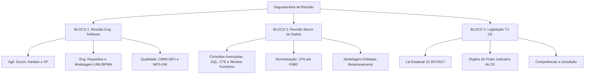

# Guia de Estudos Definitivo — Segunda-feira 15/06/2026
## Semana 5 | Dia 29 | TJ-CE 2026 (Analista TI - Sistemas)
### Foco Absoluto: Super Revisão de Eng. Software, Banco de Dados e Lei de Organização Judiciária (TJ-CE)

---

> ⚠️ **Atenção:** Hoje inauguramos a **Fase 2** do nosso cronograma! O foco agora muda: reduzimos a absorção de teorias inéditas em TI e partimos para o esmagamento de questões (Revisão Ativa) e legislação local.

---

## 🗺️ Mapa de Estudos do Dia

---

## ⚙️ SEÇÃO 1: Revisão Pesada — Engenharia de Software

A FCC tem um banco de questões infinito sobre esses temas. O segredo não é saber o que cada um faz, mas sim como a banca tenta te confundir trocando os conceitos entre eles.

### 1. Scrum vs Kanban vs XP
*   **Pegadinhas da FCC:** A banca costuma dizer que o Scrum Master gerencia pessoas ou prazos (falso, ele só garante que o Scrum seja compreendido e aplicado). Outra mentira comum é dizer que o Kanban possui time-boxes fixos (Sprints) como o Scrum (falso, Kanban é fluxo contínuo). No XP (eXtreme Programming), atenção à dupla dinâmica: *Pair Programming* (difusão de conhecimento) e *Test-Driven Development - TDD* (testes antes do código).

### 2. UML e BPMN
*   **UML:** Os diagramas Comportamentais (ex: Caso de Uso, Sequência, Atividade, Estado) mostram a dinâmica temporal do sistema. Os Estruturais (ex: Classes, Objetos, Componentes, Implantação) mostram a parte física/lógica estática.
*   **BPMN:** Muito usado em tribunais. Diferencie "Pool" (uma organização inteira) de "Lane" (departamentos/papéis dentro da organização). Gateways Exclusivos (X) só permitem um caminho, enquanto Paralelos (+) abrem múltiplos caminhos simultâneos.

### 3. CMMI-DEV v2.0 vs MPS-SW
*   **CMMI v2.0:** Acabou a decoreba das antigas áreas de processo isoladas. A versão 2.0 foca em *Práticas* agrupadas em *Áreas de Prática* e amarradas por intenções de valor de negócio. Os Níveis de Maturidade vão de 0 (Incompleto) a 5 (Otimizado).
*   **MPS-SW:** Modelo focado na realidade brasileira (PMEs). A maior pegadinha da FCC é a ordem das letras. Os níveis vão de A (Mais alto - Otimização) a G (Mais baixo - Parcialmente Gerenciado). Diferente do CMMI, a avaliação é sempre mais granular (7 níveis ao invés de 5).

---

## 📋 SEÇÃO 2: Revisão Pesada — Banco de Dados

### 1. SQL, CTEs e Window Functions
*   **CTE (Common Table Expression):** A cláusula `WITH`. Cria uma tabela temporária que só existe durante a execução daquela query. Excelente para refatorar subqueries aninhadas e para consultas recursivas (ex: organogramas).
*   **Window Functions:** A cláusula `OVER()`. Diferente do `GROUP BY`, que esmaga as linhas em um único resultado, a Window Function calcula valores (como médias móveis ou rankings) *mantendo as linhas originais* no retorno da query. Palavras-chave cobradas: `PARTITION BY`, `ORDER BY`, `RANK()`, `ROW_NUMBER()`.

### 2. Normalização (O pesadelo da FCC)
*   **1FN:** Sem atributos multivalorados ou compostos (tudo atômico).
*   **2FN:** Tem que estar na 1FN e **não ter dependência parcial**. (Todos os atributos não chave devem depender da chave primária INTEIRA, e não apenas de um pedaço dela).
*   **3FN:** Tem que estar na 2FN e **não ter dependência transitiva**. (Atributos não chave não podem depender de outros atributos não chave. Ex: Nome do Departamento dependendo do Código do Departamento em uma tabela de Empregados).
*   **FNBC (Boyce-Codd):** Uma 3FN mais rígida, onde **TODO determinante deve ser uma chave candidata**.

---

## ⚖️ SEÇÃO 3: Legislação TJ-CE — Lei Estadual nº 16.397/2017

Esta é a Lei de Organização Judiciária do Estado do Ceará (LOJ). Todo servidor do TJ precisa conhecer a estrutura da casa!

### Estrutura e Órgãos
A Lei define quais são os órgãos do Poder Judiciário Estadual. Foco nos principais:
*   **Tribunal de Justiça:** O órgão de 2ª instância (sede em Fortaleza, jurisdição em todo o Estado).
*   **Tribunal do Júri:** Para crimes dolosos contra a vida.
*   **Turmas Recursais dos Juizados Especiais:** Que julgam os recursos do JEC (não vão para o TJ).
*   **Juízos de Direito e Juizados Especiais:** 1ª instância.

### Composição do Tribunal de Justiça
*   O TJ-CE é composto por Desembargadores. A FCC pode cobrar competências exclusivas do Tribunal Pleno, do Órgão Especial (se houver/mencionado na lei), e do Presidente do Tribunal.

### Jurisdição e Comarcas
*   O estado é dividido em **Comarcas** (podendo ter mais de um município — termo: termo judiciário).
*   A Comarca de Fortaleza é Entrância Final (a mais alta da carreira do juiz de 1ª instância antes de virar Desembargador).

---

## 🎯 SEÇÃO 4: Questões Inéditas FCC-Style Comentadas (Padrão Premium)

Mantendo o nível crítico: longas, secas e com paralelismo total nas alternativas.

### Questão 1: Revisão Eng. Software (UML e Ágil)
**(FCC - 2026 - TJ-CE - Analista de TI)** Um esquadrão ágil do TJ-CE desenvolve a nova plataforma de peticionamento utilizando Scrum e necessita modelar a comunicação em tempo real entre o módulo de autenticação do advogado e o barramento corporativo do tribunal. O Arquiteto de Software determinou a criação de um diagrama UML que capture o aspecto dinâmico da troca de mensagens, evidenciando explicitamente a linha de vida temporal de cada objeto envolvido e a ordem cronológica dos métodos evocados. Dentre os diagramas canônicos da UML 2.5, o artefato arquitetural exigido é o Diagrama de:

A) Atividades, destinado a mapear o fluxo de controle estrutural das funções.
B) Objetos, projetado para consolidar as instâncias temporais em memória.
C) Sequência, construído para detalhar a interação cronológica das requisições.
D) Casos de Uso, aplicado à delimitação de fronteiras do comportamento humano.
E) Máquina de Estados, empregado na transição estática de variáveis de domínio.

💡 Resolução Comentada da Questão 1

**Gabarito Correto: C**

**Justificativa:** O diagrama de **Sequência** (um diagrama comportamental/interação) é especificamente projetado para modelar como os objetos interagem em um cenário específico, exibindo graficamente as "linhas de vida" (lifelines) caindo verticalmente, e as trocas de mensagens (chamadas de métodos) cruzando horizontalmente na ordem cronológica exata do tempo.

**Erro das Alternativas Falsas:**
*   **A:** O Diagrama de Atividades parece um fluxograma e modela o fluxo de trabalho (decisões, paralelos), mas não foca na interação cronológica entre múltiplos objetos via troca de mensagens.
*   **B:** O Diagrama de Objetos é estrutural/estático, funciona como uma "fotografia" do estado do sistema em um momento específico, sem linha do tempo.
*   **D:** Casos de Uso mostram *o que* o sistema faz para o usuário (atores), de fora, sem detalhar o cronograma técnico de *como* os objetos trocam mensagens por baixo dos panos.
*   **E:** Máquina de Estados descreve as mudanças no ciclo de vida de um *único* objeto (ex: um processo de "Aberto" para "Julgado"), não a troca temporal de mensagens entre vários componentes.

### Questão 2: Revisão Banco de Dados (Window Functions)
**(FCC - 2026 - TJ-CE - Analista de TI)** O Departamento de Estatística do TJ-CE necessita emitir um relatório analítico consolidando a produtividade dos servidores das Varas Criminais. A query solicitada deve exibir o nome de cada servidor, o total de processos baixados por ele no mês e, na mesma linha, o total acumulado de processos baixados apenas por toda a sua respectiva Vara Criminal, permitindo a comparação individual perante o grupo sem colapsar a listagem nominal. O recurso nativo da linguagem SQL (padrão ANSI) capaz de computar agregações mantendo a granularidade original das linhas de retorno é a:

A) cláusula de agrupamento restrito GROUP BY acoplada ao operador HAVING.
B) rotina de projeção temporal baseada em expressões regulares do operador LIKE.
C) estrutura de subconsulta correlacionada filtrada pela cláusula EXISTS.
D) função de janelamento analítico acompanhada da cláusula OVER e PARTITION BY.
E) operação de produto cartesiano forçada pelo uso sintático do CROSS JOIN.

💡 Resolução Comentada da Questão 2

**Gabarito Correto: D**

**Justificativa:** A necessidade de calcular um total agregado (como a soma dos processos de toda a vara) e mostrar esse resultado lado a lado com os dados individuais de cada servidor "sem colapsar a listagem nominal" é a definição primária das **Window Functions** (funções de janela). A sintaxe padrão usa funções de agregação seguidas por `OVER (PARTITION BY coluna_da_vara)`.

**Erro das Alternativas Falsas:**
*   **A:** O uso de `GROUP BY` esmaga/colapsa as linhas (reduz todas as linhas de uma vara a apenas uma linha na resposta), perdendo o detalhamento de cada servidor exigido pelo enunciado.
*   **B:** Expressões regulares e `LIKE` operam sobre filtragem de strings textuais, sem qualquer capacidade aritmética ou de agregação.
*   **C:** Uma subquery correlacionada não serve para preservar agregação particionada de forma otimizada com o restante dos dados mantidos nativamente, e o EXISTS apenas atesta verdadeiro ou falso (booleano de presença).
*   **E:** O `CROSS JOIN` multiplica todas as linhas por todas as linhas, gerando dados espúrios e nenhuma soma agregada útil.

### Questão 3: Lei de Organização Judiciária (Lei 16.397/2017)
**(FCC - 2026 - TJ-CE - Analista de TI)** Durante a auditoria de acesso aos sistemas eletrônicos que processam ações originárias do Poder Judiciário do Estado do Ceará, um engenheiro de segurança precisou classificar a permissão de magistrados atuantes na segunda instância em conformidade com a Lei Estadual nº 16.397/2017. De acordo com o que dispõe a Lei de Organização Judiciária do Estado do Ceará acerca da composição estrutural do Poder Judiciário estadual, o órgão máximo de julgamento colegiado que congrega os Desembargadores e exerce a jurisdição de segundo grau na capital do Estado é denominado:

A) Conselho Nacional de Justiça, com sede itinerante pelas comarcas estaduais.
B) Tribunal do Júri Colegiado, localizado na Entrância Final da comarca.
C) Tribunal de Justiça do Estado do Ceará, sediado exclusivamente na Capital.
D) Turma Recursal Mista, subordinada à competência dos Juizados Especiais.
E) Auditoria de Justiça Militar, responsável pelos feitos cíveis na jurisdição plena.

💡 Resolução Comentada da Questão 3

**Gabarito Correto: C**

**Justificativa:** Conforme o Art. 5º da LOJ-CE (Lei 16.397/2017), o Tribunal de Justiça do Estado do Ceará é o órgão de segundo grau de jurisdição, tem sede na Capital (Fortaleza) e jurisdição em todo o território do Estado, sendo composto pelos Desembargadores.

**Erro das Alternativas Falsas:**
*   **A:** O CNJ é órgão de cúpula administrativa de controle de todo o Judiciário Nacional sediado em Brasília, não sendo o órgão de segundo grau estadual cearense.
*   **B:** O Tribunal do Júri é órgão de 1º grau (julgamento de crimes dolosos contra a vida por jurados leigos), não é o órgão máximo de segundo grau.
*   **D:** As Turmas Recursais existem para julgar recursos vindos exclusivamente dos Juizados Especiais (pequenas causas), elas não representam a corte máxima estadual de segunda instância.
*   **E:** Auditoria Militar foca apenas em crimes militares praticados por PMs ou Bombeiros, atuando no primeiro grau.

---

## 🧠 SEÇÃO 5: Flashcards de Memorização Ativa (Estilo Anki)

### Bloco 1 — Revisão Eng. Software
*   **Frente:** No modelo CMMI v2.0, qual a diferença crítica de paradigma em relação às versões antigas?
*   **Verso:** O CMMI v2.0 abandonou a rigidez mecânica processual e adotou um foco contínuo no **Desempenho e Valor de Negócio**, organizando o modelo em "Áreas de Prática" agrupadas por intenções (Categorias/Capacidades) adaptáveis a ambientes ágeis.

### Bloco 2 — Revisão BD (Normalização)
*   **Frente:** O que viola a 3ª Forma Normal (3FN) em um Banco de Dados Relacional?
*   **Verso:** A **Dependência Transitiva**. Para estar na 3FN, um campo não-chave só pode depender logicamente da chave primária inteira e de NENHUM outro campo não-chave.

### Bloco 3 — Legislação TJ-CE
*   **Frente:** Segundo a LOJ Ceará (Lei 16.397/2017), as Comarcas do estado são divididas hierarquicamente em quais "entrâncias" para a carreira da magistratura?
*   **Verso:** Inicial, Intermediária e Final (Fortaleza).

---

## 🏆 Roteiro de Estudos Sugerido para Hoje (15/06/2026)

1.  **Manhã (Bloco 1 - 2.5h):** Revisão de Software. Não leia teoria do zero! Abra seu caderno de erros e os flashcards antigos sobre Scrum, Kanban, UML e CMMI. Repasse os erros mapeados nas semanas anteriores.
2.  **Tarde (Bloco 2 - 2.5h):** Revisão de Banco de Dados. Foco pesado na resolução de consultas de prova (CTE, Window Function) no papel ou banco local, e mapeie as regras das 3 Formas Normais mentalmente. 
3.  **Noite (Bloco 3 - 2h):** Leitura de Lei Seca. Abra a Lei 16.397/2017 e leia focando na organização administrativa. Diferencie os órgãos colegiados e saiba o que é uma Turma Recursal.
4.  **Imersão em Questões:** Aguarde o *Megapack de 75 Questões Premium* (30 para o Bloco 1, 30 para o Bloco 2 e 15 para a Legislação) que estão sendo geradas para massificar todo o seu dia! 

Bons estudos! A Fase 2 requer sangue frio. Foque nas pegadinhas, não na repetição de teorias já superadas! 🚀
