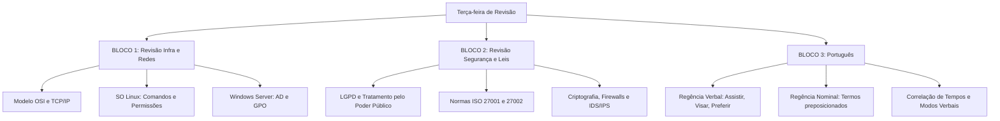

# Guia de Estudos Definitivo — Terça-feira 16/06/2026
## Semana 5 | Dia 30 | TJ-CE 2026 (Analista TI - Sistemas)
### Foco Absoluto: Super Revisão de Infraestrutura, Segurança e Regência/Correlação Verbal (FCC)

---

> ⚠️ **Atenção (Fase 2):** Continuamos na nossa jornada de nivelamento tático. Hoje o treino é massivo em Infra, Segurança e Língua Portuguesa (que tem um peso destruidor na prova do TJ).

---

## 🗺️ Mapa de Estudos do Dia

---

## ⚙️ SEÇÃO 1: Revisão Pesada — Infraestrutura e Sistemas Operacionais

A FCC costuma misturar conceitos teóricos de redes com a parte prática de configuração de sistemas operacionais.

### 1. Modelo OSI vs Pilha TCP/IP
*   **A grande pegadinha:** No modelo OSI, a Criptografia e a Compressão de dados ocorrem na camada de **Apresentação** (6). No TCP/IP original, não há camadas de Sessão e Apresentação; tudo está englobado na camada de **Aplicação**.
*   **Roteamento e MAC:** Roteador atua na Camada 3 (Rede - IPs), enquanto Switch atua na Camada 2 (Enlace - Endereços MAC).

### 2. Linux vs Windows Server
*   **Linux (Permissões):** A FCC adora cobrar o comando `chmod`. Lembre-se da regra numérica: **4** (Leitura/Read), **2** (Gravação/Write), **1** (Execução/Execute). Um `chmod 754` significa: 7 para o Dono (4+2+1, pode tudo), 5 para o Grupo (4+1, lê e executa) e 4 para Outros (somente leitura).
*   **Windows Server (AD e GPO):** Active Directory (AD) é o serviço de diretório (baseado no protocolo LDAP). As Group Policy Objects (GPOs) servem para aplicar políticas em lote para Computadores ou Usuários dentro de OUs (Unidades Organizacionais), e **NÃO** para grupos diretamente. A política é aplicada na OU.

---

## 📋 SEÇÃO 2: Revisão Pesada — Segurança da Informação

Aqui não tem choro, a FCC cobra os mínimos detalhes normativos.

### 1. Criptografia e Hashes
*   **Simétrica vs Assimétrica:** Simétrica (AES, DES) usa uma ÚNICA chave para cifrar e decifrar (rápida, boa para volumes grandes). Assimétrica (RSA) usa DUAS chaves (Pública para cifrar, Privada para decifrar).
*   **Hash (Integridade):** MD5 ou SHA geram um resumo matemático irreversível do arquivo. Se um único bit mudar, o Hash final muda drasticamente.
*   **Assinatura Digital (Autenticidade e Não-Repúdio):** O emissor cifra o Hash do documento com a sua **Chave Privada**. Qualquer um usa a chave pública dele para verificar.

### 2. Normas ISO/IEC 27001 e 27002
*   A ISO 27001 define os **Requisitos** (o que DEVE ser feito para certificar o SGSI). 
*   A ISO 27002 fornece o **Código de Práticas / Diretrizes** (o COMO fazer os controles, é um catálogo de recomendações, não é certificável).

### 3. Firewalls e IDS
*   **Firewall de Estado (Stateful Inspection):** Lembra e inspeciona toda a sessão (tabela de conexões), atuando do nível de rede até transporte.
*   **IDS (Intrusion Detection System):** Apenas **detecta** e alerta o administrador (passivo).
*   **IPS (Intrusion Prevention System):** Detecta e ativamente **bloqueia** a ameaça cortando a conexão (ativo).

---

## 🗣️ SEÇÃO 3: Língua Portuguesa — Regência e Correlação Verbal

A FCC elabora questões gigantes para você validar qual frase está correta. Foco nestes itens mortais!

### 1. Regência Verbal (Os Vilões)
*   **Assistir:** Sentido de *ver* (pede preposição A: Assistir **ao** filme). Sentido de *dar assistência* (não pede: Assistir o doente).
*   **Aspirar / Visar:** Sentido de *objetivar/almejar* (pede preposição A: O analista visa **à** aprovação). Sentido de *respirar/mirar arma* (sem preposição: Ele aspirou o ar).
*   **Preferir:** O certo é "Prefiro isto **A** aquilo". JAMAIS use "Prefiro isto *do que* aquilo" ou "Prefiro *mil vezes mais* isto". (Erro clássico FCC).

### 2. Correlação de Tempos Verbais
A FCC cobra o cruzamento lógico das ações. Os "casamentos" perfeitos:
*   Pretérito Imperfeito do Subjuntivo com Futuro do Pretérito do Indicativo: "Se o servidor **estudasse** (pretérito), ele **passaria** (futuro do pret.)".
*   Futuro do Subjuntivo com Futuro do Presente do Indicativo: "Quando o servidor **estudar** (fut. subj.), ele **passará** (fut. pres.)".

---

## 🎯 SEÇÃO 4: Questões Inéditas FCC-Style Comentadas (Padrão Premium)

### Questão 1: Revisão Infra (Linux)
**(FCC - 2026 - TJ-CE - Analista de TI)** Durante a auditoria de segurança dos servidores Red Hat Enterprise Linux do Tribunal de Justiça, um Analista constatou que o script de backup noturno de banco de dados encontrava-se com as permissões absolutas ajustadas em "640". Dada a criticidade do processo, o script deve pertencer obrigatoriamente ao usuário `oracle` e ao grupo `dba`. A atribuição octal referenciada, considerando os níveis estritos de operação do sistema, determina que:

A) O dono possui plenos direitos operacionais, enquanto o grupo está restrito à execução e os demais usuários carecem de acessos.
B) O dono detém apenas capacidades de leitura e execução, o grupo detém capacidade de gravação e os demais usuários operam de forma isolada.
C) O dono exerce capacidades de leitura e gravação, o grupo restringe-se à leitura, e há supressão total de permissões para quaisquer outros usuários.
D) O dono está impossibilitado de executar nativamente o script, o grupo detém leitura condicional e os outros usuários possuem execução atrelada ao bit SUID.
E) O dono restringe-se à configuração de gravação e leitura sobre o diretório hospedeiro, não refletindo diretamente na carga binária do arquivo para o grupo.

💡 Resolução Comentada da Questão 1

**Gabarito Correto: C**

**Justificativa:** No Linux, o valor octal decompõe-se na matriz de bits Read(4), Write(2), Execute(1). O valor "640" fragmenta-se em:
*   6 para o Dono (Owner): 4 (Leitura) + 2 (Gravação). Portanto, ele lê e grava, mas não executa nativamente.
*   4 para o Grupo (Group): 4 (Leitura). Portanto, o grupo apenas lê.
*   0 para os Outros (Others): Sem permissões totais.

**Erro das Alternativas Falsas:**
*   **A:** O dono teria plenos direitos se fosse o número "7" (4+2+1).
*   **B:** A capacidade de execução exige o bit "1" somado à trinca, o que não ocorre nem para o dono (6) nem para o grupo (4).
*   **D:** O dono realmente não pode executar (falta o bit 1 no valor 6), mas o grupo detém leitura explícita (sem "leitura condicional") e não há menção a SUID (que necessitaria de um prefixo numérico adicional como "4640").
*   **E:** O chmod de um arquivo afeta primariamente o arquivo, a alternativa confunde semântica de diretório com arquivo binário direto.

### Questão 2: Revisão Segurança (Firewall/IDS)
**(FCC - 2026 - TJ-CE - Analista de TI)** Um escritório regional de uma Comarca de Entrância Intermediária relatou ataques contínuos de varredura de portas (Port Scanning) orquestrados contra a sua interface de rede externa. A arquitetura atual reage passivamente registrando o alerta nos logs do Syslog, porém, exige que a equipe central de Segurança em Fortaleza bloqueie os IPs maliciosos manualmente nas ACLs do roteador de borda, atrasando a mitigação tática da ameaça. Para garantir o descarte imediato e automatizado da comunicação ofensiva nos cabos de rede durante a varredura ativa, a organização precisa implementar uma solução de:

A) Sistema de Prevenção de Intrusos (IPS) posicionado inline.
B) Firewall sem estado (Stateless Packet Filter) baseado na porta de origem.
C) Sistema de Detecção de Intrusos (IDS) baseado em análise heurística de tráfego.
D) Proxy Reverso para ofuscamento estático dos cabeçalhos TCP.
E) Virtual Private Network (VPN) orientada ao tunelamento com criptografia RSA.

💡 Resolução Comentada da Questão 2

**Gabarito Correto: A**

**Justificativa:** O cenário descreve perfeitamente o comportamento passivo de um Sistema de Detecção (IDS), que apenas "registra" o alerta e exige ação manual. Para que a solução realize bloqueios agressivos, proativos e automatizados derrubando (dropando) as conexões maliciosas em tempo real ("descarte imediato e automatizado"), o componente arquitetural correto é o **IPS** (Intrusion Prevention System) atuando no formato *Inline* (diretamente na rota de passagem da rede).

**Erro das Alternativas Falsas:**
*   **B:** Um filtro sem estado (stateless) bloqueia apenas baseado em regras fixas pré-escritas de IP/Porta. Ele não consegue "detectar ativamente um comportamento de varredura de portas" para agir dinamicamente.
*   **C:** O IDS é justamente a solução que eles *já possuem* hoje e que o enunciado diz ser insuficiente (reativa passivamente).
*   **D:** Proxy Reverso isola tráfego HTTP/HTTPS recebendo requisições em nome do servidor alvo, mas não toma decisões autônomas ativas para bloquear varreduras de portas em nível TCP/IP.
*   **E:** VPN cifra o tráfego em túneis. Ela não previne que a varredura atinja a interface de rede exposta ao longo do caminho público de entrada.

### Questão 3: Português (Correlação e Regência)
**(FCC - 2026 - TJ-CE - Analista de TI)** Assinale a alternativa cuja construção morfossintática evidencia a observância irrestrita das regras de regência e de correlação de tempos e modos verbais preconizadas pela norma-padrão.

A) A diretoria da área de redes informou que, quando os roteadores apresentassem defeitos intermitentes durante a sessão, eles suspenderão os serviços essenciais do tribunal.
B) Caso os servidores preferissem os relatórios antigos do que os novos modelos estruturados em nuvem, a diretoria reconsiderará a transição arquitetural para a nuvem pública.
C) O estagiário da área técnica visava a um cargo superior na hierarquia administrativa, embora preferisse mais a manutenção física de computadores à codificação em linguagem Java.
D) Desde que as falhas estruturais do Active Directory sejam devidamente reportadas aos administradores, as políticas restritivas do domínio seriam imediatamente revogadas.
E) Se o Comitê de Gestão de Riscos revisasse tempestivamente a Política de Segurança da Informação do órgão, as sanções decorrentes da falha criptográfica seriam evitadas com maior eficácia.

💡 Resolução Comentada da Questão 3

**Gabarito Correto: E**

**Justificativa:** A alternativa apresenta a correlação verbal perfeita: Pretérito Imperfeito do Subjuntivo (**revisasse**) combinado estritamente com o Futuro do Pretérito do Indicativo (**seriam**). O "casamento" lógico e semântico de hipótese no passado e consequência mitigada no futuro do pretérito está 100% correto.

**Erro das Alternativas Falsas:**
*   **A:** Erro de correlação. "Quando... apresentassem (pretérito)... suspenderão (futuro do presente)". O correto seria: "Quando... apresentarem... suspenderão".
*   **B:** Erro brutal de regência do verbo preferir. Quem prefere, prefere X **A** Y, e não X "do que" Y.
*   **C:** Outro erro de preferência associado a intensificador. Não se "prefere *mais* isto àquilo". O verbo preferir não aceita advérbios de intensidade ("mais", "muito"). O correto seria: "...embora preferisse a manutenção à codificação".
*   **D:** Erro de correlação verbal. "Desde que... sejam (presente do subjuntivo)... seriam (futuro do pretérito)". O correto seria: "Desde que... sejam reportadas... as políticas SERÃO revogadas".

---

## 🧠 SEÇÃO 5: Flashcards de Memorização Ativa (Estilo Anki)

### Bloco 1 — Revisão Infraestrutura
*   **Frente:** Onde residem os protocolos de Roteamento IP (como OSPF) na pilha de camadas do modelo OSI e do modelo TCP/IP respectivamente?
*   **Verso:** Na camada de **Rede** (Camada 3) do Modelo OSI, que corresponde à camada de **Internet** no modelo TCP/IP original.

### Bloco 2 — Revisão Segurança
*   **Frente:** Na criptografia assimétrica, se Alice deseja enviar uma mensagem confidencial apenas para Bob, qual chave ela deve utilizar para cifrar o arquivo no momento do envio?
*   **Verso:** A **Chave Pública do Bob**. Assim, somente a Chave Privada do Bob será capaz de abrir a mensagem no destino. (Confidencialidade = Chave Pública do Destino).

### Bloco 3 — Regência FCC
*   **Frente:** Corrija o erro perigoso na frase: "Ele aspirou ao cargo de Analista e custou a entender as disciplinas".
*   **Verso:** "Custou a entender" está errado! O verbo "custar" no sentido de ser difícil não admite pessoa como sujeito. O correto é: "**Custou-lhe** entender as disciplinas" (Foi custoso a ele o entendimento das disciplinas).

---

## 🏆 Roteiro de Estudos Sugerido para Hoje (16/06/2026)

1.  **Manhã (Bloco 1 - 2.5h):** Abra o caderno de erros de Linux e Windows Server. Foque unicamente na decoreba de Permissões Octais (chmod 777, 640) e nos papéis cruciais do Active Directory.
2.  **Tarde (Bloco 2 - 2.5h):** Revisão de Segurança da Informação. Repasse a tabela comparativa entre Criptografia Simétrica e Assimétrica e os pilares de Segurança (Confidencialidade, Integridade, Disponibilidade, Autenticidade, Não Repúdio) aplicando em simulados práticos de firewall.
3.  **Noite (Bloco 3 - 2h):** Regência Verbal na Veia. Pegue uma folha e liste as armadilhas dos verbos: Assistir, Aspirar, Visar, Pagar, Perdoar, Preferir e Custar.
4.  **Resolução de Questões Ininterrupta:** Foco absoluto no pacote massivo de 75 Questões que vão brotar no seu simulador (Infra, Segurança e Português). Leia as alternativas com calma para encontrar o erro gramatical ou técnico!

Bons estudos. Cuidado extra com o verbo *Preferir*, pois a FCC esconde o erro "do que" em frases de 3 linhas! 🚀
