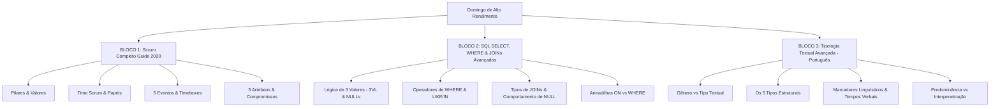

# Guia de Estudos Definitivo — Domingo 17/05/2026
## Semana 1 | Dia 2 | TJ-CE 2026 (Analista TI - Sistemas)
### Foco Absoluto: Banca FCC — Doutrina, Detalhes Ocultos, Pegadinhas e Casos Práticos

---

## 🗺️ Mapa de Estudos do Dia



---

## 🛡️ SEÇÃO 1: Engenharia de Software — Scrum (Guia Oficial 2020)

A FCC não cobra "Scrum de mercado". Ela cobra a **literalidade e a interpretação conceitual rígida** do Guia Scrum Oficial (2020). Qualquer desvio ou técnica acessória (como Story Points, Planning Poker ou quadros físicos) que for colocada como "obrigatória no Scrum" em uma alternativa estará incorreta.

---

### 1. Teoria, Pilares Empíricos e Valores

O Scrum é fundamentado no **empirismo** (o conhecimento vem da experiência e de tomadas de decisão baseadas no que é observado) e no **Lean Thinking** (redução de desperdícios e foco no essencial).

#### Os 3 Pilares Empíricos
1.  **Transparência:** O processo e o trabalho devem ser visíveis tanto para quem realiza o trabalho quanto para quem o recebe. Decisões importantes são baseadas no estado real dos artefatos. Se o estado é obscuro, as decisões são de alto risco.
2.  **Inspeção:** Os artefatos e o progresso em direção aos objetivos devem ser inspecionados frequentemente e de forma diligente para detectar variações ou problemas indesejados. A inspeção não deve atrapalhar o próprio trabalho.
3.  **Adaptação:** Se algum aspecto do processo desviar dos limites aceitáveis, ou se o produto resultante for inadequado, o processo ou os materiais produzidos devem ser ajustados. O ajuste deve ser feito o mais rápido possível para minimizar desvios adicionais.
    *   *Nota de Prova:* O Guia Scrum afirma textualmente: *"A adaptação torna-se mais difícil se as pessoas envolvidas não forem empoderadas ou auto-gerenciáveis. Espera-se que um Scrum Team se adapte no momento em que aprende algo novo por meio da inspeção."*

#### Os 5 Valores do Scrum
Para que o empirismo funcione, o Scrum Team deve viver cinco valores:
*   **Comprometimento:** O time se compromete em atingir seus objetivos e apoiar uns aos outros.
*   **Coragem:** Os membros têm coragem para fazer a coisa certa e trabalhar em problemas difíceis.
*   **Foco:** O foco principal de todos é no trabalho da Sprint e nos objetivos do time.
*   **Abertura:** O time e seus stakeholders concordam em ser abertos sobre todo o trabalho e os desafios.
*   **Respeito:** Os membros do time se respeitam como pessoas capazes e independentes.

---

### 2. O Scrum Team (Análise Profunda de Papéis)

O Scrum Team é a unidade básica do framework. É composto por: **um Scrum Master, um Product Owner e Developers**.
*   **Tamanho:** Tipicamente **10 pessoas ou menos**. O Guia diz que times menores se comunicam melhor e são mais produtivos. Se ficar muito grande, deve ser reorganizado em múltiplos times menores e coesos, mas que compartilhem o **mesmo Product Goal, Product Backlog e Product Owner**.
*   **Características Principais:**
    *   **Multifuncional (Cross-functional):** Os membros têm todas as habilidades necessárias para criar valor a cada Sprint.
    *   **Auto-gerenciável (Self-managing):** Eles decidem internamente **quem** faz, **o que** faz e **como** faz. (Atenção: Na versão de 2017 do guia, o termo usado era "auto-organizado". A mudança para "auto-gerenciável" em 2020 deu ainda mais autonomia ao time).
    *   **Sem Hierarquia:** É uma organização horizontal focada em um único objetivo.

```
                  ┌─────────────────────────────────────────┐
                  │               SCRUM TEAM                │
                  │        (10 pessoas ou menos)            │
                  └────┬───────────────────────────────┬────┘
                       │                               │
         ┌─────────────▼─────────────┐   ┌─────────────▼─────────────┐
         │       PRODUCT OWNER       │   │       SCRUM MASTER        │
         │  • Maximiza o Valor       │   │  • Eficácia do Scrum      │
         │  • Dono Único do Backlog  │   │  • Líder Servidor         │
         │  • Interface de Negócios  │   │  • Remove Impedimentos    │
         └───────────────────────────┘   └───────────────────────────┘
                               │
         ┌─────────────────────▼─────────────────────┐
         │                DEVELOPERS                 │
         │  • Cria o Incremento Pronto (DoD)         │
         │  • Auto-gerencia a execução técnica       │
         │  • É dono do Sprint Backlog               │
         └───────────────────────────────────────────┘
```

#### A. Developers (Desenvolvedores)
São as pessoas do Scrum Team comprometidas em criar qualquer aspecto de um Incremento útil a cada Sprint. Suas responsabilidades incluem:
*   Criar o plano para a Sprint (o **Sprint Backlog**).
*   Garantir a qualidade aderindo a uma **Definição de Pronto (Definition of Done - DoD)**.
*   Adaptar seu plano diariamente em direção ao **Objetivo da Sprint (Sprint Goal)**.
*   Responsabilizar-se mutuamente como profissionais.

#### B. Product Owner (PO)
É o único responsável por **maximizar o valor do produto** resultante do trabalho do Scrum Team. Suas atividades principais giram em torno da gestão do **Product Backlog**:
*   Desenvolver e comunicar claramente o Product Goal.
*   Criar e ordenar os itens do Product Backlog.
*   Garantir que o Product Backlog seja transparente, visível e compreendido por todos.
*   *Detalhe de Ouro para a Prova:* O PO representa os interesses dos stakeholders. Qualquer pessoa que queira mudar o Product Backlog deve convencer o PO. Suas decisões são refletidas na ordem e no conteúdo do backlog; ninguém pode dar ordens ao time sobre prioridades além do PO. **Ele é uma única pessoa**, não um comitê.

#### C. Scrum Master (SM)
É o responsável por estabelecer o Scrum conforme definido no Guia. Ele faz isso ajudando todos a entenderem a teoria e a prática do Scrum, tanto dentro do time quanto na organização. É um **líder que serve** ao Scrum Team e à organização.

##### Como o Scrum Master serve ao Scrum Team:
*   Coaching na auto-gerência e multifuncionalidade.
*   Ajudar a focar em criar incrementos de alto valor que atendam à DoD.
*   Promover a remoção de impedimentos ao progresso do time.
*   Garantir que todos os eventos do Scrum ocorram de forma produtiva e dentro do *timebox*.

##### Como o Scrum Master serve ao Product Owner:
*   Ajudar a encontrar técnicas para definição eficaz do Product Goal e gestão do Product Backlog.
*   Ajudar o time a entender a necessidade de itens de backlog claros e concisos.
*   Ajudar a estabelecer o planejamento empírico do produto para um ambiente complexo.
*   Facilitar a colaboração dos stakeholders, conforme solicitado ou necessário.

##### Como o Scrum Master serve à Organização:
*   Liderar, treinar e orientar a organização na adoção do Scrum.
*   Planejar e aconselhar implementações Scrum na organização.
*   Ajudar funcionários e stakeholders a compreender e aplicar a abordagem empírica para trabalhos complexos.
*   Remover barreiras entre stakeholders e Scrum Teams.

---

### 3. Os 5 Eventos do Scrum (Regras Rígidas de Timebox)

O Guia Scrum define os eventos especificamente para criar consistência e minimizar a necessidade de reuniões não definidas no Scrum. Todos os eventos são **oportunidades para inspecionar e adaptar** algo.

#### A. A Sprint
É o container para todos os outros eventos. Tem duração fixa de **até um mês** (4 semanas). Uma nova Sprint começa imediatamente após a conclusão da anterior.
*   **Durante a Sprint:**
    *   Não são feitas mudanças que coloquem em risco o Objetivo da Sprint (Sprint Goal).
    *   A qualidade não é reduzida.
    *   O Product Backlog é refinado conforme necessário.
    *   O escopo pode ser clarificado e renegociado entre o PO e os Developers à medida que mais é aprendido.
*   **Cancelamento de uma Sprint:** Apenas o **Product Owner** tem autoridade para cancelar uma Sprint, e ele só faz isso se o **Sprint Goal se tornar obsoleto**.

#### B. Sprint Planning (Planejamento da Sprint)
Inicia a Sprint ao estabelecer o trabalho a ser realizado.
*   **Timebox:** Máximo de **8 horas** para uma Sprint de um mês (para Sprints mais curtas, é proporcionalmente menor).
*   **Participantes:** Todo o Scrum Team. Podem convidar outras pessoas para fornecer assessoria técnica.
*   **Os 3 Tópicos Obrigatórios (Novidade do Guia 2020):**
    1.  **Tópico 1: Por que esta Sprint é valiosa?** O Scrum Team propõe um **Sprint Goal** que descreve o valor que a Sprint trará. Todo o time colabora para defini-lo antes do fim do planejamento.
    2.  **Tópico 2: O que pode ser feito nesta Sprint?** Os Developers selecionam itens do Product Backlog para incluir na Sprint. O time pode refinar esses itens para aumentar a previsibilidade.
    3.  **Tópico 3: Como o trabalho escolhido será realizado?** Para cada item selecionado, os Developers planejam o trabalho necessário para criar um incremento que atenda à DoD. Isso é feito decompondo itens em tarefas menores (frequentemente de um dia ou menos).
*   *Nota:* O **Sprint Backlog** é a soma do Sprint Goal (por quê), os itens selecionados (o quê) e o plano de entrega (como).

#### C. Daily Scrum (Reunião Diária)
*   **Timebox:** **15 minutos**.
*   **Frequência e Local:** Diária, realizada no mesmo horário e local todos os dias da Sprint para reduzir a complexidade.
*   **Objetivo:** Inspecionar o progresso em direção ao Sprint Goal e adaptar o Sprint Backlog conforme necessário, ajustando o plano de trabalho para as próximas 24 horas.
*   *Quem participa:* **Exclusivo para os Developers**. O SM e o PO podem assistir, mas não participam ativamente (a menos que estejam atuando também como Developers). O SM apenas garante que ela ocorra e que os Developers a conduzam no timebox.
*   *Estrutura:* Os Developers podem escolher qualquer formato ou estrutura que desejarem, desde que o foco seja o progresso em direção ao Sprint Goal. As famosas "três perguntas" (o que fiz ontem, o que farei hoje, há impedimentos) **não são mais obrigatórias** no Guia 2020.

#### D. Sprint Review (Revisão da Sprint)
*   **Timebox:** Máximo de **4 horas** para uma Sprint de um mês.
*   **Objetivo:** Inspecionar o resultado da Sprint (o incremento) e determinar adaptações futuras. O Scrum Team apresenta os resultados do seu trabalho para os principais stakeholders e o progresso em direção ao Product Goal é discutido.
*   *Natureza:* É um evento de trabalho colaborativo, **nunca apenas uma apresentação de slides ou reunião de status**. O Product Backlog pode ser ajustado para refletir novas oportunidades.

#### E. Sprint Retrospective (Retrospectiva da Sprint)
*   **Timebox:** Máximo de **3 horas** para uma Sprint de um mês.
*   **Objetivo:** Planejar maneiras de aumentar a qualidade e a eficácia. O time inspeciona como a última Sprint ocorreu em relação às pessoas, relacionamentos, processos, ferramentas e à própria Definition of Done.
*   *Melhorias:* O time identifica as mudanças mais úteis para tornar o processo mais eficaz. As melhorias mais impactantes são colocadas em prática o mais rápido possível (podendo até ser incluídas no Sprint Backlog da próxima Sprint).

---

### 4. Os 3 Artefatos e seus Compromissos Metodológicos

Os artefatos representam trabalho ou valor. Eles são projetados para maximizar a transparência das informações fundamentais. Cada artefato possui um **compromisso** associado para garantir a medição clara do progresso:

| Artefato | Compromisso Associado | O que garante? |
|---|---|---|
| **Product Backlog** | **Product Goal (Meta do Produto)** | Descreve um estado futuro do produto que serve como um alvo de longo prazo para o planejamento do Scrum Team. O time deve atingir (ou abandonar) uma meta antes de assumir a próxima. |
| **Sprint Backlog** | **Sprint Goal (Meta da Sprint)** | É o único objetivo para a Sprint. Embora seja um compromisso dos Developers, fornece flexibilidade em termos do trabalho exato necessário para alcançá-lo. |
| **Incremento** | **Definition of Done (DoD / Definição de Pronto)** | Uma descrição formal do estado do Incremento quando atinge as medidas de qualidade exigidas para o produto. Se um item não atende à DoD, ele **nunca** pode ser lançado ou apresentado na Sprint Review. Ele retorna ao Product Backlog. |

---

### 🚨 Pegadinhas Clássicas da FCC sobre Scrum
1.  **Dizer que existe papel de "Gerente de Projeto" ou "Product Manager" no Scrum.** Não existe. O PO faz a gestão do produto e o time se auto-gerencia na execução.
2.  **Afirmar que o Sprint Backlog é fixo e imutável.** Falso. Os Developers podem clarificar e renegociar o plano de tarefas com o PO ao longo da Sprint se descobrirem que o trabalho é diferente do esperado, desde que o **Sprint Goal** não seja comprometido.
3.  **Colocar reuniões de refinamento (Refinement) como um evento oficial do Scrum.** Falso. O refinamento é uma atividade contínua de adicionar detalhes, estimativas e ordem aos itens do Product Backlog, mas não é um dos 5 eventos formais.
4.  **Troca de Termos 2017 vs 2020:**
    *   *Antes:* Development Team (Time de Desenvolvimento). *Hoje:* Apenas **Developers** dentro do Scrum Team (para unificar o time).
    *   *Antes:* Self-organized (Auto-organizado). *Hoje:* **Self-managing (Auto-gerenciável)**.
    *   *Antes:* As 3 perguntas obrigatórias na Daily. *Hoje:* Livre escolha dos desenvolvedores para inspecionar a meta da Sprint.

---

## 💾 SEÇÃO 2: Banco de Dados — SQL Básico e Intermediário

A FCC testa o candidato colocando esquemas de banco de dados relacionais e tabelas preenchidas com dados e solicitando o resultado de consultas SQL complexas. Para gabaritar, você precisa entender o comportamento matemático e lógico do SQL.

---

### 1. A Lógica de Três Valores (Three-Valued Logic - 3VL) e o Comportamento do NULL

O maior erro dos candidatos é achar que o SQL é binário (`TRUE` ou `FALSE`). O SQL implementa a **Lógica de Três Valores**, introduzindo o estado `UNKNOWN` (Desconhecido) devido à presença do `NULL` (ausência de valor).

#### A Tabela-Verdade da 3VL:

| Operação A | Operação B | A AND B | A OR B | NOT A |
|---|---|---|---|---|
| `TRUE` | `TRUE` | `TRUE` | `TRUE` | `FALSE` |
| `TRUE` | `FALSE` | `FALSE` | `TRUE` | `FALSE` |
| `TRUE` | `UNKNOWN` | `UNKNOWN`| `TRUE` | `FALSE` |
| `FALSE` | `FALSE` | `FALSE` | `FALSE` | `TRUE` |
| `FALSE` | `UNKNOWN` | `FALSE` | `UNKNOWN`| `TRUE` |
| `UNKNOWN` | `UNKNOWN` | `UNKNOWN`| `UNKNOWN`| `UNKNOWN` |

#### A Regra de Ouro do NULL:
Qualquer comparação aritmética ou lógica direta com `NULL` resulta em `UNKNOWN`.
*   `salario = NULL` ➔ Resultado: `UNKNOWN` (Não traz a linha!).
*   `salario <> NULL` ➔ Resultado: `UNKNOWN` (Também não traz a linha!).
*   Para buscar valores nulos, deve-se usar sintaxe específica: `salario IS NULL` ou `salario IS NOT NULL`.

#### 💀 A Armadilha Mortal do `NOT IN` com `NULL`
Esta é uma das questões preferidas de nível difícil da FCC. Considere a consulta:
```sql
SELECT nome FROM funcionarios WHERE id NOT IN (1, 2, NULL);
```
Como o interpretador SQL traduz isso internamente?
```sql
SELECT nome FROM funcionarios 
WHERE id <> 1 AND id <> 2 AND id <> NULL;
```
Como `id <> NULL` resulta em `UNKNOWN`, a expressão inteira conectada por `AND` torna-se `UNKNOWN` (ou `FALSE`).
*   **Resultado prático:** **Nenhuma linha é retornada!** A consulta inteira falha em trazer qualquer dado simplesmente porque havia um elemento `NULL` dentro da lista do `NOT IN`.

---

### 2. Cláusula WHERE e Operadores Avançados

#### A. Operador `LIKE` e Curingas
Utilizado para casamento de padrões (*pattern matching*).
*   `%` (Percentual): Representa zero, um ou múltiplos caracteres.
    *   `'A%'` ➔ "Ana", "Arthur", "A".
*   `_` (Sublinhado): Representa **exatamente um** caractere.
    *   `'A_a'` ➔ "Ana", "Ada", "Ara" (não traz "Amanda").
*   *Nota:* No PostgreSQL, o `LIKE` é case-sensitive. Para buscas case-insensitive, utiliza-se `ILIKE`.

#### B. Operador `BETWEEN`
Verifica se um valor está dentro de um intervalo.
```sql
WHERE salario BETWEEN 2000 AND 5000;
```
*   **Regra de Prova:** O `BETWEEN` é **inclusivo**. A linha com salário exatamente igual a 2000 ou 5000 será incluída no resultado. Equivale a: `salario >= 2000 AND salario <= 5000`.

---

### 3. Anatomia Definitiva dos JOINs

Os JOINs especificam como as tabelas são combinadas com base em colunas comuns (chaves primárias e estrangeiras).

```
   INNER JOIN            LEFT JOIN            RIGHT JOIN           FULL JOIN
     (Interseção)         (Esquerda Total)     (Direita Total)     (União Total)
      ┌───┬───┐            ┌───┬───┐            ┌───┬───┐            ┌───┬───┐
     │   │███│   │          │███│███│   │          │   │███│███│          │███│███│███│
     │ A │███│ B │          │ A │███│ B │          │ A │███│ B │          │ A │███│ B │
     │   │███│   │          │███│███│   │          │   │███│███│          │███│███│███│
      └───┴───┘            └───┴───┘            └───┴───┘            └───┴───┘
```

#### Nossas Tabelas de Exemplo para Análise:

**Tabela: DEPARTAMENTOS (D)**
| id_dept | nome_dept |
|---|---|
| 10 | TI |
| 20 | Recursos Humanos |
| 30 | Financeiro |

**Tabela: FUNCIONARIOS (F)**
| id_func | nome_func | id_dept | salario |
|---|---|---|---|
| 1 | Carlos | 10 | 6000 |
| 2 | Mariana | 10 | 7000 |
| 3 | Roberto | NULL | 4500 |  *(Sem departamento)*

---

#### A. INNER JOIN
Retorna apenas as linhas que possuem valores correspondentes em ambas as tabelas (Interseção matemática).
```sql
SELECT F.nome_func, D.nome_dept
FROM FUNCIONARIOS F
INNER JOIN DEPARTAMENTOS D ON F.id_dept = D.id_dept;
```
*   *Comportamento:* Roberto é excluído (id_dept é NULL). O departamento 20 (RH) e 30 (Financeiro) são excluídos (sem funcionários associados).
*   **Resultado (2 linhas):**
    | nome_func | nome_dept |
    |---|---|
    | Carlos | TI |
    | Mariana | TI |

---

#### B. LEFT JOIN (ou LEFT OUTER JOIN)
Retorna **todas** as linhas da tabela à esquerda (primeira tabela mencionada), mesmo que não haja correspondência na tabela da direita. Onde não há correspondência, as colunas da direita vêm preenchidas com `NULL`.
```sql
SELECT F.nome_func, D.nome_dept
FROM FUNCIONARIOS F
LEFT JOIN DEPARTAMENTOS D ON F.id_dept = D.id_dept;
```
*   *Comportamento:* Roberto é retornado, mas seu `nome_dept` será retornado como `NULL`.
*   **Resultado (3 linhas):**
    | nome_func | nome_dept |
    |---|---|
    | Carlos | TI |
    | Mariana | TI |
    | Roberto | **NULL** |

---

#### C. RIGHT JOIN (ou RIGHT OUTER JOIN)
Retorna **todas** as linhas da tabela à direita (segunda tabela mencionada), mesmo que não haja correspondência na tabela da esquerda. Onde não há correspondência, as colunas da esquerda vêm como `NULL`.
```sql
SELECT F.nome_func, D.nome_dept
FROM FUNCIONARIOS F
RIGHT JOIN DEPARTAMENTOS D ON F.id_dept = D.id_dept;
```
*   *Comportamento:* Roberto sumiu (não está na tabela da direita). Os departamentos Recursos Humanos (20) e Financeiro (30) são listados com funcionário `NULL`.
*   **Resultado (4 linhas):**
    | nome_func | nome_dept |
    |---|---|
    | Carlos | TI |
    | Mariana | TI |
    | **NULL** | Recursos Humanos |
    | **NULL** | Financeiro |

---

#### D. FULL OUTER JOIN
Combina o efeito de `LEFT JOIN` e `RIGHT JOIN`. Retorna todas as linhas de ambas as tabelas, preenchendo com `NULL` as lacunas de correspondência.
```sql
SELECT F.nome_func, D.nome_dept
FROM FUNCIONARIOS F
FULL OUTER JOIN DEPARTAMENTOS D ON F.id_dept = D.id_dept;
```
*   **Resultado (5 linhas):** Carlos, Mariana, Roberto (com dept NULL), NULL (com RH), NULL (com Financeiro).

---

#### E. CROSS JOIN (Produto Cartesiano)
Retorna a combinação de todas as linhas da primeira tabela com todas as linhas da segunda tabela. Não utiliza cláusula `ON`.
```sql
SELECT F.nome_func, D.nome_dept
FROM FUNCIONARIOS F
CROSS JOIN DEPARTAMENTOS D;
```
*   *Cálculo de Linhas:* Se a tabela F tem 3 linhas e a D tem 3 linhas, o resultado terá exatamente `3 * 3 = 9` linhas.

---

#### F. NATURAL JOIN
Realiza uma junção implícita baseada em colunas que possuem o **mesmo nome** em ambas as tabelas (neste caso, `id_dept`).
```sql
SELECT F.nome_func, D.nome_dept
FROM FUNCIONARIOS F
NATURAL JOIN DEPARTAMENTOS D;
```
*   *Perigo para Prova:* Se as duas tabelas tiverem colunas sem relação com o mesmo nome (ex: se ambas tivessem uma coluna genérica `criado_em`), o `NATURAL JOIN` tentará juntar por ambas as colunas, o que provavelmente resultará em um conjunto vazio.

---

### ⚠️ A Armadilha Suprema: Cláusula `ON` vs. Cláusula `WHERE` em Outer Joins

A FCC sabe que a maioria dos candidatos não compreende a ordem lógica de execução de uma consulta SQL. Veja a diferença sutil entre estas duas consultas que gera resultados completamente diferentes.

#### Caso 1: Filtro colocado na cláusula `ON`
```sql
SELECT F.nome_func, D.nome_dept
FROM FUNCIONARIOS F
LEFT JOIN DEPARTAMENTOS D 
  ON F.id_dept = D.id_dept AND D.nome_dept = 'Financeiro';
```
*   *Explicação:* A cláusula `ON` determina **quais registros serão unidos**. Como estamos usando um `LEFT JOIN`, a tabela da esquerda (`FUNCIONARIOS`) **deve ter todas as suas linhas retornadas**, independentemente do que aconteça na junção. O filtro `D.nome_dept = 'Financeiro'` restringe apenas a junção dos dados da direita.
*   **Resultado (3 linhas):**
    | nome_func | nome_dept |
    |---|---|
    | Carlos | NULL | *(id_dept 10 não uniu porque nome_dept não é Financeiro)* |
    | Mariana | NULL | *(id_dept 10 não uniu porque nome_dept não é Financeiro)* |
    | Roberto | NULL | *(Sem correspondência)* |

#### Caso 2: Filtro colocado na cláusula `WHERE`
```sql
SELECT F.nome_func, D.nome_dept
FROM FUNCIONARIOS F
LEFT JOIN DEPARTAMENTOS D ON F.id_dept = D.id_dept
WHERE D.nome_dept = 'Financeiro';
```
*   *Explicação:* A cláusula `WHERE` é executada **depois** que a junção (`LEFT JOIN`) foi inteiramente montada.
    1.  Primeiro, o `LEFT JOIN` gera a tabela intermediária com Carlos (TI), Mariana (TI) e Roberto (NULL).
    2.  Segundo, a cláusula `WHERE` filtra o resultado mantendo apenas as linhas onde `D.nome_dept` é igual a `'Financeiro'`.
    3.  Como nenhuma linha possui `'Financeiro'` (Carlos e Mariana têm TI, Roberto tem NULL), todas as linhas são eliminadas!
*   **Resultado (0 linhas):** Conjunto vazio.
*   *Dica de Ouro:* Colocar uma condição da tabela da direita no `WHERE` de um `LEFT JOIN` anula a propriedade "Outer" e o transforma na prática em um `INNER JOIN`, pois qualquer valor `NULL` gerado pelo descasamento do join será filtrado (já que `NULL = 'Valor'` é `UNKNOWN`).

---

## ✍️ SEÇÃO 3: Língua Portuguesa — Tipologia Textual

A FCC é uma banca de perfil acadêmico clássico em Português. Suas provas trazem textos de grandes pensadores, ensaístas e jornalistas literários. A tipologia do texto deve ser analisada sob a ótica da **predominância da intenção comunicativa**, e não apenas pela presença de elementos isolados.

---

### Gênero Textual vs. Tipo Textual (A Distinção Necessária)

*   **Gênero Textual (Aspecto Sócio-Comunicativo):** É a concretização do texto no cotidiano. Possui forma e função social claras.
    *   *Exemplos:* Receita médica, e-mail, crônica jornalística, artigo de opinião, edital de concurso, acórdão judicial. Os gêneros são **infinitos** e mutáveis.
*   **Tipo Textual (Aspecto Linguístico-Estrutural):** É a base de composição do texto. Refere-se à estrutura interna das frases, verbos e construções de linguagem. Os tipos textuais são **limitados** (geralmente cinco).

---

### Os 5 Tipos Textuais em Detalhes Profundos

```
                  ┌──────────────────────────────────────────┐
                  │            TIPOLOGIAS TEXTUAIS           │
                  └────────────────────┬─────────────────────┘
         ┌─────────────────────────────┼─────────────────────────────┐
┌────────▼────────┐           ┌────────▼────────┐           ┌────────▼────────┐
│   NARRATIVO     │           │   DESCRITIVO    │           │   INJUNTIVO     │
│ • Ação no tempo │           │ • Foto estática │           │ • Instrução/Leis│
│ • Personagens   │           │ • Adjetivação   │           │ • Imperativos   │
│ • Verbo passado │           │ • Verbo ligação │           │ • Passo a passo │
└─────────────────┘           └─────────────────┘           └─────────────────┘
                     ┌─────────────────┴─────────────────┐
            ┌────────▼────────┐                 ┌────────▼────────┐
            │ EXPOSITIVO      │                 │ ARGUMENTATIVO   │
            │ • Informação    │                 │ • Tese & Defesa │
            │ • Neutro/Fatos  │                 │ • Opinião/Juízo │
            │ • Enciclopédia  │                 │ • Persuasão     │
            └─────────────────┘                 └─────────────────┘
```

#### 1. Dissertativo-Argumentativo
*   **Objetivo:** Convencer, persuadir ou influenciar o leitor sobre a validade de uma tese (opinião central).
*   **Marcas Linguísticas Claras (O que procurar no texto):**
    *   **Linguagem Valorativa (Juízo de Valor):** Uso de adjetivos e advérbios que expressam opinião (*"inaceitável desequilíbrio"*, *"lamentável avanço"*, *"indispensável medida"*).
    *   **Operadores Argumentativos:** Conectivos concessivos, causais e conclusivos (*"embora a lei exista"*, *"visto que a impunidade impera"*, *"consequentemente, faz-se necessário"*).
    *   **Verbos de Opinião/Modalização:** *"acredita-se"*, *"convém notar"*, *"deve-se impor"*.
    *   **Estratégias de Persuasão:** Citação de autoridades (filósofos, sociólogos), dados estatísticos interpretados sob a ótica do autor, exemplos históricos de impacto.
*   *Estrutura Clássica:*
    1.  **Introdução:** Apresentação do tema + tese clara.
    2.  **Desenvolvimento:** Argumentação sólida, contra-argumentação (refutação de visões contrárias).
    3.  **Conclusão:** Síntese reflexiva ou proposta de intervenção social.

#### 2. Dissertativo-Expositivo
*   **Objetivo:** Transmitir conhecimento de forma clara, precisa e objetiva sobre determinado conceito, ideia ou fato. **Não há intenção de convencer ou emitir opinião pessoal**.
*   **Marcas Linguísticas Claras:**
    *   **Neutralidade Semântica:** Ausência de adjetivos de opinião ou termos valorativos. O foco é a informação pura.
    *   **Voz Impessoal:** Verbos na terceira pessoa do singular, uso de voz passiva sintética (*"observou-se"*, *"define-se"*, *"foi constatado"*).
    *   **Precisão Terminológica:** Uso de termos técnicos e científicos da área em questão.
    *   **Apresentação Factual:** Definições diretas, dados estatísticos frios, ordem lógica de causa e efeito sem posicionamento ideológico.
*   *Onde encontrar:* Artigos científicos de divulgação, verbetes de dicionário ou enciclopédia, notícias puramente factuais.

#### 3. Narrativo
*   **Objetivo:** Relatar um acontecimento ou uma sequência de ações reais ou fictícias que se desenrolam em uma linha do tempo.
*   **Marcas Linguísticas Claras:**
    *   **Verbos de Ação:** Predominância de verbos que indicam movimento, atitude e acontecimento.
    *   **Tempo Verbal Clave:** Verbos no **Pretérito Perfeito** (ações pontuais e concluídas: *"ele chegou"*, *"ela disse"*) e **Pretérito Imperfeito** do indicativo (ações contínuas ou de fundo no passado: *"ele corria todos os dias"*, *"ela parecia triste"*).
    *   **Conectores Temporais:** Advérbios e conjunções que marcam a passagem do tempo (*"então"*, *"quando"*, *"depois que"*, *"simultaneamente"*, *"no dia seguinte"*).
*   *Estrutura Narrativa (PENT):*
    *   **P**ersonagens: Quem realiza as ações.
    *   **E**spaço: Onde ocorre o enredo.
    *   **N**arrador: Em primeira pessoa (participante) ou terceira pessoa (observador/onisciente).
    *   **T**empo: Cronológico (marcado pelo relógio) ou psicológico (tempo da memória).
    *   **E**nredo: Complicação ➔ Clímax (ponto alto da tensão) ➔ Desfecho.

#### 4. Descritivo
*   **Objetivo:** Caracterizar um objeto, pessoa, paisagem, cena ou estado de espírito. É a representação visual (uma "pintura verbal") de algo estático.
*   **Marcas Linguísticas Claras:**
    *   **Ausência de Progressão Temporal:** O tempo está congelado. Se você ler o texto, não há um "antes" ou "depois", apenas a observação do estado presente.
    *   **Classe Gramatical Dominante:** **Nomes (Substantivos e Adjetivos)**. Grande quantidade de qualificadores.
    *   **Verbos Estáticos ou de Ligação:** *"ser"*, *"estar"*, *"parecer"*, *"permanecer"*, *"ficar"*.
    *   **Organização Espacial:** A descrição segue uma ordem física (*"de cima para baixo"*, *"da esquerda para a direita"*, *"do primeiro plano para o fundo"*).
*   *Subtipos:*
    *   *Objetiva:* Descrição técnica, física e neutra (ex: descrição de um suspeito em boletim de ocorrência).
    *   *Subjetiva:* Focada em impressões sensoriais, sentimentos e metáforas (ex: descrição de uma paisagem melancólica em uma obra poética).

#### 5. Injuntivo / Instrucional
*   **Objetivo:** Instruir, orientar, aconselhar ou ditar comportamentos para que o leitor execute uma tarefa específica.
*   **Marcas Linguísticas Claras:**
    *   **Modo Verbal Dominante: Imperativo** (*"leia"*, *"faça"*, *"evite"*, *"insira"*).
    *   **Uso de Verbos Modais de Obrigação:** *"deve"*, *"precisa"*, *"tem que"*.
    *   **Infinitivos Imperativos:** Comum em receitas e editais (*"misturar os ingredientes"*, *"apresentar os documentos no prazo"*).
    *   **Estruturação Passo a Passo:** Uso de listas, marcadores numéricos e ordenação sequencial lógica de passos.
*   *Exemplos:* Manuais de instrução de software, receitas culinárias, bulas de remédio, leis, editais de concursos e resoluções do CNJ.

---

### Predominância vs. Interpenetração Textual (O Ponto Forte da FCC)

Nenhum texto real e complexo é 100% puro. Em um romance, há descrições de cenários (Descritivo) intercaladas com as ações das personagens (Narrativo). Em um artigo de opinião (Argumentativo), o autor pode contar uma parábola do cotidiano (Narrativo) ou explicar um conceito sociológico (Expositivo) para embasar seu ponto.

#### A Regra de Ouro da FCC para Identificar a Predominância:
Para descobrir a tipologia predominante exigida na questão, pergunte-se:
> **"Qual é a intenção comunicativa soberana deste texto?"**

*   Se o texto usa uma história de 3 parágrafos apenas como ferramenta ilustrativa para provar uma tese filosófica no restante do texto: **O texto é Dissertativo-Argumentativo**.
*   Se o texto descreve fisicamente uma floresta destruída com adjetivos neutros e dados de satélite para informar sobre a área desmatada: **O texto é Dissertativo-Expositivo**.
*   Se o texto foca no drama de um morador da floresta tentando fugir do incêndio, gerando suspense e ação temporal: **O texto é Narrativo**.

---

### 🧠 Exercício Final Integrado (Para Gabaritar)

#### Questão 1 (Banca FCC - Adaptada)
*Considere o trecho abaixo:*
> *"O desenvolvimento ágil de software consolidou-se na última década. No entanto, muitas organizações falham ao aplicar o Scrum por interpretarem os papéis de forma inadequada. O Product Owner, por exemplo, não deve agir como um gerente de projeto tradicional que delega tarefas aos desenvolvedores; sua função exclusiva é atuar na maximização do valor. O desconhecimento dessa premissa básica gera uma disfunção organizativa lamentável."*

**Pergunta A:** Qual é a tipologia textual predominante desse trecho?
*   *Gabarito:* **Dissertativo-Argumentativo.** O autor apresenta juízos de valor claros (*"falham"*, *"função exclusiva"*, *"lamentável"*), usa conectivos adversativos (*"no entanto"*) e de ilustração (*"por exemplo"*) para defender uma tese crítica contra o mau uso dos papéis do Scrum.

**Pergunta B:** Se realizarmos uma busca no banco de dados da empresa sobre os times que usam Scrum e seus respectivos POs através do comando abaixo, qual será o resultado caso um time não possua PO cadastrado?
```sql
SELECT T.nome_time, P.nome_po
FROM TIMES T
LEFT JOIN POS P ON T.id_po = P.id_po
WHERE P.nome_po IS NULL;
```
*   *Gabarito:* O comando retornará **exatamente o nome dos times que estão sem Product Owner associado** (onde a coluna `P.nome_po` da junção resultou em `NULL`). Como a cláusula `WHERE` filtrou especificamente por `P.nome_po IS NULL`, ela preservou apenas os registros da esquerda (`TIMES`) que não encontraram par correspondente na tabela da direita (`POS`).

---

## 🚀 Como usar este Guia hoje
1.  **Imprima ou abra** o arquivo **[guia_dia_17_05.md](file:///c:/Users/Ruan%20Gomes/Downloads/TJC/02_Conhecimentos_Gerais/guia_dia_17_05.md)** no seu editor de código principal (ele já está atualizado com essa riqueza de detalhes).
2.  **Faça ciclos de leitura ativa:** leia uma seção e tente explicar o conceito para si mesmo em voz alta.
3.  **Use os exercícios mentais:** responda às questões propostas no papel e verifique o gabarito.
4.  **Marque seu progresso** no edital verticalizado antes de dormir!
