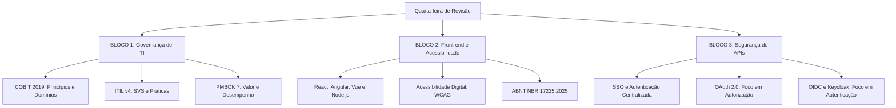

# Guia de Estudos Definitivo — Quarta-feira 17/06/2026
## Semana 5 | Dia 31 | TJ-CE 2026 (Analista TI - Sistemas)
### Foco Absoluto: Governança, Front-end/Acessibilidade e Segurança de APIs (OAuth2/OIDC)

---

> ⚠️ **Atenção (Fase 2 - Revisão Ativa):** Hoje temos um dia extremamente conceitual, recheado de normativos e protocolos arquiteturais. O volume de decoreba nas alternativas da FCC sobre Governança e OAuth2 é altíssimo. Siga os resumos com sangue nos olhos!

---

## 🗺️ Mapa de Estudos do Dia

---

## ⚙️ SEÇÃO 1: Revisão Pesada — Governança de TI

Na banca FCC, a diferença entre acertar e errar uma questão de Governança está no mapeamento dos verbos clássicos de cada framework.

### 1. COBIT 2019
*   Separa estritamente **Governança** (Direcionar, Avaliar, Monitorar - a cargo da Diretoria/Conselho) de **Gestão** (Planejar, Construir, Executar, Monitorar - a cargo dos Executivos).
*   Seus 4 domínios de gestão são: APO (Alinhar, Planejar, Organizar), BAI (Construir, Adquirir, Implementar), DSS (Entregar, Servir, Suportar) e MEA (Monitorar, Avaliar, Medir).
*   **Princípios:** Um sistema de governança deve ser Dinâmico, Customizado (Tailored), Abranger a organização de ponta a ponta e Separar Governança de Gestão.

### 2. ITIL v4
*   Substituiu o antigo "Ciclo de Vida do Serviço" pelo **Sistema de Valor de Serviço (SVS)**.
*   **Os 7 Princípios Orientadores (Decoreba obrigatória FCC):**
    1. Focar no Valor. 2. Começar de onde você está. 3. Progredir iterativamente com feedback. 4. Colaborar e promover visibilidade. 5. Pensar e trabalhar holisticamente. 6. Manter de forma simples e prática. 7. Otimizar e automatizar.

### 3. PMBOK 7ª Edição
*   Abandona os engessados "Processos" e "ITTOs" das versões anteriores.
*   Foca totalmente em **Princípios** e **Domínios de Desempenho** (Valor, Abordagem de Desenvolvimento, Equipe, Partes Interessadas, Trabalho, Medição, Incerteza e Entrega).

---

## 📋 SEÇÃO 2: Front-end e Acessibilidade Digital

Com a exigência do CNJ, acessibilidade tornou-se item de eliminação em provas de tribunais!

### 1. Front-end Moderno
*   **React:** Biblioteca mantida pelo Meta (Facebook). Baseada em Componentes e Virtual DOM.
*   **Angular:** Framework completo do Google (Usa TypeScript por padrão, arquitetura MVC fortemente opinativa).
*   **Vue.js:** Framework progressivo e flexível, amado pela sua curva de aprendizado suave.
*   **Node.js:** Ambiente de execução JavaScript *server-side* construído no motor V8 do Google Chrome. Arquitetura orientada a eventos e I/O não bloqueante.

### 2. Acessibilidade Digital (WCAG e NBR 17225)
*   **Princípios da WCAG (POUR):**
    *   **P**erceptível: Textos alternativos (alt), contraste de cores.
    *   **O**perável: Navegável 100% via teclado, sem armadilhas de foco.
    *   **U**nderstandable (Compreensível): Linguagem clara, prevenção de erros.
    *   **R**obusto: Compatibilidade com tecnologias assistivas (Leitores de tela como NVDA/JAWS).
*   **Níveis de Conformidade:** A (Básico), AA (Intermediário - exigido em lei), AAA (Máximo/Difícil).

---

## 🛡️ SEÇÃO 3: Segurança de APIs — OAuth2, OIDC e Keycloak

A FCC vai tentar te confundir sobre quem autentica e quem autoriza. Grave esta regra de ouro!

### 1. OAuth 2.0 (RFC 6749) = AUTORIZAÇÃO
*   **Propósito:** Delegação de **autorização**. (Ex: Um site pedir acesso à sua lista de amigos do Facebook sem que você forneça sua senha).
*   **Não fornece:** Identidade do usuário. O OAuth2 só entrega um `Access Token` (chave de acesso), mas não garante quem é a pessoa segurando a chave.
*   **Atores:** Resource Owner (Você), Client (Aplicação terceira), Authorization Server (Servidor de OAuth), Resource Server (API protegida).

### 2. OpenID Connect (OIDC) = AUTENTICAÇÃO
*   **Propósito:** Funciona como uma camada de **identidade (autenticação)** construída EM CIMA do OAuth 2.0.
*   **O que ele faz:** Ele responde "Quem é você?". Além do `Access Token`, ele entrega um `ID Token` (um JWT) contendo os dados do usuário logado.

### 3. Keycloak
*   Um servidor de *Identity and Access Management* (IAM) de código aberto patrocinado pela Red Hat. Ele implementa nativamente o SSO (Single Sign-On), OAuth 2.0 e OIDC, tirando a responsabilidade de autenticação de dentro do código do seu microserviço.

---

## 🎯 SEÇÃO 4: Questões Inéditas FCC-Style Comentadas (Padrão Premium)

### Questão 1: Revisão Governança (ITIL v4)
**(FCC - 2026 - TJ-CE - Analista de TI)** Durante a implementação de um novo portal de serviços jurídicos virtuais, o Comitê de Governança de TI do Tribunal de Justiça ordenou que o projeto não recriasse fluxos do zero, aproveitando a infraestrutura legada existente para reduções de custo, mesmo que obsoleta em alguns pontos iniciais. Apenas o que fosse diagnosticado como absolutamente incompatível seria substituído nas iterações seguintes. A diretiva do Comitê de Governança fundamenta-se estritamente na aplicação do Princípio Orientador da ITIL v4 denominado:

A) Manter de forma simples e prática.
B) Progredir iterativamente com feedback.
C) Otimizar e automatizar.
D) Começar de onde você está.
E) Pensar e trabalhar holisticamente.

💡 Resolução Comentada da Questão 1

**Gabarito Correto: D**

**Justificativa:** O cenário descreve a decisão de "não recriar fluxos do zero" e "aproveitar a infraestrutura legada existente". O Princípio Orientador da ITIL v4 "Começar de onde você está" (Start where you are) reza exatamente isso: não descarte tudo o que já existe para construir algo totalmente novo. Analise o estado atual, mantenha o que funciona e evolua a partir dali.

**Erro das Alternativas Falsas:**
*   **A:** Foca em não adicionar passos desnecessários aos processos (eliminar burocracia).
*   **B:** Trata do fatiamento do projeto em pequenas entregas ágeis (sprints/iterações) recebendo feedback, e não na decisão inicial de manter o legado.
*   **C:** Refere-se à intervenção tecnológica (IA, scripts) para reduzir trabalho manual repetitivo.
*   **E:** Exige que todas as dimensões do serviço (pessoas, tecnologia, parceiros) sejam analisadas em conjunto antes de agir.

### Questão 2: Acessibilidade (WCAG)
**(FCC - 2026 - TJ-CE - Analista de TI)** Um servidor com deficiência visual severa registrou uma queixa junto ao comitê de acessibilidade do TJ-CE informando que o módulo de intimações do processo eletrônico exige o preenchimento de formulários nos quais o foco do cursor fica permanentemente preso no campo de calendário, impedindo que o uso exclusivo da tecla *Tab* do teclado prossiga para o botão de confirmação. De acordo com os princípios balizadores das Diretrizes de Acessibilidade para Conteúdo Web (WCAG), o sistema eletrônico atual violou frontalmente o princípio:

A) Perceptível, por omitir alternativas em áudio.
B) Compreensível, por elaborar estruturas confusas.
C) Operável, por gerar uma armadilha de foco no teclado.
D) Robusto, por inviabilizar bibliotecas de JavaScript puras.
E) Equivalente, por prejudicar a paridade de funções.

💡 Resolução Comentada da Questão 2

**Gabarito Correto: C**

**Justificativa:** A impossibilidade de navegar usando o teclado e a condição de ficar "preso" em um componente (conhecida como Keyboard Trap ou Armadilha de Teclado) viola o Princípio **Operável** da WCAG. A Operabilidade exige que os usuários consigam interagir e operar a interface de usuário livremente, independentemente da ferramenta que usem (mouse, teclado, comandos de voz).

**Erro das Alternativas Falsas:**
*   **A:** "Perceptível" trata da percepção sensorial (visão/audição), como fornecer texto alternativo para imagens e bom contraste de cor.
*   **B:** "Compreensível" aborda linguagem clara, jargões, e mensagens de erro legíveis, não a interação física de foco.
*   **D:** "Robusto" refere-se à compatibilidade técnica do código (HTML limpo e bem formatado) com diversas tecnologias assistivas antigas e modernas.
*   **E:** O princípio "Equivalente" não existe no acrônimo oficial POUR da WCAG (Perceivable, Operable, Understandable, Robust).

### Questão 3: Segurança (OAuth2 vs OIDC)
**(FCC - 2026 - TJ-CE - Analista de TI)** O Tribunal de Justiça decidiu modernizar sua malha de serviços construindo um microserviço que permite que aplicativos de parceiros (como a OAB) leiam a agenda pública dos magistrados sem exigir a senha de rede do servidor. No entanto, o sistema também deve validar de forma criptografada a exata identidade do usuário, seu nome completo e e-mail no momento do login corporativo integrado. Para satisfazer os requisitos de delegação de acesso seguro a recursos e simultaneamente estabelecer uma camada de autenticação descentralizada de identidade, a arquitetura deve implementar, respectivamente:

A) JSON Web Token (JWT) e Security Assertion Markup Language (SAML).
B) Lightweight Directory Access Protocol (LDAP) e Single Sign-On (SSO).
C) OpenID Connect (OIDC) e Role-Based Access Control (RBAC).
D) Transport Layer Security (TLS) e OAuth 2.0.
E) OAuth 2.0 e OpenID Connect (OIDC).

💡 Resolução Comentada da Questão 3

**Gabarito Correto: E**

**Justificativa:** A delegação de acesso a recursos (ex: OAB acessar a agenda sem a senha do usuário) é o escopo técnico do **OAuth 2.0**, que emite apenas o Access Token. Porém, como a organização também precisa extrair os dados da identidade (quem é a pessoa, nome, e-mail) no login, é necessário acoplar a camada de autenticação construída sobre o OAuth2, que é o **OpenID Connect (OIDC)** (emissor do ID Token).

**Erro das Alternativas Falsas:**
*   **A:** SAML é um protocolo XML antigo para SSO, concorrente do OIDC, não formando a dupla moderna "Delegação + Identidade" especificada.
*   **B:** LDAP é protocolo para ler catálogos de rede (como o Active Directory), e não um protocolo de delegação de acesso via tokens.
*   **C:** A ordem está invertida em relação ao enunciado e RBAC é controle baseado em perfis (papéis), não um protocolo de delegação de APIs em nuvem.
*   **D:** TLS criptografa os dados em trânsito (HTTPS), não gerencia permissões lógicas de acesso a APIs nem lida com autenticação delegada federada.

---

## 🧠 SEÇÃO 5: Flashcards de Memorização Ativa (Estilo Anki)

### Bloco 1 — Governança (COBIT)
*   **Frente:** Segundo o COBIT 2019, qual o domínio de gestão responsável por Entregar, Servir e Suportar (onde fica o gerenciamento de incidentes e serviços diários)?
*   **Verso:** Domínio **DSS** (Deliver, Service and Support).

### Bloco 2 — Acessibilidade
*   **Frente:** O que diz o Princípio "Robusto" da norma WCAG de acessibilidade?
*   **Verso:** Diz que o conteúdo web deve ser suficientemente robusto para poder ser interpretado de forma confiável por uma ampla variedade de agentes de usuário, incluindo tecnologias assistivas (exige código HTML semanticamente correto e sem quebras).

### Bloco 3 — Segurança (APIs)
*   **Frente:** Qual a diferença elementar entre os Tokens emitidos pelo OAuth 2.0 e os emitidos pelo OpenID Connect?
*   **Verso:** O OAuth 2.0 emite o **Access Token** (chave para destrancar a porta da API, não revela sua identidade). O OIDC adiciona o **ID Token** (o seu crachá/RG em formato JWT, que contém seus dados de identificação e e-mail).

---

## 🏆 Roteiro de Estudos Sugerido para Hoje (17/06/2026)

1.  **Manhã (Bloco 1 - 2.5h):** Revisão de Governança. Cuidado para não ler teoria inteira! Vá direto nas suas tabelas mentais mapeando os 7 Princípios da ITIL v4 e as diferenças entre a abordagem preditiva e de Valor do PMBOK 7.
2.  **Tarde (Bloco 2 - 2.5h):** Acessibilidade e Front-end. Resuma em meia página a diferença conceitual do Virtual DOM do React contra a reatividade dos outros frameworks. Em acessibilidade, decore o acrônimo POUR (Perceptível, Operável, Compreensível e Robusto).
3.  **Noite (Bloco 3 - 2h):** Segurança de APIs. Mapeie graficamente o fluxo Authorization Code Grant do OAuth2 (o fluxo em que o backend troca o código temporário pelo token definitivo).
4.  **Treinamento Brutal:** Assim que eu liberar o nosso novo *Megapack de 75 Questões FCC Premium* de hoje, trave as portas e vá resolver! Muitas das questões testarão a sua capacidade de não confundir OAuth2 com OIDC nas alternativas secas! 

Respira fundo e vai para cima! Faltam menos de dois meses para a prova e a sua bagagem já é invejável. 🚀
