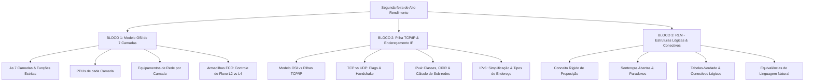

# Guia de Estudos Definitivo — Segunda-feira 18/05/2026
## Semana 1 | Dia 3 | TJ-CE 2026 (Analista TI - Sistemas)
### Foco Absoluto: Banca FCC — Doutrina, Detalhes Ocultos, Pegadinhas e Casos Práticos

---

## 🗺️ Mapa de Estudos do Dia



---

## 🛡️ SEÇÃO 1: Infraestrutura e Redes — O Modelo OSI (ISO)

O Modelo **OSI** (*Open Systems Interconnection*) é um modelo de referência de **7 camadas** criado pela ISO em 1984. A FCC cobra a **divisão estrita e teórica** de responsabilidades de cada camada, diferenciando a terminologia conceitual de rede de sua implementação prática no mundo real (TCP/IP).

### 1. Representação Visual e Fluxo de Encapsulamento

```
 Camada de Origem                                                Camada de Destino
┌─────────────────────────┐                                    ┌─────────────────────────┐
│ 7. APLICAÇÃO (Dados)    │ ─── Enviando Dados do Usuário ───> │ 7. APLICAÇÃO (Dados)    │
└───────────┬─────────────┘                                    └───────────▲─────────────┘
            │ Encapsula                                                    │ Desencapsula
┌───────────▼─────────────┐                                    ┌───────────┼─────────────┐
│ 6. APRESENTAÇÃO (Dados) │ ─── Criptografia/Compressão ─────> │ 6. APRESENTAÇÃO (Dados) │
└───────────┬─────────────┘                                    └───────────▲─────────────┘
            │                                                              │
┌───────────▼─────────────┐                                    ┌───────────┼─────────────┐
│ 5. SESSÃO (Dados)       │ ─── Controle de Diálogo/Pontos ──> │ 5. SESSÃO (Dados)       │
└───────────┬─────────────┘                                    └───────────▲─────────────┘
            │                                                              │
┌───────────▼─────────────┐                                    ┌───────────┼─────────────┐
│ 4. TRANSPORTE (Segmento)│ ─── Fluxo Fim-a-Fim / Portas ────> │ 4. TRANSPORTE (Segmento)│
└───────────┬─────────────┘                                    └───────────▲─────────────┘
            │                                                              │
┌───────────▼─────────────┐                                    ┌───────────┼─────────────┐
│ 3. REDE (Pacote)        │ ─── Roteamento Lógico / IP ──────> │ 3. REDE (Pacote)        │
└───────────┬─────────────┘                                    └───────────▲─────────────┘
            │                                                              │
┌───────────▼─────────────┐                                    ┌───────────┼─────────────┐
│ 2. ENLACE (Quadro/Frame)│ ─── Controle de Acesso / MAC ────> │ 2. ENLACE (Quadro/Frame)│
└───────────┬─────────────┘                                    └───────────▲─────────────┘
            │                                                              │
┌───────────▼─────────────┐                                    ┌───────────┼─────────────┐
│ 1. FÍSICA (Bits)        │ ═══════ Meio Físico de Rede ══════>│ 1. FÍSICA (Bits)        │
└─────────────────────────┘                                    └─────────────────────────┘
```

---

### 2. Análise Detalhada das 7 Camadas: Funções, PDUs e Equipamentos

#### Camada 7: Aplicação (Application)
*   **Função:** Fornece serviços de rede diretamente aos aplicativos do usuário final (browsers, clientes de e-mail). Ela é a interface de entrada para a rede.
*   **PDU:** Dados (Data).
*   **Protocolos Típicos:** HTTP, HTTPS, FTP, SMTP, IMAP, POP3, DNS, DHCP, SSH, Telnet, SNMP.
*   **Dispositivos:** Gateway de Aplicação, Proxy, WAF (Web Application Firewall).

#### Camada 6: Apresentação (Presentation)
*   **Função:** Garante a **sintaxe e a semântica** das informações transmitidas. É responsável pela **tradução de formatos** (ex.: conversão de ASCII para EBCDIC), **criptografia** de dados (nível conceitual OSI) e **compressão** para economia de banda.
*   **PDU:** Dados (Data).
*   **Formatos/Exemplos:** SSL/TLS (pelo modelo OSI clássico), JPEG, MPEG, GIF, ASCII, XML, JSON.

#### Camada 5: Sessão (Session)
*   **Função:** Estabelece, gerencia, sincroniza e encerra as sessões (diálogos) entre aplicações em hosts diferentes.
*   **Conceitos Chave:**
    *   **Controle de Diálogo:** Determina quem transmite em determinado momento (Simplex, Half-Duplex, Full-Duplex).
    *   **Sincronização:** Insere "checkpoints" (pontos de controle) no fluxo de dados. Se uma transmissão de 100MB cair nos 80MB, a transmissão recomeça a partir do último checkpoint (ex.: nos 70MB) e não do zero.
*   **PDU:** Dados (Data).
*   **Protocolos Típicos:** NetBIOS, RPC, L2TP, PPTP.

#### Camada 4: Transporte (Transport)
*   **Função:** Responsável pela entrega de mensagens **fim-a-fim** (*end-to-end*), isto é, da aplicação de origem para a aplicação de destino de forma isolada do meio físico.
*   **Responsabilidades:**
    *   **Segmentação e Remontagem:** Divide grandes massas de dados da camada de aplicação em pedaços menores (segmentos) e garante que sejam remontados na ordem correta no destino.
    *   **Endereçamento de Ponto de Serviço:** Identificação de portas de comunicação (ex.: Porta 80 para HTTP, Porta 443 para HTTPS).
    *   **Controle de Fluxo e Erro Fim-a-Fim:** Garante que o host transmissor não sobrecarregue o host receptor e gerencia a retransmissão de segmentos perdidos ou corrompidos.
*   **PDU:** **Segmento** (no caso do TCP) ou **Datagrama** (no caso do UDP).
*   **Protocolos Típicos:** TCP, UDP, SCTP.

#### Camada 3: Rede (Network)
*   **Função:** Responsável pelo transporte de pacotes através de múltiplas redes de computadores, decidindo o caminho físico que os dados devem percorrer (**Roteamento**).
*   **Responsabilidades:**
    *   **Endereçamento Lógico:** Atribuição de IPs para identificar unicamente os hosts na internet ou intranet.
    *   **Roteamento:** Algoritmos que escolhem a melhor rota com base em custo, distância ou velocidade.
    *   **Fragmentação de Pacotes:** Se um pacote excede a MTU (*Maximum Transmission Unit*) de uma rede intermediária, ele é dividido e depois remontado.
*   **PDU:** **Pacote** (ou Datagrama de Rede).
*   **Dispositivos:** **Roteadores**, Switches L3 (Multicamadas).
*   **Protocolos Típicos:** IPv4, IPv6, ICMP, IPsec, ARP (discussão abaixo).

#### Camada 2: Enlace de Dados (Data Link)
*   **Função:** Transmite quadros (frames) de dados entre dois nós diretamente conectados na mesma rede física (**salto-a-salto** ou *node-to-node*). Evita erros de transmissão física.
*   **Subcamadas (Padrão IEEE 802):**
    1.  **LLC (Logical Link Control):** Interface lógica com a camada de rede, controlando o fluxo e detecção de erros.
    2.  **MAC (Media Access Control):** Controla o acesso físico ao meio (ex.: CSMA/CD, CSMA/CA) e gerencia o **Endereçamento Físico** (Endereço MAC de 48 bits gravado na placa de rede).
*   **PDU:** **Quadro (Frame)**.
*   **Dispositivos:** **Switches L2**, Bridges (Pontes), Placas de Rede (NICs), Access Points.
*   **Protocolos Típicos:** Ethernet (802.3), Wi-Fi (802.11), PPP, HDLC, Frame Relay, ARP (na arquitetura OSI).

#### Camada 1: Física (Physical)
*   **Função:** Transmite a sequência de bits brutos sobre o meio físico de transmissão. Define as especificações elétricas, mecânicas e funcionais do hardware.
*   **Conceitos Chave:** Representação de bits (tensão elétrica, luz, ondas de rádio), taxas de transmissão (bps), sincronização de bits, topologia física.
*   **PDU:** **Bits**.
*   **Dispositivos:** **Hubs**, Repetidores, Cabos (Par trançado, coaxial, fibra óptica), Conectores (RJ-45, BNC), Transceivers.

#### 🔥 Aprofundamento FCC: Domínios de Colisão vs. Domínios de Broadcast
A FCC ama cobrar como os equipamentos dividem o tráfego físico e lógico:
*   **Hub (Camada 1):** Não divide nada. Todos os hosts conectados ao Hub formam **1 único domínio de colisão** e **1 único domínio de broadcast**. (Se um fala, todos ouvem; se dois falam, há colisão).
*   **Switch (Camada 2):** Divide domínios de colisão, mas não de broadcast. Cada porta do switch é **1 domínio de colisão isolado**. Porém, todos os computadores nele ainda formam **1 único domínio de broadcast**.
*   **Roteador (Camada 3):** Divide domínios de broadcast. Cada porta do roteador é **1 domínio de broadcast isolado**.

---

### 🚨 Pegadinhas Clássicas da FCC sobre o Modelo OSI

1.  **O Protocolo ARP (Address Resolution Protocol) pertence a qual camada?**
    *   *A Armadilha:* O ARP trabalha convertendo endereços IP (Camada 3) em endereços MAC (Camada 2). 
    *   *O Posicionamento para Prova:* Estritamente, no **Modelo OSI**, o ARP está situado na **Camada 2 (Enlace)**, porque seu cabeçalho é encapsulado diretamente em um frame Ethernet e seu objetivo final é resolver um endereço MAC físico. *(Nota: Em provas que usam o modelo conceitual TCP/IP, ele às vezes é classificado como pertencente à camada de Internet/Rede por fazer interface direta com o IP, mas se a questão citar especificamente o Modelo OSI, marque **Enlace de Dados**).*
2.  **Diferença crucial: Controle de Fluxo e Erro L2 vs. L4.**
    *   **Na Camada 2 (Enlace):** O controle é **salto-a-salto (link-by-link)**, feito apenas entre dois nós fisicamente vizinhos e conectados de forma direta (ex: seu computador e o switch da sua sala).
    *   **Na Camada 4 (Transporte):** O controle é **fim-a-fim (end-to-end)**, feito exclusivamente entre os dois computadores finais da comunicação (origem e destino), independente de quantos roteadores estejam no caminho intermediário.
3.  **Qual camada realiza a criptografia?**
    *   *A Armadilha:* A FCC tenta induzir o candidato a marcar "Transporte" (por causa do TLS) ou "Segurança" (que sequer existe).
    *   *O Posicionamento:* Conceitualmente no modelo OSI de 7 camadas, a responsabilidade primária de Criptografia, Tradução e Compressão é da **Camada 6 (Apresentação)**.

---

## 💾 SEÇÃO 2: TCP/IP e Endereçamento de Rede (IPv4 & IPv6)

Diferente do OSI, o modelo **TCP/IP** é prático e dominou a internet real. Ele agrupa funções de forma diferente.

### 1. Comparação Direta das Pilhas de Protocolo

| Modelo OSI (7 Camadas) | Modelo TCP/IP (RFC 1122 - 4 Camadas) | Modelo TCP/IP Moderno (5 Camadas) |
|---|---|---|
| 7. Aplicação | . | . |
| 6. Apresentação | 4. Aplicação | 5. Aplicação |
| 5. Sessão | . | . |
| 4. Transporte | 3. Transporte | 4. Transporte |
| 3. Rede | 2. Internet | 3. Rede / Internet |
| 2. Enlace | 1. Acesso à Rede (Host-to-Network) | 2. Enlace de Dados |
| 1. Física | . | 1. Física |

---

### 2. TCP vs. UDP (Camada de Transporte)

A FCC adora confrontar esses dois protocolos irmãos do Transporte. Memorize esta tabela comparativa para não perder pontos:

| Característica | TCP (Transmission Control Protocol) | UDP (User Datagram Protocol) |
|---|---|---|
| **Conexão** | Orientado à conexão (estabelece sessão via *3-Way Handshake*) | Não orientado à conexão (envia direto sem aviso) |
| **Confiabilidade** | Altamente confiável (garante entrega, ordem e integridade) | Não confiável (melhor esforço — *best effort*, pode perder dados) |
| **Velocidade** | Mais lento (devido ao overhead de controle e retransmissões) | Extremamente rápido (sem overhead de controle ou checagem) |
| **Controle de Fluxo** | Sim (janela deslizante / *sliding window*) | Não possui |
| **Controle de Congestionamento** | Sim (algoritmos Slow Start, Congestion Avoidance, Fast Retransmit) | Não possui |
| **Tamanho do Cabeçalho** | Mínimo de **20 bytes** | Fixo em **8 bytes** |
| **PDU** | Segmento | Datagrama |
| **Aplicações Comuns** | HTTP, HTTPS, SSH, FTP, SMTP (precisam de precisão) | DNS (consultas rápidas), DHCP, VoIP, Jogos Online, Streaming |

#### O Mecanismo do 3-Way Handshake (TCP)
Para estabelecer uma conexão, o TCP realiza três etapas consecutivas:
1.  **SYN:** O cliente envia um segmento com a flag `SYN` (Sincronizar) ativa e um número de sequência inicial aleatório $x$.
2.  **SYN-ACK:** O servidor responde com as flags `SYN` e `ACK` (Confirmação) ativas, confirmando o número recebido ($x+1$) e enviando seu próprio número de sequência inicial $y$.
3.  **ACK:** O cliente responde com a flag `ACK` ativa, confirmando o número recebido do servidor ($y+1$). A conexão está aberta.

*   *Para encerramento:* Ocorre via intercâmbio de quatro pacotes contendo a flag `FIN` (Finalizar) e seus respectivos `ACK`s.

---

### 3. Endereçamento IPv4: Estrutura, Classes e RFC 1918

O endereço IPv4 possui **32 bits**, representados por **4 octetos** em formato decimal separado por pontos (ex.: `192.168.1.1`).

#### A. Divisão Clássica por Classes (Classful)
Até a década de 90, o IP era rigidamente dividido em classes identificadas pelos primeiros bits do endereço:

*   **Classe A:** 
    *   Primeiro bit: `0` (Faixa: `0.0.0.0` a `127.255.255.255`)
    *   Máscara Padrão: `/8` (`255.0.0.0`)
    *   Uso: Grandes corporações/governos (poucas redes, milhões de hosts por rede).
*   **Classe B:**
    *   Primeiros bits: `10` (Faixa: `128.0.0.0` a `191.255.255.255`)
    *   Máscara Padrão: `/16` (`255.255.0.0`)
    *   Uso: Organizações de médio porte.
*   **Classe C:**
    *   Primeiros bits: `110` (Faixa: `192.0.0.0` a `223.255.255.255`)
    *   Máscara Padrão: `/24` (`255.255.255.0`)
    *   Uso: Pequenas empresas e redes residenciais.
*   **Classe D:**
    *   Primeiros bits: `1110` (Faixa: `224.0.0.0` a `239.255.255.255`)
    *   Uso: **Multicast** (transmissão para um grupo de hosts).
*   **Classe E:**
    *   Primeiros bits: `1111` (Faixa: `240.0.0.0` a `255.255.255.255`)
    *   Uso: Reservado para pesquisas e testes futuros.

#### B. Endereços Privados (RFC 1918)
Estes endereços **não são roteáveis na internet pública** e são usados dentro de redes locais. O tráfego externo deles exige **NAT** (Network Address Translation).

*   **Classe A Privada:** `10.0.0.0` a `10.255.255.255` (1 rede de máscara `/8`)
*   **Classe B Privada:** `172.16.0.0` a `172.31.255.255` (16 redes consecutivas de máscara `/12`)
*   **Classe C Privada:** `192.168.0.0` a `192.168.255.255` (256 redes de máscara `/16`)

#### C. Outros Intervalos de IP Especiais a Guardar
*   **APIPA (Link-Local IPv4):** `169.254.0.0/16` (endereço autoatribuído quando o host não acha um servidor DHCP).
*   **Loopback (Localhost):** Toda a faixa `127.0.0.0/8` (comumente `127.0.0.1`).

---

### 🧮 O GUIA MATEMÁTICO DO CIDR E CÁLCULO DE SUB-REDES (Sem Erros!)

A FCC traz questões que fornecem um endereço IP com uma barra (ex: `172.16.42.110/26`) e exigem que você calcule o **Endereço de Rede**, o **Endereço de Broadcast** ou a **Quantidade de Hosts Úteis**. 

Siga esta receita de bolo infalível passo a passo:

#### Nosso Caso Prático: Analisar o IP `172.16.42.110/26`

##### Passo 1: Entender a Máscara CIDR
A máscara `/26` significa que os **26 primeiros bits** do endereço são de Rede (bit `1`) e os **6 bits restantes** (32 - 26) pertencem aos Hosts (bit `0`).

##### Passo 2: Converter a Máscara para Decimal
Temos 4 grupos de 8 bits. Vamos distribuir os 26 bits ativos:
*   1º octeto: 8 bits ativos (`11111111`) ➔ `255`
*   2º octeto: 8 bits ativos (`11111111`) ➔ `255`
*   3º octeto: 8 bits ativos (`11111111`) ➔ `255`
*   4º octeto: restam 2 bits ativos (`11` + 6 zeros `000000`) ➔ `128 + 64 = 192`
*   **Máscara em Decimal:** `255.255.255.192`

> [!TIP]
> **Tabela Rápida de Conversão de Bits do Octeto:**
> *   `10000000` = 128 (Máscara /25 ou /17 ou /9)
> *   `11000000` = 192 (Máscara /26 ou /18 ou /10)
> *   `11100000` = 224 (Máscara /27 ou /19 ou /11)
> *   `11110000` = 240 (Máscara /28 ou /20 ou /12)
> *   `11111000` = 248 (Máscara /29 ou /21 ou /13)
> *   `11111100` = 252 (Máscara /30 ou /22 ou /14)
> *   `11111110` = 254 (Máscara /31 ou /23 ou /15)
> *   `11111111` = 255 (Máscara /32 ou /24 ou /16)

##### Passo 3: Encontrar o "Tamanho do Bloco" de Sub-rede
Subtraia o valor decimal do octeto modificado (neste caso, o 4º octeto: `192`) do número mágico **256**:
$$\text{Tamanho do Bloco} = 256 - 192 = 64$$
Isso significa que as sub-redes andam de **64 em 64** no último octeto!

##### Passo 4: Listar as Faixas de Sub-rede
Como as sub-redes crescem em múltiplos de 64, as faixas no último octeto serão:
*   Sub-rede 1: `0` a `63`
*   Sub-rede 2: `64` a `127`
*   Sub-rede 3: `128` a `191`
*   Sub-rede 4: `192` a `255`

##### Passo 5: Localizar em qual bloco nosso IP está
O nosso IP original é `172.16.42.110`. O último octeto é **110**.
O número **110** está contido no intervalo de **64 a 127** (Sub-rede 2).

##### Passo 6: Extrair as Respostas
*   **Endereço de Rede (Primeiro IP do bloco):** `172.16.42.64`
*   **Endereço de Broadcast (Último IP do bloco):** `172.16.42.127`
*   **Primeiro IP de Host Útil:** `172.16.42.65` (Rede + 1)
*   **Último IP de Host Útil:** `172.16.42.126` (Broadcast - 1)
*   **Quantidade de Hosts Úteis:** $2^{\text{bits de host}} - 2 = 2^6 - 2 = 64 - 2 = \mathbf{62\text{ hosts}}$.

---

### 4. Fundamentos do IPv6

Desenvolvido para solucionar a exaustão do IPv4. Possui **128 bits**, expressos em **hexadecimal** divididos em **8 grupos de 16 bits** separados por dois-pontos (ex.: `2001:0db8:85a3:0000:0000:8a2e:0370:7334`).

#### Regras Rígidas de Simplificação (Certas em Prova)
1.  **Omissão de zeros à esquerda:** Em qualquer grupo, você pode omitir os zeros iniciais.
    *   `0db8` vira `db8`
    *   `0000` vira `0`
2.  **Uso do duplo dois-pontos (`::`):** Sequências consecutivas de grupos contendo apenas zeros (`0000:0000`) podem ser reduzidas a `::`.
    *   **Regra de Ouro:** Você só pode usar a redução `::` **uma única vez** no endereço inteiro para evitar ambiguidade sintática de quantos zeros foram removidos.

*Exemplo de Simplificação:*
*   Original: `2001:0db8:0000:0000:0008:8a2e:0370:7334`
*   Simplificado 1: `2001:db8:0:0:8:8a2e:370:7334`
*   Simplificado Máximo: `2001:db8::8:8a2e:370:7334`

#### Tipos de Endereço IPv6
*   **Unicast:** Transmissão um-para-um (identifica uma interface de forma única).
*   **Multicast:** Transmissão um-para-muitos (identifica um grupo de interfaces).
*   **Anycast:** Transmissão um-para-o-mais-próximo (envia para um grupo, mas o roteador entrega apenas ao host topologicamente mais próximo).
*   **🚨 ATENÇÃO: NÃO EXISTE BROADCAST NO IPv6!** As funções do broadcast foram totalmente absorvidas pelo endereçamento **Multicast**.

#### 🔥 Aprofundamento FCC: Mecanismos de Transição e Fragmentação

**A. Fragmentação do IPv4 vs IPv6 (Pegadinha Mortal)**
*   **IPv4:** A fragmentação pode ser feita tanto pelo **host de origem** quanto pelos **roteadores intermediários** ao longo do caminho, se o pacote for maior que a MTU (*Maximum Transmission Unit*) do enlace seguinte.
*   **IPv6:** Os roteadores intermediários **NUNCA** fragmentam pacotes IPv6! A fragmentação no IPv6 é feita **exclusivamente pelo host de origem**. Se o pacote for muito grande para um roteador repassar, ele o descarta e envia uma mensagem *ICMPv6 "Packet Too Big"* de volta à origem.

**B. Transição IPv4 ➔ IPv6**
A FCC cobra as três técnicas principais de convivência entre os dois protocolos:
1.  **Pilha Dupla (Dual-Stack):** Os equipamentos da rede rodam simultaneamente as duas pilhas de protocolos (IPv4 e IPv6). É a forma mais natural e recomendada de transição.
2.  **Tunelamento (Tunneling):** Pacotes IPv6 são "encapsulados" dentro de pacotes IPv4 para poderem trafegar por uma rede que ainda é exclusivamente IPv4 (ex.: Teredo, ISATAP, 6to4).
3.  **Tradução (NAT64):** Traduz cabeçalhos IPv6 para IPv4 em tempo real, usado quando um dispositivo puramente IPv6 precisa falar com um servidor puramente IPv4.

---

### 🚨 Pegadinhas Clássicas da FCC sobre TCP/IP e Endereçamento

1.  **Dizer que a máscara `/31` é inválida ou impossível.**
    *   *A Realidade:* Tradicionalmente, máscaras `/31` deixariam apenas 2 endereços ($2^1$), que subtraindo rede e broadcast resultariam em 0 hosts úteis. No entanto, a **RFC 3021** descreve o uso de prefixos de 31 bits para links ponto-a-ponto, onde não se usa endereço de rede e broadcast separados, tornando ambos os IPs úteis. A FCC já cobrou a literalidade disso!
2.  **Qual o endereço de Loopback no IPv6?**
    *   *Gabarito:* `::1` (equivalente ao `127.0.0.1` do IPv4).
3.  **Comparação de Cabeçalho IPv4 vs IPv6.**
    *   Apesar de possuir um endereço 4 vezes maior, o cabeçalho do IPv6 possui **formato simplificado** com número fixo de campos (apenas 8 campos, contra 14 do IPv4), otimizando o processamento nos roteadores.

---

## ✍️ SEÇÃO 3: Raciocínio Lógico-Matemático — Estruturas Lógicas (Proposições & Conectivos)

A banca FCC é famosa pelo formalismo matemático rigoroso. Não tente resolver questões de estruturas lógicas apenas "lendo e sentindo o sentido da frase". Você deve aplicar as **leis formais** de atribuição de valor de verdade.

### 1. O Conceito Rígido de Proposição

Uma **proposição** é uma sentença declarativa (expressa em palavras ou símbolos) que exprime um pensamento de sentido completo e que pode ser avaliada exclusivamente como **Verdadeira (V)** ou **Falsa (F)**.

#### Os 3 Princípios Fundamentais da Lógica Clássica:
1.  **Princípio da Identidade:** Uma proposição verdadeira é verdadeira, e uma proposição falsa é falsa.
2.  **Princípio da Não-Contradição:** Uma proposição não pode ser verdadeira e falsa simultaneamente.
3.  **Princípio do Terceiro Excluído:** Uma proposição só pode ser Verdadeira ou Falsa, não existindo uma terceira opção ou meio-termo.

#### ⛔ O QUE NÃO É PROPOSIÇÃO (Cai muito na FCC!)
Se a frase não puder ser classificada de forma única como V ou F, **não é proposição**. Enquadram-se aqui:
1.  **Frases Interrogativas:** *"Qual o valor do subsídio de analista?"*
2.  **Frases Exclamativas:** *"Que excelente edital!"*
3.  **Frases Imperativas (Ordens/Pedidos):** *"Estude 6 horas por dia."* ou *"Escreva a petição."*
4.  **Sentenças Abertas:** Frases que possuem variáveis não especificadas e cuja atribuição de verdade depende do valor da variável.
    *   *"Ele foi aprovado no concurso do TJ-CE."* (Quem é "Ele"? Sem saber, não dá para classificar como V ou F).
    *   *"x + 4 = 10"* (É sentença aberta. Só vira proposição se for atribuído um valor para $x$ ou se usarmos quantificadores como "Existe um $x$ tal que...").
5.  **Paradoxos:** Declarações autorreferenciais contraditórias.
    *   *"Esta frase é mentira."* (Se for V, ela vira mentira e portanto F. Se for F, o que ela diz é verdade e portanto V. Fere a não-contradição).

---

### 2. Os Conectivos Lógicos e Suas Tabelas-Verdade Estritas

As proposições simples ($p, q$) são unidas por conectivos para formar proposições compostas. 

| Conectivo Lógico | Símbolo | Operação | Regra de Ouro de Verdade |
|---|---|---|---|
| **... e ...** | $\land$ | Conjunção | Só é **VERDADEIRA** se **AMBAS** forem Verdadeiras. |
| **... ou ...** | $\lor$ | Disjunção Inclusiva | Só é **FALSA** se **AMBAS** forem Falsas. |
| **ou ... ou ...** | $\underline{\lor}$ | Disjunção Exclusiva | Só é **VERDADEIRA** se as duas proposições tiverem **valores lógicos opostos** (uma V e outra F). |
| **Se ... então ...** | $\rightarrow$ | Condicional | Só é **FALSA** em um único caso: **Primeira V e Segunda F** (*"Vera Fischer é Falsa"*). |
| **... se e somente se ...** | $\leftrightarrow$ | Bicondicional | Só é **VERDADEIRA** se ambas possuírem o **mesmo valor lógico** (Ambas V ou ambas F). |

#### A Tabela-Verdade Unificada (Memorize Visualmente):

| $p$ | $q$ | Conjunção ($p \land q$) | Disjunção ($p \lor q$) | Disj. Excl. ($p \underline{\lor} q$) | Condicional ($p \rightarrow q$) | Bicondicional ($p \leftrightarrow q$) |
|:---:|:---:|:---:|:---:|:---:|:---:|:---:|
| **V** | **V** | **V** | **V** | F | **V** | **V** |
| **V** | **F** | F | **V** | **V** | **F** *(Vera Fischer)* | F |
| **F** | **V** | F | **V** | **V** | **V** | F |
| **F** | **F** | F | F | F | **V** | **V** |

#### 🔥 Aprofundamento FCC: Tautologia, Contradição e Contingência
Quando a FCC mandar você montar a tabela-verdade de uma estrutura lógica complexa, ela pedirá para você classificar o resultado final da última coluna:
1.  **Tautologia:** Quando o resultado final da tabela-verdade for **100% Verdadeiro (V)** em todas as linhas, independentemente dos valores originais de $p$ e $q$. (Exemplo clássico: $p \lor \neg p$ *"Chove ou não chove"*).
2.  **Contradição:** Quando o resultado final for **100% Falso (F)** em todas as linhas. É uma impossibilidade lógica. (Exemplo clássico: $p \land \neg p$ *"Chove e não chove"*).
3.  **Contingência (ou Indeterminação):** Quando o resultado final tiver **pelo menos um V e pelo menos um F**. Depende dos valores iniciais das proposições. Se não é tautologia nem contradição, é uma contingência.

---

### 3. Equivalências Semânticas na Linguagem Natural (As Traduções da FCC)

A FCC não usa apenas o conector padrão "Se... então". Ela emprega termos alternativos da língua portuguesa para testar sua capacidade de tradução formal.

#### A. A Conjunção ($\land$): O "Mas" Oculto
Qualquer conjunção adversativa em português funciona logicamente como um operador lógico **AND** ($\land$):
*   *"Estudo muito, **mas** não sou aprovado."* ➔ $p \land \neg q$
*   *"Estudo muito, **embora** esteja cansado."* ➔ $p \land r$

#### B. A Condicional ($p \rightarrow q$): Quem é a Causa e Quem é o Efeito?
Na condicional $p \rightarrow q$, $p$ é chamado de **Antecedente** (ou Causa/Condição Suficiente) e $q$ de **Consequente** (ou Efeito/Condição Necessária).

Atenção absoluta para as variações textuais que equivalem a $p \rightarrow q$:
*   **"Se p, q"** ou **"Se p, então q"**
*   **"q, se p"** *(A ordem das frases é invertida, mas o 'se' continua grudado no antecedente!)*
    *   Ex.: *"Passo na prova, se estudo"* equivale a *"Se estudo, passo na prova"* ($E \rightarrow P$).
*   **"p é condição suficiente para q"**
*   **"q é condição necessária para p"** *(A necessidade fica no consequente)*
*   **"Quando p, q"** ou **"Como p, q"**
*   **"p implica q"**
*   **"p apenas se q"** *(Pegadinha perigosíssima! O 'apenas se' indica uma condição necessária. Portanto, o que vem após o 'apenas se' é o consequente $q$).*
    *   Ex.: *"Dirijo apenas se tenho carteira"* ➔ $\text{Dirijo} \rightarrow \text{Carteira}$.

---

### 🚨 Pegadinhas Clássicas da FCC sobre RLM e Estruturas Lógicas

1.  **A frase "O número 5 é muito bonito" é uma proposição?**
    *   *A Armadilha:* O candidato tenta atribuir um sentido de verdade subjetivo.
    *   *Gabarito:* **Não é proposição**. Termos de natureza subjetiva, estética ou valorativa sem critério lógico claro (*"bonito"*, *"inteligente"*, *"rico"*) impedem a classificação objetiva e matemática de V ou F.
2.  **Inversão do conector condicional pelo termo "Pois".**
    *   *Exemplo:* *"Comemoro, pois sou nomeado."* 
    *   *Gabarito:* O termo "pois" indica causa/antecedente lógico. Traduzindo formalmente, isso equivale a: **"Se sou nomeado, então comemoro"** ($\text{Nomeado} \rightarrow \text{Comemoro}$). A FCC joga o "pois" para fazer o candidato montar erroneamente como $\text{Comemoro} \rightarrow \text{Nomeado}$.

---

## 🎯 SEÇÃO 4: Questões Inéditas FCC-Style Comentadas Passo a Passo

Use essas questões altamente realistas para testar seu nível antes de ir para as plataformas de questões.

### Questão 1: Infraestrutura (Modelo OSI)
**(FCC - Adaptada)** Um analista de sistemas do Tribunal de Justiça do Ceará precisa analisar uma ocorrência de segurança de rede onde dados confidenciais foram interceptados. Durante a perícia, constatou-se que o atacante obteve acesso à rede corporativa e utilizou uma ferramenta de escuta (*sniffing*) para ler cabeçalhos e payloads de pacotes. Sabendo que o tráfego interceptado envolvia a resolução de endereços lógicos em físicos e que a criptografia fim-a-fim não estava ativa no nível de aplicação, considere as afirmações sobre as camadas do modelo de referência OSI envolvidas:

I. O protocolo responsável por mapear o endereço IP do servidor ao respectivo endereço MAC é o ARP, operando conceitualmente na Camada de Rede (L3).
II. A criptografia e compressão de dados, quando fornecidas de forma nativa e geral pelo modelo de referência OSI, são atribuições típicas da Camada de Apresentação (L6).
III. O switch L2 da sala do tribunal que encaminha os frames baseando-se no endereço MAC atua na Camada de Enlace (L2), realizando controle de fluxo salto-a-salto.

Está correto o que se afirma em:
A) I e II, apenas.
B) II e III, apenas.
C) I e III, apenas.
D) I, II e III.
E) III, apenas.

#### 💡 Resolução Comentada da Questão 1:
*   **Análise do Item I:** **INCORRETO.** Embora o ARP lide com endereços IP (L3), sua especificação formal e encapsulamento de quadro dentro do Modelo OSI o posicionam na **Camada 2 (Enlace de Dados)**.
*   **Análise do Item II:** **CORRETO.** As atribuições de criptografia, decodificação, compressão e conversão de formato de dados são responsabilidades diretas da Camada 6 (Apresentação).
*   **Análise do Item III:** **CORRETO.** O Switch de Camada 2 atua na Camada de Enlace (L2) e de fato executa controle de fluxo do tipo salto-a-salto (nó conectado a nó).
*   **Gabarito correto: B (II e III, apenas).**

---

### Questão 2: Redes (Cálculo de Sub-rede)
**(FCC - Adaptada)** Uma sub-rede de computadores da comarca de Juazeiro do Norte possui o endereço IP `10.22.84.145` associado a um servidor de banco de dados. Um técnico de suporte identificou que a máscara de sub-rede configurada na interface de rede é `/27`. Com base nessas informações, o endereço de rede dessa sub-rede específica, o respectivo endereço de broadcast e a quantidade de hosts úteis que podem ser configurados nessa sub-rede são, respectivamente:

A) `10.22.84.128`, `10.22.84.159` e 30.
B) `10.22.84.144`, `10.22.84.175` e 30.
C) `10.22.84.128`, `10.22.84.159` e 32.
D) `10.22.84.0`, `10.22.84.255` e 254.
E) `10.22.84.128`, `10.22.84.255` e 126.

#### 💡 Resolução Comentada da Questão 2:
Vamos aplicar nossa Receita de Bolo matemática:
1.  **Entender a Máscara:** A máscara é `/27`. Temos $32 - 27 = 5\text{ bits}$ de host.
2.  **Máscara Decimal:**
    *   Octetos 1, 2 e 3 = `255.255.255` (24 bits)
    *   Octeto 4 = 3 bits ativos (`11100000` em binário) ➔ `128 + 64 + 32 = 224`
    *   Máscara = `255.255.255.224`
3.  **Tamanho do Bloco:** $256 - 224 = 32$. Os blocos andam de 32 em 32 no último octeto.
4.  **Encontrar as faixas de sub-rede:**
    *   Bloco 1: `0` a `31`
    *   Bloco 2: `32` a `63`
    *   Bloco 3: `64` a `95`
    *   Bloco 4: `96` a `127`
    *   Bloco 5: `128` a `159`
    *   Bloco 6: `160` a `191`
5.  **Localizar o IP:** O IP final do nosso servidor é `.145`. O número **145** está contido no Bloco 5 (`128` a `159`).
6.  **Extrair Dados:**
    *   Endereço de Rede = `10.22.84.128`
    *   Endereço de Broadcast = `10.22.84.159`
    *   Hosts Úteis = $2^5 - 2 = 32 - 2 = \mathbf{30}$.
*   **Gabarito correto: A.**

---

### Questão 3: Raciocínio Lógico-Matemático
**(FCC - Adaptada)** Considere as seguintes sentenças escritas por um escrevente judiciário:

1. "Se o processo for digitalizado e a petição estiver assinada, o juiz proferirá a sentença."
2. "Que a justiça seja feita com rapidez!"
3. "Acesse o sistema processual utilizando seu token institucional."
4. "O número de comarcas ativas no estado do Ceará somado a $y$ é igual a 150."
5. "A frase 'Esta frase é uma mentira clara' representa um pensamento lógico perfeito."

Do ponto de vista da lógica matemática e proposicional, a quantidade de sentenças descritas acima que podem ser classificadas como proposições é exatamente:

A) 1.
B) 2.
C) 3.
D) 4.
E) 5.

#### 💡 Resolução Comentada da Questão 3:
*   **Sentença 1:** **É PROPOSIÇÃO.** É uma proposição composta da forma $(p \land q) \rightarrow r$. Declarativa, pode ser julgada em V ou F.
*   **Sentença 2:** **NÃO É PROPOSIÇÃO.** É uma frase exclamativa/desejo, impossível de julgar logicamente como V ou F.
*   **Sentença 3:** **NÃO É PROPOSIÇÃO.** É uma frase imperativa (um comando/ordem: *"Acesse..."*).
*   **Sentença 4:** **NÃO É PROPOSIÇÃO.** Trata-se de uma **Sentença Aberta** devido à presença da variável indefinida $y$. Não dá para atribuir valor lógico sem conhecer $y$.
*   **Sentença 5:** **É PROPOSIÇÃO.** 
    *   *Atenção para a pegadinha suprema:* A frase de dentro das aspas (*"Esta frase é uma mentira clara"*) é de fato um paradoxo (não proposição). Porém, a sentença 5 afirma de forma declarativa que: *"A frase [X] representa um pensamento lógico perfeito."* Isso é uma declaração sobre o paradoxo que pode ser julgada objetivamente como **FALSA** (pois paradoxos não são pensamentos lógicos perfeitos). Como é uma asserção declarativa que pode ser julgada como falsa de forma definitiva, **ela é, sim, uma proposição** (de valor lógico Falso).
*   Portanto, as sentenças **1 e 5** são proposições.
*   **Gabarito correto: B (exatamente 2 sentenças).**

---

## 🧠 SEÇÃO 5: Flashcards de Memorização Ativa (Estilo Anki)

Copie e cole essas estruturas na sua ferramenta de revisão ativa para consolidar o conhecimento de hoje.

### Bloco 1 — Modelo OSI (7 Camadas)

*   **Frente (Pergunta):** Qual a PDU de dados correspondente à Camada 2 (Enlace) e à Camada 3 (Rede) do Modelo OSI?
*   **Verso (Resposta):** Camada 2 (Enlace) = Quadro ou Frame. Camada 3 (Rede) = Pacote (Packet).

*   **Frente (Pergunta):** Onde ocorre o controle de fluxo "salto-a-salto" (link-by-link) e o controle "fim-a-fim" (end-to-end) no Modelo OSI?
*   **Verso (Resposta):** Salto-a-salto = Camada 2 (Enlace). Fim-a-fim = Camada 4 (Transporte).

*   **Frente (Pergunta):** Em qual camada do modelo OSI tradicional residem as funções de Criptografia, Tradução de sintaxe e Compressão de dados?
*   **Verso (Resposta):** Camada 6 (Apresentação).

*   **Frente (Pergunta):** Quais os dispositivos típicos que operam na Camada 1, 2 e 3 do Modelo OSI, respectivamente?
*   **Verso (Resposta):** Camada 1 (Física) = Hubs, repetidores e cabos. Camada 2 (Enlace) = Switch L2 e Bridge. Camada 3 (Rede) = Roteador e Switch L3.

---

### Bloco 2 — TCP/IP & Endereçamento

*   **Frente (Pergunta):** Qual o tamanho dos cabeçalhos mínimos do TCP e do UDP, respectivamente, na camada de transporte?
*   **Verso (Resposta):** TCP = Mínimo de 20 bytes. UDP = Fixo em 8 bytes.

*   **Frente (Pergunta):** Quais são as 3 etapas (flags ativas) do processo de estabelecimento de conexão TCP (3-Way Handshake)?
*   **Verso (Resposta):** 1. Cliente envia `SYN` -> 2. Servidor responde com `SYN-ACK` -> 3. Cliente envia `ACK`.

*   **Frente (Pergunta):** Quais são as faixas de IP privado definidas pela RFC 1918 para as classes A, B e C?
*   **Verso (Resposta):** Classe A: `10.0.0.0` a `10.255.255.255`. Classe B: `172.16.0.0` a `172.31.255.255`. Classe C: `192.168.0.0` a `192.168.255.255`.

*   **Frente (Pergunta):** Como funciona o endereçamento de Broadcast na pilha do IPv6?
*   **Verso (Resposta):** Não existe Broadcast no IPv6! Ele foi descontinuado e suas funções foram assumidas por endereços do tipo Multicast.

---

### Bloco 3 — RLM (Estruturas Lógicas)

*   **Frente (Pergunta):** Por que frases imperativas, exclamativas, interrogativas e sentenças abertas não podem ser consideradas Proposições na lógica clássica?
*   **Verso (Resposta):** Porque não contêm afirmações declarativas de sentido completo e, portanto, é impossível classificá-las de forma única como Verdadeiras (V) ou Falsas (F).

*   **Frente (Pergunta):** Qual a única combinação lógica que torna uma proposição condicional ($p \rightarrow q$) Falsa?
*   **Verso (Resposta):** Quando o antecedente ($p$) for VERDADEIRO e o consequente ($q$) for FALSO. (Conhecido como *"Vera Fischer é Falsa"*).

*   **Frente (Pergunta):** Como se traduz logicamente a estrutura gramatical "Passo no concurso apenas se eu estudar"?
*   **Verso (Resposta):** $\text{Passo} \rightarrow \text{Estudo}$. (O "apenas se" introduz a condição necessária, que obrigatoriamente fica no consequente da condicional).

---

## 🏆 Roteiro de Estudos Sugerido para Hoje (18/05/2026)

1.  **Manhã (Bloco 1):** Dedique 2 horas para ler e esquematizar a **Seção 1 (Modelo OSI)**. Desenhe a tabela de camadas com suas respectivas funções e PDUs em uma folha em branco (técnica de folha em branco para active recall).
2.  **Tarde (Bloco 2):** Dedique 2 horas para estudar a **Seção 2 (TCP/IP e Sub-redes)**. Faça à mão os cálculos do IP de exemplo (`172.16.42.110/26`) e crie mais dois IP aleatórios para praticar. Isso garantirá velocidade matemática na hora da prova.
3.  **Noite (Bloco 3):** Dedique 1h30 para a **Seção 3 (Proposições em RLM)**. Memorize as tabelas-verdade desenhando-as.
4.  **Bateria de Questões:** Acesse seu sistema de questões (QConcursos/TecConcursos) e resolva:
    *   15 Questões de Redes FCC (Modelo OSI e Camadas).
    *   15 Questões de Redes FCC (Endereçamento IP, Sub-redes, TCP/UDP).
    *   15 Questões de RLM FCC (Proposições, Conectivos e Sentenças Abertas).
5.  **Fechamento:** Adicione as respostas erradas ao seu Caderno de Erros e alimente seu Anki com os flashcards gerados.
