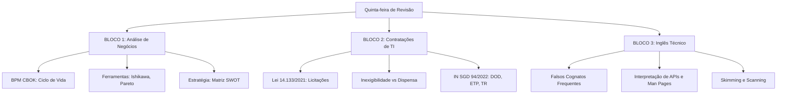

# Guia de Estudos Definitivo — Quinta-feira 18/06/2026
## Semana 5 | Dia 32 | TJ-CE 2026 (Analista TI - Sistemas)
### Foco Absoluto: Análise de Negócios, Contratações de TI e Inglês Técnico

---

> ⚠️ **Atenção (Fase 2 - Revisão Ativa):** Hoje entraremos na "zona do Direito" misturada com TI. A Nova Lei de Licitações (14.133) e a Instrução Normativa 94/2022 são leituras áridas, mas indispensáveis. Em compensação, fecharemos com Inglês Técnico, onde a banca testa seu nível de interpretação de Manuais e APIs. 

---

## 🗺️ Mapa de Estudos do Dia

---

## ⚙️ SEÇÃO 1: Revisão Pesada — Análise de Negócios (BPM)

### 1. BPM CBOK (Ciclo de Vida)
O BPM CBOK divide a gestão por processos em áreas de conhecimento que formam um ciclo contínuo:
*   **Alinhamento Estratégico:** Entender a organização.
*   **Análise de Processos:** Entender o estado atual ("AS-IS").
*   **Desenho de Processos:** Criar o estado futuro ("TO-BE").
*   **Implementação:** Colocar o desenho em prática.
*   **Medição de Desempenho:** Acompanhar as métricas e indicadores.
*   **Transformação:** Gerar melhoria contínua.

### 2. Ferramentas da Qualidade e Gestão
A FCC adora cobrar o uso de cada ferramenta em cenários práticos:
*   **Diagrama de Ishikawa (Espinha de Peixe / Causa e Efeito):** Excelente para descobrir a **causa-raiz** de um problema envolvendo o método 6M (Máquina, Método, Material, Mão-de-obra, Medida, Meio ambiente).
*   **Gráfico de Pareto (Regra 80/20):** Usado para priorizar os problemas. (80% dos problemas vêm de 20% das causas).
*   **Matriz SWOT (FOFA):** Analisa o ambiente **Interno** (Forças e Fraquezas - sob o controle da empresa) e o ambiente **Externo** (Oportunidades e Ameaças - fora do controle da empresa).

---

## 📋 SEÇÃO 2: Contratações de TI (Lei 14.133 e IN 94/2022)

Você fará licitações de TI no TJ-CE. Isso despenca na prova!

### 1. Instrução Normativa SGD/ME nº 94/2022
A contratação de soluções de TI é dividida em 3 fases principais. Foque na fase de **Planejamento da Contratação**, que possui estes artefatos obrigatórios (Nesta ordem!):
1.  **DOD (Documento de Oficialização da Demanda):** O setor requisitante fala "Eu preciso disso".
2.  **ETP (Estudo Técnico Preliminar):** A TI analisa o mercado e comprova se a contratação é viável e qual é a melhor solução.
3.  **TR (Termo de Referência):** É o detalhamento técnico do que será comprado. O "caderno de encargos" que vai para o edital.

### 2. Nova Lei de Licitações (14.133/2021)
*   **Modalidades de Licitação:** Pregão (obrigatório para bens e serviços comuns), Concorrência, Concurso, Leilão, e o grande estreante **Diálogo Competitivo** (para inovações tecnológicas complexas).
*   *Pegadinha:* Tomada de Preços e Convite **NÃO EXISTEM MAIS** na nova lei.
*   **Inexigibilidade vs Dispensa:**
    *   **Inexigibilidade:** Competição **Inviável**. Ex: Software exclusivo de fornecedor único.
    *   **Dispensa:** Competição Viável, mas a lei permite não licitar (Ex: compras de pequeno valor, emergências, calamidade).

---

## 🛡️ SEÇÃO 3: Inglês Técnico — Documentação e Textos

A prova de Inglês não cobra literatura de Shakespeare, mas sim jargão técnico.

### 1. Técnicas de Leitura Rápida
*   **Skimming:** Leitura superficial ("voo de pássaro") para pegar a ideia geral do texto, focando no primeiro e último parágrafo de cada bloco.
*   **Scanning:** Varredura em busca de um dado específico (um número de porta, um nome de protocolo, uma sigla), exatamente como seus olhos buscam um nome na lista telefônica.

### 2. Falsos Cognatos Perigosos (False Friends)
*   **Actually:** Na verdade (NÃO é atualmente. Atualmente = *currently*).
*   **To Pretend:** Fingir (NÃO é pretender. Pretender = *to intend*).
*   **Policy:** Política, diretriz.
*   **Deploy:** Implantar, disponibilizar (código/sistema).
*   **Deprecated:** Obsoleto, descontinuado. (O termo é super comum em documentações de APIs informando que o endpoint será removido no futuro).

---

## 🎯 SEÇÃO 4: Questões Inéditas FCC-Style Comentadas (Padrão Premium)

### Questão 1: Análise de Negócios (Ferramentas)
**(FCC - 2026 - TJ-CE - Analista de TI)** A equipe de modernização de processos da Corregedoria do Tribunal de Justiça identificou um número alarmante de devoluções e retificações em petições eletrônicas. Para conduzir reuniões com servidores buscando elencar graficamente os principais agrupamentos de motivos (como infraestrutura de rede, treinamento da mão-de-obra, método do fluxo atual, etc.) que estão originando as falhas sistêmicas, o gestor de projetos deve utilizar:

A) Diagrama de Ishikawa.
B) Gráfico de Pareto.
C) Matriz SWOT.
D) Mapa de Processos (BPMN).
E) Análise de Ponto de Função.

💡 Resolução Comentada da Questão 1

**Gabarito Correto: A**

**Justificativa:** O cenário descreve a busca pelas causas-raiz que estão gerando um efeito ("falhas sistêmicas"), utilizando o agrupamento de motivos por categorias como mão-de-obra, método e infraestrutura (referência aos métodos "6M"). A ferramenta visual clássica e perfeita para essa dinâmica é o Diagrama de Ishikawa (também conhecido como diagrama de Causa e Efeito ou Espinha de Peixe).

**Erro das Alternativas Falsas:**
*   **B:** Pareto prioriza os problemas em um gráfico de barras decrescente (80/20), mas não serve para agrupar e debater graficamente a "raiz" das causas.
*   **C:** A Matriz SWOT analisa o cenário estratégico da organização frente ao mercado (Forças/Fraquezas/Oportunidades/Ameaças).
*   **D:** O mapa de processos em BPMN desenha a modelagem de execução das tarefas, não serve para tempestade de ideias (brainstorming) sobre as raízes de um defeito específico.
*   **E:** Análise de Ponto de Função é uma técnica para medir o tamanho/esforço do desenvolvimento de software a partir da visão do usuário.

### Questão 2: Contratações (IN SGD 94/2022 e Licitações)
**(FCC - 2026 - TJ-CE - Analista de TI)** Um setor requisitante demandou a compra de um software extremamente inovador para uso do Tribunal. Durante o planejamento da contratação da Solução de TI, sob a égide da IN SGD/ME nº 94/2022, a área de TI iniciou a etapa que visa avaliar os custos da contratação, levantar o panorama do mercado e evidenciar formalmente qual modelo de prestação de serviço atende à necessidade com maior eficiência econômica. Este documento obrigatório é denominado:

A) Estudo Técnico Preliminar (ETP).
B) Documento de Oficialização de Demanda (DOD).
C) Termo de Referência (TR).
D) Plano Diretor de TI (PDTI).
E) Mapa de Gerenciamento de Riscos (MGR).

💡 Resolução Comentada da Questão 2

**Gabarito Correto: A**

**Justificativa:** O Estudo Técnico Preliminar (ETP) é o artefato produzido na etapa de Planejamento da Contratação que tem como propósito justificar a viabilidade técnica e econômica da contratação. É no ETP que se mapeia o mercado, levantam-se estimativas preliminares de custo e definem-se as possíveis soluções, escolhendo aquela com a melhor relação custo-benefício.

**Erro das Alternativas Falsas:**
*   **B:** O DOD (Documento de Oficialização da Demanda) é um documento mais simples, feito antes do ETP, pelo setor requisitante (apenas para iniciar o processo declarando que a área necessita de algo).
*   **C:** O Termo de Referência (TR) é o documento final do planejamento. Ele é gerado **após** a viabilidade ser atestada no ETP. É o "caderno técnico" do edital contendo especificações exatas.
*   **D:** O PDTI é um plano estratégico institucional plurianual e de governança. Não é o artefato diário feito para aprovar a contratação viável de um sistema.
*   **E:** O MGR é um anexo obrigatório para avaliar riscos, mas o estudo de custos e viabilidade mercadológica é papel restrito do ETP.

### Questão 3: Inglês Técnico
**(FCC - 2026 - TJ-CE - Analista de TI)** Na documentação da API pública do ecossistema de dados do tribunal, encontra-se a seguinte frase na nota de atualização para a versão 3.0: 

*"The `getUserLocation` endpoint is **deprecated** and will be permanently removed in the upcoming major release. Developers must migrate their code **actually**, targeting the newly **deployed** `fetchGeoLocation` service."*

Neste contexto, os vocábulos destacados *"deprecated"*, *"actually"* e *"deployed"*, significam, respectivamente:

A) Obsoleto, atualmente, implantado.
B) Depreciado, na verdade, desenvolvido.
C) Descontinuado, na verdade, implantado.
D) Quebrado, atualmente, em fase de testes.
E) Obsoleto, de fato, compilado.

💡 Resolução Comentada da Questão 3

**Gabarito Correto: C**

**Justificativa:** O conhecimento de vocabulário técnico e falsos cognatos é vital:
1. **Deprecated:** Na computação significa que a funcionalidade está "descontinuada" / obsoleta (embora ainda possa funcionar por um curto período de graça).
2. **Actually:** É um falso cognato (False Friend) clássico. Significa "na verdade" / "de fato". (E não "atualmente"!).
3. **Deployed:** No escopo de desenvolvimento, *deploy* é colocar o sistema no ar em produção, logo, significa "implantado". 

**Erro das Alternativas Falsas:**
*   **A e D:** Ocorrem erro fatal no Falso Cognato "actually", que não significa "atualmente" (o correto para atualmente seria *currently*).
*   **B:** Usa o termo "desenvolvido" para *deployed* (*developed* seria o correto).
*   **E:** "Compilado" traduz-se para *compiled*. 

---

## 🧠 SEÇÃO 5: Flashcards de Memorização Ativa (Estilo Anki)

### Bloco 1 — Análise de Negócios
*   **Frente:** Onde e com qual propósito se utiliza a Matriz SWOT?
*   **Verso:** No planejamento estratégico. Ela contrapõe o ambiente **interno** (Forças e Fraquezas, sobre o qual a empresa tem controle) ao ambiente **externo** (Oportunidades e Ameaças, cenários mercadológicos fora do controle).

### Bloco 2 — Licitações
*   **Frente:** Uma fabricante de banco de dados patenteou e é fornecedora exclusiva mundial de um software hipervisor. O Tribunal deseja comprar esse sistema, mas apenas a própria fabricante o vende. Isso é um cenário de Dispensa ou Inexigibilidade de Licitação?
*   **Verso:** **Inexigibilidade de Licitação**. A Inexigibilidade ocorre quando há INVIABILIDADE de competição (fornecedor único/exclusivo). A Dispensa ocorre quando a competição é viável, mas a lei isenta o procedimento (ex: pequeno valor).

### Bloco 3 — Inglês Técnico
*   **Frente:** Qual a diferença entre leitura tipo Skimming e Scanning?
*   **Verso:** Skimming é a leitura "por cima" para pegar o tom e a **ideia principal** do texto. Scanning é "varrer" o texto em busca de uma **informação exata e pontual** (um número, data ou nome).

---

## 🏆 Roteiro de Estudos Sugerido para Hoje (18/06/2026)

1.  **Manhã (Bloco 1 - 2.5h):** Revisão de Processos. Pegue uma folha em branco, divida no meio, desenhe o Ciclo CBOK de um lado e coloque uma tabela SWOT do outro. Entenda as características da Espinha de Peixe vs Gráfico de Pareto.
2.  **Tarde (Bloco 2 - 2.5h):** Hora pesada das Normativas. Acesse seu resumo da IN 94/2022 e escreva, cronologicamente, o fluxo: DOD (Necessidade) -> ETP (Viabilidade) -> MGR (Riscos) -> TR (Especificação). Releia os casos da 14.133 onde a licitação é inexigível.
3.  **Noite (Bloco 3 - 2h):** Inglês. Abra a lista dos 30 principais falsos cognatos da Língua Inglesa. Decore `Actually`, `Pretend`, `Parents` (pais, não parentes), e estude vocabulário técnico de redes/código.
4.  **Treinamento Insano:** Daqui a pouco eu injetarei no seu simulador o *Megapack de 75 Questões FCC Premium* de hoje. Quando elas chegarem, sente e resolva como se fosse a prova!

Respire fundo, pois hoje a prova testará sua versatilidade entre Direito, Gestão e Idiomas. 🚀
