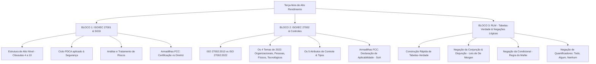

# Guia de Estudos Definitivo — Terça-feira 19/05/2026
## Semana 1 | Dia 4 | TJ-CE 2026 (Analista TI - Sistemas)
### Foco Absoluto: Banca FCC — Doutrina, Detalhes Ocultos, Pegadinhas e Casos Práticos

---

## 🗺️ Mapa de Estudos do Dia



---

## 🛡️ SEÇÃO 1: Segurança da Informação — ABNT NBR ISO/IEC 27001

A **ISO/IEC 27001** é o padrão internacional de referência para **Sistemas de Gestão de Segurança da Informação (SGSI)**. A banca FCC cobra de forma rigorosa a **estrutura normativa**, o papel da liderança, as etapas de gestão de riscos e a aplicação do ciclo **PDCA** (Plan-Do-Check-Act) neste contexto.

### 1. Estrutura de Alto Nível (Harmonized Structure / Anexo SL)

A ISO 27001 adota a estrutura harmonizada comum a todas as normas de sistemas de gestão ISO (como a ISO 9001 e ISO 14001). Isso facilita a integração de múltiplos sistemas de gestão. 

A norma divide-se em **seções introdutórias** (0 a 3) e **requisitos auditáveis** (4 a 10). A organização **só pode se certificar** se cumprir integralmente os requisitos das seções 4 a 10.

```
┌─────────────────────────────────────────────────────────────────────────┐
│                    ISO 27001: REQUISITOS DO SGSI                        │
└────────────────────────────────────┬────────────────────────────────────┘
         ┌───────────────────────────┼───────────────────────────┐
┌────────▼────────┐         ┌────────▼────────┐         ┌────────▼────────┐
│   4. Contexto   │         │  5. Liderança   │         │ 6. Planejamento │
│ • Partes Inter. │         │ • Compromisso   │         │ • Riscos & Opps │
│ • Escopo SGSI   │         │ • Política Seg. │         │ • Obj. de Seg.  │
└─────────────────┘         └─────────────────┘         └─────────────────┘
         ┌───────────────────────────┼───────────────────────────┐
┌────────▼────────┐         ┌────────▼────────┐         ┌────────▼────────┐
│    7. Apoio     │         │  8. Operação    │         │  9. Avaliação   │
│ • Competência   │         │ • Planejamento  │         │ • Aud. Interna  │
│ • Comunicação   │         │ • Trat. Riscos  │         │ • Anál. Crítica │
└─────────────────┘         └─────────────────┘         └─────────────────┘
                                     │
                            ┌────────▼────────┐
                            │  10. Melhoria   │
                            │ • Não Conformi. │
                            │ • Melh. Contínua│
                            └─────────────────┘
```

#### Análise Detalhada dos Requisitos Auditáveis (Cláusulas 4 a 10):

*   **Cláusula 4: Contexto da Organização:** A organização deve determinar as questões externas e internas relevantes, identificar as **partes interessadas** e suas necessidades, e definir de forma inequívoca o **Escopo do SGSI** (que não precisa englobar toda a empresa, podendo ser restrito a um departamento ou processo de negócio).
*   **Cláusula 5: Liderança:** A alta direção deve demonstrar liderança e comprometimento, estabelecendo a **Política de Segurança da Informação** e atribuindo papéis, responsabilidades e autoridades organizacionais.
*   **Cláusula 6: Planejamento:** Foco nas ações para abordar riscos e oportunidades associados à segurança. Aqui se define a metodologia de **Avaliação de Riscos** e o estabelecimento dos objetivos de segurança da informação.
*   **Cláusula 7: Apoio:** Define os recursos necessários para o SGSI, incluindo a **competência** dos envolvidos, a **conscientização** (awareness), a **comunicação** interna/externa e o controle da **informação documentada** (criação, atualização e controle de documentos).
*   **Cláusula 8: Operação:** Execução prática do que foi planejado. Inclui a realização da avaliação de riscos de segurança da informação em intervalos planejados ou quando ocorrerem mudanças significativas, bem como a implementação do **Plano de Tratamento de Riscos**.
*   **Cláusula 9: Avaliação de Desempenho:** Monitoramento, medição, análise e avaliação da eficácia do SGSI. Exige a realização de **Auditorias Internas** periódicas e a **Análise Crítica pela Direção** (reunião da alta liderança para revisar o sistema).
*   **Cláusula 10: Melhoria:** Reação a não conformidades, implementação de ações corretivas e promoção da **melhoria contínua** do SGSI.

---

### 2. O Ciclo PDCA no SGSI (Mapeamento Clássico de Processos)

Embora a versão mais recente da ISO 27001 tenha flexibilizado a menção explícita ao PDCA no texto principal, a FCC ainda adora cobrar o mapeamento lógico das cláusulas sobre o ciclo **PDCA** (Plan-Do-Check-Act). Memorize esta correlação exata:

```
        PLAN (Planejar)                         DO (Executar)
┌──────────────────────────────┐       ┌──────────────────────────────┐
│  • Estabelecer o escopo,     │       │  • Implementar a Política    │
│    objetivos e processos do  │ ────> │    de Segurança.             │
│    SGSI.                     │       │  • Executar o Plano de       │
│  • Realizar Análise de Risco.│       │    Tratamento de Riscos.     │
└──────────────────────────────┘       └──────────────────────────────┘
               ▲                                      │
               │                                      │
               │                                      ▼
        ACT (Agir/Melhorar)                     CHECK (Verificar)
┌──────────────────────────────┐       ┌──────────────────────────────┐
│  • Implementar melhorias     │       │  • Monitorar e medir o       │
│    contínuas no SGSI.        │ <──── │    desempenho dos processos. │
│  • Tomar ações corretivas e  │       │  • Realizar Auditorias       │
│    preventivas baseadas.     │       │    Internas e Análises.      │
└──────────────────────────────┘       └──────────────────────────────┘
```

*   **PLAN (Planejar - Concepção):** Estabelecer a política, os objetivos, processos e procedimentos do SGSI relevantes para gerenciar riscos. *Cláusulas associadas: 4, 5, 6 e 7.*
*   **DO (Executar - Implementação):** Implementar e operar a política do SGSI, controles, processos e procedimentos. *Cláusula associada: 8.*
*   **CHECK (Verificar - Monitoramento):** Avaliar e medir o desempenho do processo em relação à política do SGSI, objetivos e experiência prática, e relatar os resultados para a liderança. *Cláusula associada: 9.*
*   **ACT (Agir - Correção/Melhoria):** Executar ações corretivas e preventivas, baseadas nos resultados da auditoria interna e da revisão pela gerência, para alcançar a melhoria contínua. *Cláusula associada: 10.*

---

### 3. O Fluxo de Análise e Tratamento de Riscos (O coração do SGSI)

Para a FCC, você deve saber a diferença exata entre as etapas de gestão de riscos:

1.  **Identificação de Riscos:** Mapear quais eventos poderiam causar a perda de confidencialidade, integridade ou disponibilidade de ativos dentro do escopo do SGSI. Identificar os donos dos riscos (*risk owners*).
2.  **Análise de Riscos:** Estimar a probabilidade de ocorrência do evento e o impacto potencial nos negócios.
3.  **Avaliação de Riscos:** Comparar os resultados da análise de riscos com os critérios de risco estabelecidos pela organização para determinar se o risco é aceitável ou se exige tratamento.
4.  **Tratamento de Riscos:** Escolher uma opção de tratamento de risco. A norma prevê quatro estratégias fundamentais:
    *   **Mitigar/Modificar (Reduzir):** Aplicar controles de segurança (geralmente os do Anexo A) para diminuir a probabilidade ou o impacto do risco.
    *   **Evitar:** Alterar as atividades da empresa para eliminar a fonte do risco (ex.: deixar de coletar dados altamente sensíveis).
    *   **Compartilhar/Transferir:** Compartilhar o risco com terceiros (ex.: contratação de seguros, terceirização de infraestrutura).
    *   **Reter (Aceitar):** Decisão consciente de conviver com o risco sem controles adicionais, desde que esteja dentro dos limites aceitáveis e seja aprovado pelos donos dos riscos.

> [!IMPORTANT]
> **A Armadilha da Declaração de Aplicabilidade (Statement of Applicability - SoA):**
> A SoA é um documento obrigatório gerado na Cláusula 6. Ela deve listar:
> 1. Quais controles do Anexo A foram selecionados para mitigação dos riscos da organização.
> 2. A justificativa para a inclusão de tais controles.
> 3. Se eles já estão implementados ou não.
> 4. **A justificativa para a exclusão** de qualquer controle do Anexo A. (A FCC ama cobrar que as exclusões devem ser formalmente justificadas na SoA).

---

### 🚨 Pegadinhas Clássicas da FCC sobre a ISO 27001

1.  **Afirmar que o SGSI visa eliminar 100% dos riscos da organização.**
    *   *A Realidade:* Segurança absoluta não existe. O objetivo do SGSI é gerenciar, mitigar e manter os riscos em um nível aceitável estabelecido pelo apetite de risco da organização.
2.  **Dizer que a ISO 27001 define controles técnicos detalhados sobre como configurar um firewall ou banco de dados.**
    *   *A Realidade:* A ISO 27001 é conceitual e orientada a processos. Ela diz *o que* deve ser feito (ex.: "implementar controle de acesso"), mas não dita ferramentas específicas nem a forma de implementação tecnológica.
3.  **Inversão conceitual entre Avaliação de Riscos (Risk Assessment) e Tratamento de Riscos (Risk Treatment).**
    *   *Posicionamento de prova:* O *Risk Assessment* compreende a tríade: **Identificação + Análise + Avaliação** de riscos. O *Risk Treatment* ocorre de forma subsequente, aplicando as decisões de mitigação, retenção, transferência ou evasão.

---

## 🔐 SEÇÃO 2: Segurança da Informação — ABNT NBR ISO/IEC 27002

Se a ISO 27001 estabelece os **requisitos obrigatórios** para estruturar um SGSI, a **ISO/IEC 27002** funciona como um **guia prático de diretrizes**, detalhando as melhores práticas para a implementação dos controles de segurança listados no Anexo A da ISO 27001.

> [!WARNING]
> **ATENÇÃO EXTREMA: A Atualização da ISO 27002 (2013 vs. 2022)**
> A FCC adora cobrar a estrutura organizacional da norma. Você deve dominar tanto o padrão antigo (2013), que ainda assombra muitas questões antigas, quanto a nova arquitetura moderna de 2022!

### 1. Comparação Estrutural de Alto Nível

| Característica | ISO/IEC 27002:2013 (Versão Anterior) | ISO/IEC 27002:2022 (Versão Atual) |
|---|---|---|
| **Organização** | **14 Domínios** (Seções A.5 a A.18) | **4 Temas / Categorias** (Cláusulas 5 a 8) |
| **Total de Controles** | 114 Controles | 93 Controles (vários foram fundidos) |
| **Foco Estrutural** | Baseado no ciclo de vida de ativos e TI | Baseado em categorias holísticas de controle |
| **Novidades** | - | Introdução de **Atributos de Controle** (metadados) |

---

### 2. A Estrutura Moderna da ISO/IEC 27002:2022 (Os 4 Temas)

Na versão de 2022, a norma simplificou os controles, agrupando os 93 itens em apenas **4 temas ou categorias**. Você deve memorizar a função e exemplos de cada um deles:

```
                  ┌──────────────────────────────────────────┐
                  │            ISO 27002:2022 TEMAS          │
                  └────────────────────┬─────────────────────┘
         ┌─────────────────────────────┼─────────────────────────────┐
┌────────▼────────┐           ┌────────▼────────┐           ┌────────▼────────┐
│ ORGANIZACIONAIS │           │   DE PESSOAS    │           │    FÍSICOS      │
│ (Cláusula 5)    │           │ (Cláusula 6)    │           │ (Cláusula 7)    │
│ • Políticas     │           │ • Contratação   │           │ • Perímetros    │
│ • Gestão Ativos │           │ • Termos de Uso │           │ • Barreiras     │
│ • Relac. Fornec.│           │ • Home Office   │           │ • Facilities    │
└─────────────────┘           └─────────────────┘           └─────────────────┘
                                       │
                              ┌────────▼────────┐
                              │  TECNOLÓGICOS   │
                              │ (Cláusula 8)    │
                              │ • Criptografia  │
                              │ • Logs/Backup   │
                              │ • Redes/Firewall│
                              └─────────────────┘
```

#### A. Controles Organizacionais (Cláusula 5 - 37 controles)
Controles focados em governança, políticas, processos internos e conformidade jurídica da segurança da informação.
*   *Exemplos:* Políticas de segurança da informação, inventário e gestão de ativos, uso aceitável de ativos, segurança no relacionamento com fornecedores, gerenciamento de incidentes de segurança, conformidade com leis e regulamentos.

#### B. Controles de Pessoas (Cláusula 6 - 8 controles)
Controles direcionados às fases de pré-contratação, vigência e desligamento de funcionários ou prestadores de serviço.
*   *Exemplos:* Seleção de pessoal (background check), termos e condições de trabalho, conscientização, educação e treinamento em segurança, processo de desligamento ou mudança de responsabilidade, acordos de confidencialidade (NDAs).

#### C. Controles Físicos (Cláusula 7 - 14 controles)
Controles voltados para a proteção do perímetro físico das instalações da organização contra acessos não autorizados, desastres naturais ou sabotagem.
*   *Exemplos:* Perímetros de segurança física (muros, catracas), controles de entrada física, segurança de escritórios, salas e instalações, monitoramento físico de segurança, descarte seguro de ativos físicos, segurança do cabeamento de energia e telecomunicações.

#### D. Controles Tecnológicos (Cláusula 8 - 34 controles)
Controles aplicados diretamente nos sistemas de informação, redes, softwares e hardwares da infraestrutura corporativa.
*   *Exemplos:* Autenticação segura (senhas, MFA), controle de privilégios de acesso, uso de criptografia, segurança em redes (firewalls, segmentação), prevenção contra códigos maliciosos (antivírus), cópias de segurança (backup), registro de eventos (logs e auditoria de sistemas), desenvolvimento seguro de software.

---

### 3. O Sistema de Atributos da Versão 2022 (Altamente Cobrado!)

A versão de 2022 introduziu o conceito de **Atributos**, que funcionam como "metadados" para cada controle. Isso permite que a organização filtre e organize os controles sob diferentes visões. A norma traz cinco tipos de atributos:

1.  **Tipo de Controle (Control Type):**
    *   **Preventivo:** Evita que um incidente de segurança ocorra (ex.: criptografia, portas trancadas).
    *   **Detectivo:** Identifica quando um incidente ocorreu ou está ocorrendo (ex.: alarmes de intrusão, logs de auditoria).
    *   **Corretivo:** Restaura o estado normal após um incidente (ex.: restauração de backup, planos de contingência).
2.  **Propriedades de Segurança da Informação (Information Security Properties):**
    *   Identifica se o controle apoia a **Confidencialidade**, a **Integridade** ou a **Disponibilidade** (ou combinações delas).
3.  **Conceitos de Cibersegurança (Cybersecurity Concepts):**
    *   Mapeia o controle em relação ao framework NIST: **Identificar, Proteger, Detectar, Responder e Recuperar**.
4.  **Capacidades Operacionais (Operational Capabilities):**
    *   Filtra os controles pela área operacional responsável (ex.: Governança, Proteção de Informação, Segurança de Aplicação, Continuidade).
5.  **Domínios de Segurança (Security Domains):**
    *   Divide os controles in quatro categorias gerais de atuação: **Governança e Ecossistema, Proteção, Defesa e Resiliência**.

---

### 🚨 Pegadinhas Clássicas da FCC sobre a ISO 27002

1.  **Afirmar que uma empresa pode ser auditada e certificada "Selo ISO 27002".**
    *   *A Armadilha:* O candidato confunde as normas.
    *   *Gabarito de Prova:* A ISO 27002 é um **código de prática/diretriz**. Ela não contém requisitos auditáveis do tipo "a organização deve...". A certificação oficial é concedida **exclusivamente com base na ISO/IEC 27001**.
2.  **Inverter os conceitos de controles Físicos e Organizacionais.**
    *   *Exemplo:* Questões que classificam a trituração física de papel confidencial como "controle tecnológico" ou "organizacional".
    *   *Gabarito:* O descarte de documentos físicos em trituradoras é classificado como um **Controle Físico** (Cláusula 7 - Destruição Segura de Informações).

---

## ✍️ SEÇÃO 3: Raciocínio Lógico-Matemático — Tabelas-Verdade & Negações Lógicas

A FCC adora testar a capacidade do candidato em aplicar as **regras de negação de conectivos compostos** e a análise semântica das proposições na linguagem natural. Não use sua "intuição em português"; use as **regras lógicas formais**.

### 1. Negação da Conjunção e Disjunção — As Leis de De Morgan

A negação de proposições compostas unidas por "e" ($\land$) ou por "ou" ($\lor$) deve seguir estritamente as regras de **Augustus De Morgan**.

$$\text{1ª Lei de De Morgan: } \neg(p \land q) \equiv \neg p \lor \neg q$$
> **Tradução:** Para negar uma conjunção ("E"), você deve **negar ambas as proposições simples** e trocar o conectivo "E" pelo conectivo **"OU"**.

$$\text{2ª Lei de De Morgan: } \neg(p \lor q) \equiv \neg p \land \neg q$$
> **Tradução:** Para negar uma disjunção ("OU"), você deve **negar ambas as proposições simples** e trocar o conectivo "OU" pelo conectivo **"E"**.

#### 💡 Exemplos de Provas da FCC traduzidos na Prática:

*   **Frase Original:** *"O servidor de banco de dados está online **e** o backup foi concluído."* ($p \land q$)
    *   *Como a FCC tentará te enganar:* *"O servidor de banco de dados não está online e o backup não foi concluído."* (A banca manteve o conectivo "e").
    *   *Negação Correta:* **"O servidor de banco de dados NÃO está online OU o backup NÃO foi concluído."** ($\neg p \lor \neg q$)
*   **Frase Original:** *"Estudo para o TJ-CE **ou** vou à praia."* ($r \lor s$)
    *   *Negação Correta:* **"NÃO estudo para o TJ-CE E NÃO vou à praia."** ($\neg r \land \neg s$)

---

### 2. Negação da Proposição Condicional (O queridinho da FCC!)

A condicional ($p \rightarrow q$) possui uma regra de negação totalmente contra-intuitiva em português. Memorize a regra prática do **MaNe** (Mantém a primeira **E** Nega a segunda).

$$\neg(p \rightarrow q) \equiv p \land \neg q$$

> **Regra de Ouro:** A negação de uma condicional ("Se... então") **nunca será outra condicional**! A negação resulta em uma conjunção ("E") na qual a primeira parte é mantida e a segunda parte é negada.

#### 💡 Caso Prático de Prova:
*   **Frase Original:** *"Se o processo for digitalizado, então o julgamento será célere."* ($P \rightarrow J$)
    *   *Como a FCC tentará te enganar:* *"Se o processo não for digitalizado, então o julgamento não será célere."* (NUNCA negue um "Se... então" com outro "Se... então"!).
    *   *Negação Correta:* **"O processo foi digitalizado E o julgamento NÃO foi célere."** ($P \land \neg J$)

---

### 3. Negação de Quantificadores Lógicos (Proposições Categóricas)

As proposições categóricas utilizam quantificadores universais (**Todo, Nenhum**) ou quantificadores particulares/existenciais (**Algum, Pelo Menos Um, Existe**).

```
   Quantificador Universal                            Quantificador Particular
┌───────────────────────────┐                       ┌───────────────────────────┐
│     TODO (Afirmativo)     │ ◄── Negação Mútua ──> │    ALGUM NÃO (Existencial)│
│     NENHUM (Negativo)     │ ◄── Negação Mútua ──> │    ALGUM SIM (Existencial)│
└───────────────────────────┘                       └───────────────────────────┘
```

#### Regras Rígidas de Negação de Quantificadores:

1.  **Como negar o "TODO" (Todo A é B):**
    *   *A Armadilha:* O candidato acha que a negação de "Todo político é corrupto" é "Nenhum político é corrupto". (ERRADO!).
    *   *A Regra:* Para quebrar a verdade de que "Todo A é B", basta encontrar **pelo menos um** elemento A que não seja B.
    *   *Fórmula:* $\neg(\text{Todo A é B}) \equiv \text{Algum A NÃO é B} \equiv \text{Pelo menos um A NÃO é B} \equiv \text{Existe A que NÃO é B}$.
2.  **Como negar o "NENHUM" (Nenhum A é B):**
    *   *A Regra:* Para quebrar a afirmação de que nada se relaciona, basta provar que existe pelo menos uma relação ativa.
    *   *Fórmula:* $\neg(\text{Nenhum A é B}) \equiv \text{Algum A é B} \equiv \text{Pelo menos um A é B} \equiv \text{Existe A que é B}$.
3.  **Como negar o "ALGUM" (Algum A é B):**
    *   *A Regra:* Se afirmo que pelo menos um elemento cumpre a regra, a negação exige provar que nenhum deles cumpre.
    *   *Fórmula:* $\neg(\text{Algum A é B}) \equiv \text{Nenhum A é B}$.

#### Tabela Rápida de Memorização de Quantificadores:

| Proposição Original | Como Negar Corretamente | Exemplo Prático |
|---|---|---|
| **Todo** $A$ é $B$ | **Algum** $A$ **não** é $B$ | *"Todo analista é focado"* ➔ *"Algum analista não é focado"* |
| **Nenhum** $A$ é $B$ | **Algum** $A$ é $B$ | *"Nenhum processo sumiu"* ➔ *"Algum processo sumiu"* |
| **Algum** $A$ é $B$ | **Nenhum** $A$ é $B$ | *"Algum juiz errou"* ➔ *"Nenhum juiz errou"* |
| **Algum** $A$ **não** é $B$ | **Todo** $A$ é $B$ | *"Algum cabo não funciona"* ➔ *"Todo cabo funciona"* |

---

## 🎯 SEÇÃO 4: Questões Inéditas FCC-Style Comentadas Passo a Passo

### Questão 1: Segurança da Informação (ISO 27001)
**(FCC - Adaptada)** Durante a estruturação do Sistema de Gestão de Segurança da Informação (SGSI) do Tribunal de Justiça do Ceará com base na norma ABNT NBR ISO/IEC 27001:2022, o comitê de governança corporativa de TI iniciou o mapeamento dos processos de avaliação e tratamento de riscos de segurança da informação. Com base nos requisitos descritos no texto principal da referida norma, assinale a alternativa correta:

A) A definição do escopo do SGSI deve englobar obrigatoriamente a totalidade das divisões geográficas e das pessoas jurídicas da instituição, sob pena de invalidar a futura auditoria de certificação.
B) A Declaração de Aplicabilidade (SoA) é um documento opcional utilizado meramente para auditorias internas, devendo conter apenas a lista de controles que foram de fato implementados pela organização.
C) O tratamento de riscos de segurança da informação deve possuir um processo formulado para formular um plano de tratamento de risco que selecione controles apropriados do Anexo A ou de outras fontes, necessitando que as exclusões de controles do Anexo A sejam justificadas no SoA.
D) A alta direção é responsável pelo desenho das políticas de segurança, mas a atribuição de responsabilidades e autoridades pelos papéis de segurança é de competência exclusiva da auditoria externa.
E) A melhoria contínua do SGSI (Cláusula 10) deve ocorrer em periodicidade estritamente anual, sendo vedada a aplicação de ações corretivas no decorrer do ciclo operacional.

#### 💡 Resolução Comentada da Questão 1:
*   **Análise da A:** **Incorreta.** O escopo do SGSI pode ser delimitado de forma estrita de acordo com as necessidades da organização (Cláusula 4.3), não precisando ser corporativo-totalitário.
*   **Análise da B:** **Incorreta.** A SoA é um documento **obrigatório** (Cláusula 6.1.3 d) e deve listar tanto os controles incluídos (com justificativa de inclusão e status de implementação) quanto a justificativa para as **exclusões**.
*   **Análise da C:** **CORRETA.** É a literalidade da norma (Cláusula 6.1.3 d). A organização deve elaborar a Declaração de Aplicabilidade contendo os controles necessários e a respectiva justificativa para as exclusões dos controles do Anexo A.
*   **Análise da D:** **Incorreta.** A atribuição de papéis, responsabilidades e autoridades é competência e dever da **Alta Direção** da organização (Cláusula 5.3), não de auditores externos.
*   **Análise da E:** **Incorreta.** A melhoria contínua e as ações corretivas devem ocorrer de forma ágil e sempre que houver detecção de não conformidades (Cláusula 10.1), não havendo essa limitação de prazo.
*   **Gabarito correto: C.**

---

### Questão 2: Segurança da Informação (ISO 27002:2022)
**(FCC - Adaptada)** Um Analista Judiciário da área de TI do TJ-CE recebeu a incumbência de adequar as diretrizes de descarte de mídias de armazenamento físico que continham cópias descontinuadas de processos judiciais sigilosos. Sob a ótica da norma ABNT NBR ISO/IEC 27002:2022, o controle que rege o descarte ou a destruição segura de informações e mídias de armazenamento deve ser categorizado como um controle pertencente ao tema:

A) Tecnológico, dotado de atributos do tipo puramente corretivo.
B) Organizacional, voltado a garantir a integridade dos dados por meio de redundância física.
C) De Pessoas, aplicável exclusivamente a funcionários desligados da instituição.
D) Físico, tendo em vista que lida com a eliminação de mídias físicas tangíveis para prevenir o vazamento de informações.
E) Ambiental, focado no controle de temperatura de data centers.

#### 💡 Resolução Comentada da Questão 2:
*   *A Pegadinha:* O candidato desatento lê "mídias de armazenamento de computadores" e marca "Tecnológico". 
*   *A Doutrina da Norma:* Na ISO 27002:2022, o controle **7.10 (Destruição Segura de Informações)** e o controle de mídias físicas pertencem à **Cláusula 7: Controles Físicos**, visto que a proteção e destruição física de mídias tangíveis envolvem perímetros de descarte, barreiras e destruição de hardware físico antes do descarte.
*   **Gabarito correto: D.**

---

### Questão 3: Raciocínio Lógico-Matemático (Negação de Proposição Composta)
**(FCC - Adaptada)** Um escrivão judiciário anotou a seguinte proposição no livro de registros diários da comarca: 

> *"Se o réu foi citado eletronicamente, então ele apresentou a defesa tempestiva e a audiência foi marcada."*

A negação lógica correta dessa afirmação, expressa em linguagem natural, está indicada em:

A) Se o réu não foi citado eletronicamente, então ele não apresentou a defesa tempestiva ou a audiência não foi marcada.
B) O réu foi citado eletronicamente, e ele não apresentou a defesa tempestiva ou a audiência não foi marcada.
C) O réu foi citado eletronicamente, e ele não apresentou a defesa tempestiva e a audiência não foi marcada.
D) Se o réu foi citado eletronicamente, então ele não apresentou a defesa tempestiva ou a audiência não foi marcada.
E) O réu não foi citado eletronicamente, e ele apresentou a defesa tempestiva e a audiência foi marcada.

#### 💡 Resolução Comentada da Questão 3:
Vamos traduzir a proposição original para a linguagem simbólica:
*   $C$: *"O réu foi citado eletronicamente."*
*   $D$: *"Ele apresentou a defesa tempestiva."*
*   $A$: *"A audiência foi marcada."*
*   **Proposição Original:** $C \rightarrow (D \land A)$

Queremos calcular a **negação lógica** dessa proposição:
$$\neg [C \rightarrow (D \land A)]$$

Aplicamos a regra de negação da condicional (Regra do **MaNe** - Mantém a primeira parte e nega a segunda, trocando pelo conectivo "E"):
$$\neg [C \rightarrow (D \land A)] \equiv C \land \neg(D \land A)$$

Agora, aplicamos a **1ª Lei de De Morgan** para negar o parênteses da conjunção $\neg(D \land A)$:
$$\neg(D \land A) \equiv \neg D \lor \neg A$$

Substituindo de volta na nossa equivalência:
$$\text{Negação Final: } C \land (\neg D \lor \neg A)$$

Traduzindo de volta para a linguagem natural:
*   $C$: *"O réu foi citado eletronicamente"*
*   $\land$: *", e"*
*   $(\neg D \lor \neg A)$: *"ele NÃO apresentou a defesa tempestiva OU a audiência NÃO foi marcada."*

Logo, a negação perfeita é: **"O réu foi citado eletronicamente, e ele não apresentou a defesa tempestiva ou a audiência não foi marcada."**
*   **Gabarito correto: B.**

---

## 🧠 SEÇÃO 5: Flashcards de Memorização Ativa (Estilo Anki)

### Bloco 1 — ISO/IEC 27001

*   **Frente (Pergunta):** Quais as seções da ISO/IEC 27001:2022 contêm os requisitos auditáveis que uma organização precisa cumprir para obter a certificação?
*   **Verso (Resposta):** Seções 4 (Contexto), 5 (Liderança), 6 (Planejamento), 7 (Apoio), 8 (Operação), 9 (Avaliação de Desempenho) e 10 (Melhoria). As seções 0 a 3 são introdutórias e informativas.

*   **Frente (Pergunta):** Onde devem ser registradas e justificadas as exclusões de controles do Anexo A do SGSI de uma organização?
*   **Verso (Resposta):** Na Declaração de Aplicabilidade (Statement of Applicability - SoA), documento obrigatório gerado na cláusula de Planejamento (6.1.3 d).

*   **Frente (Pergunta):** O que diferencia a natureza jurídica e prática da norma ISO 27001 em relação à ISO 27002?
*   **Verso (Resposta):** A ISO 27001 estabelece os **requisitos auditáveis** para implementação e certificação do SGSI. A ISO 27002 é um **código de prática/diretriz** que detalha a aplicação dos controles, mas **não é certificável por si só**.

---

### Bloco 2 — ISO/IEC 27002:2022

*   **Frente (Pergunta):** Como estão agrupados os 93 controles de segurança da ISO/IEC 27002:2022 (quais são os 4 temas)?
*   **Verso (Resposta):** 1. Controles Organizacionais (Cláusula 5)
2. Controles de Pessoas (Cláusula 6)
3. Controles Físicos (Cláusula 7)
4. Controles Tecnológicos (Cláusula 8)

*   **Frente (Pergunta):** Quais são os 3 atributos possíveis de um controle da ISO 27002:2022 quanto ao seu "Tipo de Controle" (Control Type)?
*   **Verso (Resposta):** 1. Preventivo (evita ocorrência)
2. Detectivo (identifica ocorrência)
3. Corretivo (corrige e mitiga danos após a ocorrência)

*   **Frente (Pergunta):** O controle de "Segurança em Trabalho Remoto (Teletrabalho/Home Office)" pertence a qual categoria temática da ISO 27002:2022?
*   **Verso (Resposta):** Controles de Pessoas (Cláusula 6).

---

### Bloco 3 — RLM (Negações Lógicas)

*   **Frente (Pergunta):** Qual a fórmula de negação de uma conjunção $\neg(p \land q)$ e de uma disjunção $\neg(p \lor q)$ pelas Leis de De Morgan?
*   **Verso (Resposta):** 
$\neg(p \land q) \equiv \neg p \lor \neg q$ (nega as duas partes e troca o "E" por "OU")
$\neg(p \lor q) \equiv \neg p \land \neg q$ (nega as duas partes e troca o "OU" por "E")

*   **Frente (Pergunta):** Como se faz para negar logicamente uma proposição condicional $p \rightarrow q$?
*   **Verso (Resposta):** Aplica-se a regra do MaNe: Mantém o antecedente ($p$) **E** nega o consequente ($\neg q$). A negação de uma condicional resulta em uma conjunção: $p \land \neg q$.

*   **Frente (Pergunta):** Qual a regra lógica para negar a proposição universal afirmativa "Todo A é B"?
*   **Verso (Resposta):** Troca-se o "Todo" por um quantificador existencial negado. A negação correta é: "Algum A não é B" (ou "Existe A que não é B" / "Pelo menos um A não é B"). **Nunca** se nega com "Nenhum".

---

## 🏆 Roteiro de Estudos Sugerido para Amanhã (19/05/2026)

1.  **Manhã (Bloco 1 - 2h):** Estude e revise a **Seção 1 (ISO 27001)**. Foque nas cláusulas auditáveis (4 a 10) e entenda o funcionamento do PDCA no SGSI. Escreva em um papel de rascunho o fluxo completo da análise de riscos e a estrutura do SoA.
2.  **Tarde (Bloco 2 - 2h):** Domine a **Seção 2 (ISO 27002:2022)**. Faça um mapeamento mental rápido dividindo os controles nos 4 grandes temas. Destaque quais controles antigos de 2013 foram consolidados no padrão moderno de 2022.
3.  **Noite (Bloco 3 - 1h30):** Pratique a **Seção 3 (RLM - Negações Lógicas)**. Escreva as tabelas de negação, as Leis de De Morgan e a regra do MaNe. Resolva pelo menos 10 negações textuais escritas à mão para treinar a transposição lógica rápida.
4.  **Bateria de Questões (1h30):** Acesse seu sistema de questões preferido e filtre:
    *   15 Questões FCC: Segurança da Informação (ISO 27001).
    *   15 Questões FCC: Segurança da Informação (ISO 27002).
    *   15 Questões FCC: Raciocínio Lógico (Tabelas-Verdade e Negações).
5.  **Revisão e Anki:** Alimente seu Anki com os flashcards da Seção 5 e guarde suas estatísticas no edital verticalizado.
