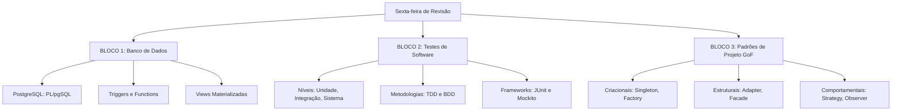

# Guia de Estudos Definitivo — Sexta-feira 19/06/2026
## Semana 5 | Dia 33 | TJ-CE 2026 (Analista TI - Sistemas)
### Foco Absoluto: PostgreSQL, Testes de Software e Padrões GoF

---

> ⚠️ **Atenção (Fase 2 - Revisão Ativa):** Hoje a cobrança volta a ser 100% técnica de código e arquitetura. É o famoso dia "hardcore". Vamos revisar profundamente os detalhes específicos do PostgreSQL, a teoria rigorosa sobre pirâmide de testes de software e a decoreba essencial dos Padrões de Projeto do "Gang of Four" (GoF).

---

## 🗺️ Mapa de Estudos do Dia

---

## ⚙️ SEÇÃO 1: Revisão Pesada — Banco de Dados (PostgreSQL)

A FCC adora cobrar as particularidades sintáticas e de arquitetura do PostgreSQL.

### 1. PL/pgSQL e Functions
*   **PL/pgSQL:** É a linguagem procedural do PostgreSQL (similar ao PL/SQL da Oracle). Permite criar blocos de código com variáveis, laços de repetição (`FOR`, `WHILE`) e condicionais (`IF/THEN`).
*   **Functions vs Procedures:** No Postgres moderno, *Procedures* podem executar transações (`COMMIT` / `ROLLBACK`) internamente, enquanto *Functions* tradicionais não podem.

### 2. Triggers (Gatilhos)
*   **O que são:** Blocos de código executados automaticamente ANTES (`BEFORE`) ou DEPOIS (`AFTER`) ou NO LUGAR DE (`INSTEAD OF`) um comando de `INSERT`, `UPDATE` ou `DELETE` em uma tabela.
*   **Variáveis Especiais:** `NEW` (contém a nova linha sendo inserida/atualizada) e `OLD` (contém a linha antiga antes da atualização/deleção).

### 3. Views vs Materialized Views
*   **View normal:** Apenas uma consulta gravada. Sempre que você faz `SELECT * FROM view`, o banco executa a consulta por trás dela em tempo real.
*   **Materialized View:** A consulta é executada e o resultado é **salvo fisicamente** no disco. A leitura é ultrarrápida, mas se os dados base mudarem, a view materializada fica desatualizada até que você rode o comando `REFRESH MATERIALIZED VIEW`. Excelente para relatórios analíticos pesados!

---

## 📋 SEÇÃO 2: Testes de Software (Engenharia de Software)

A diferença entre acertar e errar na FCC aqui é não confundir as siglas e os níveis da pirâmide.

### 1. Níveis e Tipos de Teste
*   **Teste de Unidade (Unitário):** Testa a menor parte testável (uma função/método). Feito pelo desenvolvedor.
*   **Teste de Integração:** Testa a comunicação entre dois ou mais componentes ou módulos.
*   **Teste de Sistema:** Testa o sistema inteiro funcionando ponta-a-ponta, buscando requisitos funcionais.
*   **Teste de Aceitação:** Realizado pelo cliente/usuário final para homologar se o sistema atende ao contrato/negócio.

### 2. Abordagens de Desenvolvimento Orientado
*   **TDD (Test-Driven Development):** Escreve o teste ANTES do código. Ciclo famoso: **Red** (falha) -> **Green** (passa) -> **Refactor** (melhora o código).
*   **BDD (Behavior-Driven Development):** Focado no comportamento esperado pelo usuário. Usa linguagem natural Gherkin: *Given* (Dado que) -> *When* (Quando) -> *Then* (Então).

### 3. Frameworks Java
*   **JUnit:** O framework padrão do Java para criar e rodar os testes unitários. Usa anotações como `@Test`, `@BeforeEach`, `@AfterEach`.
*   **Mockito:** Usado para criar objetos falsos ("Mocks"). Por exemplo, em um teste unitário, você não deve acessar o banco de dados real; você usa o Mockito para fingir que o banco de dados respondeu com sucesso. (Tipos: *Dummies, Stubs, Spies, Mocks e Fakes*).

---

## 🏛️ SEÇÃO 3: Padrões de Projeto (GoF)

Decore as 3 famílias e a essência de cada padrão exigido pela banca.

### 1. Padrões Criacionais (Como criar objetos)
*   **Singleton:** Garante que uma classe tenha **apenas UMA instância** em todo o sistema (ex: conexão com banco de dados).
*   **Factory Method:** Delega às subclasses a decisão de qual objeto instanciar.
*   **Abstract Factory:** Cria famílias de objetos relacionados.
*   **Builder:** Separa a construção de um objeto complexo da sua representação (cria o objeto passo a passo).

### 2. Padrões Estruturais (Como compor classes)
*   **Adapter (Wrapper):** Converte a interface de uma classe em outra esperada pelo cliente. (Aquele adaptador de tomada de 3 pinos para 2 pinos).
*   **Facade:** Fornece uma interface única, simplificada e unificada para um subsistema muito complexo. (Um "painel central" que esconde a bagunça por trás).
*   **Decorator:** Adiciona novas responsabilidades a um objeto dinamicamente, sem alterar seu código base.

### 3. Padrões Comportamentais (Como os objetos se comunicam)
*   **Strategy:** Define uma família de algoritmos, encapsula cada um e os torna intercambiáveis (Ex: Escolher entre pagamento via Pix, Cartão ou Boleto em tempo de execução).
*   **Observer:** Define uma relação "um-para-muitos". Quando um objeto (Subject) muda de estado, todos os seus dependentes (Observers) são notificados. (Padrão de arquitetura orientada a eventos / Pub-Sub).

---

## 🎯 SEÇÃO 4: Questões Inéditas FCC-Style Comentadas (Padrão Premium)

### Questão 1: Banco de Dados (PostgreSQL)
**(FCC - 2026 - TJ-CE - Analista de TI)** Um desenvolvedor do tribunal precisa criar uma visualização de dados que agrega os pagamentos de precatórios dos últimos 10 anos. Como o tempo de processamento dessa agregação excede 40 segundos, a leitura da visualização precisa consultar dados fisicamente armazenados em disco, atualizados sob demanda através de um agendamento noturno. Para atender arquiteturalmente a esta necessidade no PostgreSQL, deve-se criar:

A) Uma Stored Procedure transacional.
B) Um Trigger do tipo AFTER SELECT.
C) Uma View simples (Standard View).
D) Uma Materialized View.
E) Uma Cursor-based Table.

💡 Resolução Comentada da Questão 1

**Gabarito Correto: D**

**Justificativa:** O enunciado descreve exatamente a função da *Materialized View* no PostgreSQL. Ela executa uma consulta lenta e pesada e salva fisicamente o resultado (cache), oferecendo leitura instantânea. Como os dados ficam salvos fisicamente, a tabela precisa ser atualizada ocasionalmente (usando `REFRESH MATERIALIZED VIEW`), o que bate exatamente com o requisito do "agendamento noturno".

**Erro das Alternativas Falsas:**
*   **A:** Uma procedure serve para executar scripts procedurais complexos com commit/rollback, não para funcionar como uma "tabela de cache de leitura".
*   **B:** Triggers disparam em operações de manipulação (Insert, Update, Delete). Não existe gatilho de operação para `SELECT`.
*   **C:** Uma View Simples não armazena dados em disco. Ela rodaria a consulta original de 40 segundos toda santa vez que alguém a acessasse.
*   **E:** O termo não constitui uma entidade nativa de cache físico no SGBD.

### Questão 2: Testes (TDD e Mockito)
**(FCC - 2026 - TJ-CE - Analista de TI)** Durante a aplicação da técnica de Test-Driven Development (TDD) para validar a classe "CalculadoraProcessuais", um programador percebeu que a classe dependia de uma API externa do Banco Central para obter cotações monetárias. Para isolar o teste unitário e garantir que a classe seja testada rapidamente sem invocar a rede real, o desenvolvedor deve injetar na classe de teste um objeto que fornece respostas pré-configuradas e simula o comportamento da API. O uso dessa abordagem através do framework Mockito caracteriza o emprego de:

A) Teste de Aceitação com Mocks.
B) Teste de Integração com Dummies.
C) Teste Unitário com Mocks/Stubs.
D) Teste de Sistema com Spies.
E) Teste de Regressão com Fakes.

💡 Resolução Comentada da Questão 2

**Gabarito Correto: C**

**Justificativa:** A técnica TDD geralmente atua na base da pirâmide (Testes Unitários). Para que um teste seja puramente "Unitário", ele não pode bater em banco de dados, disco ou rede (APIs). Para "isolar" o teste, usamos *Mocks* ou *Stubs* (objetos falsos com respostas pré-programadas). No ecossistema Java, o Mockito é o framework soberano para criar esses objetos simulados.

**Erro das Alternativas Falsas:**
*   **A e D:** Testes de Aceitação e de Sistema testam a aplicação real ponta a ponta. Não devem utilizar "objetos falsos" no lugar de integrações vitais caso queiram validar o sistema como um todo.
*   **B:** Testes de Integração existem justamente para testar a conexão REAL entre os componentes (ex: bater na API de verdade). Isolar a API invalidaria o teste de integração.
*   **E:** Testes de Regressão visam garantir que uma nova versão não quebrou algo que já funcionava; o enunciado pede algo específico sobre "isolar a rede via respostas configuradas", que define Mocks.

### Questão 3: Padrões de Projeto (GoF)
**(FCC - 2026 - TJ-CE - Analista de TI)** A equipe de arquitetura do TJ-CE desenvolveu um módulo de integração judicial que acessa uma DLL de um sistema legado altamente intrincado. Para facilitar o trabalho dos desenvolvedores front-end e isolá-los da complexidade do legado, os arquitetos criaram uma nova classe Java que expõe apenas três métodos simples, mascarando internamente as dezenas de chamadas, conversões e inicializações necessárias da DLL antiga. O padrão de projeto estrutural (GoF) empregado nesta solução é o:

A) Observer.
B) Facade (Fachada).
C) Builder.
D) Strategy.
E) Decorator.

💡 Resolução Comentada da Questão 3

**Gabarito Correto: B**

**Justificativa:** O padrão estrutural *Facade* (Fachada) tem como objetivo exatamente criar uma interface unificada, simplificada e de alto nível que esconde (mascara) a complexidade de um subsistema inteiro (no caso, a DLL intrincada). O programador chama apenas "fachada.iniciar()", e a fachada se vira para executar internamente as dezenas de códigos complexos.

**Erro das Alternativas Falsas:**
*   **A:** Observer é comportamental e lida com notificação baseada em eventos (publish/subscribe).
*   **C:** Builder é criacional, focado em instanciar um objeto complexo passo-a-passo.
*   **D:** Strategy permite escolher um algoritmo de uma família em tempo de execução, não mascarar um subsistema complexo.
*   **E:** Decorator anexa responsabilidades e recursos a um objeto dinamicamente sem alterar seu código-fonte, não focando em criar uma "interface simplificadora" para um legado.

---

## 🧠 SEÇÃO 5: Flashcards de Memorização Ativa (Estilo Anki)

### Bloco 1 — PostgreSQL
*   **Frente:** O que representam as variáveis automáticas especialíssimas `NEW` e `OLD` utilizadas dentro do bloco de código de um Trigger no PostgreSQL?
*   **Verso:** Representam os estados dos registros em uma tabela. `NEW` contém os dados da NOVA linha sendo inserida ou atualizada. `OLD` contém os dados da linha VELHA antes de ser deletada ou atualizada.

### Bloco 2 — Engenharia (Testes)
*   **Frente:** Qual é o ciclo clássico de cores e passos do TDD (Test-Driven Development)?
*   **Verso:** 1) **Red:** Escreva um teste que falha. 2) **Green:** Escreva o código mais simples possível que faça o teste passar. 3) **Refactor:** Limpe e melhore o código sem quebrar o teste.

### Bloco 3 — Arquitetura (GoF)
*   **Frente:** Qual a diferença elementar entre o padrão Adapter e o padrão Facade?
*   **Verso:** O **Adapter** faz duas interfaces incompatíveis trabalharem juntas (tradutor 1 para 1). O **Facade** define uma nova interface simplificada para esconder a complexidade de um subsistema inteiro (1 para muitos).

---

## 🏆 Roteiro de Estudos Sugerido para Hoje (19/06/2026)

1.  **Manhã (Bloco 1 - 2h):** Banco de Dados - PostgreSQL. Foque na sintaxe do PL/pgSQL. Entenda quando você deve usar uma *Materialized View* ao invés de uma view normal (para não explodir o banco de dados em relatórios do tribunal).
2.  **Tarde (Bloco 2 - 2.5h):** Testes Ágeis. Se você souber de cor a Pirâmide de Testes, as três etapas do TDD e as três etapas do BDD (Gherkin: Given-When-Then), você tem 90% das questões garantidas.
3.  **Noite (Bloco 3 - 2.5h):** Padrões GoF. Essa é a área de maior confusão. Dedique-se a diferenciar os padrões estruturais (como Adapter, Decorator e Facade). Use os flashcards para memorizar as "palavras-chave" (ex: "encapsula algoritmo" = Strategy).
4.  **Treinamento Insano:** Em breve, soltarei o *Megapack de 75 Questões FCC Premium* sobre esse conteúdo. Treine exaustivamente!

Este é o dia de fixar conceitos técnicos que garantem vantagem competitiva. Bons estudos! 🚀
