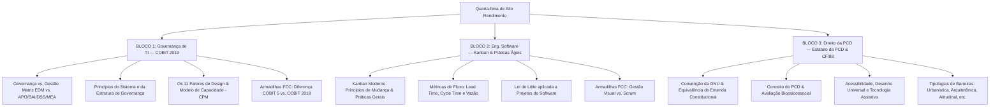

# Guia de Estudos Definitivo — Quarta-feira 20/05/2026
## Semana 1 | Dia 5 | TJ-CE 2026 (Analista TI - Sistemas)
### Foco Absoluto: Banca FCC — Doutrina, Detalhes Ocultos, Pegadinhas e Casos Práticos

---

## 🗺️ Mapa de Estudos do Dia



---

## 💼 SEÇÃO 1: Governança de TI — COBIT 2019

O **COBIT 2019** (Control Objectives for Information and Related Technologies) é o principal framework global para **Governança e Gestão corporativa de Informação e Tecnologia (I&T)**. A banca FCC cobra exaustivamente a divisão teórica entre governança e gestão, seus domínios, componentes e a grande novidade desta versão: os **Fatores de Design**.

### 1. Governança vs. Gestão: A Divisão Suprema do COBIT 2019

O COBIT 2019 estabelece uma linha divisória clara entre as atribuições de Governança e as de Gestão. Elas compreendem atividades, estruturas organizacionais e finalidades distintas:

```
┌────────────────────────────────────────────────────────────────────────┐
│                          COBIT 2019 CORE MODEL                         │
└───────────────────────────────────┬────────────────────────────────────┘
         ┌──────────────────────────┴──────────────────────────┐
┌────────▼────────┐                                   ┌────────▼────────┐
│    GOVERNANÇA   │                                   │     GESTÃO      │
│  (Nível Board)  │                                   │(Executivos/Ger.)│
│   • Avaliar     │                                   │   • Planejar    │
│   • Direcionar  │                                   │   • Construir   │
│   • Monitorar   │                                   │   • Executar    │
│   (Sigla: EDM)  │                                   │   • Monitorar   │
└────────┬────────┘                                   └────────┬────────┘
         │                                                     │
┌────────▼────────┐                                   ┌────────▼────────┐
│     DOMÍNIO     │                                   │    DOMÍNIOS     │
│  • EDM          │                                   │  • APO  • BAI   │
│  (5 processos)  │                                   │  • DSS  • MEA   │
└─────────────────┘                                   └─────────────────┘
```

#### Governança (Governance):
É de responsabilidade da alta administração (Conselho de Administração / Board). 
*   **Função:** Avaliar as necessidades dos stakeholders, definir o direcionamento estratégico através de prioridades e tomada de decisão, e monitorar o desempenho e a conformidade em relação ao direcionamento acordado.
*   **Domínio:** **EDM** (Evaluate, Direct and Monitor / Avaliar, Direcionar e Monitorar). Contém 5 objetivos de governança.

#### Gestão (Management):
É de responsabilidade da gerência executiva, sob a liderança do CEO ou CIO.
*   **Função:** Planejar, construir, executar e monitorar atividades em alinhamento com o direcionamento definido pela governança para atingir os objetivos corporativos.
*   **Domínios (4 domínios):**
    1.  **APO** (Align, Plan and Organize / Alinhar, Planejar e Organizar): Foco na estratégia e na estruturação de TI. (14 objetivos).
    2.  **BAI** (Build, Acquire and Implement / Construir, Adquirir e Implementar): Foco na entrega e desenvolvimento de soluções de TI. (11 objetivos).
    3.  **DSS** (Deliver, Service and Support / Entregar, Servir e Suportar): Foco na operação física e suporte aos serviços de TI. (6 objetivos).
    4.  **MEA** (Monitor, Evaluate and Assess / Monitorar, Avaliar e Medir): Foco no monitoramento de desempenho e conformidade interna. (4 objetivos).

No total, o modelo de referência do COBIT 2019 (Core Model) possui **40 Objetivos de Governança e Gestão**.

---

### 2. Os Princípios do COBIT 2019

O framework diferencia princípios que orientam o **sistema de governança** daqueles que orientam a **estrutura de governança**:

#### Princípios para um Sistema de Governança (6 princípios):
1.  **Prover Valor aos Stakeholders:** Alinhar os benefícios gerados com a otimização de riscos e recursos.
2.  **Abordagem Holística:** O sistema é construído a partir de vários componentes de diferentes tipos que trabalham juntos.
3.  **Sistema de Governança Dinâmico:** Sempre que houver mudanças nos fatores de design, o impacto no sistema de governança deve ser avaliado.
4.  **Governança Distinta da Gestão:** Separar claramente as atividades e estruturas de governança das de gestão.
5.  **Adaptado às Necessidades da Organização:** Utilizar fatores de design para personalizar o sistema de governança.
6.  **Sistema de Governança de Ponta a Ponta:** Não focar apenas na função de TI, mas tratar a informação e tecnologia de forma corporativa e integrada.

#### Princípios para uma Estrutura de Governança (3 princípios):
1.  **Baseada em um Modelo Conceitual:** Identificar os principais componentes e relacionamentos para permitir consistência.
2.  **Aberta e Flexível:** Permitir a inclusão de novos conteúdos e adaptar-se de forma flexível.
3.  **Alinhada com os Principais Padrões:** Alinhada com frameworks como ITIL, TOGAF, PMBOK e normas ISO.

---

### 3. Fatores de Design (Design Factors) — O Grande Diferencial do COBIT 2019

Os Fatores de Design são parâmetros que podem influenciar o projeto do sistema de governança de uma organização. Eles permitem personalizar o modelo padrão do COBIT para a realidade específica da empresa (ex: o TJ-CE).

A FCC adora cobrar a listagem ou a classificação desses **11 Fatores de Design**:

1.  **Estratégia Corporativa:** O foco estratégico da organização (ex.: Liderança em Custo, Inovação, Foco no Cliente).
2.  **Metas Corporativas:** As prioridades organizacionais mapeadas no Balanced Scorecard (BSC).
3.  **Perfil de Risco:** O apetite e as áreas de risco de TI mais críticas enfrentadas.
4.  **Problemas Relacionados à I&T:** Dificuldades atuais enfrentadas pela TI (ex.: falta de pessoal capacitado, segurança fraca).
5.  **Cenário de Ameaças:** O nível de ameaças externas (Normal ou Alto).
6.  **Requisitos de Conformidade:** Complexidade regulatória à qual a empresa está sujeita (Baixo, Médio ou Alto).
7.  **Papel da TI:** A importância da TI para o negócio (Suporte, Fábrica, Turnaround ou Estratégica).
8.  **Modelo de Fornecimento de TI:** Adoção de Cloud, Terceirização (Outsourcing) ou infraestrutura local (On-premise).
9.  **Práticas de Adoção de TI:** Postura perante novas tecnologias (Adotante Inicial, Seguidor Rápido ou Adotante Tardio).
10. **Estratégia de Tecnologia:** Tecnologias priorizadas (ex.: Cloud, Big Data, Legado).
11. **Tamanho da Organização:** Classificação geral (Grandes Empresas vs. Pequenas/Médias Empresas).

---

### 4. Modelo de Capacidade de Processo (CPM - Capability Process Model)

O COBIT 2019 mede a capacidade de cada processo utilizando uma escala baseada no padrão global CMMI e na ISO/IEC 15504 (SPICE). A escala de capacidade varia de **0 a 5**:

*   **Nível 0 (Incompleto):** O processo não foi implementado ou não atinge seu objetivo.
*   **Nível 1 (Executado):** O processo atinge seu objetivo básico por meio da aplicação de um conjunto de atividades não estruturadas.
*   **Nível 2 (Gerenciado):** O processo é planejado, monitorado e ajustado. Seus resultados são estabelecidos e controlados.
*   **Nível 3 (Estabelecido):** O processo é documentado e estruturado usando padrões corporativos estabelecidos.
*   **Nível 4 (Previsível):** O processo é controlado quantitativamente usando métricas estatísticas e de desempenho.
*   **Nível 5 (Otimizado):** O processo é continuamente melhorado com foco em inovações e mudanças tecnológicas.

---

### 🚨 Pegadinhas Clássicas da FCC sobre o COBIT 2019

1.  **Dizer que os domínios do COBIT contêm processos estritamente de Governança.**
    *   *A Realidade:* Apenas o domínio **EDM** é de Governança. Os domínios **APO, BAI, DSS e MEA** pertencem ao nível de **Gestão**.
2.  **Afirmar que o COBIT 2019 substitui padrões como ITIL ou PMBOK.**
    *   *A Realidade:* O COBIT é um framework integrador (guarda-chuva). Ele se alinha e referencia outros padrões específicos. Ele diz *o que* governar, enquanto o ITIL detalha *como* gerenciar serviços de TI, e o PMBOK detalha *como* gerenciar projetos.
3.  **Confundir "Fatores de Design" com "Áreas de Foco" (Focus Areas).**
    *   *Posicionamento de prova:* Os Fatores de Design são os 11 itens de customização. As **Áreas de Foco** descrevem tópicos de governança específicos (ex.: cibersegurança, DevOps, pequenas empresas).

---

## 📋 SEÇÃO 2: Engenharia de Software — Kanban

O **Kanban** é um método visual de gestão de fluxo de trabalho desenvolvido por David J. Anderson a partir dos princípios do sistema de manufatura enxuta (Lean/Toyota). No desenvolvimento de software, ele é utilizado para otimizar a eficiência das equipes de engenharia por meio de sistemas puxados e limites de trabalho em andamento.

### 1. Os 4 Princípios de Gestão de Mudança do Kanban

Diferente de frameworks prescritivos (como o Scrum, que exige novos papéis como Product Owner e Scrum Master), o Kanban adota uma abordagem evolucionária e respeitosa com a estrutura existente:

1.  **Comece com o que você faz hoje:** Entenda os processos atuais, respeitando os papéis, cargos e responsabilidades existentes.
2.  **Combine buscar melhorias evolucionárias e incrementais:** Evite mudanças drásticas e traumáticas. Promova a evolução contínua em pequenos passos.
3.  **Incentive atos de liderança em todos os níveis:** Desde engenheiros juniores até gerentes de projeto, todos devem ter autonomia para sugerir melhorias.
4.  **Foque nas necessidades e expectativas dos clientes:** O cliente define o valor gerado pelo fluxo de trabalho.

---

### 2. As 6 Práticas Gerais do Kanban

Para gerenciar um fluxo de trabalho com eficiência, o Kanban prescreve seis práticas estruturadas:

```
┌────────────────────────────────────────────────────────────────────────┐
│                        AS 6 PRÁTICAS DO KANBAN                         │
└────────┬───────────┬───────────┬───────────┬───────────┬───────────┬───┘
┌────────▼────────┐  │  ┌────────▼────────┐  │  ┌────────▼────────┐  │
│  1. Visualizar  │  │  │  2. Limitar WIP │  │  │3. Gerenciar Fl. │  │
│  • Quadro       │  │  │  • Gargalos     │  │  │  • Lead/Cycle t.│  │
│  • Cartões/Raias│  │  │  • Multitarefa  │  │  │  • Bloqueios    │  │
└─────────────────┘  │  └─────────────────┘  │  └─────────────────┘  │
                     │                       │                       │
┌─────────────────┐  │  ┌─────────────────┐  │  ┌─────────────────┐  │
│ 4. Políticas Ex │  │  │5. Feedback Loop │  │  │ 6. Melhoria Col │  │
│  • Critérios In.│  │  │  • Reuniões     │  │  │  • Abord. Cient.│  │
│  • Def. de Pronto│ │  │  • Cadências    │  │  │  • Métricas/Lei │  │
└─────────────────┘  ▼  └─────────────────┘  ▼  └─────────────────┘  ▼
```

1.  **Visualizar (Visualize):** Expor visualmente o trabalho (quadros com colunas e cartões), as etapas de transição e os riscos associados.
2.  **Limitar o Trabalho em Progresso (Limit WIP - Work in Progress):** Impor limites máximos de itens permitidos em cada coluna ativa para evitar que a equipe sofra com a sobrecarga de multitarefa.
3.  **Gerenciar o Fluxo (Manage Flow):** Medir e monitorar a velocidade do fluxo de trabalho para identificar gargalos e tratar impedimentos.
4.  **Tornar as Políticas Explícitas (Make Policies Explicit):** Definir claramente as regras de funcionamento do fluxo (ex.: o que significa um item estar "Pronto para Teste" para que possa ser puxado pela equipe de QA).
5.  **Implementar Ciclos de Feedback (Implement Feedback Loops):** Estabelecer reuniões (cadências) periódicas para revisar o fluxo, reabastecer o backlog e inspecionar a entrega de serviços.
6.  **Melhorar Colaborativamente, Evoluir Experimentalmente (Improve Collaboratively, Evolve Experimentally):** Utilizar modelos científicos, métricas e análises estatísticas para promover a melhoria contínua de forma empírica.

---

### 3. Métricas de Fluxo Essenciais (O Calcanhar de Aquiles das provas!)

A FCC costuma cobrar a distinção exata entre os seguintes conceitos de tempo:

*   **Lead Time (Tempo de Atendimento):** É o tempo total decorrido entre a criação da solicitação do cliente (ou inserção no backlog do produto) até a entrega definitiva do produto/funcionalidade pronta. Mede a experiência do **cliente**.
*   **Cycle Time (Tempo de Ciclo):** É o tempo que a equipe gasta ativamente trabalhando para produzir o item. Inicia-se quando um desenvolvedor "puxa" a tarefa para a coluna "Em Execução" e termina quando o item chega à coluna "Concluído". Mede a eficiência do **processo interno**.
*   **Throughput (Vazão):** A quantidade de itens de trabalho entregues por unidade de tempo (ex.: 4 tarefas por dia, 12 bugs por sprint).

```
⏱️ TIMELINE DO FLUXO KANBAN
[ Solicitação ] ──────────────────────┐ (Início do Lead Time)
                                      ▼
[ Backlog/Fila ] ─────────────────────┤ 
                                      ▼ (Início do Cycle Time)
[ Em Execução ] ──────────────────────┤ 
                                      ▼
[ Teste/Validação ] ──────────────────┤
                                      ▼ (Fim do Lead Time e Cycle Time)
[ Concluído / Entregue ] ─────────────┘
```

---

### 4. A Lei de Little no Kanban

Matematicamente herdada da Teoria das Filas, a Lei de Little relaciona o WIP, a Vazão e o Lead Time de um sistema estável:

$$\text{WIP} = \text{Throughput} \times \text{Lead Time}$$

Podendo ser rearranjada para encontrar o Lead Time médio:

$$\text{Lead Time} = \frac{\text{WIP}}{\text{Throughput}}$$

#### 💡 Aplicação Prática em Prova:
Se uma equipe possui, em média, **15 tarefas em andamento** (WIP = 15) e consegue concluir **3 tarefas por dia** (Throughput = 3), qual o tempo médio que uma nova tarefa levará para passar por todo o fluxo?

$$\text{Lead Time} = \frac{15}{3} = 5 \text{ dias}$$

---

### 🚨 Pegadinhas Clássicas da FCC sobre o Kanban

1.  **Dizer que o Kanban proíbe reuniões diárias ou papéis definidos.**
    *   *A Realidade:* O Kanban não proíbe nada. Ele apenas não os prescreve obrigatoriamente. Se a equipe quiser usar papéis ou reuniões diárias (como as cadências Kanban), ela pode.
2.  **Afirmar que o Kanban limita o tempo das tarefas.**
    *   *A Realidade:* O Kanban limita a **quantidade** de trabalho em progresso (WIP), não o tempo individual gasto em cada tarefa.
3.  **Confundir o Kanban com um simples "quadro de tarefas" (Task Board).**
    *   *A Realidade:* Para ser considerado um Sistema Kanban real, o quadro **deve obrigatoriamente** implementar **limites de WIP** nas colunas ativas e operar sob o modelo de **fluxo puxado**. Um quadro sem limites de WIP é apenas um gerenciador visual de tarefas (como um quadro To-Do).

---

## ♿ SEÇÃO 3: Direito da Pessoa com Deficiência

O Direito da Pessoa com Deficiência ganhou status constitucional no Brasil e é cobrado em todos os concursos de Tribunais de Justiça. As questões baseiam-se na literalidade do **Estatuto da Pessoa com Deficiência (Lei nº 13.146/2015)**, nas normas constitucionais correlatas e nos decretos federais.

### 1. Natureza Jurídica da Convenção da ONU sobre Direitos da PCD

A Convenção de Nova York (Convenção da ONU sobre os Direitos das Pessoas com Deficiência) foi aprovada no Congresso Nacional sob o rito do **Art. 5º, § 3º da Constituição Federal de 1988**.
*   **Status Normativo:** Equivalente a uma **Emenda Constitucional**.
*   **Posição na Pirâmide de Kelsen:** Integra o **Bloco de Constitucionalidade** (norma constitucional originária/derivada).

---

### 2. O Conceito Moderno e Social de Deficiência (Art. 2º da LBI)

O Estatuto da Pessoa com Deficiência adota o **modelo social** de deficiência, rompendo com o antigo modelo meramente médico. A deficiência não é uma característica intrínseca e isolada do indivíduo, mas sim o resultado da **interação entre os impedimentos do indivíduo e as barreiras da sociedade**.

> [!NOTE]
> **Art. 2º da Lei nº 13.146/2015:** 
> *"Considera-se pessoa com deficiência aquela que tem impedimento de longo prazo de natureza física, mental, intelectual ou sensorial, o qual, em interação com uma ou mais barreiras, pode obstruir sua participação plena e efetiva na sociedade em igualdade de condições com as demais pessoas."*

#### A Avaliação Biopsicossocial (Art. 2º, § 1º):
Quando necessária, a avaliação da deficiência será **biopsicossocial**, realizada por equipe **multiprofissional e interdisciplinar**, considerando:
1.  Os impedimentos nas funções e nas estruturas do corpo.
2.  Os fatores socioambientais, psicológicos e pessoais.
3.  A limitação no desempenho de atividades.
4.  A restrição de participação.

---

### 3. Conceitos-Chave da LBI (Art. 3º) — Campeões de Cobrança

A FCC adora trocar as definições de termos técnicos do Art. 3º do Estatuto. Você deve saber a distinção milimétrica entre eles:

*   **Acessibilidade:** Possibilidade e condição de alcance para utilização, com segurança e autonomia, de espaços, mobiliários, edificações, transportes, informação e comunicação (inclusive sistemas e tecnologias).
*   **Desenho Universal:** Concepção de produtos, ambientes, programas e serviços a serem usados por **todas as pessoas**, sem necessidade de adaptação ou projeto específico. A adaptabilidade é a exceção; o Desenho Universal é a regra de projeto.
*   **Tecnologia Assistiva (ou Ajuda Técnica):** Produtos, equipamentos, dispositivos, recursos, metodologias e práticas que promovam a funcionalidade, visando à autonomia, independência e inclusão social da PCD (ex.: leitores de tela para cegos, cadeiras de rodas personalizadas, órteses).
*   **Acompanhante:** Pessoa que acompanha a PCD, podendo ou não desempenhar funções de atendente pessoal.
*   **Atendente Pessoal:** Pessoa, membro ou não da família, que, com ou sem remuneração, assiste ou presta cuidados básicos e diários à PCD, **excluídas** as técnicas ou procedimentos de profissões regulamentadas (ex: enfermeiros e fisioterapeutas não são meros atendentes pessoais).

---

### 4. Tipologias de Barreiras (Art. 3º, Inciso II)

Barreira é qualquer entrave, obstáculo, atitude ou comportamento que limite ou impeça a participação social da pessoa com deficiência. O Estatuto divide as barreiras em **6 categorias**:

| Tipo de Barreira | O que impede / Onde se localiza | Exemplo Prático |
|---|---|---|
| **Urbanísticas** | Nas vias e nos espaços públicos e privados abertos ao público. | Ausência de rampas nas calçadas, calçada esburacada. |
| **Arquitetônicas** | No interior dos edifícios públicos e privados. | Prédio do TJ-CE sem elevador ou sem portas largas. |
| **Nos Transportes** | Nos sistemas e meios de transporte. | Ônibus coletivo sem elevador hidráulico para cadeiras. |
| **Nas Comunicações** | No acesso à informação e na comunicação interpessoal. | Site de notícias sem tradutor de Libras ou audiodescrição. |
| **Atitudinais** | Atitudes ou comportamentos que impeçam a participação social. | Preconceito de um colega de trabalho, subestimação da capacidade. |
| **Tecnológicas** | Acesso a tecnologias de informação e comunicação. | Aplicativo celular incompatível com leitores de tela. |

---

### 🚨 Pegadinhas Clássicas da FCC sobre Direito da PCD

1.  **Dizer que a avaliação da deficiência é puramente médica ou clínica.**
    *   *A Realidade:* Ela é obrigatoriamente **biopsicossocial** e realizada por equipe **multiprofissional e interdisciplinar**.
2.  **Afirmar que profissionais de saúde de nível técnico (como técnicos de enfermagem) são classificados como "atendente pessoal".**
    *   *A Realidade:* O Art. 3º exclui expressamente da categoria de atendente pessoal os procedimentos de profissões legalmente estabelecidas.
3.  **Trocar "Desenho Universal" por "Acessibilidade Adaptada".**
    *   *Posicionamento de prova:* O Desenho Universal visa criar soluções para todos logo na concepção original, enquanto a adaptação de acessibilidade é a correção posterior aplicada a um projeto falho.

---

## 🎯 SEÇÃO 4: Questões Inéditas FCC-Style Comentadas Passo a Passo

### Questão 1: Governança de TI (COBIT 2019)
**(FCC - Adaptada)** A direção executiva de um Tribunal Regional do Trabalho iniciou um projeto de melhoria da governança organizacional de TI com base no framework COBIT 2019. Durante a modelagem do sistema, constatou-se que o tribunal está sujeito a requisitos de conformidade elevados (conformidade legal rígida) e possui uma estratégia de tecnologia voltada para a modernização em nuvem híbrida. Sob a ótica do COBIT 2019, os parâmetros que descrevem tais características são classificados como:

A) Princípios da Estrutura de Governança.
B) Objetivos de Governança do Domínio EDM.
C) Fatores de Design.
D) Níveis de Capacidade do Modelo CMMI.
E) Componentes de Processo do Domínio MEA.

#### 💡 Resolução Comentada da Questão 1:
*   **Análise:** Os parâmetros apresentados na questão (requisitos de conformidade e estratégia de tecnologia) constituem características específicas da organização que devem ser analisadas para projetar/customizar o sistema de governança de TI. 
*   No COBIT 2019, esses parâmetros são classificados como **Fatores de Design** (Design Factors), os quais somam 11 itens no total (incluindo Estratégia de Tecnologia e Requisitos de Conformidade).
*   **Gabarito correto: C.**

---

### Questão 2: Engenharia de Software (Kanban)
**(FCC - Adaptada)** Uma equipe de desenvolvimento ágil do TJ-CE utiliza o método Kanban para gerenciar o desenvolvimento de um novo módulo do sistema processual. Ao analisar o Cumulative Flow Diagram (CFD) do último mês, o gerente de projetos constatou que o limite médio de Trabalho em Progresso (WIP) da etapa de desenvolvimento foi fixado em 12 itens de trabalho. Verificou-se também que a vazão média (Throughput) da equipe foi de 4 itens de trabalho entregues por semana. Aplicando a Lei de Little a este sistema estável, conclui-se que o Lead Time médio para a entrega de um item de trabalho é de:

A) 3 semanas.
B) 48 dias.
C) 0,33 semanas.
D) 8 dias.
E) 12 dias.

#### 💡 Resolução Comentada da Questão 2:
*   Para calcular o Lead Time médio a partir do WIP e do Throughput em um fluxo de trabalho estável, aplicamos a **Lei de Little**:
    $$\text{WIP} = \text{Throughput} \times \text{Lead Time}$$
*   Rearranjando os termos para isolar o Lead Time:
    $$\text{Lead Time} = \frac{\text{WIP}}{\text{Throughput}}$$
*   Substituindo os valores da questão:
    $$\text{Lead Time} = \frac{12}{4} = 3 \text{ semanas}$$
*   **Gabarito correto: A.**

---

### Questão 3: Direito da Pessoa com Deficiência (LBI)
**(FCC - Adaptada)** Um cidadão com deficiência visual dirigiu-se à secretaria de uma das varas cíveis do Poder Judiciário para solicitar cópia de um termo de audiência. O servidor responsável pela entrega do documento indicou que o tribunal possui um software leitor de tela instalado nos computadores de autoatendimento, que permite à pessoa cega ouvir o conteúdo do termo de forma autônoma. De acordo com as definições expressas no Artigo 3º da Lei nº 13.146/2015 (Estatuto da Pessoa com Deficiência), o software leitor de tela disponibilizado é classificado como:

A) Desenho Universal.
B) Acessibilidade Urbanística.
C) Tecnologia Assistiva ou Ajuda Técnica.
D) Atendimento Pessoal Diferenciado.
E) Barreira Tecnológica Mitigada.

#### 💡 Resolução Comentada da Questão 3:
*   **Análise:** O software leitor de tela é um produto/recurso que promove a funcionalidade relacionada à atividade de ler/comunicar da pessoa com deficiência visual, garantindo sua autonomia e independência.
*   Conforme o Art. 3º, inciso III da LBI, os produtos, equipamentos, dispositivos ou recursos que objetivam promover a funcionalidade de pessoas com deficiência são classificados como **Tecnologia Assistiva** ou **Ajuda Técnica**.
*   **Gabarito correto: C.**

---

## 🧠 SEÇÃO 5: Flashcards de Memorização Ativa (Estilo Anki)

### Bloco 1 — COBIT 2019

*   **Frente (Pergunta):** Qual a diferença funcional entre Governança e Gestão no COBIT 2019?
*   **Verso (Resposta):** A Governança (domínio EDM) avalia, direciona e monitora as estratégias para atingir objetivos. A Gestão (domínios APO, BAI, DSS, MEA) planeja, constrói, executa e monitora as atividades alinhadas ao direcionamento da Governança.

*   **Frente (Pergunta):** O que são os "Fatores de Design" no COBIT 2019 e qual a sua finalidade?
*   **Verso (Resposta):** São 11 fatores/parâmetros (estratégia, perfil de risco, tamanho, etc.) que influenciam o projeto do sistema de governança, permitindo personalizá-lo para a realidade e necessidade de cada organização.

*   **Frente (Pergunta):** No modelo de capacidade do COBIT 2019 (CPM), qual a característica de um processo no Nível 3 (Estabelecido)?
*   **Verso (Resposta):** O processo é formalmente documentado e estruturado usando os padrões e diretrizes estabelecidos da organização.

---

### Bloco 2 — Kanban

*   **Frente (Pergunta):** O que diferencia conceitualmente o "Lead Time" do "Cycle Time" no Kanban?
*   **Verso (Resposta):** O Lead Time é o tempo total desde o pedido do cliente até a entrega final. O Cycle Time é o tempo em que o item está sendo trabalhado ativamente pela equipe de desenvolvimento.

*   **Frente (Pergunta):** O que significa limitar o WIP (Work in Progress) no Kanban e qual seu principal benefício?
*   **Verso (Resposta):** Significa definir a quantidade máxima de itens permitidos em cada coluna ativa do fluxo. O benefício é evitar multitarefa, expor gargalos e otimizar o fluxo de entrega.

*   **Frente (Pergunta):** Qual a fórmula matemática da Lei de Little aplicada a fluxos ágeis?
*   **Verso (Resposta):** $\text{WIP} = \text{Throughput} \times \text{Lead Time}$ (Trabalho em Progresso = Vazão x Tempo de Atendimento).

---

### Bloco 3 — Direito da PCD

*   **Frente (Pergunta):** Qual o quórum de aprovação e o status hierárquico da Convenção da ONU sobre Direitos da PCD no ordenamento brasileiro?
*   **Verso (Resposta):** Aprovada em dois turnos por 3/5 dos votos em cada casa do Congresso Nacional, possuindo status de **Emenda Constitucional** (Bloco de Constitucionalidade).

*   **Frente (Pergunta):** Quais os critérios considerados pela avaliação biopsicossocial da deficiência de acordo com a LBI?
*   **Verso (Resposta):** 1. Impedimentos nas funções/estruturas do corpo; 2. Fatores socioambientais, psicológicos e pessoais; 3. Limitação no desempenho de atividades; 4. Restrição de participação.

*   **Frente (Pergunta):** Qual a diferença entre "Barreira Urbanística" e "Barreira Arquitetônica"?
*   **Verso (Resposta):** A urbanística localiza-se em vias públicas e espaços abertos (ruas, calçadas). A arquitetônica localiza-se no interior de edifícios (prédios públicos ou privados).

---

## 🏆 Roteiro de Estudos Sugerido para Amanhã (20/05/2026)

1.  **Manhã (Bloco 1 - 2h):** Dedique-se à **Seção 1 (COBIT 2019)**. Faça um esquema gráfico diferenciando as atividades de Governança (EDM) das de Gestão (APO, BAI, DSS, MEA). Memorize a lista de 11 fatores de design.
2.  **Tarde (Bloco 2 - 2h):** Estude a **Seção 2 (Kanban)**. Desenhe a linha do tempo diferenciando Lead Time de Cycle Time. Pratique a aplicação da Lei de Little com diferentes valores hipotéticos para fixar o cálculo mental.
3.  **Noite (Bloco 3 - 1h30):** Estude a **Seção 3 (Direito da PCD)**. Leia com atenção as definições dos artigos 2º e 3º da LBI. Destaque os conceitos de barreiras e as características da avaliação biopsicossocial.
4.  **Bateria de Questões (1h30):** Filtre em seu portal de questões:
    *   15 Questões FCC: Governança de TI (COBIT 2019).
    *   15 Questões FCC: Engenharia de Software (Kanban / Metodologias Ágeis).
    *   15 Questões FCC: Direito da Pessoa com Deficiência (LBI).
5.  **Revisão Final e Anki:** Revise os erros cometidos na bateria e adicione os flashcards da Seção 5 no seu aplicativo Anki.
