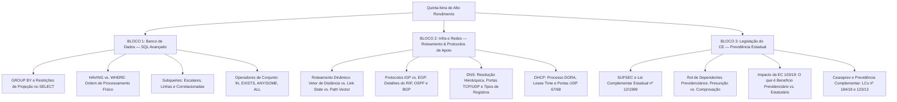

# Guia de Estudos Definitivo — Quinta-feira 21/05/2026
## Semana 1 | Dia 6 | TJ-CE 2026 (Analista TI - Sistemas)
### Foco Absoluto: Banca FCC — Doutrina, Detalhes Ocultos, Pegadinhas e Casos Práticos

---

## 🗺️ Mapa de Estudos do Dia



---

## 💾 SEÇÃO 1: Banco de Dados — SQL Avançado

Para a banca FCC, o domínio do SQL Avançado vai muito além do básico `SELECT ... FROM ... WHERE`. A banca exige o entendimento da **ordem física de execução das cláusulas** de uma consulta SQL, o uso correto das restrições de agrupamento, e o comportamento lógico dos operadores de subconsultas.

### 1. Cláusula GROUP BY e as Restrições de Projeção

O `GROUP BY` é utilizado para agrupar registros que compartilham os mesmos valores em uma ou mais colunas, permitindo a execução de funções de agregação (`COUNT`, `SUM`, `AVG`, `MIN`, `MAX`) sobre esses grupos.

#### A Regra de Ouro do Agrupamento (Foco FCC):
Qualquer coluna que conste na lista de projeção do `SELECT` **deve** satisfazer a pelo menos uma das seguintes condições:
1.  Estar listada explicitamente na cláusula `GROUP BY`.
2.  Estar envolvida por uma função de agregação.

Se houver uma coluna solta no `SELECT` que não pertença ao `GROUP BY` ou não esteja agregada, o banco de dados retornará um **erro de sintaxe** (especialmente no PostgreSQL e no Oracle, referências da FCC).

```sql
-- ❌ ERRO DE SINTAXE SQL:
SELECT departamento_id, cargo, AVG(salario) 
FROM funcionarios 
GROUP BY departamento_id;
-- O campo 'cargo' impede a execução, pois não foi agrupado nem agregado.

--  CONSULTA CORRETA:
SELECT departamento_id, cargo, AVG(salario) 
FROM funcionarios 
GROUP BY departamento_id, cargo;
```

---

### 2. Cláusula HAVING vs. WHERE: Ordem de Processamento Físico

A FCC adora confundir o candidato trocando as funções de `WHERE` e `HAVING`. A diferença reside no momento em que os filtros são aplicados no fluxo de execução do SGBD:

```
[ Tabela Original ] 
        │
        ▼
   1. WHERE ──────> Filtra linhas individuais (Antes do agrupamento)
        │
        ▼
  2. GROUP BY ────> Agrupa os registros restantes em partições
        │
        ▼
   3. HAVING ─────> Filtra os grupos formados (Depois do agrupamento)
        │
        ▼
   [ SELECT ] ────> Projeta e calcula funções agregadas
```

#### Regras fundamentais para a prova:
*   O `WHERE` **não pode** conter funções de agregação. Exemplo inválido: `WHERE SUM(vendas) > 5000` (Erro!).
*   O `HAVING` é aplicado **após** o agrupamento e **pode** referenciar funções de agregação. Exemplo válido: `HAVING SUM(vendas) > 5000`.
*   Filtros que não dependem de agregações (ex: `departamento_id = 5`) devem ser colocados no `WHERE` por motivos de performance (evita que o SGBD faça o agrupamento de linhas inúteis).

---

### 3. Subqueries (Subconsultas) e Operadores Especiais

Uma subconsulta é uma instrução `SELECT` aninhada dentro de outra consulta externa. Classificam-se em:

#### A) Subconsultas Escalares:
Retornam exatamente um único valor (uma linha e uma coluna). Podem ser combinadas com operadores relacionais tradicionais (`=`, `>`, `<`, etc.).
```sql
SELECT nome, salario FROM funcionarios 
WHERE salario > (SELECT AVG(salario) FROM funcionarios);
```

#### B) Subconsultas de Múltiplas Linhas:
Retornam uma coluna com várias linhas. Exigem operadores de conjunto específicos:

*   **`IN`:** Verifica se o valor da consulta externa pertence ao conjunto retornado.
*   **`EXISTS`:** Avalia apenas a existência de linhas na subconsulta. Retorna `TRUE` ou `FALSE`. O SGBD interrompe a busca assim que encontra o primeiro registro correspondente (**short-circuit**), tornando-o altamente eficiente em subconsultas correlacionadas.
*   **`ANY` ou `SOME`:** Compara o valor externo com cada item individualmente e retorna verdadeiro se **pelo menos uma** comparação for verdadeira.
    *   `X > ANY (10, 20, 30)` $\rightarrow$ Equivalente a `X > 10` (maior que o menor valor).
    *   `X < ANY (10, 20, 30)` $\rightarrow$ Equivalente a `X < 30` (menor que o maior valor).
*   **`ALL`:** Compara o valor externo com cada item e retorna verdadeiro apenas se **todas** as comparações forem verdadeiras.
    *   `X > ALL (10, 20, 30)` $\rightarrow$ Equivalente a `X > 30` (maior que o maior valor).
    *   `X < ALL (10, 20, 30)` $\rightarrow$ Equivalente a `X < 10` (menor que o menor valor).

#### C) Subconsultas Correlacionadas:
A subconsulta referencia uma coluna da consulta externa. O SGBD executa a subconsulta para cada linha processada pela consulta principal.
```sql
SELECT e.nome FROM empregados e
WHERE e.salario > (
    SELECT AVG(d.salario) FROM empregados d 
    WHERE d.departamento_id = e.departamento_id
);
```

---

### 🚨 Pegadinhas Clássicas da FCC sobre SQL Avançado

1.  **Inserir colunas não agregadas no SELECT sem incluí-las no GROUP BY.** 
    *   *A Realidade:* O SGBD gera um erro imediato. Fique atento às opções da prova que trazem códigos com essa inconsistência.
2.  **Tentar usar aliases (apelidos) definidos no SELECT dentro do WHERE.**
    *   *A Realidade:* Como o `WHERE` roda antes do `SELECT` na ordem de processamento do banco, o SGBD não reconhece o alias do SELECT no WHERE.
3.  **Afirmar que o `NOT IN` com `NULL` se comporta igual ao `NOT EXISTS`.**
    *   *A Realidade:* Se a subconsulta retornar qualquer valor `NULL`, o uso de `NOT IN` resultará em um conjunto vazio (sempre falso), impossibilitando a exibição de resultados. O `NOT EXISTS` trata valores `NULL` corretamente.

---

## 🌐 SEÇÃO 2: Infraestrutura e Redes — Roteamento, DNS e DHCP

Esta seção aborda como os pacotes de dados encontram seu caminho na Internet (Roteamento) e como os serviços de infraestrutura básica suportam o funcionamento lógico da rede (DNS e DHCP).

### 1. Roteamento Estático vs. Dinâmico e Algoritmos

Roteamento é o processo de selecionar caminhos em uma rede para enviar pacotes de dados.
*   **Estático:** Configurado manualmente pelo administrador. Sem sobrecarga na CPU do roteador, mas não se adapta a falhas de link.
*   **Dinâmico:** Roteadores trocam informações de topologia entre si. Classifica-se conforme o algoritmo:

```
┌────────────────────────────────────────────────────────────────────────┐
┌────────────────────── PROTOCOLOS DE ROTEAMENTO ────────────────────────┐
└────────┬──────────────────────────────────┬────────────────────────────┘
┌────────▼────────┐                        ┌▼────────┐
│  IGP (Internos) │                        │   EGP   │
│  (Dentro do AS) │                        │ (Ext.)  │
└────────┬────────┘                        └┬────────┘
  ┌──────┴───────────────┐                  │
┌─▼────────┐           ┌─▼────────┐       ┌─▼────────┐
│ Vetor de │           │Estado do │       │ Vetor de │
│Distância │           │ Enlace   │       │ Caminho  │
│  (RIP)   │           │ (OSPF)   │       │  (BGP)   │
└──────────┘           └──────────┘       └──────────┘
```

#### A) RIP (Routing Information Protocol) — Vetor de Distância:
*   Usa o algoritmo Bellman-Ford.
*   **Métrica:** Contagem de Saltos (Hop Count). O limite máximo são **15 saltos**. Uma rota com **16 saltos** é considerada inalcançável.
*   **Atualização:** Envia a tabela de roteamento inteira periodicamente (geralmente a cada 30 segundos) via broadcast (RIPv1) ou multicast (RIPv2 no endereço `224.0.0.9`).
*   **RIPv1 vs. RIPv2:** O RIPv1 é *classful* (não envia máscara de sub-rede nas atualizações). O RIPv2 é *classless* (suporta VLSM/CIDR, autenticação e usa multicast).

#### B) OSPF (Open Shortest Path First) — Estado do Enlace (Link State):
*   Usa o algoritmo de Dijkstra (Shortest Path First - SPF).
*   **Métrica:** Custo (Cost), proporcional à largura de banda do link.
*   **Funcionamento:** Cada roteador constrói um mapa completo da rede (Link State Database). Atualizações são enviadas apenas quando há alteração na topologia (LSAs - Link State Advertisements) usando multicast (`224.0.0.5` para todos os roteadores OSPF e `224.0.0.6` para os Designated Routers - DR).
*   **Hierarquia:** Divide a rede em **Áreas**. A **Área 0 (Backbone)** é obrigatória e todas as outras áreas devem conectar-se diretamente a ela.

#### C) BGP (Border Gateway Protocol) — Vetor de Caminho (Path Vector):
*   É o protocolo que interconecta Sistemas Autônomos (AS) na Internet. Classifica-se como **EGP** (Exterior Gateway Protocol).
*   **Transporte Confiável:** Diferente do RIP (UDP 520) e do OSPF (encapsulado diretamente no IP, protocolo 89), o BGP utiliza o **TCP (porta 179)**.
*   **Métrica:** Baseia-se em políticas administrativas e no atributo **AS-Path** (lista de ASs que o pacote atravessará, servindo também para evitar loops de roteamento).

---

### 2. DNS (Domain Name System) — Resolução Hierárquica de Nomes

O DNS converte nomes legíveis (ex: `www.tjce.jus.br`) em endereços IP. Opera na camada de aplicação, utilizando principalmente **UDP na porta 53** para consultas rápidas, e **TCP na porta 53** para transferências de zona ou quando a resposta ultrapassa 512 bytes.

#### Estrutura Hierárquica:
1.  **Raiz (Root Zone):** Representada pelo ponto final oculto (ex: `www.tjce.jus.br.`).
2.  **Top-Level Domain (TLD):** Domínios de primeiro nível como `.br`, `.com`, `.gov`.
3.  **Second-Level Domain:** O domínio registrado, ex: `jus`.
4.  **Subdomínio:** Ex: `tjce`.

```
                  [ . (Raiz) ]
                       │
             ┌─────────┴─────────┐
          [ .br ]             [ .com ]
             │
          [ .jus ]
             │
          [ .tjce ] ──> Host: [ www ]
```

#### Principais Tipos de Registros DNS:
*   **A (Address):** Associa um nome de domínio a um endereço IPv4 (32 bits).
*   **AAAA:** Associa um nome de domínio a um endereço IPv6 (128 bits).
*   **CNAME (Canonical Name):** Define um apelido (alias) para um nome real (ex: redirecionar `web.tjce.jus.br` para `www.tjce.jus.br`).
*   **MX (Mail Exchanger):** Aponta os servidores de e-mail autorizados para receber mensagens do domínio.
*   **NS (Name Server):** Indica os servidores de nomes autoritativos daquela zona DNS.
*   **TXT (Text):** Armazena textos genéricos em formato string. Extremamente utilizado para mecanismos de segurança de e-mail como **SPF**, **DKIM** e **DMARC**.
*   **PTR (Pointer Record):** Usado para DNS Reverso (resolve IP para Nome).
*   **SOA (Start of Authority):** Contém parâmetros essenciais da zona (e-mail do administrador, timer de refresh, expiração e número de série da versão).

---

### 3. DHCP (Dynamic Host Configuration Protocol) — Configuração Automática

O DHCP automatiza a distribuição de parâmetros de rede (IP, Máscara, Gateway, DNS) para os dispositivos da rede. Opera na camada de aplicação, utilizando **UDP nas portas 67 (Servidor) e 68 (Cliente)**.

#### O Processo DORA (Memorize a sequência!):
```
Cliente                                         Servidor
   │                                               │
   │ ─── 1. DISCOVER (Broadcast: 255.255.255.255) ─> (Procura servidores DHCP)
   │                                               │
   │ <── 2. OFFER (Unicast ou Broadcast) ──────────│ (Oferece um endereço IP)
   │                                               │
   │ ─── 3. REQUEST (Broadcast) ───────────────────> (Confirma interesse no IP)
   │                                               │
   │ <── 4. ACKNOWLEDGE (Unicast ou Broadcast) ────│ (Confirmação final + parâmetros)
   ▼                                               ▼
```
*   *Nota sobre o Step 3 (Request):* É enviado em broadcast para que todos os outros servidores DHCP que também enviaram ofertas saibam que o cliente aceitou a oferta deste servidor específico, liberando os IPs pré-alocados por eles.

#### Tempo de Concessão (Lease Time):
É o tempo que o cliente pode usar o IP. O cliente inicia processos de renovação em dois marcos temporais importantes:
*   **Timer T1 (50% do lease):** O cliente envia uma mensagem *DHCP Request* em **unicast** diretamente para o servidor que concedeu o IP para renovar o tempo.
*   **Timer T2 (87,5% do lease):** Se o servidor original não responder, o cliente envia um *DHCP Request* em **broadcast** tentando renovar o IP com qualquer servidor DHCP disponível na rede.

---

### 🚨 Pegadinhas Clássicas da FCC sobre Redes e Protocolos

1.  **Afirmar que o OSPF envia periodicamente sua tabela de roteamento inteira.**
    *   *A Realidade:* Quem faz atualizações completas periódicas é o **RIP**. O OSPF é incremental e só envia atualizações (LSAs) quando ocorrem alterações na topologia do enlace.
2.  **Confundir a porta padrão do BGP e seu protocolo de transporte.**
    *   *A Realidade:* O BGP usa a porta **TCP 179** para garantir a confiabilidade na troca de rotas. A banca tentará empurrar UDP ou portas de RIP/OSPF.
3.  **Inverter a ordem lógica do DORA no DHCP.**
    *   *A Realidade:* O processo é obrigatoriamente Discover $\rightarrow$ Offer $\rightarrow$ Request $\rightarrow$ Acknowledge. Lembre-se da palavra **D-O-R-A**.

---

## ⚖️ SEÇÃO 3: Legislação do Ceará — Previdência Estadual

O estudo da Legislação Previdenciária cearense exige a compreensão das diretrizes que regem o regime próprio do Estado, a gestão dos fundos e a reestruturação operada para a adaptação às reformas federais.

### 1. O SUPSEC (Lei Complementar Estadual nº 12/1999)

O **Sistema Único de Previdência Social dos Servidores Públicos Civis e Militares, dos Agentes Públicos e dos Membros de Poder do Estado do Ceará (SUPSEC)** é o Regime Próprio de Previdência Social (RPPS) estadual.

*   **Caráter:** Contributivo e solidário.
*   **Contribuintes:** Estado, servidores ativos, aposentados, militares da reserva/reformados e pensionistas.
*   **Servidores abrangidos:** Servidores civis titulares de cargos de provimento efetivo, militares, membros de poder (Juízes/Desembargadores) e agentes públicos.
*   **Excluídos:** Servidores contratados sob regime temporário, ocupantes exclusivos de cargos em comissão de livre nomeação e exoneração, e empregados públicos. Estes estão vinculados obrigatoriamente ao Regime Geral de Previdência Social (RGPS - gerido pelo INSS).

---

### 2. O Rol de Dependentes Previdenciários (Art. 6º da LC 12/99, após LC 159/16)

A concessão de pensão por morte depende do enquadramento dos familiares no rol de dependentes legais. A lei divide-os conforme a exigência de comprovação de dependência econômica:

| Categoria do Dependente | Tipo de Dependência | Condições Específicas |
|---|---|---|
| **Cônjuge / Companheiro(a)** | **Presumida (Absoluta)** | União estável ou casamento civil regular no momento do óbito. |
| **Ex-cônjuge / Ex-companheiro(a)** | **Necessita Comprovar** | Deve estar recebendo pensão alimentícia judicial regulamentada na data do óbito. |
| **Filho(a) Menor** | **Presumida (Absoluta)** | Idade inferior a **21 anos** (não confundir com os 24 anos universitários, comum em direito civil mas inexistente na previdência estadual!). |
| **Filho(a) de Qualquer Idade** | **Necessita Comprovar** | Deve ser inválido(a) ou apresentar deficiência grave, com laudo médico oficial. |
| **Tutelado(a)** | **Necessita Comprovar** | Menor sob guarda/tutela judicial que demonstre dependência econômica. |
| **Mãe / Pai** | **Necessita Comprovar** | Dependência econômica total das finanças do servidor, e **apenas se inexistirem dependentes das classes prioritárias acima**. |

---

### 3. Impacto da Emenda Constitucional nº 103/2019 e Legislação do Ceará

A reforma previdenciária nacional de 2019 trouxe impactos drásticos na estrutura do SUPSEC, ratificados e regulamentados no Ceará.

#### A Desconstitucionalização e a Natureza dos Benefícios:
Após a EC nº 103/2019, o rol de benefícios mantidos pelo RPPS ficou restrito a apenas dois:
1.  **Aposentadoria** (segurado civil) ou Reserva Remunerada/Reforma (segurado militar).
2.  **Pensão por Morte** (dependentes).

#### 🚨 Pegadinha Suprema para a FCC:
Os benefícios de **Auxílio-Natalidade**, **Salário-Família**, **Salário-Maternidade** e **Auxílio-Reclusão** perderam o caráter previdenciário no âmbito dos RPPSs. No Estado do Ceará, eles agora são considerados **benefícios estatutários ou trabalhistas**, pagos diretamente com dotação orçamentária do órgão de lotação do servidor (no caso, o TJ-CE), e não pelo fundo previdenciário do SUPSEC.

---

### 4. Cearaprev (LC nº 184/2018) e Previdência Complementar (LC nº 123/2013)

#### Cearaprev:
A **Fundação de Previdência Social do Estado do Ceará (Cearaprev)** é a entidade gestora única do RPPS cearense.
*   **Natureza Jurídica:** Fundação pública estadual, dotada de personalidade jurídica de direito público, autonomia administrativa, financeira e patrimonial.
*   **Finalidade:** Gerenciar, administrar e operacionalizar o SUPSEC, incluindo a arrecadação de contribuições, gestão de fundos previdenciários e concessão/manutenção dos benefícios previdenciários.

#### Previdência Complementar (RPC):
Instituída originalmente pela **Lei Complementar nº 123/2013** para limitar o teto das aposentadorias públicas estaduais ao teto estabelecido pelo RGPS (INSS).
*   Os novos servidores (empossados após a vigência do regime) só receberão pelo SUPSEC até o teto do INSS.
*   Para receber valores acima do teto, devem aderir ao Regime de Previdência Complementar do Ceará, gerido pela fundação previdenciária fechada **CE-Prevcom** (autorizada pela LC nº 185/2018).

---

### 🚨 Pegadinhas Clássicas da FCC sobre Legislação Previdenciária do Ceará

1.  **Estender a concessão da pensão por morte para filhos estudantes universitários até os 24 anos.**
    *   *A Realidade:* O SUPSEC limita a pensão de filhos saudáveis estritamente aos **21 anos**, independente de estarem cursando nível superior.
2.  **Afirmar que o Salário-Maternidade e o Auxílio-Reclusão são benefícios previdenciários pagos pelo SUPSEC.**
    *   *A Realidade:* Post-reforma da EC 103/19, são benefícios de natureza administrativa/trabalhista custeados pelo Tesouro Estadual, restando ao SUPSEC apenas Aposentadoria/Reserva/Reforma e Pensão por Morte.
3.  **Dizer que ocupantes de cargos exclusivamente em comissão têm direito a aposentar-se pelo SUPSEC.**
    *   *A Realidade:* Estes servidores vinculam-se obrigatoriamente ao Regime Geral de Previdência Social (RGPS/INSS).

---

## 🎯 SEÇÃO 4: Questões Inéditas FCC-Style Comentadas Passo a Passo

### Questão 1: Banco de Dados (SQL Avançado)
**(FCC - Adaptada)** Considere a tabela `processos` criada em um banco de dados PostgreSQL com as colunas: `id` (INT), `classe_processual` (VARCHAR), `comarca` (VARCHAR), `valor_causa` (NUMERIC) e `data_distribuicao` (DATE). Um analista de sistemas do TJ-CE deseja obter uma listagem que apresente a comarca, a classe processual e a média dos valores da causa de todos os processos cujo valor de causa seja superior a R$ 10.000,00. Contudo, ele deseja agrupar os resultados apenas pelas comarcas que tenham mais de 50 processos cadastrados nesta condição. O comando SQL que atende integralmente a essa solicitação é:

A)
```sql
SELECT comarca, classe_processual, AVG(valor_causa)
FROM processos
WHERE valor_causa > 10000
GROUP BY comarca
HAVING COUNT(id) > 50;
```
B)
```sql
SELECT comarca, classe_processual, AVG(valor_causa)
FROM processos
WHERE valor_causa > 10000 AND COUNT(id) > 50
GROUP BY comarca, classe_processual;
```
C)
```sql
SELECT comarca, classe_processual, AVG(valor_causa)
FROM processos
WHERE valor_causa > 10000
GROUP BY comarca, classe_processual
HAVING COUNT(id) > 50;
```
D)
```sql
SELECT comarca, classe_processual, AVG(valor_causa)
FROM processos
GROUP BY comarca, classe_processual
HAVING valor_causa > 10000 AND COUNT(id) > 50;
```
E)
```sql
SELECT comarca, AVG(valor_causa)
FROM processos
WHERE valor_causa > 10000
GROUP BY comarca, classe_processual
HAVING COUNT(id) > 50;
```

#### 💡 Resolução Comentada da Questão 1:
*   **Análise das Alternativas:**
    *   **Alternativa A:** Errada. A coluna `classe_processual` está presente no `SELECT` mas não está na cláusula `GROUP BY`, gerando erro de sintaxe.
    *   **Alternativa B:** Errada. A função agregada `COUNT(id)` está sendo utilizada inapropriadamente dentro do `WHERE`.
    *   **Alternativa C:** **Correta**. A coluna `classe_processual` e `comarca` são agrupadas juntas, permitindo que ambas figurem no `SELECT`. O filtro individual (`valor_causa > 10000`) é aplicado no `WHERE` antes do agrupamento, e o filtro agregado (`COUNT(id) > 50`) no `HAVING` após o agrupamento.
    *   **Alternativa D:** Errada. Coloca o filtro individual `valor_causa > 10000` no `HAVING` sem agregação, exigindo que estivesse no `GROUP BY`.
    *   **Alternativa E:** Errada. A coluna `classe_processual` está no `GROUP BY` mas não no `SELECT`, o que é sintaticamente permitido, mas a questão pedia para apresentar a classe processual no resultado final.
*   **Gabarito correto: C.**

---

### Questão 2: Infraestrutura e Redes (DHCP e DNS)
**(FCC - Adaptada)** Um administrador de redes do TJ-CE configurou um servidor DNS interno para responder por requisições de servidores intranet e um servidor DHCP para alocar dinamicamente IPs para os computadores dos servidores públicos. Sobre o funcionamento dos protocolos DNS e DHCP no modelo TCP/IP, assinale a opção correta.

A) O processo de handshake do DHCP ocorre através de mensagens na ordem Discover, Offer, Request e Acknowledge, enviadas obrigatoriamente de forma criptografada na porta TCP 67 pelo cliente.
B) O registro DNS do tipo CNAME permite associar um domínio diretamente a um endereço IPv6, enquanto o registro do tipo AAAA realiza o mapeamento reverso de endereços IPs em nomes.
C) O timer T1 do DHCP é acionado quando o cliente atinge 50% do seu tempo de concessão (lease time), enviando uma mensagem DHCP Request em unicast direcionada ao servidor DHCP original.
D) O protocolo DNS realiza todas as suas operações exclusivamente sobre UDP na porta 53, rejeitando tráfego TCP para evitar ataques de estouro de pilha.
E) O atributo AS-Path é a métrica principal de determinação de caminhos utilizada pelos servidores de nome (DNS) para a sincronização de servidores TLD de raiz.

#### 💡 Resolução Comentada da Questão 2:
*   **Análise das Alternativas:**
    *   **Alternativa A:** Errada. O DHCP utiliza o protocolo de transporte **UDP**, não TCP, e as mensagens originais de Discover/Offer não são criptografadas.
    *   **Alternativa B:** Errada. O CNAME é para apelidos (aliases), o registro que associa domínio a IPv6 é o **AAAA**, e o mapeamento reverso é o **PTR**.
    *   **Alternativa C:** **Correta**. Ao atingir 50% do lease (Timer T1), o cliente DHCP tenta renovar o IP enviando um *Request* via **unicast** diretamente para o servidor DHCP de origem.
    *   **Alternativa D:** Errada. O DNS utiliza TCP na porta 53 para transferência de zona e para pacotes maiores que 512 bytes.
    *   **Alternativa E:** Errada. O AS-Path é um atributo métrico do protocolo de roteamento **BGP**, e não do DNS.
*   **Gabarito correto: C.**

---

### Questão 3: Legislação do Ceará (SUPSEC)
**(FCC - Adaptada)** De acordo com as disposições expressas na Lei Complementar Estadual nº 12/1999 (SUPSEC) e suas alterações vigentes, considere as seguintes afirmativas sobre os dependentes previdenciários e a concessão de benefícios:

I. A dependência econômica do cônjuge, do companheiro ou companheira e do filho menor de 21 anos é presumida de forma absoluta.
II. O salário-maternidade e o auxílio-reclusão dos servidores ativos do TJ-CE constituem benefícios de natureza previdenciária e são custeados integralmente pela SEPLAG através dos fundos de capitalização do SUPSEC.
III. O filho inválido perde o direito ao recebimento da pensão por morte caso complete 21 anos de idade sem que haja a cessação de sua invalidez física ou intelectual.

Está correto o que se afirma em:

A) I, apenas.
B) I e II, apenas.
C) II e III, apenas.
D) I e III, apenas.
E) I, II e III.

#### 💡 Resolução Comentada da Questão 3:
*   **Análise das Afirmativas:**
    *   **Afirmativa I:** **Correta**. A dependência econômica de cônjuge, companheiro(a) e filhos menores de 21 anos é presumida por lei de maneira absoluta.
    *   **Afirmativa II:** Errada. Após a reforma constitucional da previdência (EC 103/19), o SUPSEC custeia apenas Aposentadorias e Pensão por Morte. O salário-maternidade e o auxílio-reclusão passaram a ter natureza estatutária/administrativa, pagos diretamente pelo órgão de dotação orçamentária do servidor, e não pelos fundos previdenciários do SUPSEC.
    *   **Afirmativa III:** Errada. O filho inválido ou com deficiência grave mantém a condição de dependência mesmo após atingir 21 anos de idade, desde que a invalidez/deficiência tenha se iniciado antes da maioridade ou emancipação e persista.
*   **Gabarito correto: A.**

---

## 🧠 SEÇÃO 5: Flashcards de Memorização Ativa (Estilo Anki)

### Bloco 1 — SQL Avançado

*   **Frente (Pergunta):** Qual o comportamento sintático de uma coluna incluída no `SELECT` que não possui função agregadora em uma consulta com `GROUP BY`?
*   **Verso (Resposta):** A coluna deve, obrigatoriamente, figurar na cláusula `GROUP BY`. Caso contrário, o SGBD retornará um erro de sintaxe.

*   **Frente (Pergunta):** O que diferencia logicamente os filtros aplicados na cláusula `WHERE` daqueles na cláusula `HAVING`?
*   **Verso (Resposta):** O `WHERE` filtra linhas individuais antes do agrupamento (`GROUP BY`) e não suporta funções de agregação. O `HAVING` filtra os grupos após o agrupamento e suporta funções de agregação.

*   **Frente (Pergunta):** Como funcionam os operadores `ANY` e `ALL` nas subconsultas SQL?
*   **Verso (Resposta):** O `ANY` retorna verdadeiro se o valor comparado satisfizer à condição para pelo menos um item do conjunto. O `ALL` exige que a condição seja verdadeira para todos os itens do conjunto.

---

### Bloco 2 — Redes (Roteamento, DNS e DHCP)

*   **Frente (Pergunta):** Qual a métrica do protocolo RIP e seu limite físico de alcance de saltos?
*   **Verso (Resposta):** A métrica é o número de saltos (hop count), limitada ao máximo de 15 saltos. Um link com 16 saltos é considerado inalcançável.

*   **Frente (Pergunta):** Qual protocolo de transporte e porta o BGP utiliza para realizar a troca de tabelas de roteamento dinâmico?
*   **Verso (Resposta):** Utiliza o **TCP na porta 179** para garantir a entrega confiável e ordenada das mensagens de roteamento.

*   **Frente (Pergunta):** Quais os tipos de registro DNS usados para mapear nomes para endereços IPv4, IPv6 e Apelidos (aliases)?
*   **Verso (Resposta):** IPv4 mapeia para registro **A**; IPv6 mapeia para registro **AAAA**; Apelidos (aliases) mapeiam para registro **CNAME**.

---

### Bloco 3 — Legislação Previdenciária do Ceará

*   **Frente (Pergunta):** Quais servidores estaduais do Ceará estão obrigatoriamente excluídos do SUPSEC e vinculados ao RGPS (INSS)?
*   **Verso (Resposta):** Servidores temporários, empregados públicos e ocupantes exclusivamente de cargos em comissão de livre nomeação e exoneração.

*   **Frente (Pergunta):** Qual o limite de idade para a presunção absoluta de dependência econômica de um filho de servidor no SUPSEC?
*   **Verso (Resposta):** Limite de **21 anos de idade**. Não existe prorrogação automática por motivos universitários no regime previdenciário estadual.

*   **Frente (Pergunta):** Quais os únicos benefícios previdenciários de caráter obrigatório custeados pelo SUPSEC após a adaptação da EC 103/2019?
*   **Verso (Resposta):** Aposentadoria (para servidores civis) / Reserva e Reforma (para militares) e Pensão por Morte (para os dependentes).

---

## 🏆 Roteiro de Estudos Sugerido para Hoje (21/05/2026)

1.  **Manhã (Bloco 1 - 2h):** Dedique-se à **Seção 1 (SQL Avançado)**. Pratique consultas simuladas no seu editor preferido usando combinações de `GROUP BY` e `HAVING`. Estude a diferença entre `EXISTS` e `IN`.
2.  **Tarde (Bloco 2 - 2h):** Estude a **Seção 2 (Redes e Roteamento)**. Memorize a métrica limitante do RIP e as portas de rede (BGP = TCP 179, DHCP = UDP 67/68, DNS = UDP/TCP 53). Memorize o acrônimo **DORA**.
3.  **Noite (Bloco 3 - 1h30):** Estude a **Seção 3 (Legislação Previdenciária)**. Domine o rol de dependentes previdenciários do SUPSEC e a diferenciação de benefícios pós-EC 103/19.
4.  **Bateria de Questões (1h30):** Faça a resolução de questões focadas no portal de questões:
    *   15 Questões FCC: SQL (Agrupamento e Subqueries).
    *   15 Questões FCC: Redes (Roteamento Dinâmico, DNS e DHCP).
    *   15 Questões FCC: Legislação Estadual de Previdência / SUPSEC Ceará.
5.  **Revisão Final e Anki:** Alimente seu Anki com os flashcards da Seção 5 e revise os principais erros cometidos nas baterias.
