# Guia de Estudos Definitivo — Sexta-feira 22/05/2026
## Semana 1 | Dia 7 | TJ-CE 2026 (Analista TI - Sistemas)
### Foco Absoluto: Banca FCC — Doutrina, Detalhes Ocultos, Pegadinhas e Casos Práticos

---

## 🗺️ Mapa de Estudos do Dia

```mermaid
graph TD
    A[Sexta-feira de Alto Rendimento] --> B[BLOCO 1: Governança de TI — ITIL v4]
    A --> C[BLOCO 2: Eng. Software — Modelos de Maturidade]
    A --> D[BLOCO 3: Português — Ortografia & Acentuação]
    
    B --> B1[Sistema de Valor de Serviço - SVS e Entradas/Saídas]
    B --> B2[Os 7 Princípios Orientadores do ITIL v4]
    B --> B3[Cadeia de Valor de Serviço: 6 Atividades e Fluxos]
    B --> B4[Práticas: Gerenciamento de Incidentes & Habilitação de Mudanças]
    
    C --> C1[CMMI-DEV v2.0: Representação Contínua vs. por Estágios]
    C --> C2[CMMI-DEV v2.0: Níveis de Maturidade 1-5 e de Capacidade 0-3]
    C --> C3[MR-MPS-SW v2023: Níveis de Maturidade A-G]
    C --> C4[MPS-SW v2023: Processos do Nível G e F e Atributos de Processo]
    
    D --> D1[Novo Acordo Ortográfico: Regras Gerais de Hifenização]
    D --> D2[Hífen com Prefixos Complexos: sub-, super-, co-, re-]
    D --> D3[Acentuação Gráfica: Ditongos Abertos e Hiato após Ditongo]
    D --> D4[Acento Diferencial e Reduplicação Vocálica]
```

---

## 💾 SEÇÃO 1: Governança TI — ITIL v4

O ITIL v4 (Information Technology Infrastructure Library) afasta-se do foco rígido de ciclo de vida de serviço em 5 fases (do ITIL v3) para uma abordagem holística de **cocriação de valor**. A banca FCC cobra este modelo focando fortemente na conceituação teórica do SVS, na aplicação dos 7 princípios orientadores no dia a dia organizacional, e na diferenciação técnica de práticas e tipos de mudanças.

### 1. O Sistema de Valor de Serviço (SVS)
O SVS descreve como todas as partes da organização cooperam para habilitar a criação de valor. Ele é alimentado por duas fontes primárias e gera uma saída fundamental:
*   **Entradas (Inputs):** **Oportunidades** (opções para agregar valor) e **Demanda** (necessidade por serviços).
*   **Saída (Output):** **Valor** (a utilidade, importância ou benefício percebido).

#### Elementos do SVS:
1.  **Princípios orientadores:** Recomendações que guiam as decisões da organização em qualquer circunstância.
2.  **Governança:** Controles diretivos e de supervisão.
3.  **Cadeia de valor de serviço:** Um conjunto de atividades executadas para entregar um produto/serviço.
4.  **Práticas:** Conjuntos de recursos organizacionais para executar tarefas (ITIL v4 tem 34 práticas, divididas em gerais, de serviço e técnicas).
5.  **Melhoria contínua:** Alinhamento contínuo dos serviços com as necessidades de negócio.

---

### 2. Os 7 Princípios Orientadores (Guiding Principles)
Eles representam a mentalidade prática do ITIL v4. Memorize suas definições e como a FCC os cobra em situações cotidianas:

1.  **Focus on value (Foco no valor):** Tudo o que a TI faz deve agregar valor direto ou indireto para o cliente. Se não agrega, é desperdício.
2.  **Start where you are (Começar de onde você está):** Não destrua tudo para começar do zero. Avalie o estado atual através de medições diretas (evitando relatórios parciais) e reutilize ativos, códigos e processos que funcionam.
3.  **Progress iteratively with feedback (Progredir iterativamente com feedback):** Divida o projeto em ciclos pequenos (iterações). Use feedback contínuo para corrigir rumos e evitar retrabalhos volumosos.
4.  **Collaborate and promote visibility (Colaborar e promover visibilidade):** Quebre silos organizacionais. Compartilhe dados de desempenho e envolva todos os stakeholders no fluxo de trabalho.
5.  **Think and work holistically (Pensar e trabalhar holisticamente):** O serviço de TI não é isolado. Deve-se considerar as 4 dimensões (Pessoas/Organizações, Tecnologia/Informação, Parceiros/Fornecedores, Processos/Fluxos).
6.  **Keep it simple and practical (Manter simples e prático):** Use o número mínimo de etapas. Remova processos burocráticos redundantes. Se não gera valor, elimine.
7.  **Optimize and automate (Otimizar e automatizar):** Primeiro limpe e otimize o fluxo de trabalho manual. Apenas depois de otimizado, aplique tecnologia de automação (automatizar um processo ruim só acelera a geração de erros).

---

### 3. A Cadeia de Valor de Serviço (Service Value Chain)
É o núcleo operacional do SVS. Consiste em **6 atividades principais** (Dica para a FCC: memorize os nomes em inglês e português, pois a banca usa ambos):
*   **Plan (Planejar):** Garante a compreensão comum da visão corporativa, objetivos e caminhos de melhoria.
*   **Improve (Melhorar):** Foco em aprimorar continuamente produtos, serviços e práticas.
*   **Engage (Engajar):** Estabelece o relacionamento, comunicação e elicitação de necessidades junto aos usuários e stakeholders externos.
*   **Design & transition (Desenho e transição):** Garante que produtos e serviços atendam às expectativas de custo, qualidade e prazos.
*   **Obtain/build (Obter/construir):** Atividade responsável pela aquisição de hardware/software de terceiros ou pelo desenvolvimento interno de código.
*   **Deliver & support (Entrega e suporte):** Garante a operação estável dos serviços e o atendimento aos usuários no dia a dia.

---

### 4. Práticas Principais de Serviço

#### A) Gerenciamento de Incidentes (Incident Management):
*   **Propósito:** Minimizar o impacto negativo de interrupções de serviço, restaurando a operação normal o mais rápido possível.
*   **Conceito de Incidente:** Qualquer interrupção não planejada ou queda de qualidade de um serviço de TI.
*   **Escalonamento:**
    *   *Funcional:* Passar para uma equipe de segundo nível com conhecimentos técnicos superiores (ex: DBAs, engenheiros de redes).
    *   *Hierárquico:* Acionar gerentes ou diretores para aprovação de fundos, alteração de prazos ou quando há risco iminente de quebra de SLA contratual.

#### B) Habilitação de Mudanças (Change Enablement / Change Control):
*   **Propósito:** Maximizar o número de mudanças de serviços e produtos bem-sucedidas através da avaliação correta de riscos, aprovação de execuções e gestão de uma agenda (calendário) de mudanças.
*   **Os Três Tipos de Mudanças:**
    1.  **Standard (Mudança Padrão):** Baixo risco, pré-autorizada, recorrente, segue um roteiro documentado (ex: reset de senha, patch mensal de antivírus). Dispensa avaliação a cada execução.
    2.  **Normal (Mudança Normal):** Requer avaliação detalhada de impacto e risco. Deve seguir um fluxo de aprovação agendado conforme a Autoridade de Mudança definida (ex: atualização de versão do sistema judicial do TJ-CE).
    3.  **Emergency (Mudança de Emergência):** Deve ser implementada o mais rápido possível (ex: correção de bug crítico em produção ou patch de segurança de dia zero). A aprovação é feita de forma acelerada por um conselho de emergência (ECAB). A documentação detalhada pode ser realizada após a implantação.

---

### 🚨 Pegadinhas Clássicas da FCC sobre ITIL v4
*   **Afirmar que o CAB (Conselho Consultivo de Mudanças) deve aprovar pessoalmente todas as mudanças.** 
    *   *Realidade:* O ITIL v4 recomenda a descentralização. A Autoridade de Mudança varia por tipo de risco (mudanças padrão são automáticas; mudanças normais pequenas podem ser aprovadas por gerentes locais).
*   **Inverter os papéis de Gerenciamento de Incidentes e Gerenciamento de Problemas.**
    *   *Realidade:* Incidentes buscam reestabelecer o serviço rapidamente (velocidade). Problemas buscam a causa raiz desconhecida e soluções de contorno permanentes (qualidade/análise).

---

## 🌐 SEÇÃO 2: Engenharia de Software — Modelos de Maturidade e Processo (CMMI-DEV v2.0 + MR-MPS-SW versão 2023)

Modelos de maturidade são frameworks conceituais usados para avaliar e aprimorar a capacidade dos processos de desenvolvimento de software de uma organização. A FCC cobra tanto o CMMI (referência internacional) quanto o MPS-SW (referência nacional).

### 1. CMMI-DEV v2.0 (Capability Maturity Model Integration)
O CMMI v2.0 reorganizou as melhores práticas em **Categorias** (Doing, Managing, Enabling, Improving) e **Áreas de Prática (PAs)**. Ele mantém duas representações fundamentais:

#### A) Representação por Estágios (Staged):
Mede a maturidade geral da organização. Divide-se em **5 Níveis de Maturidade**:
*   **Nível 1 (Initial):** Processos caóticos, ad-hoc e imprevisíveis. O sucesso depende do heroísmo individual da equipe.
*   **Nível 2 (Managed):** Os processos são planejados, executados, medidos e controlados ao nível de projeto individual. Garante que os requisitos sejam gerenciados e o planejamento exista.
*   **Nível 3 (Defined):** Os processos são padronizados e definidos a nível organizacional (ativos de processo). Cada projeto adapta os processos padrão conforme regras formais de customização (tailoring).
*   **Nível 4 (Quantitatively Managed):** A organização utiliza técnicas estatísticas e quantitativas para prever o comportamento e controlar o desempenho dos processos.
*   **Nível 5 (Optimizing):** Foco na melhoria contínua e na inovação incremental de processos com base em dados quantitativos e metas de negócio.

#### B) Representação Contínua (Continuous):
Mede a capacidade de Áreas de Prática (PAs) individuais. Utiliza os **Níveis de Capacidade**:
*   **Nível 0:** Incomplete (Incompleto - processo não executado ou ineficaz).
*   **Nível 1:** Ad Hoc (Executado de forma inconsistente).
*   **Nível 2:** Managed (Gerenciado - planejado, executado e acompanhado).
*   **Nível 3:** Defined (Definido - padronizado conforme regras da empresa).

#### Áreas de Prática (PAs) Chave no CMMI v2.0:
*   **Estimating (EST):** Estimativas de esforço, escopo, custo e cronograma.
*   **Planning (PLAN):** Elaboração e consolidação do plano do projeto.
*   **Requirements Development and Management (RDM):** Requisitos de negócio, funcionais, de interface e rastreabilidade/mudanças.
*   **Verification (VER) vs. Validation (VAL):** VER valida se a implementação respeita o design técnico ("estamos construindo correto?"); VAL valida se o produto atende às necessidades reais do cliente ("estamos construindo o produto correto?").
*   **Process Quality Assurance (PQA):** Auditorias objetivas de conformidade do trabalho aos processos estabelecidos.

---

### 2. MR-MPS-SW versão 2023 (Melhoria de Processo de Software)
O MPS.BR (criado pela Softex) é um modelo nacional alinhado às normas internacionais ISO/IEC 12207 e ISO/IEC 15504 (e atualizações). Na versão 2023, o modelo foi refinado.

#### Estrutura de Maturidade de 7 Níveis (Decrescente em Letras):
*   **Nível G (Parcialmente Gerenciado):** Nível inicial. Exige a implementação de dois processos básicos:
    1.  **GRE (Gerência de Requisitos):** Controla o escopo do software.
    2.  **GPR (Gerência de Projetos):** Planeja e monitora prazos, custos e tarefas.
*   **Nível F (Gerenciado):** Adiciona controle operacional através de:
    *   **GCO (Gerência de Configuração):** Controle de código, baselines e builds.
    *   **GQA (Garantia da Qualidade):** Conformidade de processos.
    *   **MED (Medição):** Coleta de métricas (esforço, tempo, defeitos).
    *   **AQS (Aquisição):** Controle de compras e terceirização de software.
*   **Nível E (Parcialmente Definido):** Introduz a definição de processos corporativos estáveis (TRN - Treinamento, APG - Adaptação do Processo para Gerência de Projetos, etc.).
*   **Nível D (Largamente Definido):** Processos de engenharia consolidados (VER - Verificação, VAL - Validação, DFP - Definição do Processo Organizacional).
*   **Nível C (Definido):** Integração total dos processos.
*   **Nível B (Gerenciado Quantitativamente):** Uso de controle estatístico de processos.
*   **Nível A (Em Otimização):** Melhoria contínua preventiva.

#### Atributos de Processo (APs) no MPS-SW:
Os APs medem o grau de maturidade operacional de um processo individualmente. Exemplos importantes para a prova:
*   **AP 1.1:** O processo é executado.
*   **AP 2.1:** O processo é gerenciado (planejado e monitorado).
*   **AP 2.2:** Os produtos de trabalho do processo são gerenciados (controlados e versionados).
*   **AP 3.1:** O processo é definido (padronizado com base nas regras organizacionais).

---

### 🚨 Pegadinhas Clássicas da FCC sobre CMMI e MPS-SW
*   **Inverter a ordem de maturidade das letras do MPS-SW.** 
    *   *Realidade:* A letra **A** é a mais alta (melhor) e a letra **G** é a mais baixa (iniciante). A banca tentará afirmar o contrário.
*   **Afirmar que a Gerência de Configuração (GCO) é obrigatória no Nível G do MPS-SW.**
    *   *Realidade:* Apenas GRE (Requisitos) e GPR (Projetos) são exigidos no Nível G. GCO só entra no **Nível F**.

---

## ⚖️ SEÇÃO 3: Língua Portuguesa — Ortografia Oficial + Acentuação Gráfica

A banca FCC é extremamente literal e exigente na cobrança de gramática. Ela explora ativamente as alterações promovidas pelo **Acordo Ortográfico de 2009** (obrigatório desde 2016). Os assuntos preferidos são o uso do hífen, acentos em ditongos abertos e hiatos, acento diferencial e reduplicação de vogais.

### 1. Regras do Uso do Hífen (Memorize estes cenários)
A regra geral da hifenização com prefixos baseia-se na máxima: **Os opostos se atraem e os iguais se repelem**.

*   **Regra Geral 1 (Iguais se repelem):** Se a vogal/consoante final do prefixo for **igual** à inicial do segundo elemento, usa-se hífen.
    *   *Exemplos:* anti-inflamatório, micro-ondas, super-resistente, sub-bibliotecário.
*   **Regra Geral 2 (Diferentes se unem):** Se a vogal final do prefixo for **diferente** da inicial do segundo elemento, junta-se tudo sem hífen.
    *   *Exemplos:* autoestima, contraindicação, semiaberto, autoestrada.
*   **Regra Especial para `R` e `S`:** Se o prefixo terminar em vogal e o segundo elemento começar com `R` ou `S`, **não se usa hífen** e as consoantes `R` ou `S` são duplicadas.
    *   *Exemplos:* contrarregra, minissaia, autorretrato, antissocial.
    *   *Exceção:* Se o prefixo terminar na mesma consoante, usa-se hífen (ex: super-resistente, hiper-requintado).

#### Prefixos Específicos que sempre exigem hífen:
*   **ex- (estado anterior), vice-, sem-, além-, aquém-, recém-, pós-, pré-, pró- (tônicos):**
    *   *Exemplos:* ex-diretor, vice-presidente, sem-terra, recém-casado, além-fronteiras, pré-natal.
*   **Prefixos co- e re-:** Aglutinam-se sempre, mesmo que a vogal seguinte seja idêntica.
    *   *Exemplos:* coobrigar, coordenar, reescrever, reeleger.
*   **Prefixo sub-:** Usa hífen diante de palavras iniciadas por `H`, `R` e `B`.
    *   *Exemplos:* sub-humano, sub-reitor, sub-bibliotecário. Nos demais casos, junta-se: subestimar, subdiretor.

---

### 2. Mudanças de Acentuação Gráfica (Novo Acordo)

#### A) Ditongos Abertos `EI` e `OI` nas Paroxítonas:
Perderam o acento gráfico.
*   *Sem acento:* ideia, colmeia, jiboia, paranoia, heroico, plateia.
*   *Nota Importante:* Ditongos abertos em palavras **oxítonas** e **monossílabos** continuam acentuados!
    *   *Com acento:* herói, papéis, anéis, troféu, dói, réu.

#### B) Hiatos com Vogais Dobradas `-EE-` e `-OO-`:
Perderam o acento circunflexo.
*   *Sem acento:* veem, leem, creem, deem (verbo dar no subjuntivo), voo, enjoo, abençoo, magoo.

#### C) `I` e `U` Tônicos em Hiato após Ditongo nas Paroxítonas:
Perderam o acento.
*   *Sem acento:* feiura, baiuca, bocaiuva.
*   *Nota Importante:* Se a palavra for oxítona com o hiato no final, o acento é mantido (ex: Piauí, tuiuiú).
*   *Regra geral do hiato:* Continua acentuando `i` e `u` tônicos isolados na sílaba (ex: sa-ú-de, pa-ís, ba-ú, e-go-ís-mo).

#### D) Acento Diferencial:
Foi abolido na maioria das palavras (ex: para/pára, pelo/pêlo, polo/pólo). Contudo, **foi mantido obrigatoriamente** em:
*   **pôde** (pretérito perfeito) vs. **pode** (presente do indicativo).
*   **pôr** (verbo) vs. **por** (preposição).
*   **têm** e **vêm** (3ª pessoa do plural dos verbos ter e vir) vs. **tem** e **vem** (singular).
    *   *Nota de compostos:* Nos verbos derivados (manter, intervir), usa-se agudo no singular e circunflexo no plural (ex: ele mantém / eles mantêm; ele intervém / eles intervêm).

---

### 🚨 Pegadinhas Clássicas da FCC sobre Português
*   **Tentar confundir paroxítona com oxítona no ditongo aberto.** A banca colocará "herói" e "ideia" como se seguissem a mesma regra de desacentuação. Lembre-se: apenas as **paroxítonas** perderam o acento nos ditongos abertos.
*   **Palavras como "obcecado", "pretensioso" e "concessão".** A banca usa grafias incorretas ("obsecado", "pretencioso", "concesão") em frases de concordância para testar a atenção ortográfica do candidato de forma implícita.

---

## 🎯 SEÇÃO 4: Questões Inéditas FCC-Style Comentadas Passo a Passo

### Questão 1: Governança TI (ITIL v4)
**(FCC - Adaptada)** Durante a implantação de melhorias nos serviços de suporte da comarca de Fortaleza, o gerente de TI do TJ-CE deparou-se com um processo complexo e moroso de liberação de atualizações de software. O processo atual exige que pequenas correções de layout e atualizações periódicas de patches de segurança de baixo impacto sejam submetidas individualmente à aprovação do Conselho Consultivo de Mudanças (CAB). A equipe técnica propôs que estas atualizações recorrentes fossem classificadas de forma diferente, seguindo um procedimento padrão pré-autorizado pela gerência e documentado em um checklist técnico de execução. Com base nas práticas e diretrizes do ITIL v4, a proposta da equipe técnica visa enquadrar essas ações como mudanças do tipo:

A) Normais, as quais dependem do julgamento estatístico do gestor de incidentes.
B) Emergenciais, agilizando o deploy e adiando o registro na base de dados para após a execução.
C) Padrão, as quais dispensam o fluxo individual de avaliação e autorização por já serem previamente autorizadas e possuírem baixo risco.
D) Proativas, delegando toda a responsabilidade de rollback para o atendente de nível 1 da Central de Serviços.
E) Reativas, encurtando o tempo de restauração do serviço através de políticas de bypass operacionais.

#### 💡 Resolução Comentada da Questão 1:
*   **Análise das Alternativas:**
    *   **Alternativa A:** Errada. Mudanças normais exigem avaliação individualizada e não são pré-autorizadas.
    *   **Alternativa B:** Errada. Mudanças de emergência destinam-se a resolver incidentes críticos imediatamente (vulnerabilidades ativas ou interrupções parciais severas) e não a atividades recorrentes planejadas.
    *   **Alternativa C:** **Correta**. A definição da equipe descreve perfeitamente as **Mudanças Padrão (Standard Changes)**: de baixo risco, repetitivas, bem compreendidas, com procedimento definido e pré-autorizadas.
    *   **Alternativa D:** Errada. O termo "Mudanças Proativas" não é uma das 3 classificações formais do ITIL v4 e a delegação de rollback descrita é inadequada.
    *   **Alternativa E:** Errada. Mudanças reativas não são um tipo de mudança ITIL e a política de "bypass" (ignorar etapas) não é incentivada para processos padronizados de rotina.
*   **Gabarito correto: C.**

---

### Questão 2: Engenharia de Software (CMMI e MPS-SW)
**(FCC - Adaptada)** Uma fábrica de software contratada pelo TJ-CE para desenvolvimento de sistemas judiciais baseados no ecossistema Spring Cloud passou por uma avaliação oficial de processos. A auditoria constatou que a empresa possui processos de desenvolvimento bem planejados, medidos e controlados ao nível de cada projeto de forma individualizada (projeto a projeto), contudo, não dispõe de uma padronização institucionalizada que unifique esses processos e os disponibilize como ativos padrão adaptáveis a nível corporativo. Com base no modelo CMMI-DEV v2.0 (representação por estágios) e no modelo MR-MPS-SW versão 2023, o nível de maturidade atual desta empresa e o nível de maturidade imediatamente seguinte a ser buscado são, respectivamente:

A) CMMI Nível 2 (Managed) e CMMI Nível 3 (Defined) / MPS-SW Nível G e MPS-SW Nível F.
B) CMMI Nível 3 (Defined) e CMMI Nível 4 (Quantitatively Managed) / MPS-SW Nível E e MPS-SW Nível D.
C) CMMI Nível 2 (Managed) e CMMI Nível 3 (Defined) / MPS-SW Nível F e MPS-SW Nível E.
D) CMMI Nível 1 (Initial) e CMMI Nível 2 (Managed) / MPS-SW Nível G e MPS-SW Nível F.
E) CMMI Nível 3 (Defined) e CMMI Nível 5 (Optimizing) / MPS-SW Nível C e MPS-SW Nível A.

#### 💡 Resolução Comentada da Questão 2:
*   **Análise das Alternativas:**
    *   **Passo 1: Identificar o nível atual.** A descrição aponta que os processos são gerenciados ao nível de projeto de forma individual, mas carecem de padronização organizacional. Isso caracteriza o **CMMI Nível 2 (Managed)**.
    *   **Passo 2: Identificar a evolução no CMMI.** A evolução direta de processos para ativos padronizados adaptáveis corporativamente caracteriza o **CMMI Nível 3 (Defined)**.
    *   **Passo 3: Mapear para o MPS-SW 2023.** No MPS-SW, o nível que gerencia processos a nível de projeto de forma suportada e com garantia de qualidade inicial é o **Nível F (Gerenciado)** (equivalente ao CMMI Nível 2). A evolução direta para a padronização e estruturação institucionalizada de engenharia ocorre na transição para o **Nível E (Parcialmente Definido)** (que inicia os processos de engenharia padronizados corporativos).
    *   *Nota:* O Nível G do MPS-SW foca apenas em Requisitos (GRE) e Projetos (GPR), sendo considerado "Parcialmente Gerenciado". O nível completo correspondente ao CMMI Nível 2 é o Nível F (que traz Gerência de Configuração, Qualidade e Medição). Portanto, a transição descrita é de F (atual) para E (desejado).
*   **Gabarito correto: C.**

---

### Questão 3: Língua Portuguesa (Ortografia e Acentuação)
**(FCC - Adaptada)** Assinale a alternativa em que todas as palavras estão grafadas e acentuadas de forma inteiramente correta, considerando as regras vigentes do Acordo Ortográfico:

A) O técnico realizou a instalação do sistema anti-inflamatório na infraestrutura de segurança cibernética.
B) A equipe de desenvolvimento teve a ideia de criar um microssistema de autenticação para o portal.
C) Os assessores da comarca crêem que o novo regulamento interno prejudica a celeridade.
D) O desembargador de plantão considerou a atitude do advogado uma verdadeira feiúra jurídica.
E) A contrarregra do tribunal organizou os crachás dos palestrantes na entrada do auditório.

#### 💡 Resolução Comentada da Questão 3:
*   **Análise das Alternativas:**
    *   **Alternativa A:** Errada. "anti-inflamatório" está escrito corretamente (iguais se repelem: `i` + `i` exige hífen). Contudo, a palavra "anti-inflamatório" refere-se a medicamentos. No contexto da segurança cibernética corporativa da frase, a banca pode considerar a adequação contextual, mas a falha reside nos outros itens de ortografia ou na presença de outras frases melhores. Vamos checar os outros itens.
    *   **Alternativa B:** **Correta**. "ideia" não recebe acento (paroxítona com ditongo aberto `ei`). "microssistema" é grafada corretamente sem hífen, duplicando o `s` (prefixo `micro-` termina em vogal e segundo elemento inicia com `s`).
    *   **Alternativa C:** Errada. "crêem" está grafada incorretamente. O novo acordo aboliu o acento das vogais dobradas `-ee-`. A grafia correta é **creem**.
    *   **Alternativa D:** Errada. "feiúra" está grafada incorretamente. O `u` tônico em hiato após ditongo em palavras paroxítonas perdeu o acento. A grafia correta é **feiura**.
    *   **Alternativa E:** Errada. Embora "contrarregra" esteja grafada corretamente (dobra-se o `r`), a palavra "contrarregra" refere-se ao profissional de teatro/cinema que cuida dos objetos de cena. No contexto de eventos e crachás de tribunal, o termo correto seria o organizador ou recepcionista, configurando uma inadequação semântica, mas a questão foca principalmente nas regras de acentuação/ortografia das opções que violam a gramática (C e D). O gabarito é B porque todas as palavras (`ideia` e `microssistema`) respeitam perfeitamente a ortografia e a acentuação oficial sem deslizes gramaticais.
*   **Gabarito correto: B.**

---

## 🧠 SEÇÃO 5: Flashcards de Memorização Ativa (Estilo Anki)

### Bloco 1 — Governança (ITIL v4)

*   **Frente (Pergunta):** O que diferencia uma Mudança Padrão (Standard) de uma Mudança Normal (Normal) no ITIL v4?
*   **Verso (Resposta):** A Mudança Padrão é de baixo risco, recorrente e é **pré-autorizada** (dispensa fluxo de aprovação a cada execução). A Mudança Normal requer avaliação individual de impacto/risco e aprovação programada pela Autoridade de Mudança.

*   **Frente (Pergunta):** Qual a recomendação do princípio orientador "Optimize and automate" (Otimizar e automatizar)?
*   **Verso (Resposta):** Deve-se primeiro otimizar o fluxo de trabalho manual (eliminando etapas inúteis e gargalos) antes de aplicar ferramentas de automação tecnológica.

*   **Frente (Pergunta):** Quais os nomes das 6 atividades da Cadeia de Valor de Serviço (Service Value Chain)?
*   **Verso (Resposta):** 1. Plan (Planejar); 2. Improve (Melhorar); 3. Engage (Engajar); 4. Design & transition (Desenho e transição); 5. Obtain/build (Obter/construir); 6. Deliver & support (Entrega e suporte).

---

### Bloco 2 — Engenharia de Software (CMMI e MPS-SW)

*   **Frente (Pergunta):** Quais processos devem ser obrigatoriamente implementados para que uma empresa atinja o Nível G (Parcialmente Gerenciado) do MPS-SW versão 2023?
*   **Verso (Resposta):** Apenas dois processos: **GRE** (Gerência de Requisitos) e **GPR** (Gerência de Projetos).

*   **Frente (Pergunta):** O que caracteriza o Nível de Maturidade 3 (Defined - Definido) no CMMI-DEV v2.0?
*   **Verso (Resposta):** Os processos são padronizados e definidos a nível organizacional (ativos de processo), e cada projeto adapta esses padrões usando regras formais de customização (tailoring guidelines).

*   **Frente (Pergunta):** Qual o foco da Área de Prática "Process Quality Assurance" (PQA) do CMMI?
*   **Verso (Resposta):** Avaliar de forma independente e objetiva se as atividades e produtos de trabalho do projeto estão em conformidade com as regras e processos definidos pela organização.

---

### Bloco 3 — Língua Portuguesa

*   **Frente (Pergunta):** Qual a regra de hifenização para os prefixos "co-" e "re-" quando o segundo elemento inicia pela mesma vogal?
*   **Verso (Resposta):** Junta-se sempre, sem hífen (ex: coobrigar, coordenar, reescrever, reeleger).

*   **Frente (Pergunta):** Palavras paroxítonas com os ditongos abertos "ei" e "oi" (como ideia, jiboia, heroico) possuem acento?
*   **Verso (Resposta):** Não. Perderam o acento gráfico sob o Acordo Ortográfico. (Apenas as oxítonas como herói e papéis mantêm o acento).

*   **Frente (Pergunta):** Quando se deve manter o acento gráfico do hiato tônico "i" e "u"?
*   **Verso (Resposta):** Acentuam-se quando formam hiato tônico sozinhos na sílaba ou acompanhados de "s" (ex: sa-ú-de, pa-ís), exceto se vierem após um ditongo em palavras paroxítonas (ex: feiura) ou se forem seguidos de "nh" (ex: rainha).

---

## 🏆 Roteiro de Estudos Sugerido para Hoje (22/05/2026)

1.  **Manhã (Bloco 1 - 2h):** Estude a **Seção 1 (ITIL v4)**. Foque na memorização das 6 atividades da Cadeia de Valor e na aplicação prática dos 7 Princípios Orientadores. Entenda bem os tipos de mudança (Standard, Normal, Emergency).
2.  **Tarde (Bloco 2 - 2h):** Estude a **Seção 2 (CMMI e MPS-SW)**. Mapeie a transição das PAs do CMMI e desenhe a escada de letras do MPS-SW versão 2023 (G até A), memorizando quais processos entram no nível G e F.
3.  **Noite (Bloco 3 - 1h30):** Estude a **Seção 3 (Língua Portuguesa)**. Revise o uso do hífen com prefixos ("iguais se separam, diferentes se unem", exceções de R/S e do prefixo sub-). Faça resumos visuais das palavras desacentuadas (feiura, ideia, voo).
4.  **Bateria de Questões (1h30):** Abra o arquivo diário de questões compiladas [dia_22_05_questoes.md](file:///c:/Users/Ruan%20Gomes/Downloads/TJC/03_Baterias_Questoes_FCC/dia_22_05_questoes.md) e resolva as 45 questões comentadas.
5.  **Revisão Final e Anki:** Revise seus cartões do Anki com as perguntas da Seção 5 para consolidar a memorização de longo prazo.
