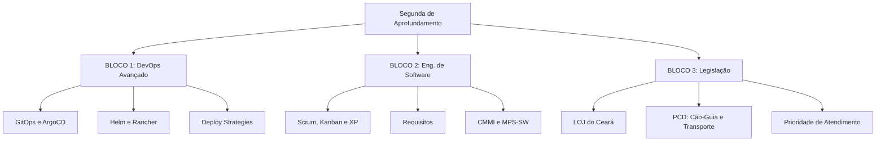

# Guia de Estudos Definitivo — Segunda-feira 22/06/2026
## Semana 6 | Dia 36 | TJ-CE 2026 (Analista TI - Sistemas)
### Foco: Aprofundamento em DevOps, Bateria de Eng. Software e Leis do TJ/PCD

---

> ⚠️ **Atenção (Fase 2 - Semana 6):** Bem-vindo à Semana 6! A partir de agora, o volume de questões aumenta radicalmente. Iniciamos os blocos de aprofundamento (conteúdos complexos onde a FCC bate forte) e baterias diretas para ganhar tração. Hoje vamos subir o nível em DevOps com ferramentas enterprise de Kubernetes e revisar o coração da engenharia de software e da lei orgânica do TJ.

---

## 🗺️ Mapa de Estudos do Dia

---

## ⚙️ SEÇÃO 1: Aprofundamento — DevOps Avançado

O Kubernetes sozinho já não basta. As bancas querem saber o ecossistema moderno ao redor dele.

### 1. GitOps e ArgoCD
*   **GitOps:** É a prática de usar repositórios Git como a **fonte única da verdade** (Single Source of Truth) para infraestrutura declarativa e aplicações. Em vez de rodar `kubectl apply` na mão, o cluster sincroniza com o Git.
*   **ArgoCD:** A principal ferramenta declarativa e contínua do padrão GitOps para Kubernetes. O ArgoCD mora "dentro" do cluster e puxa (PULL) as atualizações automáticas do repositório Git, mantendo o cluster exatamente igual ao código declarado.

### 2. Helm e Rancher
*   **Helm:** É o "Gerenciador de Pacotes" do Kubernetes (como se fosse o `apt` do Ubuntu ou `npm` do Node). Ele empacota manifestos complexos de Kubernetes (Yaml) em um formato chamado **Chart**.
*   **Rancher:** É uma plataforma de software open-source para a adoção massiva de containers. Ele centraliza a gestão e autenticação de *múltiplos* clusters Kubernetes espalhados em diferentes nuvens (AWS, Azure, On-premise).

---

## 📋 SEÇÃO 2: Bateria FCC — Engenharia de Software

Hoje teremos dezenas de questões para revisar a base:
*   **Scrum vs Kanban vs XP:** O Scrum tem sprints de tempo fixo. O Kanban é um fluxo contínuo restrito pelo limite de WIP (Work in Progress). O XP (eXtreme Programming) tem foco técnico brutal (Pair Programming, TDD, Integração Contínua, Refatoração, Simplicidade).
*   **Requisitos:** Entender de forma infalível a diferença entre funcional (o que o sistema faz) e não-funcional (qualidade, desempenho, segurança).
*   **CMMI e MPS-SW:** Modelos de maturidade. Lembre-se que o MPS-SW vai do nível G (mais baixo) ao A (mais alto), contendo 7 níveis. O CMMI-DEV possui 5 níveis de maturidade (1-Inicial, 2-Gerenciado, 3-Definido, 4-Gerenciado Quantitativamente, 5-Otimização).

---

## 🏛️ SEÇÃO 3: Legislação — LOJ Ceará e Direitos PCD

### 1. LOJ Ceará (Lei Estadual nº 16.397/2017)
*   **Organização Judiciária:** Entenda muito bem os Órgãos do Poder Judiciário do Estado do Ceará (Tribunal de Justiça, Turmas Recursais, Fóruns, Juízes de Direito, Juizados Especiais, Conselho da Magistratura). 
*   **Conselho da Magistratura:** É o órgão superior de inspeção e disciplina de primeira instância (e não a Corregedoria). Preste atenção às composições.

### 2. Direitos da PCD (Cão-guia, Prioridade e Transporte)
*   **Cão-guia (Lei 11.126/05):** É assegurado à pessoa com deficiência visual acompanhada de cão-guia o direito de ingressar e permanecer em **qualquer** ambiente de uso coletivo (público ou privado), sendo proibida a cobrança de tarifas extras. (Lembrete: não é apenas "cego", pessoa com visão subnormal/baixa visão também tem direito).
*   **Prioridade:** O acompanhante ou atendente pessoal tem prioridade justificada pelo acompanhamento, exceto no atendimento em órgãos de arrecadação (Receita).
*   **Transporte:** Reservas de assentos obrigatórias em transportes públicos e adaptação das frotas. 

---

## 🎯 SEÇÃO 4: Questões Inéditas FCC-Style Comentadas (Padrão Premium)

### Questão 1: DevOps Avançado (GitOps)
**(FCC - 2026 - TJ-CE - Analista de TI)** Um engenheiro do tribunal adotou uma arquitetura onde qualquer modificação manual executada por linha de comando diretamente em um cluster Kubernetes de produção é automaticamente sobrescrita e revertida pelo ArgoCD após alguns minutos. Esse comportamento ocorre porque a ferramenta detectou divergência entre o estado real do cluster e o estado declarado em um repositório centralizado. O conceito arquitetural central implementado neste cenário é denominado:

A) Canary Deployment.
B) Blue-Green Strategy.
C) GitOps.
D) Infrastructure as a Service (IaaS).
E) Helm Package Management.

💡 Resolução Comentada da Questão 1

**Gabarito Correto: C**

**Justificativa:** O comportamento descrito (onde a ferramenta reverte mudanças manuais que divergem do repositório) é a essência do **GitOps** com ArgoCD. O Git é a única fonte da verdade. Qualquer edição manual direta ("drift") é considerada anômala e apagada pela ferramenta de sincronização contínua.
**Erro das Falsas:**
*   **A e B** são estratégias de *deploy* (teste com pequena amostra ou virada de chave completa de ambiente), não tratam de sincronizar o estado manual com repositório.
*   **D** é o modelo base de nuvem (aluguel de VMs).
*   **E** é gerenciamento de pacotes Kubernetes, não sincronização forçada de estado de infraestrutura via Git.

### Questão 2: Eng. de Software (XP e Ágil)
**(FCC - 2026 - TJ-CE - Analista de TI)** A Diretoria de TI do tribunal determinou o uso estrito de duas práticas fundamentais nas equipes de desenvolvimento: todo o código deve ser construído impreterivelmente por dois programadores trabalhando em uma mesma máquina de forma intercalada; e todo teste unitário deve ser programado antes que a funcionalidade principal correspondente seja codificada. Tais diretrizes derivam, fundamentalmente, do método ágil:

A) Scrum.
B) Extreme Programming (XP).
C) Kanban.
D) DSDM (Dynamic Systems Development Method).
E) Feature Driven Development (FDD).

💡 Resolução Comentada da Questão 2

**Gabarito Correto: B**

**Justificativa:** *Pair Programming* (Programação em Par - "dois programadores na mesma máquina") e *Test-Driven Development* (TDD - "teste unitário antes da funcionalidade") são os dois maiores pilares e contribuições clássicas da metodologia ágil **XP (eXtreme Programming)**. 
**Erro das Falsas:** O Scrum foca puramente em gestão, não opinando em práticas técnicas de código. O Kanban foca em gerenciar fluxo de trabalho via limites.

### Questão 3: Legislação (Direitos da PCD)
**(FCC - 2026 - TJ-CE - Analista de TI)** Durante um evento promovido pela Escola Superior da Magistratura do Estado do Ceará em um auditório alugado na rede privada hoteleira, o gestor de segurança do hotel exigiu de um juiz com baixa visão um atestado médico assinado em cartório e uma taxa extra de acomodação para o ingresso do seu cão-guia no estabelecimento. Diante da Lei nº 11.126/2005, a atitude da segurança é considerada:

A) Legal, visto que o evento ocorreu no interior de uma instituição da rede privada, isenta dos ditames para espaços públicos.
B) Ilegal, uma vez que a lei proíbe cobrança de valores extras e assegura o ingresso livre do animal sem necessidade de registro ou identificação do cão.
C) Ilegal, sendo assegurado o acesso a espaços de uso coletivo, públicos ou privados, sem cobrança de taxas, exigindo-se apenas identificação adequada do animal.
D) Legal, pois apenas a cegueira total concede o direito à isenção da taxa do animal em ambientes da rede privada.
E) Ilegal na cobrança da taxa, mas amparada na exigência médica, visto que o laudo deve atestar a sanidade clínica do animal no momento do ingresso.

💡 Resolução Comentada da Questão 3

**Gabarito Correto: C**

**Justificativa:** Pela Lei 11.126/05, a pessoa com deficiência visual (cegueira ou baixa visão) com seu cão-guia tem livre ingresso em ambientes de uso coletivo (públicos e **privados**), sem cobrança de taxas ou tarifas. A atitude foi **Ilegal**. Porém, atenção à vírgula final: a lei **exige** sim que o cão porte a identificação de cão-guia e carteira de vacinação, mas jamais um laudo médico assinado em cartório para o dono ou taxa extra de estadia para o cão.

**Erro das Falsas:**
*   **A e D** chamam de legal. O fato de ser rede privada (uso coletivo) não isenta a obrigatoriedade. Baixa visão também possui o direito.
*   **B** erra ao dizer que ingressa "sem necessidade de identificação do cão".
*   **E** erra ao afirmar que o laudo médico solicitado na questão está amparado na lei.

---

## 🧠 SEÇÃO 5: Flashcards de Memorização Ativa (Estilo Anki)

### Bloco 1 — DevOps
*   **Frente:** Qual a função da ferramenta Helm no ecossistema Kubernetes?
*   **Verso:** Ele atua como um Gerenciador de Pacotes (Package Manager). Ele empacota as complexas configurações YAML do Kubernetes no formato de `Charts`, permitindo o deploy e versionamento de um app com 1 comando.

### Bloco 2 — Eng. de Software
*   **Frente:** Quais são os 7 níveis de Maturidade do processo MPS-SW?
*   **Verso:** G (Parcialmente Gerenciado), F (Gerenciado), E (Parcialmente Definido), D (Largamente Definido), C (Definido), B (Gerenciado Quantitativamente) e A (Em Otimização).

### Bloco 3 — Legislação PCD
*   **Frente:** A Lei obriga que os cães-guia em treinamento em posse do instrutor tenham os mesmos direitos de acesso a locais públicos/privados de uso coletivo que o cão já treinado?
*   **Verso:** **SIM.** O treinador ou instrutor tem o mesmo direito de ingresso ao acompanhar o animal em fase de treinamento, para que ele se habitue aos ambientes.

---

## 🏆 Roteiro de Estudos Sugerido para Hoje (22/06/2026)

1.  **Manhã (Bloco 1 - 2h):** DevOps. Estude o conceito de infraestrutura declarativa (GitOps). Não decore linha de comando de GitOps, mas compreenda a arquitetura de *Push* (tradicional) vs *Pull* (ArgoCD puxando o Git).
2.  **Tarde (Bloco 2 - 2.5h):** Eng. de Software. O volume de questões hoje na bateria será insano. Revise a tabela de comparação CMMI vs MPS-SW. Saiba de cor os 5 valores e os pilares do XP.
3.  **Noite (Bloco 3 - 2.5h):** Legislação. O LOJ Ceará é chato mas cai. Foque na competência administrativa do Conselho da Magistratura. Revise as restrições e garantias de PCD em transporte e prioridades.
4.  **Treinamento Insano:** Em breve, soltarei as 75 Questões FCC Premium que o sistema de IA está fabricando no exato momento sobre este roteiro. Se prepare!

A Semana 6 vai testar sua resistência. Você está mais forte do que imagina. Vamos buscar! 🚀
