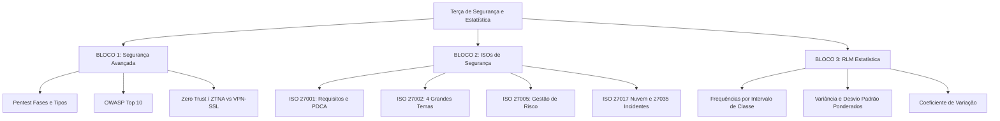

# Guia de Estudos Definitivo — Terça-feira 23/06/2026
## Semana 6 | Dia 37 | TJ-CE 2026 (Analista TI - Sistemas)
### Foco: Segurança da Informação, Pentest, OWASP Top 10, Família ISO 27000 e Estatística de Dispersão Avançada (RLM)

---

> ⚠️ **Atenção (Fase 2 - Semana 6):** Hoje o foco é duplo e de altíssimo peso. Na parte de TI, entramos na Segurança da Informação Avançada e nas Normas ISO da família 27000. Estes tópicos são os maiores diferenciais da FCC para cargos de Analista e costumam vir com enunciados extensos simulando auditorias e incidentes em tribunais. Na parte de RLM, subiremos o nível na Estatística com cálculos complexos de dispersão baseados em tabelas de frequência por classes e histogramas.

---

## 🗺️ Mapa de Estudos do Dia

---

## ⚙️ SEÇÃO 1: Aprofundamento — Segurança Avançada

As provas de tribunal da FCC exigem o conhecimento conceitual e prático de técnicas de ataque e defesa ativas.

### 1. Pentest (Teste de Intrusão)
*   **Fases do Pentest:**
    1.  **Reconhecimento (Reconnaissance):** Coleta de dados (ativa ou passiva) sobre o alvo.
    2.  **Varredura/Mapeamento (Scanning):** Uso de portas e ferramentas (Nmap, Nessus) para identificar vulnerabilidades e sistemas ativos.
    3.  **Obtenção de Acesso (Exploitation):** Invasão propriamente dita, explorando vulnerabilidades descobetas.
    4.  **Manutenção de Acesso (Post-exploitation):** Instalação de backdoors ou elevação de privilégios para garantir persistência.
    5.  **Análise/Relatório (Reporting):** Documentação detalhada dos caminhos de invasão e planos de mitigação.
*   **Tipos de Pentest:**
    *   **Black Box:** O pentester não tem qualquer informação prévia da infraestrutura (simula um invasor externo real).
    *   **White Box:** O pentester tem acesso total a diagramas, código-fonte e credenciais (simula um ataque interno ou auditoria profunda).
    *   **Grey Box:** O pentester tem informações limitadas ou parciais (ex: um usuário comum sem privilégios administrativos).

### 2. OWASP Top 10 (Principais Vulnerabilidades de Web Apps)
*   **A01: Broken Access Control (Controle de Acesso Quebrado):** Permite que usuários acessem recursos fora de seus privilégios (ex: mudar o ID na URL para ver processos judiciais de terceiros).
*   **A02: Cryptographic Failures (Falhas Criptográficas):** Exposição de dados sensíveis devido à falta de criptografia em trânsito ou repouso, ou uso de algoritmos fracos (ex: MD5, SHA-1).
*   **A03: Injection (Injeção):** Envio de dados maliciosos interpretados como comandos pelo interpretador (SQL Injection, LDAP Injection, XSS).
*   **A04: Insecure Design (Design Inseguro):** Falha conceitual na arquitetura da aplicação que não previu defesas básicas.

### 3. Zero Trust, ZTNA e VPN-SSL
*   **Zero Trust (Confiança Zero):** Paradigma de segurança baseado na premissa: **"Nunca confiar, sempre verificar"**. Nenhum usuário ou dispositivo é confiável por padrão, mesmo que esteja dentro da rede física do Tribunal.
*   **ZTNA (Zero Trust Network Access):** Substitui as VPNs tradicionais. O acesso é concedido de forma granular a aplicações específicas e não à infraestrutura de rede inteira, avaliando contexto em tempo real (dispositivo, geolocalização, comportamento).
*   **VPN-SSL vs IPsec:** 
    *   *IPsec:* Opera na Camada de Rede (L3), exige cliente de software e dá acesso a todo o segmento de rede.
    *   *VPN-SSL:* Opera na Camada de Transporte (L4/L7), geralmente acessada via navegador (Portal) ou túnel leve, restringindo o acesso a serviços selecionados.

---

## 📋 SEÇÃO 2: Bateria FCC — Família ISO 27000

A FCC cobra as normas da família ISO/IEC 27000 com foco na distinção exata das responsabilidades de cada uma.

### 1. ISO/IEC 27001 (SGSI - Requisitos)
*   É a norma **certificável**. Ela define os requisitos para estabelecer, implementar, manter e melhorar continuamente um Sistema de Gestão da Segurança da Informação (SGSI).
*   Utiliza a abordagem de processos baseada no ciclo **PDCA** (Plan-Do-Check-Act) para governança e melhoria contínua da segurança.

### 2. ISO/IEC 27002 (Código de Prática para Controles)
*   É a norma **guia**. Ela detalha as diretrizes e boas práticas para implementação de controles de segurança descritos no Anexo A da ISO 27001.
*   *Nota da Nova Versão:* Os controles foram condensados e agrupados em **4 Grandes Temas**:
    1.  **Organizacionais** (Políticas, regras, governança).
    2.  **Pessoas** (Contratação, treinamento, conduta).
    3.  **Físicos** (Perímetros, salas de servidores, instalações).
    4.  **Tecnológicos** (Criptografia, rede, controle de acessos).

### 3. ISO/IEC 27005 (Gestão de Riscos)
*   Foca exclusivamente nas diretrizes para o processo de **Gestão de Riscos de Segurança da Informação**.
*   Define as etapas de: Estabelecimento do Contexto, Identificação do Risco, Análise do Risco, Avaliação do Risco, Tratamento do Risco (Mitigar, Evitar, Transferir, Aceitar) e Aceitação do Risco.

### 4. ISO/IEC 27017 (Segurança em Nuvem) e ISO/IEC 27035 (Gestão de Incidentes)
*   **ISO 27017:** Controles adicionais específicos para provedores de serviços em nuvem e clientes de nuvem pública/híbrida.
*   **ISO 27035:** Gestão de Incidentes de Segurança. Divide-se em fases estruturadas: *Preparação -> Detecção e Reporte -> Triagem e Avaliação -> Resposta a Incidentes -> Lições Aprendidas*.

---

## 🏛️ SEÇÃO 3: RLM — Estatística de Dispersão Avançada

Para fechar a matéria de RLM da FCC, você precisa dominar o cálculo de variância e desvio padrão para **tabelas de frequência com intervalo de classes**. A banca adora dar tabelas e pedir para você calcular a dispersão.

### 1. Ponto Médio da Classe (\(x_i\))
Quando a tabela apresenta intervalos de classes (ex: \(10 \vdash 20\)), o valor representante daquela linha é o ponto médio (\(x_i\)):
\[x_i = \frac{Limite\ Inferior + Limite\ Superior}{2} = \frac{10 + 20}{2} = 15\]

### 2. Média Ponderada (\(\bar{x}\))
A média das frequências agrupadas usa os pontos médios (\(x_i\)) multiplicados pela frequência absoluta (\(f_i\)):
\[\bar{x} = \frac{\sum (x_i \cdot f_i)}{\sum f_i}\]

### 3. Variância Ponderada (\(S^2\) ou \(\sigma^2\))
A variância avalia o desvio de cada ponto médio em relação à média geral:
\[S^2 = \frac{\sum [f_i \cdot (x_i - \bar{x})^2]}{\sum f_i}\]
*(Nota: Use divisor \(N\) para populações ou \(N-1\) para amostras, conforme o enunciado indicar).*

### 4. Desvio Padrão (\(S\) ou \(\sigma\)) e Coeficiente de Variação (CV)
*   **Desvio Padrão:** É a raiz quadrada da Variância:
    \[S = \sqrt{S^2}\]
*   **Coeficiente de Variação (CV):** Medida de dispersão relativa expressa em percentual:
    \[CV = \frac{S}{\bar{x}} \cdot 100\%\]

---

## 🎯 SEÇÃO 4: Questões Inéditas FCC-Style Comentadas (Padrão Premium)

### Questão 1: Segurança Avançada (Zero Trust e ZTNA)
**(FCC - 2026 - TJ-CE - Analista de TI)** Durante um processo de auditoria de conformidade no Tribunal de Justiça do Ceará, a equipe de segurança identificou que a VPN corporativa baseada em IPsec, embora protegida por criptografia robusta, permite que qualquer servidor que estabeleça conexão obtenha um endereço IP da subrede interna e realize varreduras de porta (scanning) em outros sistemas do tribunal. Para conter a movimentação lateral e adotar um paradigma de confiança zero, a equipe propôs a transição para uma solução baseada em:

A) Tunneling SSH com encapsulamento de camada de rede.
B) VPN-SSL configurada em modo Full-Tunnel com NAT estático.
C) ZTNA (Zero Trust Network Access) mapeando o acesso lógico diretamente a aplicações autorizadas e específicas.
D) Criptografia WPA3 Enterprise em toda a borda do data center.
E) IDS/IPS ativo com assinaturas de contenção lateral integradas ao AD.

💡 Resolução Comentada da Questão 1

**Gabarito Correto: C**

**Justificativa:** O ZTNA (Zero Trust Network Access) funciona de forma diferente das VPNs clássicas. Em vez de conectar o dispositivo à subrede inteira (Camada 3), o ZTNA atua provendo conexões lógicas ponto a ponto restritas a aplicações ou serviços específicos (geralmente Camada 7), prevenindo a movimentação lateral e atividades de varredura.
**Erro das Falsas:**
*   **A e B** mantêm o modelo tradicional onde o tráfego é encapsulado, mas o acesso ainda expõe segmentos de rede ou rotas amplas.
*   **D** é protocolo para redes sem fio locais, inadequado para controle de acesso remoto a aplicações.
*   **E** é uma tecnologia de monitoramento reativa, e não uma arquitetura de controle de acesso preventivo baseado em Confiança Zero.

### Questão 2: Família ISO 27000 (ISO 27002:2022)
**(FCC - 2026 - TJ-CE - Analista de TI)** Um Analista de TI do Tribunal de Justiça do Ceará foi designado para conduzir a adequação dos controles de segurança do tribunal às melhores práticas internacionais. Ao utilizar a norma ABNT NBR ISO/IEC 27002, versão atualizada, ele constatou que os controles não são mais segmentados por dezenas de seções antigas, mas sim consolidados em quatro grandes temas práticos. De acordo com a norma, o controle que define as diretrizes para o "desenvolvimento seguro de software" está classificado sob o tema:

A) Organizacionais.
B) Pessoas.
C) Físicos.
D) Tecnológicos.
E) Processuais.

💡 Resolução Comentada da Questão 2

**Gabarito Correto: D**

**Justificativa:** Na estruturação moderna da ISO/IEC 27002, o tema **Tecnológicos** agrupa todos os controles relacionados à tecnologia da informação, incluindo criptografia, segurança em redes, controle de acesso lógico e o ciclo de vida de desenvolvimento seguro de software (SDLC).
**Erro das Falsas:**
*   **A** trata de governança e políticas corporativas amplas.
*   **B** trata do ciclo de vida dos recursos humanos e regras de conduta.
*   **C** trata de barreiras físicas e perímetros de segurança.
*   **E** sequer existe como um dos quatro temas estruturais da norma.

### Questão 3: RLM / Estatística (Desvio Padrão por Classes)
**(FCC - 2026 - TJ-CE - Analista de TI)** Uma pesquisa no banco de dados do Tribunal de Justiça mapeou o tempo de resposta (em minutos) para o encerramento de chamados de suporte técnico de primeiro nível em TI durante um dia de plantão judiciário, obtendo a seguinte tabela de frequências acumuladas por classe:

| Tempo (minutos) | Frequência Absoluta (\(f_i\)) |
| :--- | :--- |
| \(0 \vdash 10\) | 4 |
| \(10 \vdash 20\) | 6 |

Considerando os dados da tabela, a variância amostral desse tempo de resposta é de:

A) \(25,00\).
B) \(24,00\).
C) \(26,67\).
D) \(27,78\).
E) \(22,22\).

💡 Resolução Comentada da Questão 3

**Gabarito Correto: C**

**Passo a Passo do Cálculo:**
1.  **Encontrar os pontos médios (\(x_i\)) das classes:**
    *   Classe 1 (\(0 \vdash 10\)): \(x_1 = \frac{0 + 10}{2} = 5\)
    *   Classe 2 (\(10 \vdash 20\)): \(x_2 = \frac{10 + 20}{2} = 15\)
2.  **Calcular a média aritmética ponderada (\(\bar{x}\)):**
    *   \(\sum f_i = 4 + 6 = 10\) chamados total.
    *   \(\bar{x} = \frac{(5 \cdot 4) + (15 \cdot 6)}{10} = \frac{20 + 90}{10} = \frac{110}{10} = 11\) minutos.
3.  **Calcular os desvios e quadrados dos desvios ponderados:**
    *   Para Classe 1: \(f_1 \cdot (x_1 - \bar{x})^2 = 4 \cdot (5 - 11)^2 = 4 \cdot (-6)^2 = 4 \cdot 36 = 144\)
    *   Para Classe 2: \(f_2 \cdot (x_2 - \bar{x})^2 = 6 \cdot (15 - 11)^2 = 6 \cdot (4)^2 = 6 \cdot 16 = 96\)
    *   Soma dos desvios quadrados = \(144 + 96 = 240\).
4.  **Calcular a Variância Amostral (divisor \(N - 1\)):**
    *   \(S^2 = \frac{Soma\ dos\ desvios}{N - 1} = \frac{240}{10 - 1} = \frac{240}{9} \approx 26,67\)
    *(Nota: Se fosse populacional, o divisor seria 10, resultando em 24,00, mas a questão pede explicitamente a variância amostral, o que exige divisor N - 1 = 9. A FCC sempre testa a atenção do candidato com essa diferença!).*

