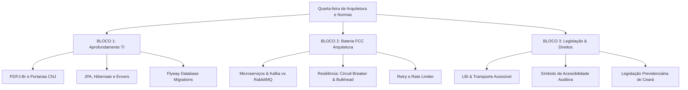

# Guia de Estudos Definitivo — Quarta-feira 24/06/2026
## Semana 6 | Dia 38 | TJ-CE 2026 (Analista TI - Sistemas)
### Foco: PDPJ-Br & Portarias CNJ, JPA/Hibernate/Envers, Flyway, Microserviços (Kafka, RabbitMQ, Resiliência) e Legislação (PCD & Previdência CE)

---

> ⚠️ **Atenção (Fase 2 - Semana 6):** Hoje estudaremos o coração da arquitetura de TI exigida nos concursos de tribunais modernos. O CNJ com a plataforma PDPJ-Br e suas portarias regulamentares estabelecem o padrão nacional para microsserviços do Judiciário. Além disso, aprofundaremos nas tecnologias de persistência (JPA, Hibernate, Envers, Flyway) e em padrões de arquitetura distribuída e resiliência com Kafka/RabbitMQ. À noite, fechamos com Direitos PCD e Legislação Previdenciária do Ceará.

---

## 🗺️ Mapa de Estudos do Dia

---

## ⚙️ SEÇÃO 1: Aprofundamento — Tecnologia e Normas CNJ

### 1. PDPJ-Br e Portarias CNJ
A Plataforma Digital do Poder Judiciário (PDPJ-Br), instituída pela Resolução CNJ nº 335/2020, visa unificar o trâmite processual no país através de microsserviços integrados a um Marketplace central.
*   **Portaria CNJ nº 131:** Regulamenta o uso de Inteligência Artificial no Judiciário, instituindo a plataforma **Sinapses** como repositório e ambiente de execução de modelos de IA.
*   **Portaria CNJ nº 252, 253 e 284:** Definem os padrões de interoperabilidade, segurança, entrega e documentação de APIs na PDPJ-Br. A comunicação deve ser RESTful sobre JSON, usando JWT (JSON Web Tokens) para autenticação unificada (Single Sign-On).
*   **Portaria CNJ nº 162:** Estabelece diretrizes para o plano de segurança cibernética e resposta a incidentes no ecossistema do Poder Judiciário.

### 2. Persistência de Dados (JPA, Hibernate e Envers)
*   **Estados das Entidades no JPA:**
    *   **Transient:** Entidade recém-criada em memória (`new User()`), sem ID associado e desconhecida pelo EntityManager.
    *   **Managed (Gerenciada):** Entidade associada a um contexto de persistência. Qualquer alteração em seus atributos será automaticamente sincronizada com o banco de dados no momento do *commit/flush*.
    *   **Detached (Desanexada):** Entidade que possui ID associado, mas cujo contexto de persistência foi fechado ou ela foi desanexada explicitamente (`em.detach()`). Alterações não se propagam automaticamente.
    *   **Removed (Removida):** Entidade marcada para exclusão física no banco ao final da transação (`em.remove()`).
*   **Hibernate Envers:** Módulo de auditoria do Hibernate. Ao anotar uma classe com `@Audited`, o Envers gera automaticamente tabelas de histórico (geralmente com sufixo `_AUD`) e registra cada alteração, associando-a a um ID de revisão (`REV`) e tipo de operação (inserção, atualização, deleção).

### 3. Flyway
Ferramenta de migração de banco de dados baseada em convenções de arquivos (Database Migrations).
*   **Convenção de Nomes:** Os arquivos SQL de migração residem no diretório do projeto e devem seguir a nomenclatura: `V<Versão>__<Descrição>.sql` (ex: `V1__create_tables.sql`).
*   **Migrações Repetíveis (Repeatable):** Começam com a letra `R` (ex: `R__create_views.sql`) e são executadas toda vez que seu hash de arquivo sofrer alterações.

---

## 📋 SEÇÃO 2: Bateria FCC — Arquitetura e Resiliência

### 1. Mensageria: Apache Kafka vs RabbitMQ
*   **Apache Kafka:** Orientado a log de commits distribuídos. Armazena mensagens em partições de tópicos no disco de forma sequencial. Os consumidores leem as mensagens controlando seus próprios ponteiros (*offsets*). Ideal para processamento de eventos de alto volume e replay de mensagens (*Event Sourcing*).
*   **RabbitMQ:** Broker de mensagens tradicional baseado no protocolo AMQP. Utiliza o fluxo: *Produtor -> Exchange -> Binding -> Queue -> Consumidor*. A mensagem é removida da fila assim que o consumidor confirma o processamento (*ACK*). Ideal para roteamento complexo de mensagens (Direct, Topic, Fanout, Headers).

### 2. Padrões de Resiliência em Microserviços
*   **Circuit Breaker (Disjuntor):** Evita que falhas em cascata derrubem o ecossistema. Possui 3 estados lógicos:
    1.  *Closed (Fechado):* Funcionamento normal. As requisições passam diretamente.
    2.  *Open (Aberto):* Falhas consecutivas ultrapassam o limite definido. As chamadas falham imediatamente (fast fail), retornando uma resposta padrão (*fallback*).
    3.  *Half-Open (Meio Aberto):* Após um tempo de espera (timeout), permite que poucas requisições de teste passem. Se obtiverem sucesso, o circuito fecha; se falharem, volta a abrir.
*   **Bulkhead:** Isola recursos (pools de threads ou conexões) por microsserviço/operação. Se um serviço falhar ou ficar lento, ele consome apenas seu próprio pool, sem esgotar os recursos de toda a aplicação.
*   **Rate Limiter:** Limita a taxa de requisições que um cliente pode fazer em um intervalo de tempo para evitar sobrecargas e ataques de negação de serviço.

---

## 🏛️ SEÇÃO 3: Legislação — Direitos PCD & Previdência CE

### 1. Direitos das Pessoas com Deficiência (PCD)
*   **LBI (Lei Brasileira de Inclusão - Lei nº 13.146/2015):** Foco em acessibilidade, direito à moradia, educação inclusive e igualdade de oportunidades.
*   **Acessibilidade em Transportes:** Frotas de transporte público coletivo terrestre, aquaviário e aéreo devem ser totalmente acessíveis.
*   **Símbolo de Acessibilidade Auditiva (Lei Federal nº 8.160/1991):** Representa um desenho estilizado de uma orelha cortada por uma linha diagonal. Deve ser colocado obrigatoriamente em locais públicos, guichês, transportes e telas que possuam atendimento prioritário ou recursos adequados para deficientes auditivos.

### 2. Legislação Previdenciária do Estado do Ceará
*   Estudo das normas previdenciárias que regem o regime próprio dos servidores civis do Ceará, com atenção para as contribuições ordinárias, regras de aposentadoria e o fundo de previdência estadual.

---

## 🎯 SEÇÃO 4: Questões Inéditas FCC-Style Comentadas (Padrão Premium)

### Questão 1: JPA/Hibernate (Estados de Entidades)
**(FCC - 2026 - TJ-CE - Analista de TI)** Um desenvolvedor do TJ-CE codificou uma rotina em Java utilizando JPA 2.2 e Hibernate 5 para atualizar os dados cadastrais de um servidor público. O método correspondente executa os seguintes passos lógicos dentro de uma transação ativa gerenciada pelo Spring Framework:

1. Executa a busca da entidade Servidor pelo ID usando `em.find(Servidor.class, id)`.
2. Executa a chamada `em.detach(servidor)` passando a referência obtida.
3. Executa a chamada do método modificador `servidor.setEmail("novo.email@tjce.jus.br")`.
4. Finaliza a transação sem nenhuma chamada subsequente ao EntityManager.

Considerando o comportamento do ciclo de vida das entidades no JPA, após a conclusão bem-sucedida da transação, o estado da entidade no passo 3 e o resultado no banco de dados são, respectivamente:

A) Managed; o e-mail no banco de dados foi atualizado devido à sincronização automática da transação ativa.
B) Detached; o e-mail no banco de dados não sofreu alterações devido à desassociação da entidade com o contexto de persistência.
C) Transient; a entidade tornou-se um novo registro em memória e o banco de dados disparou uma exceção de chave duplicada.
D) Removed; a entidade foi marcada para exclusão física e o registro correspondente foi apagado do banco de dados.
E) Detached; o banco de dados foi atualizado automaticamente no commit através do mecanismo de Dirty Checking.

💡 Resolução Comentada da Questão 1

**Gabarito Correto: B**

**Justificativa:** No passo 2, a entidade foi desanexada explicitamente (`em.detach()`), mudando seu estado de **Managed** para **Detached**. Entidades no estado Detached não são monitoradas pelo provedor de persistência (Hibernate). Logo, modificações de estado realizadas nelas (passo 3) não sofrem Dirty Checking e não são sincronizadas com o banco de dados no encerramento da transação.
**Erro das Falsas:**
*   **A e E** erram ao afirmar que houve atualização no banco.
*   **C** está incorreta; a entidade tem ID válido e foi persistida no passado, logo não é Transient.
*   **D** está incorreta; o método de remoção não foi invocado.

### Questão 2: Arquitetura de Microserviços (Mensageria Kafka)
**(FCC - 2026 - TJ-CE - Analista de TI)** Para viabilizar o processamento em tempo real de eventos gerados pelos diários de justiça eletrônicos, o TJ-CE adotou uma arquitetura orientada a eventos baseada no Apache Kafka. O Comitê de Arquitetura exige que a distribuição e o consumo de dados de um determinado tópico de eventos garantam a ordenação estrita das mensagens de um mesmo processo judicial, ao mesmo tempo que permite o consumo paralelo e concorrente dos eventos de processos diferentes por múltiplas instâncias de microsserviços. Para atender a esses requisitos na arquitetura do Kafka, o projeto deve implementar:

A) Um único tópico global sem partições lógicas, com todas as instâncias no mesmo grupo de consumidores.
B) Múltiplos tópicos, um para cada processo judicial, com conexões síncronas de baixo atraso.
C) Definição de chaves de partição (Partition Keys) baseadas no número do processo judicial, associadas a um tópico com múltiplas partições.
D) Uso de exchanges do tipo Fanout roteando dados para filas com confirmação manual de offset.
E) Implementação do padrão Circuit Breaker no produtor de eventos com timeout síncrono configurado no broker.

💡 Resolução Comentada da Questão 2

**Gabarito Correto: C**

**Justificativa:** No Apache Kafka, a garantia de ordenação estrita ocorre apenas **no nível de partição**. Ao definir a chave da mensagem (Partition Key) com o ID/Número do Processo, o Kafka garante que todas as mensagens com aquela mesma chave sejam direcionadas para a mesma partição física. Como o tópico possui múltiplas partições, instâncias concorrentes de consumidores (no mesmo grupo) podem ler partições diferentes em paralelo, permitindo concorrência para processos distintos sem perder a ordem para mensagens do mesmo processo.
**Erro das Falsas:**
*   **A** elimina a possibilidade de processamento paralelo concorrente de múltiplos consumidores ativos, gerando gargalo.
*   **B** é inviável, pois criar milhões de tópicos individuais estoura o gerenciamento de metadados do Kafka.
*   **D** mistura conceitos do RabbitMQ (exchanges Fanout) com o Kafka.
*   **E** descreve padrões de resiliência e não de distribuição e ordenação de mensagens.

### Questão 3: Direito das Pessoas com Deficiência (Símbolo Internacional de Acessibilidade Auditiva)
**(FCC - 2026 - TJ-CE - Analista de TI)** Um analista de infraestrutura do TJ-CE está revisando o projeto básico de sinalização e acessibilidade de um novo fórum regional no Ceará. Em conformidade com a Lei Federal nº 8.160/1991, que dispõe sobre a caracterização do Símbolo Internacional de Acessibilidade Auditiva, o referido símbolo deve ser obrigatoriamente colocado em:

A) Todas as vagas de estacionamento destinadas exclusivamente a pessoas com deficiência física ou motora.
B) Todos os locais de acesso público que ofereçam serviços especializados para pessoas portadoras de deficiência física.
C) Sanitários públicos adaptados e áreas de saída de emergência dos edifícios públicos de interesse judiciário.
D) Todos os locais que possibilitem o acesso, a circulação e a utilização por pessoas portadoras de deficiência auditiva, bem como em todos os veículos de transporte coletivo que possuam cabine de atendimento adaptada.
E) Dispositivos móveis de telefonia celular fornecidos aos magistrados do tribunal.

💡 Resolução Comentada da Questão 3

**Gabarito Correto: D**

**Justificativa:** A Lei nº 8.160/1991 estabelece que o Símbolo Internacional de Acessibilidade Auditiva (orelha cortada por barra diagonal) deve ser utilizado em todos os locais e serviços que possibilitem o acesso ou atendimento de pessoas com deficiência auditiva, além de veículos de transporte coletivo adaptados.
**Erro das Falsas:**
*   **A** descreve a sinalização do Símbolo Internacional de Acesso (cadeirante), focado em deficiência física.
*   **B e C** focam em deficiência física/motora ou acessibilidade universal, não na sinalização de acessibilidade auditiva específica prevista no normativo.
*   **E** é uma regra descabida criada para tentar confundir o candidato na prova.

