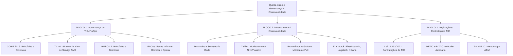

# Guia de Estudos Definitivo — Quinta-feira 25/06/2026
## Semana 6 | Dia 39 | TJ-CE 2026 (Analista TI - Sistemas)
### Foco: Governança de TI (COBIT, ITIL v4, PMBOK 7), FinOps, Observabilidade (Zabbix, Prometheus, Grafana, ELK Stack), Redes e Sistemas Operacionais, Contratações de TIC (Lei 14.133/2021), PDTIC, PETIC e TOGAF

---

> ⚠️ **Atenção (Fase 2 - Semana 6):** Hoje entramos em uma tríade de altíssima relevância para as provas de Analista da FCC: a governança corporativa de TI (envolvendo COBIT, ITIL v4, PMBOK 7 e o moderno FinOps), a infraestrutura com foco em Observabilidade (essencial para sustentação de microsserviços e nuvem no Judiciário) e a complexa legislação/normativa pública que rege as contratações e planejamento estratégico de TIC (com foco absoluto na Nova Lei de Licitações - Lei nº 14.133/2021, PDTIC, PETIC e TOGAF). A banca costuma explorar conceitos e cenários simulando a tomada de decisão de gestores e analistas públicos.

---

## 🗺️ Mapa de Estudos do Dia

---

## ⚙️ SEÇÃO 1: Aprofundamento — Governança de TI e FinOps

### 1. COBIT (Control Objectives for Information and Related Technologies)
O COBIT 2019 é o framework global para governança e gestão de TI da informação e tecnologia corporativa.
*   **Diferença entre Governança e Gestão:**
    *   *Governança (Avaliar, Direcionar e Monitorar - EDM):* Responsabilidade do conselho de administração. Define as necessidades e metas corporativas, monitorando o alinhamento com a estratégia.
    *   *Gestão (Planejar, Construir, Executar e Monitorar - APO, BAI, DSS, MEA):* Responsabilidade da gerência executiva. Conduz as atividades diárias para atingir os objetivos traçados pela governança.
*   **Componentes de um Sistema de Governança:** Processos, estruturas organizacionais, princípios/políticas/frameworks, fluxos de informação, cultura/ética/comportamento, pessoas/habilidades/competências, e serviços/infraestrutura/aplicações.

### 2. ITIL v4 (Information Technology Infrastructure Library)
Foco no gerenciamento de serviços de TI modernos através da co-criação de valor.
*   **Sistema de Valor de Serviço (SVS):** Descreve como todos os componentes e atividades da organização trabalham juntos para facilitar a criação de valor.
    *   *Componentes do SVS:* Princípios Orientadores, Governança, Cadeia de Valor de Serviço (SVC), Práticas e Melhoria Contínua.
*   **Cadeia de Valor de Serviço (SVC - Service Value Chain):** O modelo operacional central do ITIL v4, contendo 6 atividades principais:
    1.  *Planejar (Plan)*
    2.  *Melhorar (Improve)*
    3.  *Engajar (Engage)*
    4.  *Desenho e Transição (Design & Transition)*
    5.  *Obtenção/Construção (Obtain/Build)*
    6.  *Entrega e Suporte (Deliver & Support)*

### 3. PMBOK 7 (Project Management Body of Knowledge)
Mudou drasticamente o foco de "processos" para um modelo baseado em **Princípios** e **Domínios de Desempenho**.
*   **12 Princípios de Entrega de Projetos:** Custódia, Equipe, Partes Interessadas, Valor, Pensamento Sistêmico, Liderança, Adaptação, Qualidade, Complexidade, Risco, Adaptabilidade/Resiliência, e Mudança.
*   **8 Domínios de Desempenho do Projeto:** Partes Interessadas, Equipe, Abordagem de Desenvolvimento e Ciclo de Vida, Planejamento, Trabalho do Projeto, Entrega, Medição, e Incerteza.

### 4. FinOps (Financial Operations)
Prática cultural e operacional que promove a responsabilidade financeira sobre o consumo de nuvem (Cloud Computing).
*   **As 3 Fases do Ciclo FinOps:**
    1.  **Informar (Inform):** Fornecer visibilidade total sobre custos corporativos, alocação e orçamentos (tags, relatórios).
    2.  **Otimizar (Optimize):** Identificar desperdícios, redimensionar recursos (rightsizing) e aproveitar descontos por compromisso (instâncias reservadas).
    3.  **Operar (Operate):** Integrar práticas financeiras e de engenharia no cotidiano, automatizando políticas e avaliando o ROI continuamente.

---

## 📋 SEÇÃO 2: Bateria FCC — Infraestrutura e Observabilidade

### 1. Protocolos e Infraestrutura
*   **TCP/IP e Serviços de Rede:** DNS (Resolução de nomes sobre UDP/TCP 53), DHCP (Configuração dinâmica de IPs sobre UDP 67/68), HTTP/HTTPS (Transmissão de hipertexto sobre TCP 80/443), e SNMP (Gerenciamento de redes sobre UDP 161/162).
*   **Sistemas Operacionais:** Gerenciamento de memória (memória virtual, paginação e swap), escalonamento de processos e sistemas de arquivos distribuídos/locais.

### 2. Zabbix (Monitoramento Tradicional)
Ferramenta robusta para monitoramento de rede e servidores baseada em estado.
*   **Zabbix Agent (Ativo vs Passivo):**
    *   *Modo Passivo:* O servidor Zabbix solicita os dados de métricas na porta do agente (geralmente TCP 10050). O agente apenas responde à requisição.
    *   *Modo Ativo:* O agente solicita a lista de itens a serem monitorados ao servidor Zabbix (porta TCP 10051), coleta os dados localmente e os envia ao servidor em lote.
*   **Proxy Zabbix:** Permite coletar dados de localizações remotas, distribuindo a carga de processamento e contornando limitações de firewall.

### 3. Prometheus & Grafana (Monitoramento de Microsserviços e Cloud Native)
*   **Prometheus:** Banco de dados de séries temporais (TSDB) focado em métricas numéricas. Utiliza o modelo de **Pull (Busca)**, onde o servidor do Prometheus raspa (*scrapes*) as métricas expostas por exporters em endpoints HTTP (geralmente `/metrics`).
*   **Grafana:** Ferramenta de visualização e analítica de dados que se conecta ao Prometheus e outras fontes para construir dashboards analíticos interativos de alta fidelidade visual.

### 4. ELK Stack (Observabilidade e Análise de Logs)
*   **Elasticsearch:** Mecanismo de busca e análise de dados distribuído baseado em documentos JSON. Atua como o repositório centralizado dos logs.
*   **Logstash:** Pipeline de processamento de dados do lado do servidor que ingere dados de múltiplas fontes simultaneamente, transforma os dados (usando filtros) e os envia para o Elasticsearch.
*   **Kibana:** Interface de usuário que permite visualizar os dados do Elasticsearch através de gráficos, tabelas e mapas em tempo real.
*   **Fluentd / Fluent Bit:** Alternativas leves ao Logstash para coleta e roteamento de logs para o Elasticsearch.

---

## 🏛️ SEÇÃO 3: Legislação & Governança Pública

### 1. Contratações de TIC e a Lei nº 14.133/2021 (Nova Lei de Licitações)
A contratação de soluções de TIC no serviço público exige planejamento rigoroso devido ao alto risco de insucesso e obsolescência.
*   **Planejamento da Contratação:** Compreende três documentos fundamentais:
    1.  **Estudo Técnico Preliminar (ETP):** Documento que justifica a necessidade da contratação, analisa a viabilidade técnica e econômica e escolhe a melhor solução.
    2.  **Termo de Referência (TR):** Define o objeto, requisitos de qualidade, critérios de aceitação e modelo de gestão do contrato.
    3.  **Análise de Riscos:** Identifica potenciais eventos que possam comprometer a contratação e define estratégias de tratamento.
*   **Vedações Específicas:** É proibido contratar soluções sem a devida justificativa técnica no ETP, ou direcionar a contratação para marcas/fornecedores específicos sem justificativa de padronização.

### 2. PDTIC e PETIC (Poder Judiciário)
*   **PETIC (Planejamento Estratégico de TIC):** Define a visão de futuro, a missão, as metas e os objetivos de TIC do órgão a longo prazo (geralmente alinhados com o CNJ).
*   **PDTIC (Plano Diretor de Tecnologia da Informação e Comunicação):** Documento tático-operacional de médio prazo que detalha as ações, projetos, recursos financeiros e humanos necessários para concretizar o PETIC.

### 3. TOGAF (The Open Group Architecture Framework)
O framework de arquitetura corporativa mais utilizado do mundo.
*   **Architecture Development Method (ADM):** O núcleo do TOGAF. É um ciclo iterativo dividido em fases:
    *   *Fase Preliminar:* Preparação e definição do escopo.
    *   *Fase A: Visão de Arquitetura:* Alinhamento de escopo e expectativas dos stakeholders.
    *   *Fase B: Arquitetura de Negócio.*
    *   *Fase C: Arquiteturas de Sistemas de Informação (Dados e Aplicação).*
    *   *Fase D: Arquitetura de Tecnologia.*
    *   *Fases E a H:* Planejamento de Transição, Implementação e Governança de Mudanças.

---

## 🎯 SEÇÃO 4: Questões Inéditas FCC-Style Comentadas (Padrão Premium)

### Questão 1: Governança de TI (COBIT 2019 vs ITIL v4)
**(FCC - 2026 - TJ-CE - Analista de TI)** Uma equipe de governança de TIC do Tribunal de Justiça do Ceará recebeu a atribuição de estruturar um novo portal de serviços digitais voltado para os cidadãos. Para alinhar os objetivos institucionais e operacionais, planejam integrar práticas do COBIT 2019 e do ITIL v4. No contexto do alinhamento entre esses dois frameworks, assinale a alternativa que descreve a correlação conceitual correta:

A) A governança no COBIT 2019 foca em planejar e construir o sistema de serviços, enquanto o ITIL v4 restringe-se exclusivamente a avaliar, direcionar e monitorar a operação final de hardware e servidores.
B) O Sistema de Valor de Serviço (SVS) do ITIL v4 fornece um ecossistema completo para a criação de valor, cujas atividades de sua Cadeia de Valor de Serviço (SVC) podem ser governadas e avaliadas através dos objetivos de governança e gestão mapeados no modelo de referência do COBIT 2019.
C) Os Princípios Orientadores do ITIL v4 substituem integralmente as 5 áreas de foco de governança descritas no COBIT 2019, eliminando a necessidade de mapeamento de processos no nível organizacional.
D) O COBIT 2019 orienta a criação de projetos baseados puramente em processos preditivos, contrapondo-se à flexibilidade ágil promovida pela Cadeia de Valor do ITIL v4, que atua exclusivamente em fluxos contínuos sem controle de portfólio.
E) O ITIL v4 centraliza sua estrutura no monitoramento exclusivo de segurança física e redes, deixando as demais práticas de governança e contratações externas de software a cargo exclusivo da governança corporativa do COBIT 2019.

💡 Resolução Comentada da Questão 1

**Gabarito Correto: B**

**Justificativa:** COBIT e ITIL são complementares. O COBIT 2019 provê o modelo de referência com os objetivos de controle, governança e gestão (EDM, APO, BAI, DSS, MEA) para avaliar e auditar toda a TI corporativa, enquanto o ITIL v4 fornece as práticas e atividades na Cadeia de Valor de Serviço (SVC) para a entrega e co-criação do valor na gestão operacional dos serviços de tecnologia.
**Erro das Falsas:**
*   **A** inverte a lógica: a governança foca em avaliar, direcionar e monitorar (EDM no COBIT).
*   **C** afirma incorretamente que um framework elimina a necessidade do outro ou substitui integralmente a gestão de processos.
*   **D** e **E** criam falsas exclusões e caricaturam o escopo operacional de ambos os frameworks, limitando-os de forma errônea.

---

### Questão 2: Observabilidade & Cloud Native (Prometheus vs ELK Stack)
**(FCC - 2026 - TJ-CE - Analista de TI)** Um Tribunal de Justiça estadual migrou seu sistema de processos eletrônicos para um ambiente de nuvem Kubernetes utilizando microsserviços Java e Node.js. Para garantir a observabilidade de toda a infraestrutura, a gerência de monitoramento determinou que a coleta de logs distribuídos e a extração de métricas de desempenho em tempo real sigam padrões de mercado adequados à elasticidade do ambiente. Nesse contexto, para estruturar a arquitetura de observabilidade, a equipe de TI deve implementar:

A) O Prometheus em conjunto com exporters HTTP locais, que operarão em modo Push ativo, forçando o envio periódico das métricas dos containers diretamente para o Elasticsearch para que este faça a análise estatística.
B) A ferramenta Grafana como repositório primário de logs, configurando-a para ingerir diretamente os arquivos raw de logs dos servidores web através de agentes Zabbix integrados ao kernel do SO.
C) O Prometheus configurado para realizar o scrape (pull) de endpoints HTTP expostos pelas aplicações, armazenando os dados em seu TSDB para consumo pelo Grafana, enquanto a ingestão de logs é feita via pipeline do Logstash ou Fluentd com destino ao Elasticsearch (ELK Stack).
D) O Zabbix Agent passivo instalado em cada container de microsserviço, que realizará chamadas REST periódicas para gravar as métricas no banco de dados NoSQL do Kibana, garantindo o replay de transações se houver falhas.
E) O Logstash configurado para monitorar unicamente as portas de rede UDP de logs usando SNMPv3, uma vez que o Elasticsearch não suporta a indexação de payloads JSON complexos gerados em ambientes distribuídos.

💡 Resolução Comentada da Questão 2

**Gabarito Correto: C**

**Justificativa:** Esta é a arquitetura clássica e padrão do mercado de observabilidade moderna em microsserviços. O Prometheus atua coletando métricas numéricas via Pull (scrape HTTP) e armazenando-as em seu banco de dados de série temporal (TSDB), permitindo sua exibição no Grafana. Simultaneamente, para logs de texto estruturados, a ELK Stack (ou variante com Fluentd/Fluent Bit) capta e processa os fluxos de logs, indexando-os no Elasticsearch para busca no Kibana.
**Erro das Falsas:**
*   **A** está errada porque o Prometheus usa nativamente o modelo de Pull (e não Push forçado para o Elasticsearch).
*   **B** coloca o Grafana como repositório primário de logs, o que é conceitualmente incorreto (o Grafana é visualizador, não repositório ou indexador primário).
*   **D** mistura conceitos ao dizer que o Kibana possui um banco de dados NoSQL próprio para replays.
*   **E** afirma absurdamente que o Elasticsearch não suporta payloads JSON (sendo que ele armazena dados justamente em documentos estruturados em JSON).

---

### Questão 3: Licitações e Contratações de TIC (Lei nº 14.133/2021)
**(FCC - 2026 - TJ-CE - Analista de TI)** Na contratação de soluções de Tecnologia da Informação e Comunicação (TIC) sob a égide da Lei nº 14.133/2021, o Tribunal de Justiça do Ceará determinou que todas as novas contratações sejam precedidas por um rigoroso planejamento instruído por agentes públicos designados. De acordo com a Nova Lei de Licitações e as boas práticas de contratações de TIC na Administração Pública, na fase preparatória da contratação:

A) O Estudo Técnico Preliminar (ETP) é dispensável em contratações de software proprietário, devendo o Termo de Referência (TR) ser elaborado diretamente a partir das cotações comerciais apresentadas pelos fabricantes.
B) É expressamente permitida a indicação de marca no Termo de Referência sem a necessidade de justificativa prévia ou comprovação de compatibilidade técnica, desde que a marca escolhida conste no catálogo de produtos aprovado pelo CNJ.
C) O planejamento deve prever a segregação de funções, assegurando que o agente responsável pela elaboração do Estudo Técnico Preliminar (ETP) e da Análise de Riscos não seja o mesmo servidor responsável pela fiscalização técnica do contrato durante sua execução operacional.
D) O Estudo Técnico Preliminar (ETP) deve identificar as diferentes alternativas de mercado e justificar a escolha da solução de TIC adotada, inclusive com estimativa dos custos totais de propriedade (TCO), para demonstrar a viabilidade técnica, econômica e operacional da contratação.
E) A vigência máxima dos contratos de fornecimento contínuo de soluções de TIC é de 1 ano, proibindo-se quaisquer prorrogações sucessivas mesmo em casos de sistemas de suporte à atividade finalística do tribunal.

💡 Resolução Comentada da Questão 3

**Gabarito Correto: D**

**Justificativa:** O ETP é a espinha dorsal da fase preparatória de contratação de soluções de TIC. Ele deve estudar as soluções existentes no mercado, estimar o custo total do ciclo de vida da solução (TCO - Total Cost of Ownership) e justificar de forma inequívoca a viabilidade técnica e financeira da solução selecionada em detrimento das demais.
**Erro das Falsas:**
*   **A** está errada porque o ETP é obrigatório e fundamental exatamente para justificar a escolha, inclusive quando se trata de software proprietário versus software livre.
*   **B** está incorreta porque a indicação de marcas é uma exceção e exige justificativa técnica robusta e fundamentada (e não há permissão tácita genérica).
*   **C** está incorreta porque a segregação de funções impede que o mesmo agente realize tarefas incompatíveis de aprovação e execução direta no ciclo de controle/ordenação de despesas, mas a participação de analistas técnicos no planejamento e posterior fiscalização técnica do contrato é perfeitamente comum e salutar (a segregação clássica impede, por exemplo, o fiscal de autorizar pagamentos ou adjudicar a licitação).
*   **E** está incorreta pois a Lei 14.133/2021 permite vigência de serviços contínuos por até 5 anos (art. 106), prorrogáveis por até 10 anos (art. 107).

