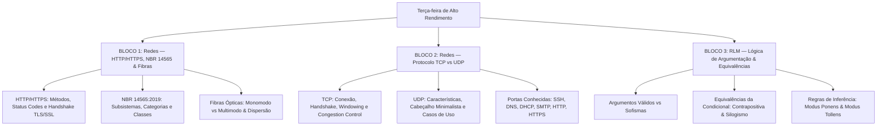

# Guia de Estudos Definitivo — Terça-feira 26/05/2026
## Semana 2 | Dia 9 | TJ-CE 2026 (Analista TI - Sistemas)
### Foco Absoluto: Banca FCC — Doutrina, Detalhes Ocultos, Pegadinhas e Casos Práticos

---

## 🗺️ Mapa de Estudos do Dia



---

## 🌐 SEÇÃO 1: HTTP/HTTPS, ABNT NBR 14565:2019 e Fibras Ópticas

Esta seção une os conceitos lógicos da camada de aplicação web aos conceitos físicos de cabeamento estruturado e transmissão por luz, ambos muito exigidos pela FCC.

### 1. HTTP/HTTPS (Camada de Aplicação)

O **HTTP (Hypertext Transfer Protocol)** é o protocolo base da Web. Opera em arquitetura cliente-servidor (estilo requisição-resposta) sobre a porta TCP 80 (HTTP) ou TCP 443 (HTTPS).

#### A. Métodos HTTP (Verbos)
*   **GET:** Solicita a representação de um recurso. Não deve alterar o estado do servidor (é seguro e idempotente).
*   **POST:** Envia dados para o servidor (geralmente para criar um recurso ou processar formulários). Não é seguro nem idempotente.
*   **PUT:** Substitui todas as representações atuais do recurso de destino pelos dados da requisição (idempotente).
*   **DELETE:** Remove o recurso especificado (idempotente).
*   **PATCH:** Aplica modificações parciais a um recurso (não é necessariamente idempotente, mas frequentemente tratado como tal).
*   **HEAD:** Idêntico ao GET, mas o servidor responde apenas com os cabeçalhos (headers), sem o corpo (body). Útil para verificar se um recurso mudou ou se existe.
*   **OPTIONS:** Retorna os métodos HTTP suportados pelo servidor para aquele recurso (muito usado em CORS).

> **O que é Idempotência?** Um método é idempotente se múltiplas requisições idênticas produzem o mesmo efeito e estado no servidor que uma única requisição. GET, PUT, DELETE, HEAD e OPTIONS são idempotentes. POST e PATCH não são.

#### B. Códigos de Status (Status Codes)
A FCC cobra decoreba e cenários práticos dos status codes:
*   **1xx (Informativos):** Ex: `100 Continue` (o cliente pode continuar enviando o corpo da requisição).
*   **2xx (Sucesso):**
    *   `200 OK`: Requisição atendida com sucesso.
    *   `201 Created`: Requisição bem-sucedida e um novo recurso foi criado (geralmente resposta de um POST).
    *   `204 No Content`: Requisição bem-sucedida, mas a resposta não tem corpo (comum em DELETE ou PUT).
*   **3xx (Redirecionamento):**
    *   `301 Moved Permanently`: O recurso mudou de URI permanentemente.
    *   `302 Found` (antigo Temporary Redirect): O recurso está temporariamente em outra URI.
    *   `304 Not Modified`: O recurso não mudou desde a última requisição (usado para cache local).
*   **4xx (Erro do Cliente):**
    *   `400 Bad Request`: A requisição está malformada.
    *   `401 Unauthorized`: O cliente precisa se autenticar para obter a resposta (falta credenciais).
    *   `403 Forbidden`: O cliente está autenticado, mas não tem permissão de acesso ao recurso.
    *   `404 Not Found`: O recurso solicitado não existe no servidor.
    *   `405 Method Not Allowed`: O método HTTP utilizado não é permitido para o recurso (ex: tentar enviar POST em recurso somente GET).
*   **5xx (Erro do Servidor):**
    *   `500 Internal Server Error`: Erro genérico no código do servidor.
    *   `502 Bad Gateway`: O servidor (agindo como gateway ou proxy) recebeu uma resposta inválida do servidor upstream.
    *   `503 Service Unavailable`: O servidor está temporariamente sobrecarregado ou em manutenção.
    *   `504 Gateway Timeout`: O servidor proxy não recebeu uma resposta a tempo do servidor de origem.

#### C. HTTPS e o Handshake TLS/SSL
O HTTPS é o HTTP encapsulado dentro de uma camada criptográfica: **SSL (Secure Sockets Layer)** ou, modernamente, **TLS (Transport Layer Security)**.
O **Handshake TLS** realiza a autenticação do servidor (e opcionalmente do cliente) e estabelece as chaves de criptografia simétrica para a sessão.

```
Cliente                                                     Servidor
   │                                                           │
   ├─────── ClientHello (Cifras suportadas, versão, random) ──>│
   │                                                           │
   │<────── ServerHello (Cifra escolhida, random) ─────────────┤
   │<────── Certificate (Certificado digital X.509) ───────────┤
   │<────── ServerKeyExchange / ServerHelloDone ───────────────┤
   │                                                           │
   ├─────── ClientKeyExchange (Pre-master secret cifrado) ────>│
   ├─────── [ChangeCipherSpec] e Finished (Mensagem cifrada) ─>│
   │                                                           │
   │<────── [ChangeCipherSpec] e Finished ─────────────────────┤
   │                                                           │
   │◄───────────────── Dados Criptografados (Simétrico) ──────►│
```

---

### 2. ABNT NBR 14565:2019 (Cabeamento Estruturado)

A norma brasileira **ABNT NBR 14565:2019** padroniza os sistemas de cabeamento estruturado para edifícios comerciais e data centers. A FCC cobra a nomenclatura dos elementos e os limites de distância.

#### A. Subsistemas e Distribuidores de Rede
*   **Distribuidor de Campus (CD - Campus Distributor):** Ponto central de conexão do campus.
*   **Distribuidor de Edifício (BD - Building Distributor):** Ponto de conexão de um edifício individual.
*   **Distribuidor de Piso (FD - Floor Distributor):** Atende a um andar específico.
*   **Ponto de Consolidação (CP - Consolidation Point):** Ponto de conexão intermediário opcional no cabeamento horizontal (entre o FD e a tomada).
*   **Tomada de Equipamento / Telecomunicações (TO - Telecommunications Outlet):** A tomada RJ-45 de parede na área de trabalho (WA).

```
   [CD] (Campus) 
     │ (Cabeamento de Backbone de Campus - Max 2000m)
   [BD] (Edifício)
     │ (Cabeamento de Backbone de Edifício - Max 500m)
   [FD] (Piso/Andar)
     │ (Cabeamento Horizontal - Max 90m de cabo rígido + 10m de patch cords = 100m canal total)
   [TO] (Tomada de Telecomunicações na Área de Trabalho)
```

#### B. Classes de Desempenho e Categorias de Cabos
Você precisa saber a associação entre a **Categoria** do cabo físico e a **Classe** de desempenho de transmissão do canal de comunicação:

| Categoria do Cabo | Classe do Canal | Frequência Máxima | Aplicações Comuns |
|---|---|---|---|
| **Categoria 5e** | Classe D | 100 MHz | Fast Ethernet (100 Mbps), Gigabit Ethernet (1 Gbps) |
| **Categoria 6** | Classe E | 250 MHz | Gigabit Ethernet (1 Gbps), 10GBASE-T (distâncias curtas ~37-55m) |
| **Categoria 6A** | Classe Ea | 500 MHz | 10 Gigabit Ethernet (10 Gbps) em canal completo de 100m |
| **Categoria 7** | Classe F | 600 MHz | 10 Gbps com blindagem individual por par (S/FTP) |
| **Categoria 7A** | Classe Fa | 1000 MHz (1 GHz) | Transmissões de alta velocidade, vídeo banda larga |
| **Categoria 8.1 / 8.2** | Classe I / II | 2000 MHz (2 GHz) | 25 Gbps / 40 Gbps em data centers (limite de 30 metros de canal) |

---

### 3. Fibras Ópticas (Monomodo vs. Multimodo)

As fibras ópticas transmitem sinais de dados modulados em ondas de luz através de um núcleo de vidro ou plástico.

#### A. Fibra Monomodo (SMF - Single Mode Fiber)
*   **Núcleo:** Muito fino (geralmente de **8 a 10 micrômetros - µm**).
*   **Propagação:** A luz se propaga em um **único caminho (modo)** retilíneo.
*   **Fonte de Luz:** Lasers de alta potência.
*   **Alcance:** Longuíssimo alcance (dezenas de quilômetros) sem necessidade de repetidores.
*   **Dispersão:** **Não possui dispersão modal** (apenas dispersão cromática residual).
*   **Custo:** Cabos mais baratos, porém os transceptores (GBIC/SFP) e emissores laser são muito caros.

#### B. Fibra Multimodo (MMF - Multi Mode Fiber)
*   **Núcleo:** Mais largo (geralmente **50 ou 62.5 micrômetros - µm**).
*   **Propagação:** A luz entra sob diferentes ângulos e se propaga por **múltiplos caminhos (modos)** refletindo nas paredes do núcleo.
*   **Fonte de Luz:** LEDs ou VCSELs (lasers de cavidade vertical).
*   **Alcance:** Curto alcance (geralmente até 550m em 10 Gbps).
*   **Dispersão:** **Sofre severa dispersão modal** (a luz de caminhos diferentes chega em tempos diferentes, alargando o pulso original e limitando a taxa de transmissão/distância).
*   **Custo:** Cabos ligeiramente mais caros, porém transceptores e placas ópticas de LED são significativamente mais baratos.

---

## 🚦 SEÇÃO 2: Protocolo TCP vs. UDP e Controle de Fluxo/Congestionamento

Na camada de transporte do modelo TCP/IP, o TCP e o UDP dividem o tráfego da rede. A FCC ama cobrar a mecânica de controle de transmissão do TCP.

### 1. TCP (Transmission Control Protocol)
*   **Orientado à Conexão:** Exige o estabelecimento prévio de uma sessão lógica (Handshake de 3 vias) antes de enviar dados.
*   **Confiável:** Garante a entrega dos dados na ordem correta por meio de números de sequência, confirmações (ACKs) e retransmissões.
*   **Controle de Fluxo e de Congestionamento:** Mecanismos para não sobrecarregar o receptor nem os roteadores intermediários.
*   **Cabeçalho Mínimo:** **20 bytes** (sem opções adicionais).

#### A. O Handshake de 3 Vias (Three-Way Handshake)
Estabelece a conexão e sincroniza os números de sequência iniciais (ISN).

```
Cliente                                                     Servidor
   │                                                           │
   ├─────── SYN (Sincronizar, seq = x) ───────────────────────>│  (Servidor Escuta)
   │                                                           │
   │<────── SYN-ACK (Sinc/Confirma, seq = y, ack = x + 1) ─────┤  (Conexão estabelecida)
   │                                                           │
   ├─────── ACK (Confirma, seq = x + 1, ack = y + 1) ─────────>│  (Conexão estabelecida)
```

#### B. O Encerramento de Conexão (Teardown)
Usa o flag **FIN** (Finish). O encerramento padrão exige **4 passos**:
1.  Cliente envia **FIN**.
2.  Servidor responde **ACK** (a conexão fica "meio aberta": o cliente não envia mais dados, mas ainda pode receber).
3.  Servidor envia **FIN** (quando terminar de transmitir seus dados).
4.  Cliente responde **ACK** (o cliente entra em estado `TIME_WAIT` antes de fechar de vez).

#### C. Controle de Fluxo: Janela Deslizante (Sliding Window)
*   Evita que o emissor envie dados mais rápido do que o buffer do receptor consegue processar.
*   O receptor anuncia no cabeçalho TCP o campo **Window Size** (tamanho da janela de recepção), informando quantos bytes ele é capaz de aceitar antes de exigir um ACK de confirmação.

#### D. Controle de Congestionamento TCP
Evita que a rede entre em colapso devido ao excesso de pacotes nos buffers dos roteadores. O emissor mantém uma variável interna chamada **Congestion Window (cwnd)**. O algoritmo divide-se em 4 etapas clássicas:
1.  **Slow Start (Partida Lenta):** Começa com $cwnd$ baixa (ex: 1 MSS). Para cada ACK recebido, a janela **dobra de tamanho** a cada RTT (crescimento exponencial), até atingir o limite conhecido como **ssthresh (Slow Start Threshold)**.
2.  **Congestion Avoidance (Prevenção de Congestionamento):** Uma vez atingido o *ssthresh*, o crescimento passa a ser **linear** (soma-se 1 MSS por RTT) para evitar saturação abrupta.
3.  **Fast Retransmit (Retransmissão Rápida):** Se o emissor receber **3 ACKs duplicados** (indicando a perda de um pacote específico, mas que os subsequentes chegaram), ele retransmite o pacote perdido imediatamente, sem esperar pelo estouro do temporizador de timeout (RTO).
4.  **Fast Recovery (Recuperação Rápida):** Após a retransmissão rápida, em vez de voltar a janela para 1 MSS (iniciar Slow Start), ele reduz o *ssthresh* pela metade e define a janela como o novo *ssthresh* + 3 MSS, reiniciando o crescimento linear do Congestion Avoidance.

---

### 2. UDP (User Datagram Protocol)
*   **Não orientado à conexão:** Envia datagramas diretamente, sem estabelecer sessão prévia.
*   **Não confiável:** Não garante entrega, ordem, integridade rígida (checksum é opcional no IPv4, embora muito usado) ou controle de fluxo.
*   **Velocidade:** Latência mínima, sem overhead de controle de erros ou sincronização.
*   **Cabeçalho Mínimo:** Apenas **8 bytes** (Origem, Destino, Comprimento, Checksum).
*   **Aplicações:** Streaming de mídia, VoIP, DNS, DHCP, SNMP, jogos online.

---

### 3. Portas de Protocolo Bem Conhecidas (Well-Known Ports)

Você deve memorizar as portas padrão de serviços exigidas na prova:

| Serviço / Protocolo | Porta | Protocolo de Transporte Padrão |
|---|---|---|
| **FTP (Dados)** | 20 | TCP |
| **FTP (Controle)** | 21 | TCP |
| **SSH (Acesso Seguro)** | 22 | TCP |
| **Telnet** | 23 | TCP |
| **SMTP (Envio de E-mail)** | 25 | TCP |
| **DNS (Resolução de Nomes)** | 53 | UDP (consultas normais) / TCP (zone transfers/respostas >512 bytes) |
| **DHCP (Servidor / Cliente)** | 67 / 68 | UDP |
| **TFTP (Trivial FTP)** | 69 | UDP |
| **HTTP** | 80 | TCP |
| **POP3 (Recebimento E-mail)** | 110 | TCP |
| **NTP (Sincronização Tempo)** | 123 | UDP |
| **IMAP (Recebimento E-mail)** | 143 | TCP |
| **SNMP (Gerenciamento)** | 161 (agente) / 162 (gerente) | UDP |
| **LDAP (Diretório)** | 389 | TCP / UDP |
| **HTTPS** | 443 | TCP |
| **Syslog** | 514 | UDP / TCP |
| **LDAPS (LDAP sobre SSL/TLS)** | 636 | TCP |
| **RDP (Área de Trabalho Remota)** | 3389 | TCP / UDP |

---

## ✍️ SEÇÃO 3: RLM — Lógica de Argumentação e Equivalências Lógicas

A lógica de argumentação analisa a **validade estrutural** de um raciocínio. A FCC cobra exaustivamente a validação de argumentos e as regras clássicas de inferência.

### 1. Estrutura de um Argumento Lógico
Um argumento é um conjunto de proposições em que algumas delas são as **premissas** ($P_1, P_2, ..., P_n$) e a última é a **conclusão** ($C$).
*   **Argumento Válido:** A estrutura é tal que, se todas as premissas forem consideradas verdadeiras, a conclusão **obrigatoriamente** deve ser verdadeira.
*   **Sofisma / Falácia / Argumento Inválido:** A conclusão pode ser falsa mesmo se todas as premissas forem verdadeiras.

> **Importante:** A validade de um argumento depende puramente da sua **forma lógica**, e não do conteúdo real ou da verdade factual das frases.

---

### 2. Principais Regras de Inferência
As regras de inferência são formas de argumentos que são **sempre válidos**.

#### A. Modus Ponens (Afirmação do Antecedente)
Se temos uma condicional e afirmamos a primeira parte (antecedente), podemos concluir a segunda parte (consequente).
$$\text{Premissas: } \begin{cases} p \rightarrow q \\ p \end{cases} \implies \text{Conclusão: } q$$
*   *Exemplo:* "Se chover, a rua fica molhada. Choveu. Logo, a rua ficou molhada."

#### B. Modus Tollens (Negação do Consequente)
Se temos uma condicional e negamos a segunda parte (consequente), podemos concluir a negação da primeira parte (antecedente).
$$\text{Premissas: } \begin{cases} p \rightarrow q \\ \neg q \end{cases} \implies \text{Conclusão: } \neg p$$
*   *Exemplo:* "Se chover, a rua fica molhada. A rua não está molhada. Logo, não choveu."

> [!CAUTION]
> **As Duas Falácias Formais Favoritas da FCC:**
> 1. **Falácia da Afirmação do Consequente:** Tentar fazer $p \rightarrow q$ e $q \implies p$. 
>    *(Ex: "Se chover, a rua fica molhada. A rua está molhada. Logo, choveu." - Falso, a rua pode ter sido molhada por um balde de água).*
> 2. **Falácia da Negação do Antecedente:** Tentar fazer $p \rightarrow q$ e $\neg p \implies \neg q$.
>    *(Ex: "Se chover, a rua fica molhada. Não choveu. Logo, a rua não está molhada." - Falso, pode ter sido molhada de outra forma).*

---

### 3. Equivalências Lógicas Clássicas
Duas proposições são equivalentes ($\equiv$) se possuem tabelas-verdade idênticas.

#### A. Equivalências da Condicional ($p \rightarrow q$)
A FCC exige de cabeça as duas equivalências da condicional:
1.  **Contrapositiva (Modus Tollens Equivalência):** Inverte as duas proposições e nega ambas.
    $$(p \rightarrow q) \equiv (\neg q \rightarrow \neg p)$$
2.  **Equivalência da Disjunção (Regra do Silogismo/Nega-ou):** Nega a primeira parte, troca o conectivo para "OU" e mantém a segunda parte.
    $$(p \rightarrow q) \equiv (\neg p \lor q)$$

---

## 🎯 SEÇÃO 4: Questões Inéditas FCC-Style Comentadas Passo a Passo

### Questão 1: Cabeamento Estruturado (ABNT NBR 14565:2019)
**(FCC - Adaptada)** Um Analista Judiciário de TI está planejando o projeto de cabeamento estruturado para o novo edifício do anexo administrativo do TJ-CE. O projeto deve seguir rigorosamente a norma ABNT NBR 14565:2019. Em conformidade com essa norma, o comprimento máximo permitido para o cabeamento horizontal (cabo rígido permanente), excluindo os cabos de manobra (patch cords) da área de trabalho e do distribuidor de piso, e a classe de desempenho que opera a uma frequência máxima de 250 MHz são, respectivamente:

A) 100 metros e Classe Ea.
B) 90 metros e Classe E.
C) 90 metros e Classe D.
D) 100 metros e Classe D.
E) 80 metros e Classe F.

#### 💡 Resolução Comentada da Questão 1:
*   **Análise das Distâncias:** De acordo com a NBR 14565:2019, o comprimento máximo do cabo rígido no canal de cabeamento horizontal (link permanente) é de **90 metros**. O canal completo pode chegar a 100 metros se considerarmos até 10 metros adicionais de cabos de manobra (patch cords) divididos entre a tomada (TO) e o distribuidor de piso (FD).
*   **Análise das Classes:** A Classe E é especificada para operar com frequências de até **250 MHz** (utilizando cabos de Categoria 6). A Classe D opera a 100 MHz (Cat 5e) e a Classe Ea a 500 MHz (Cat 6A).
*   **Gabarito correto: B.**

---

### Questão 2: Protocolos de Redes (TCP Congestion Control)
**(FCC - Adaptada)** Durante a transmissão de um lote de arquivos PDF contendo atas de julgamento do tribunal via protocolo TCP, o remetente recebe três confirmações consecutivas e duplicadas (ACKs duplicados) referentes a um mesmo segmento de dados enviado. Sob a ótica do mecanismo de controle de congestionamento clássico do protocolo TCP, ao detectar essa ocorrência, o emissor executa imediatamente a etapa de:

A) Slow Start, reduzindo a janela de congestionamento (cwnd) para o tamanho mínimo de 1 MSS para garantir a entrega segura.
B) Fast Retransmit, reenviando o segmento faltante imediatamente sem aguardar o estouro do temporizador de retransmissão (RTO).
C) Congestion Avoidance, reduzindo linearmente a taxa de envio de dados e suspendendo o recebimento de novos pacotes.
D) Teardown, iniciando a finalização da sessão TCP com o envio do flag RST (Reset) devido à instabilidade do canal.
E) Janela Deslizante, expandindo a janela de recepção (Window Size) para compensar o atraso de transmissão.

#### 💡 Resolução Comentada da Questão 2:
*   **Análise do Mecanismo:** A recepção de 3 ACKs duplicados indica que os pacotes seguintes ao pacote perdido chegaram com sucesso ao destino, confirmando que a rede não está em colapso total (apenas houve perda de um pacote pontual). 
*   Para evitar o tempo de espera lento do timeout (RTO), o TCP aciona o **Fast Retransmit (Retransmissão Rápida)** para reenviar o segmento perdido e em seguida ativa a fase de **Fast Recovery**, onde a janela não é reiniciada a 1 (como no Slow Start), mas sim ajustada a ssthresh + 3 MSS.
*   **Gabarito correto: B.**

---

### Questão 3: Raciocínio Lógico (Lógica de Argumentação)
**(FCC - Adaptada)** Considere as seguintes premissas de um argumento formulado em um processo administrativo:
1. Se o servidor acessar a rede corporativa sem criptografia, então ele vulnerabiliza o sistema do tribunal.
2. Se o servidor vulnerabiliza o sistema do tribunal, então a equipe de segurança é acionada e o log de auditoria é registrado.
3. Sabe-se que a equipe de segurança não foi acionada.

A partir dessas premissas, a conclusão logicamente válida para este argumento é que o servidor:

A) Vulnerabilizou o sistema do tribunal, mas o log de auditoria não foi registrado.
B) Não vulnerabilizou o sistema do tribunal ou a equipe de segurança foi acionada.
C) Não acessou a rede corporativa sem criptografia e não vulnerabilizou o sistema do tribunal.
D) Acessou a rede corporativa sem criptografia, mas a equipe de segurança não foi acionada.
E) Se acessar a rede corporativa sem criptografia, acionará apenas o log de auditoria.

#### 💡 Resolução Comentada da Questão 3:
Vamos estruturar as premissas em proposições simples:
*   $A$: *O servidor acessa a rede sem criptografia.*
*   $V$: *O servidor vulnerabiliza o sistema.*
*   $S$: *A equipe de segurança é acionada.*
*   $L$: *O log de auditoria é registrado.*

Premissas estruturadas:
1.  $A \rightarrow V$
2.  $V \rightarrow (S \land L)$
3.  $\neg S$ (A equipe de segurança NÃO foi acionada)

Desenvolvimento lógico:
*   Pela premissa 3, temos $\neg S$ como verdade.
*   Pelas propriedades da conjunção, se $\neg S$ é verdadeiro, a proposição composta $(S \land L)$ é obrigatoriamente **Falsa** (pois para o "E" ser verdadeiro, ambas deveriam ser verdadeiras).
*   Agora analisamos a premissa 2: $V \rightarrow (S \land L)$. Sabemos que a conclusão desse condicional $(S \land L)$ é Falsa. Pela regra do **Modus Tollens**, se o consequente é falso, o antecedente também deve ser falso para manter a condicional verdadeira. Logo, **$\neg V$ é verdadeiro** (O servidor NÃO vulnerabilizou o sistema).
*   Agora analisamos a premissa 1: $A \rightarrow V$. Sabemos que $V$ é falso. Aplicando novamente o **Modus Tollens**, concluímos que $A$ também é falso. Logo, **$\neg A$ é verdadeiro** (O servidor NÃO acessou a rede corporativa sem criptografia).

Juntando as conclusões verdadeiras:
*   $\neg A$: *O servidor não acessou a rede sem criptografia.*
*   $\neg V$: *O servidor não vulnerabilizou o sistema.*

Análise das alternativas:
*   A alternativa C afirma: *"O servidor não acessou a rede corporativa sem criptografia e não vulnerabilizou o sistema do tribunal"*. Isso corresponde exatamente a $\neg A \land \neg V$, ambas verdades absolutas.
*   **Gabarito correto: C.**

---

## 🧠 SEÇÃO 5: Flashcards de Memorização Ativa (Estilo Anki)

### Bloco 1 — HTTP/HTTPS, NBR 14565 e Fibras

*   **Frente (Pergunta):** O que caracteriza a idempotência de um método HTTP e quais são os principais verbos que a possuem?
*   **Verso (Resposta):** A idempotência garante que requisições idênticas consecutivas mantêm o mesmo estado final no servidor. Métodos idempotentes: GET, PUT, DELETE, HEAD, OPTIONS. (POST e PATCH NÃO são idempotentes).

*   **Frente (Pergunta):** Qual a distância limite do link permanente de cabo rígido UTP no subsistema horizontal de cabeamento estruturado segundo a ABNT NBR 14565:2019?
*   **Verso (Resposta):** O limite é de **90 metros** de cabo rígido, restando 10 metros para patch cords nas extremidades para formar o canal de 100m.

*   **Frente (Pergunta):** Por que a fibra monomodo (SMF) alcança distâncias muito maiores e taxas mais altas do que a multimodo (MMF)?
*   **Verso (Resposta):** A fibra monomodo tem núcleo reduzido (8-10µm) que força a luz a se propagar em um único caminho retilíneo, eliminando a **dispersão modal** (característica física da multimodo que alarga os pulsos de luz e corrompe o sinal a longas distâncias).

---

### Bloco 2 — TCP vs. UDP

*   **Frente (Pergunta):** Qual é a diferença no tamanho dos cabeçalhos base do TCP e do UDP?
*   **Verso (Resposta):** O cabeçalho base do TCP tem **20 bytes** (carrega sequenciamento, ACKs, flags, etc.). O cabeçalho do UDP tem apenas **8 bytes** (origem, destino, comprimento, checksum).

*   **Frente (Pergunta):** Descreva as etapas e as taxas de crescimento da janela de congestionamento (cwnd) nas fases de "Slow Start" e "Congestion Avoidance" do TCP.
*   **Verso (Resposta):** 
    *   **Slow Start:** Crescimento **exponencial** (a janela dobra a cada RTT) a partir de 1 MSS até o limite de *ssthresh*.
    *   **Congestion Avoidance:** Crescimento **linear** (soma-se 1 MSS por RTT) a partir de *ssthresh* para prevenir colapso de congestionamento.

*   **Frente (Pergunta):** Quais portas e protocolos de transporte padrão são usados pelo DNS e DHCP?
*   **Verso (Resposta):** 
    *   **DNS:** Porta **53** (principalmente UDP, usa TCP para transferência de zona e respostas grandes).
    *   **DHCP:** Portas **67** (servidor) e **68** (cliente) rodando sobre UDP.

---

### Bloco 3 — RLM

*   **Frente (Pergunta):** Quais são as duas equivalências lógicas mais cobradas para a proposição condicional $p \rightarrow q$?
*   **Verso (Resposta):** 
    *   1. Contrapositiva: $\neg q \rightarrow \neg p$ (inverte e nega ambas).
    *   2. Equivalência Disjuntiva (Regra "Nega-Ou"): $\neg p \lor q$.

*   **Frente (Pergunta):** Qual a diferença estrutural entre as regras válidas "Modus Ponens" e "Modus Tollens"?
*   **Verso (Resposta):** 
    *   **Modus Ponens:** Afirma o antecedente para concluir o consequente ($p \rightarrow q$, $p \vdash q$).
    *   **Modus Tollens:** Nega o consequente para concluir a negação do antecedente ($p \rightarrow q$, $\neg q \vdash \neg p$).

---

## 🏆 Roteiro de Estudos Sugerido para Hoje (26/05/2026)

1.  **Manhã (Bloco 1 - 2h):** Estude a **Seção 1**. Revise os status codes do HTTP (diferença entre 401 e 403; redirecionamentos 301/302). Desenhe o esquema físico da NBR 14565 (CD, BD, FD, TO, CP) no caderno e escreva a tabela de Categorias vs Classes de desempenho.
2.  **Tarde (Bloco 2 - 2h):** Dedique-se à **Seção 2 (TCP vs UDP)**. Entenda no detalhe o mecanismo de controle de congestionamento. Certifique-se de decorar as portas de serviços mais comuns (SMTP-25, SNMP-161, RDP-3389, HTTPS-443, etc.).
3.  **Noite (Bloco 3 - 1h30):** Estude a **Seção 3 (RLM)**. Faça exercícios de validade de argumento. Aplique o Modus Ponens e Modus Tollens. Cuidado para não cair nas armadilhas de "afirmação do consequente" ou "negação do antecedente".
4.  **Bateria de Questões:** Como hoje começa a revisão direcionada deste edital de redes e RLM, use os cadernos e scripts compilados no seu ambiente de estudos ou filtre 30 questões da FCC cobrando esses tópicos para medir sua retenção.

Bons estudos! A sua vaga no TJ-CE está cada vez mais próxima! 🚀
