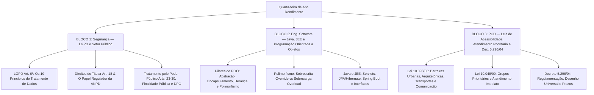

# Guia de Estudos Definitivo — Quarta-feira 27/05/2026
## Semana 2 | Dia 10 | TJ-CE 2026 (Analista TI - Sistemas)
### Foco Absoluto: Banca FCC — Doutrina, Detalhes Ocultos, Pegadinhas e Casos Práticos

---

## 🗺️ Mapa de Estudos do Dia



---

## 🔒 SEÇÃO 1: LGPD (Lei nº 13.709/2018) — Foco no Setor Público e ANPD

A FCC adora cobrar o comportamento da **Lei Geral de Proteção de Dados (LGPD)** aplicada ao setor público, além dos princípios rígidos de tratamento.

### 1. Os 10 Princípios do Tratamento de Dados (Art. 6º)
Esses princípios são a base de qualquer questão de LGPD da FCC. Eles definem os limites de boa-fé que qualquer tratamento deve respeitar:
1.  **Finalidade:** Propósito legítimo, específico, explícito e informado ao titular, sem possibilidade de tratamento posterior incompatível.
2.  **Adequação:** Compatibilidade do tratamento com as finalidades informadas.
3.  **Necessidade:** Limitação do tratamento ao **mínimo necessário** para a realização de suas finalidades (abrangência dos dados pertinentes e não excessivos).
4.  **Livre Acesso:** Garantia de consulta facilitada e gratuita sobre a forma e duração do tratamento, bem como sobre a integridade dos dados pessoais.
5.  **Qualidade dos Dados:** Exatidão, clareza, relevância e atualização dos dados.
6.  **Transparência:** Informações claras, precisas e facilmente acessíveis sobre a realização do tratamento e os respectivos agentes.
7.  **Segurança:** Utilização de medidas técnicas e administrativas aptas a proteger os dados pessoais de acessos não autorizados.
8.  **Prevenção:** Adoção de medidas para evitar a ocorrência de danos em virtude do tratamento.
9.  **Não Discriminação:** Impossibilidade de realização do tratamento para fins discriminatórios ilícitos ou abusivos.
10. **Responsabilização e Prestação de Contas (Accountability):** Demonstração, pelo agente, da adoção de medidas eficazes e capazes de comprovar a observância e o cumprimento das normas.

---

### 2. Tratamento de Dados Pessoais pelo Poder Público (Arts. 23 a 30)
Esta seção é a favorita para provas de Tribunais de Justiça.
*   **Finalidade do Tratamento:** O tratamento de dados por pessoas jurídicas de direito público deve ser realizado para o **atendimento de sua finalidade pública**, na persecução do interesse público, com o objetivo de executar as competências legais ou cumprir as atribuições legais do serviço público.
*   **Dever de Transparência:** As entidades públicas devem fornecer informações claras e atualizadas sobre a previsão legal, a finalidade, os procedimentos e as práticas utilizadas para executar esses tratamentos, em veículos de fácil acesso (preferencialmente em seus sites).
*   **O Encarregado (DPO - Data Protection Officer):** A autoridade pública **deve indicar um encarregado** de dados. A identidade do encarregado deve ser pública, de preferência no site da instituição.
*   **Compartilhamento de Dados no Setor Público:** O compartilhamento de dados entre órgãos públicos é permitido para fins de execução de políticas públicas, cumprimento de obrigações legais ou execução de contratos administrativos.
*   **Transferência a Entidades Privadas:** Em regra, o Poder Público **não pode** transferir dados pessoais constantes de bases de dados a entidades privadas.
    *   *Exceções:* Nos casos de execução descentralizada de atividade pública que exija o compartilhamento (ex: cartórios, bancos públicos), quando os dados forem acessíveis publicamente, ou quando houver previsão legal expressa.

---

### 3. Direitos do Titular (Art. 18) e ANPD
*   O titular dos dados pessoais tem o direito de obter do controlador, a qualquer momento e mediante requisição: confirmação da existência de tratamento, acesso aos dados, correção de dados incompletos/inexatos, eliminação de dados desnecessários ou tratados em desconformidade, portabilidade dos dados, revogação do consentimento.
*   **ANPD (Autoridade Nacional de Proteção de Dados):** Órgão da administração pública federal indireta, dotado de autonomia técnica e decisória, com natureza jurídica de **autarquia de regime especial** (desde a alteração pela Lei nº 14.460/2022, antes era órgão subordinado à Presidência da República). É o órgão regulador e fiscalizador responsável por aplicar as sanções administrativas previstas na lei (como advertências e multas).

> [!WARNING]
> **Pegadinha da FCC sobre Multas ao Poder Público:**
> O Art. 52 da LGPD prevê sanções administrativas como multas diárias ou multas de até 2% do faturamento (limitadas a R$ 50 milhões por infração). **Essas sanções financeiras (multas) NÃO se aplicam às pessoas jurídicas de direito público** (como o TJ-CE). Para o Poder Público, aplicam-se advertências, publicização da infração, bloqueio dos dados ou suspensão do tratamento.

---

## ☕ SEÇÃO 2: Java (JEE, Frameworks) e Orientação a Objetos

Conceitos puros de Programação Orientada a Objetos (POO) e frameworks Java clássicos aparecem constantemente nas provas de analista de sistemas.

### 1. Pilares da Programação Orientada a Objetos (POO)
*   **Abstração:** Capacidade de extrair propriedades e comportamentos essenciais de um objeto do mundo real para o código, ignorando detalhes desnecessários.
*   **Encapsulamento:** Prática de ocultar os detalhes internos de implementação de um objeto, expondo apenas uma interface segura para interação. Em Java, isso é feito definindo atributos como `private` ou `protected` e provendo acesso controlado via métodos públicos `getters` e `setters`.
*   **Herança:** Mecanismo que permite a uma classe (subclasse/filha) herdar atributos e métodos de outra classe (superclasse/mãe). Em Java, utiliza-se a palavra-chave `extends`. Java **não suporta herança múltipla de classes** (uma classe pode herdar de apenas uma classe mãe).
*   **Polimorfismo:** Capacidade de diferentes objetos responderem à mesma assinatura de método de maneiras distintas. Existem dois tipos principais na prova:
    1.  **Sobrescrita (Method Overriding / Polimorfismo de Inclusão):** Ocorre em classes com relação de herança. A subclasse redefine um método herdado da superclasse, mantendo exatamente a **mesma assinatura** (nome e parâmetros). Em Java, indica-se com a anotação `@Override`. (Tempo de execução - Dynamic Binding).
    2.  **Sobrecarga (Method Overloading / Polimorfismo de Sobrecarga):** Ocorre na mesma classe. Métodos diferentes compartilham o mesmo nome, mas possuem **parâmetros diferentes** (número, ordem ou tipo de argumentos). (Tempo de compilação - Static Binding).

```
   Sobrescrita (Overriding): Mesma Assinatura, Classes Diferentes (Herança).
   Sobrecarga (Overloading): Assinatura Diferente (Parâmetros), Mesma Classe.
```

*   **Interfaces:** Contratos puros que definem assinaturas de métodos sem implementação (embora, a partir do Java 8, permitam métodos padrão com a palavra-chave `default`). Em Java, uma classe pode implementar **múltiplas interfaces** (`implements InterfaceA, InterfaceB`).

---

### 2. Tecnologias Java EE (Jakarta EE) e Frameworks
*   **Servlets:** Classes Java que rodam no servidor web (Container Web, como o Tomcat) e processam requisições HTTP dinâmicas (implementam métodos `doGet`, `doPost`, etc.).
*   **JSP (JavaServer Pages):** Tecnologia que permite mesclar código HTML com Java para renderizar páginas do lado do servidor (MVC - View).
*   **JPA (Java Persistence API):** Especificação padrão de mapeamento objeto-relacional (ORM) em Java para persistência de dados. O **Hibernate** é a implementação mais famosa da JPA.
*   **Spring Framework / Spring Boot:** Framework completo voltado para injeção de dependência (IoC - Inversão de Controle) e desenvolvimento simplificado de microserviços/APIs RESTful (Spring Boot fornece auto-configuração e servidor embutido).

---

## ♿ SEÇÃO 3: Legislação PCD — Acessibilidade e Atendimento Prioritário

Esta seção une a legislação federal de acessibilidade obrigatória em concursos de tribunais.

### 1. Lei nº 10.098/2000 (Lei de Acessibilidade)
Estabelece normas gerais e critérios básicos para a promoção da acessibilidade das pessoas com deficiência ou com mobilidade reduzida.
A lei foca na eliminação de **barreiras** e **obstáculos**:
*   **Barreiras Urbanísticas:** Localizadas nas vias e nos espaços públicos e privados abertos ao público ou de uso coletivo.
*   **Barreiras Arquitetônicas:** Localizadas nas edificações públicas e privadas de uso coletivo ou de uso residencial.
*   **Barreiras nos Transportes:** Localizadas nos sistemas de transporte coletivo.
*   **Barreiras nas Comunicações e na Informação:** Qualquer obstáculo que dificulte ou impeça a expressão ou o recebimento de mensagens e de informações.

---

### 2. Lei nº 10.048/2000 (Prioridade de Atendimento)
Determina que as pessoas com deficiência, os idosos com idade igual ou superior a 60 anos, as gestantes, as lactantes, as pessoas com crianças de colo e os obesos terão **atendimento prioritário** nos órgãos públicos, empresas concessionárias de serviços públicos e instituições financeiras.
*   *Novidade:* A Lei nº 14.626/2023 incluiu pessoas com transtorno do espectro autista (TEA) e doadores de sangue (estes últimos com prioridade após os demais grupos prioritários).

---

### 3. Decreto nº 5.296/2004
Este regulamento unifica os normativos de acessibilidade no Brasil e detalha as definições das Leis nº 10.048/00 e 10.098/00.
*   **Conceito de Acessibilidade:** Condição para utilização, com segurança e autonomia, total ou parcial, dos espaços, mobiliários e equipamentos urbanos, das edificações, dos serviços de transporte e dos dispositivos, sistemas e meios de comunicação e informação.
*   **Desenho Universal:** Concepção de produtos, ambientes, programas e serviços a serem usados por todas as pessoas, na máxima extensão possível, sem necessidade de adaptação ou projeto específico.
*   **Adaptação Razoável:** Modificações e ajustes necessários e adequados que não acarretem um ônus desproporcional para garantir o gozo dos direitos de igualdade às PCDs.
*   **Acessibilidade Digital:** Determina a obrigatoriedade de acessibilidade nos portais e páginas web dos órgãos da administração pública para pessoas com deficiência visual (leitor de tela).

---

## 🎯 SEÇÃO 4: Questões Inéditas FCC-Style Comentadas Passo a Passo

### Questão 1: Legislação (LGPD no Setor Público)
**(FCC - Adaptada)** Uma auditoria interna no Tribunal de Justiça do Ceará constatou que dados pessoais sensíveis de jurisdicionados estavam sendo compartilhados de forma irregular com uma empresa terceirizada para fins puramente comerciais. Diante do ocorrido e com base nas sanções administrativas previstas na Lei Geral de Proteção de Dados (Lei nº 13.709/2018), a Autoridade Nacional de Proteção de Dados (ANPD):

A) Poderá aplicar ao Tribunal de Justiça multa de até 2% do seu orçamento anual limite, respeitado o teto de 50 milhões de reais.
B) Não poderá aplicar sanções pecuniárias (multas) ao Tribunal de Justiça, uma vez que se trata de pessoa jurídica de direito público.
C) Deverá decretar a cassação imediata da personalidade jurídica do Tribunal, suspendendo todas as suas atividades jurisdicionais.
D) Aplicará multa diária proporcional ao número de titulares afetados no âmbito do estado do Ceará.
E) É impedida de fiscalizar órgãos do Poder Judiciário, cabendo as sanções administrativas exclusivamente ao CNJ.

#### 💡 Resolução Comentada da Questão 1:
*   **Análise das Multas no Setor Público:** O Art. 52, § 3º da LGPD determina que as sanções de multa simples (inciso II) e multa diária (inciso III) **não se aplicam** às pessoas jurídicas de direito público. O Poder Público está sujeito a outras penalidades (advertência, publicização, bloqueio de dados, suspensão do tratamento).
*   **Gabarito correto: B.**

---

### Questão 2: Engenharia de Software (Orientação a Objetos em Java)
**(FCC - Adaptada)** Considere duas classes em Java: a classe `Funcionario` possui um método público `void baterPonto(String hora)`. A classe `Desenvolvedor` estende `Funcionario` e implementa o método `void baterPonto(String hora)` com uma lógica específica para monitoramento de commits remotos. Em outra classe do projeto, o desenvolvedor cria o método `void baterPonto(String hora, String geolocalizacao)`. As relações conceituais de POO descritas entre o método da classe `Desenvolvedor` e o da classe `Funcionario`, e o novo método da classe com dois parâmetros representam, respectivamente:

A) Sobrecarga (Overloading) e Sobrescrita (Overriding).
B) Abstração e Encapsulamento de Atributos.
C) Sobrescrita (Overriding) e Sobrecarga (Overloading).
D) Herança Múltipla e Polimorfismo Paramétrico.
E) Acoplamento Forte e Coesão Funcional.

#### 💡 Resolução Comentada da Questão 2:
*   **Análise do primeiro caso:** A classe `Desenvolvedor` herda de `Funcionario` e reimplementa um método com a **mesma assinatura** (`baterPonto(String hora)`). Isso é uma **Sobrescrita (Overriding)**.
*   **Análise do segundo caso:** Na mesma classe, cria-se um método com o mesmo nome, mas com **assinatura diferente** (dois parâmetros ao invés de um). Isso é uma **Sobrecarga (Overloading)**.
*   **Gabarito correto: C.**

---

### Questão 3: Legislação PCD (Decreto nº 5.296/2004)
**(FCC - Adaptada)** Nos termos do Decreto Federal nº 5.296/2004, que regulamenta as Leis nº 10.048/2000 e nº 10.098/2000, a concepção de produtos, ambientes, programas e serviços a serem usados por todas as pessoas, na máxima extensão possível, sem necessidade de adaptação ou de projeto específico, define conceitualmente o princípio do(a):

A) Acessibilidade Arquitetônica.
B) Tecnologia Assistiva ou Ajuda Técnica.
C) Desenho Universal.
D) Adaptação Razoável com Ônus Proporcional.
E) Mobilidade Reduzida com Autonomia Assistida.

#### 💡 Resolução Comentada da Questão 3:
*   **Análise Conceitual:** O Decreto nº 5.296/2004, em seu Art. 8º, inciso II, traz a definição literal de **Desenho Universal**: *"concepção de produtos, ambientes, programas e serviços a serem usados por todas as pessoas, na máxima extensão possível, sem necessidade de adaptação ou de projeto específico..."*.
*   **Gabarito correto: C.**

---

## 🧠 SEÇÃO 5: Flashcards de Memorização Ativa (Estilo Anki)

### Bloco 1 — LGPD e Setor Público

*   **Frente (Pergunta):** As multas diárias ou multas administrativas de até R$ 50 milhões por infração previstas na LGPD (Art. 52) podem ser aplicadas a órgãos públicos (como o TJ-CE)?
*   **Verso (Resposta):** **Não.** O Art. 52, § 3º veda a aplicação de multas (simples ou diárias) ao Poder Público. Aplicam-se apenas sanções como advertências, publicização da infração e suspensão/bloqueio do tratamento de dados.

*   **Frente (Pergunta):** Qual a natureza jurídica da ANPD segundo a legislação recente?
*   **Verso (Resposta):** A ANPD é uma **autarquia de regime especial**, dotada de autonomia técnica e decisória, vinculada ao Ministério da Justiça (antigamente era órgão da Presidência).

*   **Frente (Pergunta):** O que diferencia o princípio da "Finalidade" do princípio da "Necessidade" na LGPD (Art. 6º)?
*   **Verso (Resposta):**
    *   **Finalidade:** O tratamento deve ter propósitos legítimos, específicos e informados previamente.
    *   **Necessidade:** Limitação do tratamento ao **mínimo necessário** para alcançar essa finalidade (sem dados excessivos).

---

### Bloco 2 — Java e POO

*   **Frente (Pergunta):** Java aceita herança múltipla de classes? Como contornar essa restrição?
*   **Verso (Resposta):** **Não.** Java permite apenas herança simples de classes (uma classe herda de apenas uma superclasse). A restrição é contornada através do uso de **Interfaces**, já que uma classe Java pode implementar múltiplas interfaces.

*   **Frente (Pergunta):** Qual a diferença entre Sobrescrita (Overriding) e Sobrecarga (Overloading) de métodos?
*   **Verso (Resposta):**
    *   **Sobrescrita:** Métodos com a **mesma assinatura** em classes ligadas por herança (resolvido em tempo de execução).
    *   **Sobrecarga:** Métodos com o **mesmo nome, mas assinaturas (parâmetros) diferentes** na mesma classe (resolvido em tempo de compilação).

*   **Frente (Pergunta):** O que é o encapsulamento em POO e como ele é aplicado em Java?
*   **Verso (Resposta):** Ocultar detalhes internos do objeto. Em Java, os atributos são declarados como `private` (ou `protected`) e o acesso e modificação desses dados é exposto de forma controlada através de métodos públicos `getters` e `setters`.

---

### Bloco 3 — Legislação PCD

*   **Frente (Pergunta):** Qual a diferença legal entre as Barreiras Urbanísticas e as Barreiras Arquitetônicas segundo a Lei nº 10.098/2000?
*   **Verso (Resposta):**
    *   **Urbanísticas:** Barreiras em vias públicas e espaços públicos abertos ao público. (Ex: calçadas).
    *   **Arquitetônicas:** Barreiras nas edificações físicas. (Ex: entradas de prédios, escadas internas).

*   **Frente (Pergunta):** Quem tem direito a atendimento prioritário garantido pela Lei nº 10.048/2000?
*   **Verso (Resposta):** Pessoas com deficiência, idosos (>= 60 anos), gestantes, lactantes, pessoas com crianças de colo, obesos, pessoas com autismo (TEA) e doadores de sangue (em caráter subsidiário).

---

## 🏆 Roteiro de Estudos Sugerido para Hoje (27/05/2026)

1.  **Manhã (Bloco 1 - 2h):** Estude a **Seção 1 (LGPD)**. Leia os arts. 6º, 18 e 23 a 30 da Lei 13.709/18. Lembre-se da pegadinha da inaplicabilidade de multas a órgãos públicos.
2.  **Tarde (Bloco 2 - 2h):** Estude a **Seção 2 (POO e Java)**. Certifique-se de compreender a diferença entre sobrecarga e sobrescrita de métodos em POO. Se possível, faça um rascunho em papel da modelagem de classes usando polimorfismo.
3.  **Noite (Bloco 3 - 1h30):** Estude a **Seção 3 (Legislação PCD)**. Diferencie os tipos de barreiras da Lei 10.098/00 e memorize a definição de Desenho Universal do Decreto 5.296/04.
4.  **Resolução de Questões:** Responda à bateria de 45 questões diárias gerada na pasta do simulador sobre estes temas para fixar a doutrina e as cascas de banana da FCC.

Bons estudos! Foco total! 🚀
