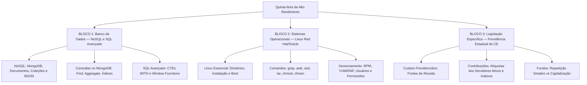

# Guia de Estudos Definitivo — Quinta-feira 28/05/2026
## Semana 2 | Dia 11 | TJ-CE 2026 (Analista TI - Sistemas)
### Foco Absoluto: Banca FCC — Doutrina, Detalhes Ocultos, Pegadinhas e Casos Práticos

---

## 🗺️ Mapa de Estudos do Dia

---

## 🔒 SEÇÃO 1: Banco de Dados — MongoDB e SQL Avançado

A FCC cobra conceitos arquiteturais de NoSQL e sintaxe avançada de SQL em provas de TI.

### 1. MongoDB (NoSQL Orientado a Documentos)
*   **Arquitetura Básica:** Não possui tabelas, linhas ou colunas. Utiliza **Bancos de Dados**, que contêm **Coleções** (Collections - equivalente a tabelas), que contêm **Documentos** (Documents - equivalente a linhas/registros).
*   **Formato dos Dados:** Os documentos são armazenados em formato **BSON** (Binary JSON). Isso permite tipagem rica (datas, binários) e velocidade.
*   **Flexibilidade (Schema-less):** Uma mesma coleção pode conter documentos com estruturas totalmente diferentes, embora seja recomendada alguma consistência.
*   **Consultas Essenciais:**
    *   `db.collection.find({ idade: { $gt: 18 } })`: Busca documentos onde idade > 18.
    *   `db.collection.aggregate([ { $match: { status: "A" } }, { $group: { _id: "$cust_id", total: { $sum: "$amount" } } } ])`: Pipeline de agregação poderoso (equivalente a `GROUP BY`).
    *   `db.collection.createIndex({ nome: 1 })`: Cria um índice ascendente no campo nome.

### 2. SQL Avançado: CTEs e Window Functions
*   **CTEs (Common Table Expressions):** Criadas usando a cláusula `WITH`. Permitem criar blocos de resultados temporários que podem ser referenciados em uma query `SELECT`, `INSERT`, `UPDATE` ou `DELETE`. Úteis para simplificar subqueries complexas e criar consultas recursivas (`WITH RECURSIVE`).
*   **Window Functions (Funções Analíticas):** Permitem realizar cálculos em um conjunto de linhas (a "janela") relacionadas à linha atual, mas **sem agrupar** as linhas no resultado final (ao contrário do `GROUP BY`).
    *   **Sintaxe Básica:** `FUNCAO() OVER (PARTITION BY coluna ORDER BY coluna)`
    *   **Funções Comuns:** `ROW_NUMBER()` (numera as linhas sequencialmente), `RANK()` (dá o mesmo ranking para empates, pulando os próximos), `DENSE_RANK()` (não pula posições após empate).

---

## 🐧 SEÇÃO 2: Sistemas Operacionais — Linux Essencial

Para a FCC, é crucial dominar permissões e gerenciamento de pacotes, especialmente nas famílias Red Hat/Oracle Linux.

### 1. Hierarquia de Diretórios
*   `/etc`: Arquivos de configuração do sistema.
*   `/var`: Dados variáveis (logs em `/var/log`, spool, bases de dados).
*   `/bin` e `/usr/bin`: Binários essenciais do sistema (comandos de usuário).
*   `/sbin` e `/usr/sbin`: Binários de administração do sistema (root).
*   `/home`: Diretórios pessoais dos usuários.

### 2. Permissões de Arquivos e Diretórios
*   **Modelo de Permissão (UGO):** User (Dono), Group (Grupo), Others (Outros).
*   **Tipos de Permissão:** Read (r = 4), Write (w = 2), Execute (x = 1).
*   **Comandos:**
    *   `chmod 755 arquivo`: Define rwxr-xr-x. O dono pode tudo, grupo e outros podem ler e executar.
    *   *Nota sobre Diretórios:* Para entrar em um diretório (`cd`), é necessário permissão de **execução (x)**. Para listar o conteúdo (`ls`), é necessário permissão de **leitura (r)**.
    *   `chown usuario:grupo arquivo`: Altera o dono e o grupo do arquivo.

### 3. Comandos Essenciais e Red Hat
*   **Processamento de Texto:** `grep` (busca padrões), `awk` (processamento de campos/colunas), `sed` (substituição em fluxo de texto).
*   **Gerenciadores de Pacotes (Red Hat/Oracle):**
    *   `rpm`: Gerenciador de pacotes de baixo nível (instala arquivos `.rpm`, mas **não** resolve dependências automaticamente).
    *   `yum` ou `dnf`: Gerenciadores de alto nível que baixam repositórios e **resolvem dependências**.

---

## 🏛️ SEÇÃO 3: Legislação Previdenciária do CE — Custeio

Em leis previdenciárias estaduais, o foco recai sobre as alíquotas e as fontes de financiamento do Regime Próprio de Previdência Social (RPPS).

### 1. Fontes de Custeio
O RPPS é custeado através de contribuições do Estado (ente patronal) e dos segurados (servidores ativos, aposentados e pensionistas).
*   O sistema é regido pelo princípio da solidariedade.
*   As receitas compõem fundos específicos para garantir a liquidez e o pagamento de aposentadorias presentes (Fundo Financeiro - Repartição Simples) e futuras (Fundo Previdenciário - Capitalização).

### 2. Regras de Contribuição dos Segurados
*   **Servidores Ativos:** A contribuição incide sobre a totalidade da remuneração de contribuição.
*   **Inativos e Pensionistas:** Diferente do INSS, no serviço público os aposentados e pensionistas **continuam contribuindo** para o sistema, porém a contribuição incide apenas sobre a parcela dos proventos que **supere o teto** do Regime Geral de Previdência Social (RGPS).
*   *Exceção (Deficiência/Doença Incapacitante):* Em alguns estados, caso o aposentado tenha doença incapacitante, a isenção de contribuição incide sobre o dobro do limite máximo do RGPS.

---

## 🎯 SEÇÃO 4: Questões Inéditas FCC-Style Comentadas Passo a Passo

### Questão 1: Banco de Dados (CTEs)
**(FCC - Adaptada)** Um analista de sistemas do TJ-CE precisa escrever uma consulta SQL que simplifique uma lógica complexa de subconsultas, criando um conjunto de resultados nomeado que existe apenas durante a execução da consulta e que não é armazenado como um objeto no banco de dados. Para isso, ele deve utilizar a cláusula:

A) `CREATE VIEW`
B) `WITH`
C) `CREATE TEMPORARY TABLE`
D) `OVER`
E) `PARTITION BY`

#### 💡 Resolução Comentada da Questão 1:
*   A cláusula `WITH` é usada para criar Expressões de Tabela Comuns (Common Table Expressions - CTEs), que são result sets temporários e nomeados válidos apenas durante a execução de uma única instrução `SELECT`, `INSERT`, `UPDATE`, ou `DELETE`.
*   **Gabarito correto: B.**

### Questão 2: Linux (Permissões)
**(FCC - Adaptada)** Considere um diretório no Linux cujo comando `ls -ld /dados` retorne a seguinte string de permissões: `drw-r--r--`. Para que um usuário comum, que não é dono do diretório nem pertence ao grupo dono, possa acessar o conteúdo do diretório utilizando o comando `cd /dados`, o administrador deve, no mínimo, aplicar qual comando?

A) `chmod o+w /dados`
B) `chmod o+x /dados`
C) `chmod u+x /dados`
D) `chmod 644 /dados`
E) `chown root /dados`

#### 💡 Resolução Comentada da Questão 2:
*   Para que qualquer usuário possa entrar (`cd`) em um diretório no Linux, ele precisa da permissão de **execução (x)** nesse diretório. Atualmente, os outros (Others - terceira trinca `r--`) só têm permissão de leitura.
*   O comando para adicionar execução aos outros é `chmod o+x /dados`.
*   **Gabarito correto: B.**

---

## 🧠 SEÇÃO 5: Flashcards de Memorização Ativa (Estilo Anki)

### Bloco 1 — MongoDB e SQL
*   **Frente (Pergunta):** No MongoDB, qual é a hierarquia de armazenamento equivalente a "Bancos > Tabelas > Linhas"?
*   **Verso (Resposta):** Bancos de Dados > Coleções (Collections) > Documentos (Documents).

*   **Frente (Pergunta):** Qual a diferença entre `GROUP BY` e `Window Functions` no SQL?
*   **Verso (Resposta):** O `GROUP BY` colapsa as linhas agrupando-as em um único resultado agregado. As `Window Functions` realizam a agregação mas **mantêm todas as linhas originais** no resultado.

### Bloco 2 — Linux
*   **Frente (Pergunta):** Em distribuições da família Red Hat, qual a principal diferença entre os comandos `rpm` e `yum/dnf`?
*   **Verso (Resposta):** O `rpm` instala pacotes locais mas **não resolve dependências** automaticamente. O `yum` e o `dnf` acessam repositórios, baixam pacotes e **resolvem/instalam todas as dependências** automaticamente.

*   **Frente (Pergunta):** Qual a permissão octal que representa `rwxr-xr-x`?
*   **Verso (Resposta):** **755**. (Dono: 4+2+1=7; Grupo: 4+0+1=5; Outros: 4+0+1=5).

### Bloco 3 — Legislação Previdenciária
*   **Frente (Pergunta):** Servidores públicos estaduais aposentados param de contribuir para o RPPS?
*   **Verso (Resposta):** **Não**. Eles continuam contribuindo, mas a alíquota incide apenas sobre a parcela dos proventos que **excede o teto** do INSS (RGPS).

---

## 🏆 Roteiro de Estudos Sugerido para Hoje (28/05/2026)

1.  **Manhã (Bloco 1 - 2h):** Estude a sintaxe de agregação no MongoDB e pratique CTEs (`WITH`) e a sintaxe básica de `ROW_NUMBER() OVER()` em um ambiente SQL online.
2.  **Tarde (Bloco 2 - 2h):** Revise comandos Linux e os conceitos de octais de permissões (`chmod`). Entenda a utilidade da permissão de execução em diretórios.
3.  **Noite (Bloco 3 - 1h):** Leia rapidamente as regras estaduais de custeio no seu material, focando em "quem paga" e "sobre que valor incide a alíquota" para inativos.
4.  **Resolução de Questões:** Responda à bateria de 45 questões diárias.

Bons estudos! 🚀
