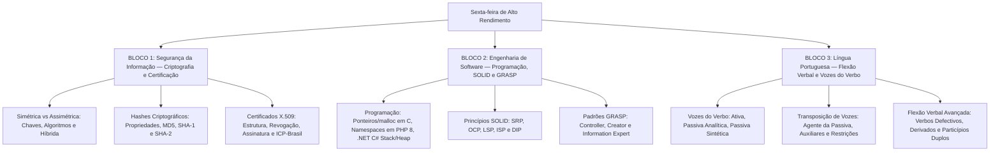

# Guia de Estudos Definitivo — Sexta-feira 29/05/2026
## Semana 2 | Dia 12 | TJ-CE 2026 (Analista TI - Sistemas)
### Foco Absoluto: Banca FCC — Doutrina, Detalhes Ocultos, Pegadinhas e Casos Práticos

---

## 🗺️ Mapa de Estudos do Dia

---

## 🔒 SEÇÃO 1: Segurança da Informação — Criptografia e Certificação

A FCC cobra em detalhes a parte matemática e os fluxos práticos de criptografia e certificação digital.

### 1. Criptografia Simétrica vs Assimétrica vs Híbrida
*   **Criptografia Simétrica:** Utiliza uma **única chave** compartilhada para cifrar e decifrar.
    *   *Propriedades:* Rápida, baixo consumo de processamento, ideal para grandes volumes de dados. Não garante o não-repúdio nativamente (pois ambos possuem a mesma chave).
    *   *Algoritmos:* DES (inseguro, 56 bits), 3DES, AES (padrão atual, chaves de 128, 192 e 256 bits), RC4, Blowfish.
*   **Criptografia Assimétrica:** Utiliza um **par de chaves** correlacionadas matematicamente: a **pública** (distribuída livremente, cifra os dados) e a **privada** (mantida em segredo pelo dono, decifra os dados).
    *   *Propriedades:* Mais lenta computacionalmente, excelente para gerenciamento de chaves em redes abertas e base do não-repúdio.
    *   *Algoritmos:* RSA (segurança baseada na fatoração de primos grandes), ECC (Curvas Elípticas - oferece mesma segurança do RSA com chaves bem menores), Diffie-Hellman (troca de chaves).
*   **Criptografia Híbrida:** Utiliza o melhor dos dois mundos. A criptografia assimétrica é usada para **compartilhar uma chave simétrica temporária** de sessão, e a criptografia simétrica cifra os dados da transmissão em si.

### 2. Funções Hash Criptográficas
*   **Propriedades Fundamentais:**
    *   *Unidirecionalidade (Resistência à Pré-Imagem):* Dado um hash $H$, é inviável encontrar a mensagem original $M$.
    *   *Resistência à Segunda Pré-Imagem:* Dada uma mensagem $M_1$, é inviável achar outra mensagem $M_2$ tal que $Hash(M_1) = Hash(M_2)$.
    *   *Resistência à Colisão:* É inviável encontrar quaisquer duas mensagens diferentes $M_1$ e $M_2$ que gerem o mesmo hash de saída.
    *   *Efeito Avalanche:* Pequena alteração no input gera um output completamente diferente.
*   **Algoritmos:**
    *   *Obsoletos/Inseguros:* MD5 (128 bits) e SHA-1 (160 bits) possuem colisões práticas demonstradas e não devem ser usados para assinaturas digitais.
    *   *Seguros:* Família SHA-2 (SHA-224, SHA-256, SHA-384, SHA-512) e SHA-3.

### 3. Assinatura Digital e Certificados X.509
*   **Assinatura Digital:** Garante **Autenticidade**, **Integridade** e **Não-Repúdio**.
    *   *Geração:* Remetente calcula o hash do documento e cifra esse hash com sua **chave privada**.
    *   *Verificação:* Destinatário calcula o hash do documento recebido, decifra a assinatura com a **chave pública** do remetente e compara ambos.
*   **Certificado Digital X.509:** Associa uma identidade a uma chave pública. Contém: chave pública do titular, período de validade, nome do titular, nome e assinatura digital da Autoridade Certificadora (AC).
    *   *Verificação de Revogação:* Pode ser feita por consulta à Lista de Revogação de Certificados (LRC/CRL) ou via protocolo em tempo real OCSP (Online Certificate Status Protocol).
    *   *ICP-Brasil:* O Instituto Nacional de Tecnologia da Informação (ITI) é a **AC-Raiz** (única autoridade credenciadora e fiscalizadora de topo).

---

## 💻 SEÇÃO 2: Engenharia de Software — Programação, SOLID e GRASP

A FCC cobra as bases de linguagens de programação e os princípios clássicos de orientação a objetos.

### 1. Linguagens de Programação
*   **Linguagem C (Ponteiros e Memória):**
    *   `*` (operador de desreferenciação): Acessa o valor armazenado no endereço de memória apontado pelo ponteiro.
    *   `&` (operador de endereço): Obtém o endereço físico na memória de uma variável comum.
    *   Alocação dinâmica: `malloc()` aloca memória bruta na heap; `calloc()` aloca e inicializa com zero; `free()` libera o espaço alocado para evitar vazamento de memória (memory leak).
*   **PHP 8 (Namespaces e Composer):**
    *   `namespace`: Evita conflito de nomes entre classes e funções organizando o escopo.
    *   Composer Autoloader: Carrega as classes sob demanda automaticamente (lazy loading) evitando múltiplos `require` ou `include`.
*   **C# / .NET (Stack, Heap e Recursos):**
    *   *Stack (Pilha):* Armazena tipos de valor (value types: `int`, `bool`, `structs`). Acesso ultrarápido e liberação automática pelo escopo.
    *   *Heap (Monte):* Armazena tipos de referência (reference types: `classes`, `interfaces`, `objects`, `strings`). Gerenciado e limpo pelo Garbage Collector (GC).
    *   `using (var res = new Resource())`: Garante a chamada automática de `Dispose()` ao final do escopo para liberar recursos não gerenciados (conexões de rede, arquivos abertos).

### 2. Princípios SOLID
1.  **SRP (Single Responsibility):** Uma classe deve ter apenas um motivo para mudar.
2.  **OCP (Open/Closed):** Aberto para extensão, fechado para modificação.
3.  **LSP (Liskov Substitution):** Subclasses devem ser substituíveis por suas superclasses sem quebrar o programa.
4.  **ISP (Interface Segregation):** Interfaces específicas de cliente são melhores do que uma interface única para propósitos gerais.
5.  **DIP (Dependency Inversion):** Dependa de abstrações (interfaces), não de implementações concretas.

### 3. Padrões GRASP Principais
*   **Controller:** Responsável por receber e coordenar eventos do sistema gerados na interface do usuário (UI).
*   **Creator:** Define quem deve criar uma instância de um objeto $B$ (normalmente quem agrega ou contém $B$).
*   **Information Expert:** Atribui uma responsabilidade à classe que possui as informações necessárias para realizá-la.

---

## ✍️ SEÇÃO 3: Língua Portuguesa — Flexão Verbal e Vozes do Verbo

Esta é a área que mais reprova candidatos no português da FCC. Exige análise sintático-semântica rigorosa.

### 1. Vozes do Verbo e Transposição
*   **Voz Passiva Analítica:** Sujeito Paciente + Verbo Auxiliar (Ser/Estar) + Particípio + Agente da Passiva.
    *   *Exemplo:* "A diretoria (Sujeito) analisou os logs (Objeto Direto)" $\to$ "Os logs (Sujeito Paciente) foram analisados (Locução Passiva) pela diretoria (Agente da Passiva)".
*   **Voz Passiva Sintética (ou Pronominal):** VTD ou VTDI + se (Pronome Apassivador) + Sujeito Paciente.
    *   *Exemplo:* "Analisaram-se os logs de segurança" (o verbo concorda com o sujeito: "os logs foram analisados").
*   *Pegadinha do "SE":* Se o verbo for Transitivo Indireto (VTI), Intransitivo (VI) ou de Ligação (VL), a partícula "se" é **Índice de Indeterminação do Sujeito (IIS)**. O sujeito é indeterminado, o verbo fica obrigatoriamente no singular e **não admite voz passiva**.
    *   *Exemplo:* "Precisa-se de novos servidores" (VTI + SE + preposição $\to$ IIS).
*   **Regra da Transposição de Voz:** O tempo e o modo do verbo auxiliar na passiva devem manter correlação estrita com o verbo principal da ativa.
    *   *A diretoria vinha analisando (gerúndio ativo) os logs* $\to$ *Os logs vinham sendo analisados (gerúndio passivo) pela diretoria*.

### 2. Flexões Verbais Especiais e Casos Críticos
*   **Verbos defectivos:** Verbo **reaver** (derivado de haver, mas só conjuga onde o verbo haver possui a letra 'v': reouvemos, reouveram, reaver). *NÃO existe "reavemos" ou "reavenham"*.
*   **Verbos derivados:**
    *   *Vir (e intervir):* Pretérito perfeito: "ele interveio" (e não "interviu"). Futuro do subjuntivo: "se ele intervier" (e não "intervir").
    *   *Ter (e manter):* Futuro do subjuntivo: "se eles mantiverem" (e não "manterem").
    *   *Propor (derivado de pôr):* "se ele propuser" (e não "propor").
*   **Particípios duplos:**
    *   Regular (terminado em -ado ou -ido): usa-se com os auxiliares **ter** ou **haver** (ex: *tinha imprimido*, *havia aceitado*).
    *   Irregular (forma curta): usa-se com os auxiliares **ser** ou **estar** (ex: *foi impresso*, *é aceito*).

---

## 🎯 SEÇÃO 4: Questões Inéditas FCC-Style Comentadas Passo a Passo

### Questão 1: Segurança da Informação (Assinatura Digital)
**(FCC - Adaptada)** Um analista de sistemas do TJ-CE deseja garantir a autoria e o não-repúdio de um parecer técnico a ser enviado por correio eletrônico institucional. Para assinar digitalmente o parecer, de acordo com os padrões de criptografia assimétrica, o analista deve cifrar:

A) o hash do parecer técnico utilizando a sua própria chave pública.
B) o parecer técnico completo utilizando a sua própria chave privada.
C) o hash do parecer técnico utilizando a sua própria chave privada.
D) o parecer técnico completo utilizando a chave pública do destinatário.
E) o hash do parecer técnico utilizando a chave pública da Autoridade Certificadora emissora.

#### 💡 Resolução Comentada da Questão 1:
*   A assinatura digital é gerada calculando-se um resumo criptográfico (hash) da mensagem e cifrando-se esse hash com a **chave privada do remetente**. O destinatário usa a chave pública do remetente para decifrar o hash e conferir a integridade e autoria.
*   Cifrar o documento completo seria computacionalmente custoso demais, por isso cifra-se apenas o hash.
*   **Gabarito correto: C.**

### Questão 2: Língua Portuguesa (Flexão Verbal)
**(FCC - Adaptada)** Assinale a alternativa em que a forma verbal está empregada em estrita consonância com as normas gramaticais da língua portuguesa:

A) Se o comitê intervir na governança do projeto de TI, o cronograma será mantido.
B) Os analistas de segurança reaveram todos os dados criptografados pelo ransomware.
C) Se a equipe mantiver as diretrizes do CMMI, a maturidade será alcançada.
D) O diretor de infraestrutura interviu na reunião para propor novas rotas de backup.
E) Eles requiseram a alteração da especificação de requisitos no início da tarde.

#### 💡 Resolução Comentada da Questão 2:
*   **A (Incorreta):** O correto é "se o comitê intervier" (futuro do subjuntivo de intervir/vir).
*   **B (Incorreta):** O verbo reaver é defectivo. O correto é "reouveram" (pretérito perfeito).
*   **C (Correta):** "Se a equipe mantiver" está correto (futuro do subjuntivo de manter/ter).
*   **D (Incorreta):** O correto é "interveio" (pretérito perfeito de intervir/vir).
*   **E (Incorreta):** O correto é "requereram" (do verbo requerer, que não é derivado de querer).
*   **Gabarito correto: C.**

---

## 🧠 SEÇÃO 5: Flashcards de Memorização Ativa (Estilo Anki)

### Bloco 1 — Segurança da Informação
*   **Frente (Pergunta):** Quais os três objetivos (garantias) que a assinatura digital assegura?
*   **Verso (Resposta):** **Autenticidade**, **Integridade** e **Não-Repúdio** (Irretratabilidade).

*   **Frente (Pergunta):** Qual o status de segurança dos algoritmos de hash MD5 e SHA-1 para uso em assinaturas digitais?
*   **Verso (Resposta):** **Inseguros / Obsoletos**, pois possuem vulnerabilidades conhecidas que permitem colisões práticas em tempo viável.

### Bloco 2 — Engenharia de Software
*   **Frente (Pergunta):** No C# .NET, qual a diferença de alocação de memória entre uma `struct` e uma `class`?
*   **Verso (Resposta):** A `struct` (tipo de valor) é alocada na **pilha (stack)**, enquanto a `class` (tipo de referência) é alocada no **monte (heap)**.

*   **Frente (Pergunta):** Qual o princípio do SOLID que diz que uma classe deve ser aberta para extensão, mas fechada para modificação?
*   **Verso (Resposta):** **OCP** (Open/Closed Principle - Princípio do Aberto/Fechado).

### Bloco 3 — Língua Portuguesa
*   **Frente (Pergunta):** Qual o erro gramatical na frase: "Precisa-se de novos programadores no tribunal"?
*   **Verso (Resposta):** **Nenhum**. A frase está correta. O verbo "precisar" é Transitivo Indireto, logo o "se" é IIS (Índice de Indeterminação do Sujeito). O verbo fica obrigatoriamente no singular.

*   **Frente (Pergunta):** Qual a transposição correta da locução ativa "vinha analisando" para a voz passiva analítica?
*   **Verso (Resposta):** **"vinham sendo analisados"** (ou "vinha sendo analisado", dependendo do sujeito paciente).

---

## 🏆 Roteiro de Estudos Sugerido para Hoje (29/05/2026)

1.  **Manhã (Bloco 1 - 2h):** Revise os conceitos de Criptografia Simétrica e Assimétrica, memorize os algoritmos de cada tipo, compreenda o passo a passo da Assinatura Digital e como validar um certificado X.509.
2.  **Tarde (Bloco 2 - 2h):** Revise a alocação de variáveis na stack/heap do C# e as definições do SOLID (especialmente Liskov e DIP) e do GRASP.
3.  **Noite (Bloco 3 - 1.5h):** Foque nas flexões dos verbos defectivos (reaver) e derivados de *vir*, *ter*, *pôr* e *ver*. Pratique a transposição de orações de voz ativa para passiva.
4.  **Resolução de Questões:** Responda à bateria de 45 questões do dia 29/05.

Bons estudos! 🚀
