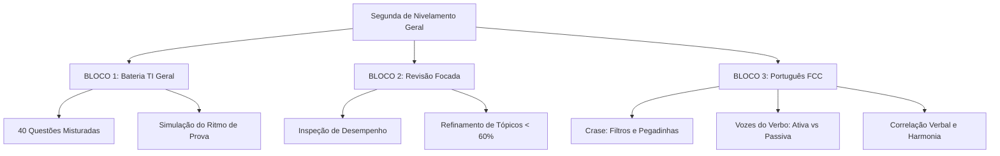

# Guia de Estudos Definitivo — Segunda-feira 29/06/2026
## Semana 7 | Dia 41 | TJ-CE 2026 (Analista TI - Sistemas)
### Foco: Nivelamento Geral (TI Geral), Identificação de Pontos Fracos e Português (Crase, Vozes do Verbo e Correlação Verbal)

---

> ⚠️ **Atenção (Fase 2 - Semana 7):** Bem-vindo à Semana 7! Esta é a penúltima semana da nossa Fase 2, focada no nivelamento geral, identificação ativa de lacunas e consolidação de conhecimentos. A partir de hoje, você fará baterias de questões de TI misturadas (simulando a prova real) e usará o período da tarde para atacar diretamente os tópicos com menos de 60% de aproveitamento. À noite, revisaremos os três assuntos de Língua Portuguesa mais cobrados pela FCC.

---

## 🗺️ Mapa de Estudos do Dia

---

## ⚙️ SEÇÃO 1: Bateria FCC — TI Geral (Manhã)

Esta bateria de 40 questões visa treinar a **alternância mental de tópicos**. Na prova real, as questões não vêm agrupadas por tema. O candidato passa de Kubernetes para Engenharia de Software e em seguida para Banco de Dados Relacional.
*   **Simule o ambiente:** Evite olhar resumos durante a resolução.
*   **Tempo ideal:** Reserve de 2h a 2h30 para resolver as 40 questões e ler atentamente os gabaritos das que errou ou teve dúvida.

---

## 📋 SEÇÃO 2: Revisão Focada — Tópicos < 60% (Tarde)

É hora de usar o seu **Edital Verticalizado** e o histórico de resoluções de questões locais para fazer um pente fino:
1.  Identifique em quais assuntos sua média de acertos está abaixo de 60% (ex: se errou muitas questões de ITIL v4 ou de comandos avançados de PostgreSQL).
2.  Dedique a tarde para ler seus resumos desses tópicos específicos, revisar o material conceitual associado e refazer as questões que errou anteriormente.
3.  O objetivo é elevar a média dessas matérias deficientes para a faixa de segurança (acima de 70%).

---

## 🏛️ SEÇÃO 3: Português — Crase, Vozes do Verbo e Correlação Verbal

A Fundação Carlos Chagas possui uma abordagem extremamente mecânica em Língua Portuguesa. Domine as regras a seguir para garantir acertos rápidos:

### 1. Crase (Filtro de 3 Passos)
*   **Bloqueio Imediato (Proibida):** Antes de verbos (ex: *a partir de*), antes de palavras masculinas (ex: *venda a prazo*), antes de pronomes pessoais e de tratamento (ex: *referiu-se a ela/a Vossa Excelência*), e no "A" singular diante de palavra no plural (ex: *assisti a aulas*).
*   **Teste de Confirmação:** 
    *   *Substituição Feminina/Masculina:* Substitua a palavra feminina subsequente por uma masculina. Se o "A" virar **AO**, há crase. Exemplo: *Obedeceu à lei* -> *Obedeceu ao regulamento* (Confirmado!).
    *   *Substituição por "Para a":* Se puder trocar por "para a", há crase. Exemplo: *Entregou a petição à juíza* -> *para a juíza*.
*   **Casos Facultativos:** 
    1.  Antes de nomes próprios femininos de pessoas (*Refiro-me a/à Maria*).
    2.  Antes de pronomes possessivos femininos singulares (*Entregou o relatório a/à sua chefe*).
    3.  Após a preposição **até** (*Foi até a/à sala*).

### 2. Vozes do Verbo (Transposição Prática)
A FCC cobra exaustivamente a transposição da voz ativa para a voz passiva analítica. Siga a lógica estrutural:
*   **Regra do +1 Verbo:** A voz passiva analítica sempre terá **um verbo a mais** do que a voz ativa correspondente.
    *   *Ativa:* O juiz **assinou** a sentença (1 verbo).
    *   *Passiva:* A sentença **foi assinada** pelo juiz (2 verbos).
*   **Regra do Espelhamento Temporal:** O novo verbo auxiliar (verbo *SER*) deve assumir exatamente o mesmo tempo e modo verbal do verbo principal da voz ativa. O verbo principal da ativa vai para o particípio na passiva.
    *   Pretérito Perfeito: *assinou* -> **foi** assinado.
    *   Pretérito Imperfeito: *assinava* -> **era** assinado.
    *   Futuro do Presente: *assinará* -> **será** assinado.
    *   Futuro do Pretérito: *assinaria* -> **seria** assinado.
*   **Partícula Apassivadora "SE" (Voz Passiva Sintética):** Na estrutura *Verbo Transitivo Direto + SE*, o termo seguinte é o sujeito paciente (e concorda em número com o verbo). Exemplo: *Identificaram-se falhas* (Falhas foram identificadas).

### 3. Correlação Verbal (Harmonia dos Tempos)
A correlação verbal exige que as orações subordinadas e principais mantenham tempos e modos harmoniosos entre si:
*   **Correlação Clássica 1:** Pretérito Imperfeito do Subjuntivo (**-SSE**) pede Futuro do Pretérito do Indicativo (**-RIA**).
    *   *Correto:* Se ele **estudasse**, **obteria** a vaga.
    *   *Incorreto:* Se ele *estudasse*, *obterá* a vaga.
*   **Correlação Clássica 2:** Futuro do Subjuntivo (**-R / -REM**) pede Futuro do Presente do Indicativo (**-RÁ / -RÃO**).
    *   *Correto:* Quando os analistas **chegarem**, a reunião **começará**.
    *   *Incorreto:* Quando os analistas *chegarem*, a reunião *começaria*.

---

## 🎯 SEÇÃO 4: Questões Inéditas FCC-Style Comentadas (Padrão Premium)

### Questão 1: Português (Emprego do Acento Grave - Crase)
**(FCC - 2026 - TJ-CE - Analista de TI)** O uso do acento grave indicativo de crase está empregado de maneira inteiramente correta na frase:

A) As novas regras de segurança cibernética aplicam-se à qualquer comarca do interior do Ceará.
B) O Diretor de TI comprometeu-se à entregar os novos computadores a partir de amanhã.
C) Diante das dificuldades apresentadas pelas equipes, referi-me à sua decisão com bastante cautela.
D) As diretrizes de desenvolvimento seguro de software visam à evitar vazamento de dados judiciais.
E) O acesso à informações sigilosas de processos criminais foi restrito por determinação da Corregedoria.

💡 Resolução Comentada da Questão 1

**Gabarito Correto: C**

**Justificativa:** A alternativa C está correta. A crase é facultativa antes de pronomes possessivos femininos singulares ("sua"). Logo, a grafia "à sua decisão" é perfeitamente válida (assim como seria válido escrever "a sua decisão").
**Erro das Falsas:**
*   **A** está incorreta; a crase é proibida antes de pronome indefinido/genérico ("qualquer").
*   **B e D** estão incorretas; é proibido o uso de crase antes de verbos no infinitivo ("entregar", "evitar").
*   **E** está incorreta; o "A" está no singular diante da palavra plural "informações", o que indica que se trata apenas de uma preposição simples. A crase exigiria a forma plural "às informações".

### Questão 2: Português (Transposição de Voz Verbal)
**(FCC - 2026 - TJ-CE - Analista de TI)** Transpondo-se para a voz passiva a frase *"A equipe de suporte técnico do tribunal solucionará os incidentes de rede até o final do plantão"*, a forma verbal correta que resultará é:

A) Terão sido solucionados.
B) Seriam solucionados.
C) Serão solucionados.
D) Foram solucionados.
E) Solucionar-se-á.

💡 Resolução Comentada da Questão 2

**Gabarito Correto: C**

**Justificativa:** Aplicando a regra do espelhamento temporal: o verbo principal da voz ativa é "solucionará" (Futuro do Presente do Indicativo). O verbo auxiliar correspondente na voz passiva deve assumir o mesmo tempo: **serão** (Futuro do Presente do Indicativo, concordando com o sujeito paciente plural "os incidentes"). O verbo principal vai para o particípio: **solucionados**.
**Erro das Falsas:**
*   **A** altera o aspecto verbal para o futuro composto.
*   **B** usa o Futuro do Pretérito (seriam).
*   **D** usa o Pretérito Perfeito (foram).
*   **E** é a voz passiva sintética na terceira pessoa do singular, mas o sujeito "incidentes" exigiria o plural "solucionar-se-ão".

### Questão 3: Português (Correlação Verbal)
**(FCC - 2026 - TJ-CE - Analista de TI)** Assinale a alternativa em que a correlação entre os tempos e modos verbais está estruturada de maneira adequada e em conformidade com as regras gramaticais:

A) Se o comitê de governança aprovasse o plano, a transição tecnológica ocorrerá sem sobressaltos.
B) Caso os desenvolvedores concluam a migração a tempo, os testes integrados começariam imediatamente.
C) Caso os desenvolvedores concluíssem a migração a tempo, os testes integrados começarão imediatamente.
D) Se o comitê de governança aprovasse o plano, a transição tecnológica ocorreria sem sobressaltos.
E) Quando o comitê de governança aprovar o plano, a transição tecnológica ocorreria sem sobressaltos.

💡 Resolução Comentada da Questão 3

**Gabarito Correto: D**

**Justificativa:** A alternativa D apresenta a correlação harmônica clássica: "aprovasse" (Pretérito Imperfeito do Subjuntivo) correlacionado adequadamente com "ocorreria" (Futuro do Pretérito do Indicativo).
**Erro das Falsas:**
*   **A** mistura o Imperfeito do Subjuntivo (aprovasse) com o Futuro do Presente (ocorrerá).
*   **B** mistura o Presente do Subjuntivo (concluam) com o Futuro do Pretérito (começariam).
*   **C** mistura o Imperfeito do Subjuntivo (conclíssem) com o Futuro do Presente (começarão).
*   **E** mistura o Futuro do Subjuntivo (aprovar) com o Futuro do Pretérito (ocorreria).

